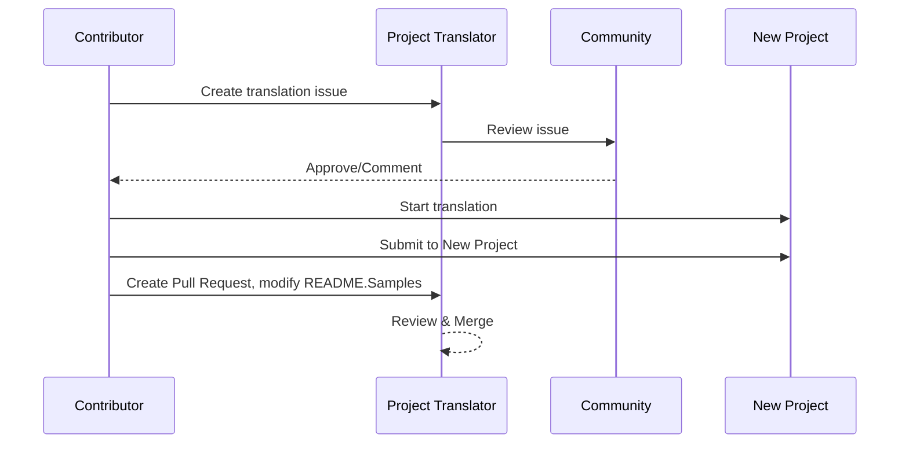

# Project Translator

A VSCode extension: An easy-to-use tool for multi-language localization of projects.

## Available Translations

The extension supports translation to these languages:

- [简体中文 (zh-cn)](./readmes/README.zh-cn.md)
- [繁體中文 (zh-tw)](./readmes/README.zh-tw.md)
- [日本語 (ja-jp)](./readmes/README.ja-jp.md)
- [한국어 (ko-kr)](./readmes/README.ko-kr.md)
- [Français (fr-fr)](./readmes/README.fr-fr.md)
- [Deutsch (de-de)](./readmes/README.de-de.md)
- [Español (es-es)](./readmes/README.es-es.md)
- [Português (pt-br)](./readmes/README.pt-br.md)
- [Русский (ru-ru)](./readmes/README.ru-ru.md)
- [العربية (ar-sa)](./readmes/README.ar-sa.md)
- [العربية (ar-ae)](./readmes/README.ar-ae.md)
- [العربية (ar-eg)](./readmes/README.ar-eg.md)

## Samples

| Project                                                                             | Original Repository                                                                                       | Description                                                                                                                                                               | Stars | Tags                                                                                                                                                                                                                                                                                                                                                                                                                                                                                                                                                                                                                                                                 |
| ----------------------------------------------------------------------------------- | --------------------------------------------------------------------------------------------------------- | ------------------------------------------------------------------------------------------------------------------------------------------------------------------------- | ----- | -------------------------------------------------------------------------------------------------------------------------------------------------------------------------------------------------------------------------------------------------------------------------------------------------------------------------------------------------------------------------------------------------------------------------------------------------------------------------------------------------------------------------------------------------------------------------------------------------------------------------------------------------------------------- |
| [algorithm-visualizer](https://github.com/Project-Translation/algorithm-visualizer) | [algorithm-visualizer/algorithm-visualizer](https://github.com/algorithm-visualizer/algorithm-visualizer) | :fireworks:Interactive Online Platform that Visualizes Algorithms from Code                                                                                               | 47301 | [`algorithm`](https://github.com/topics/algorithm), [`animation`](https://github.com/topics/animation), [`data-structure`](https://github.com/topics/data-structure), [`visualization`](https://github.com/topics/visualization)                                                                                                                                                                                                                                                                                                                                                                                                                                     |
| [algorithms](https://github.com/Project-Translation/algorithms)                     | [algorithm-visualizer/algorithms](https://github.com/algorithm-visualizer/algorithms)                     | :crystal_ball:Algorithm Visualizations                                                                                                                                    | 401   | N/A                                                                                                                                                                                                                                                                                                                                                                                                                                                                                                                                                                                                                                                                  |
| [cline-docs](https://github.com/Project-Translation/cline-docs)                     | [cline/cline](https://github.com/cline/cline)                                                             | Autonomous coding agent right in your IDE, capable of creating/editing files, executing commands, using the browser, and more with your permission every step of the way. | 39572 | N/A                                                                                                                                                                                                                                                                                                                                                                                                                                                                                                                                                                                                                                                                  |
| [cursor-docs](https://github.com/Project-Translation/cursor-docs)                   | [getcursor/docs](https://github.com/getcursor/docs)                                                       | Cursor's Open Source Documentation                                                                                                                                        | 309   | N/A                                                                                                                                                                                                                                                                                                                                                                                                                                                                                                                                                                                                                                                                  |
| [gobyexample](https://github.com/Project-Translation/gobyexample)                   | [mmcgrana/gobyexample](https://github.com/mmcgrana/gobyexample)                                           | Go by Example                                                                                                                                                             | 7523  | N/A                                                                                                                                                                                                                                                                                                                                                                                                                                                                                                                                                                                                                                                                  |
| [golang-website](https://github.com/Project-Translation/golang-website)             | [golang/website](https://github.com/golang/website)                                                       | [mirror] Home of the go.dev and golang.org websites                                                                                                                       | 402   | N/A                                                                                                                                                                                                                                                                                                                                                                                                                                                                                                                                                                                                                                                                  |
| [reference-en-us](https://github.com/Project-Translation/reference-en-us)           | [Fechin/reference](https://github.com/Fechin/reference)                                                   | ⭕ Share quick reference cheat sheet for developers.                                                                                                                      | 7808  | [`awk`](https://github.com/topics/awk), [`bash`](https://github.com/topics/bash), [`chatgpt`](https://github.com/topics/chatgpt), [`cheatsheet`](https://github.com/topics/cheatsheet), [`cheatsheets`](https://github.com/topics/cheatsheets), [`css`](https://github.com/topics/css), [`golang`](https://github.com/topics/golang), [`grep`](https://github.com/topics/grep), [`markdown`](https://github.com/topics/markdown), [`python`](https://github.com/topics/python), [`reference`](https://github.com/topics/reference), [`sed`](https://github.com/topics/sed), [`snippets`](https://github.com/topics/snippets), [`vim`](https://github.com/topics/vim) |
| [styleguide](https://github.com/Project-Translation/styleguide)                     | [google/styleguide](https://github.com/google/styleguide)                                                 | Style guides for Google-originated open-source projects                                                                                                                   | 38055 | [`cpplint`](https://github.com/topics/cpplint), [`style-guide`](https://github.com/topics/style-guide), [`styleguide`](https://github.com/topics/styleguide)                                                                                                                                                                                                                                                                                                                                                                                                                                                                                                         |
| [vscode-docs](https://github.com/Project-Translation/vscode-docs)                   | [microsoft/vscode-docs](https://github.com/microsoft/vscode-docs)                                         | Public documentation for Visual Studio Code                                                                                                                               | 5914  | [`vscode`](https://github.com/topics/vscode)                                                                                                                                                                                                                                                                                                                                                                                                                                                                                                                                                                                                                         |

## Requesting Project Translation

If you want to contribute a translation or need a project to be translated:

1. Create an issue using the following template:

```md
**Project**: [project_url]
**Target Language**: [target_lang]
**Description**: Brief description of why this translation would be valuable
```

2. Workflow:



3. After the PR is merged, the translation will be added to the Samples section.

Current translations in progress: [View Issues](https://github.com/Project-Translation/project_translator/issues)

## Features

- 📁 Folder-level Translation Support
  - Translate entire project folders to multiple languages
  - Maintain original folder structure and hierarchy
  - Support for recursive translation of subfolders
  - Automatic detection of translatable content
  - Batch processing for efficient large-scale translations
- 📄 File-level Translation Support
  - Translate individual files to multiple languages
  - Preserve original file structure and formatting
  - Support for both folder and file translation modes
- 💡 Smart Translation with AI
  - Automatically maintains code structure integrity
  - Only translates code comments, preserves code logic
  - Maintains JSON/XML and other data structure formats
  - Professional technical documentation translation quality
- ⚙️ Flexible Configuration
  - Configure source folder and multiple target folders
  - Support for custom file translation intervals
  - Set specific file types to ignore
  - Support for multiple AI model options
- 🚀 User-Friendly Operations
  - Real-time translation progress display
  - Support for pause/resume/stop translation
  - Automatic maintenance of target folder structure
  - Incremental translation to avoid duplicate work

## Installation

1. Search for "[Project Translator](https://marketplace.visualstudio.com/items?itemName=techfetch-dev.project-translator)" in VS Code extension marketplace
2. Click install

## Configuration

The extension supports the following configuration options:

```json
{
  "projectTranslator.specifiedFolders": [
    {
      "sourceFolder": {
        "path": "Source folder path",
        "lang": "Source language code"
      },
      "destFolders": [
        {
          "path": "Target folder path",
          "lang": "Target language code"
        }
      ]
    }
  ],
  "projectTranslator.specifiedFiles": [
    {
      "sourceFile": {
        "path": "Source file path",
        "lang": "Source language code"
      },
      "destFiles": [
        {
          "path": "Target file path",
          "lang": "Target language code"
        }
      ]
    }
  ],
  "projectTranslator.currentVendor": "openai",
  "projectTranslator.vendors": [
    {
      "name": "openai",
      "apiEndpoint": "API endpoint URL",
      "apiKey": "API authentication key",
      "model": "Model name to use",
      "rpm": "Maximum requests per minute",
      "maxTokensPerSegment": 4096,
      "timeout": 30,
      "temperature": 0.0
    }
  ]
}
```

Key configuration details:

| Configuration Option                            | Description                                                                                    |
| ----------------------------------------------- | ---------------------------------------------------------------------------------------------- |
| `projectTranslator.specifiedFolders`            | Multiple source folders with their corresponding destination folders for translation           |
| `projectTranslator.specifiedFiles`              | Multiple source files with their corresponding destination files for translation               |
| `projectTranslator.translationIntervalDays`     | Translation interval in days (default 7 days)                                                  |
| `projectTranslator.ignoreTranslationExtensions` | List of text file extensions that don't need translation, these files will be copied directly  |
| `projectTranslator.ignorePaths`                 | List of ignored path patterns using glob syntax, these files won't be copied                   |
| `projectTranslator.currentVendor`               | Current API vendor in use                                                                      |
| `projectTranslator.vendors`                     | API vendor configuration list                                                                  |
| `projectTranslator.systemPrompts`               | System prompt array for guiding the translation process                                        |
| `projectTranslator.userPrompts`                 | User-defined prompt array, these prompts will be added after system prompts during translation |
| `projectTranslator.segmentationMarkers`         | Segmentation markers configured by file type, supports regular expressions                     |

## Usage

1. Open command palette (Ctrl+Shift+P / Cmd+Shift+P)
2. Type "Translate Project" and select the command
3. If source folder is not configured, a folder selection dialog will appear
4. Wait for translation to complete

During translation:

- Can pause/resume translation via status bar buttons
- Can stop translation process at any time
- Translation progress shown in notification area
- Detailed logs displayed in output panel

## Notes

- Ensure sufficient API usage quota
- Recommended to test with small projects first
- Use dedicated API keys and remove them after completion

## License

[License](LICENSE)
