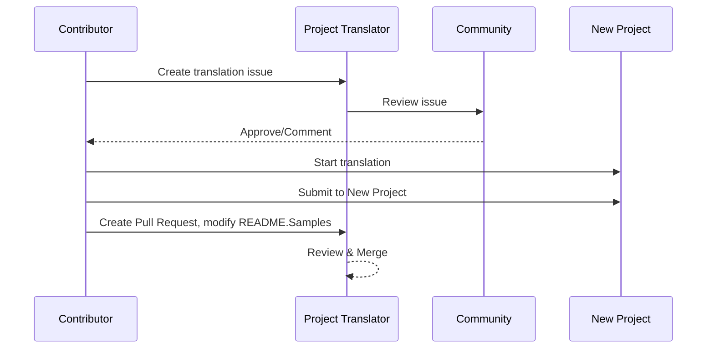

# Project Translator

An easy-to-use vscode extension for multi-language localization of projects.

Project repository: `https://github.com/Project-Translation/project_translator`


## Installation

1. Marketplace:
   - VS Code Extensions Marketplace: [https://marketplace.visualstudio.com/items?itemName=techfetch-dev.project-translator](https://marketplace.visualstudio.com/items?itemName=techfetch-dev.project-translator)
   - Open VSX Registry: [https://open-vsx.org/extension/techfetch-dev/project-translator](https://open-vsx.org/extension/techfetch-dev/project-translator)
2. Search for `techfetch-dev.project-translator` in the VS Code Extensions view and click install


<!--  -->


## Available Translations

The extension supports translation to these languages:

- [简体中文 (zh-cn)](./readmes/README.zh-cn.md)
- [繁體中文 (zh-tw)](./readmes/README.zh-tw.md)
- [日本語 (ja-jp)](./readmes/README.ja-jp.md)
- [한국어 (ko-kr)](./readmes/README.ko-kr.md)
- [Français (fr-fr)](./readmes/README.fr-fr.md)
- [Deutsch (de-de)](./readmes/README.de-de.md)
- [Español (es-es)](./readmes/README.es-es.md)
- [Português (pt-br)](./readmes/README.pt-br.md)
- [Русский (ru-ru)](./readmes/README.ru-ru.md)
- [العربية (ar-sa)](./readmes/README.ar-sa.md)
- [العربية (ar-ae)](./readmes/README.ar-ae.md)
- [العربية (ar-eg)](./readmes/README.ar-eg.md)

## Samples

| Project                                                                             | Original Repository                                                                                       | Description                                                                                                                                                               | Stars | Tags                                                                                                                                                                                                                                                                                                                                                                                                                                                                                                                                                                                                                                                                 |
| ----------------------------------------------------------------------------------- | --------------------------------------------------------------------------------------------------------- | ------------------------------------------------------------------------------------------------------------------------------------------------------------------------- | ----- | -------------------------------------------------------------------------------------------------------------------------------------------------------------------------------------------------------------------------------------------------------------------------------------------------------------------------------------------------------------------------------------------------------------------------------------------------------------------------------------------------------------------------------------------------------------------------------------------------------------------------------------------------------------------- |
| [algorithm-visualizer](https://github.com/Project-Translation/algorithm-visualizer) | [algorithm-visualizer/algorithm-visualizer](https://github.com/algorithm-visualizer/algorithm-visualizer) | :fireworks:Interactive Online Platform that Visualizes Algorithms from Code                                                                                               | 47301 | [`algorithm`](https://github.com/topics/algorithm), [`animation`](https://github.com/topics/animation), [`data-structure`](https://github.com/topics/data-structure), [`visualization`](https://github.com/topics/visualization)                                                                                                                                                                                                                                                                                                                                                                                                                                     |
| [algorithms](https://github.com/Project-Translation/algorithms)                     | [algorithm-visualizer/algorithms](https://github.com/algorithm-visualizer/algorithms)                     | :crystal_ball:Algorithm Visualizations                                                                                                                                    | 401   | N/A                                                                                                                                                                                                                                                                                                                                                                                                                                                                                                                                                                                                                                                                  |
| [cline-docs](https://github.com/Project-Translation/cline-docs)                     | [cline/cline](https://github.com/cline/cline)                                                             | Autonomous coding agent right in your IDE, capable of creating/editing files, executing commands, using the browser, and more with your permission every step of the way. | 39572 | N/A                                                                                                                                                                                                                                                                                                                                                                                                                                                                                                                                                                                                                                                                  |
| [cursor-docs](https://github.com/Project-Translation/cursor-docs)                   | [getcursor/docs](https://github.com/getcursor/docs)                                                       | Cursor's Open Source Documentation                                                                                                                                        | 309   | N/A                                                                                                                                                                                                                                                                                                                                                                                                                                                                                                                                                                                                                                                                  |
| [gobyexample](https://github.com/Project-Translation/gobyexample)                   | [mmcgrana/gobyexample](https://github.com/mmcgrana/gobyexample)                                           | Go by Example                                                                                                                                                             | 7523  | N/A                                                                                                                                                                                                                                                                                                                                                                                                                                                                                                                                                                                                                                                                  |
| [golang-website](https://github.com/Project-Translation/golang-website)             | [golang/website](https://github.com/golang/website)                                                       | [mirror] Home of the go.dev and golang.org websites                                                                                                                       | 402   | N/A                                                                                                                                                                                                                                                                                                                                                                                                                                                                                                                                                                                                                                                                  |
| [reference-en-us](https://github.com/Project-Translation/reference-en-us)           | [Fechin/reference](https://github.com/Fechin/reference)                                                   | ⭕ Share quick reference cheat sheet for developers.                                                                                                                      | 7808  | [`awk`](https://github.com/topics/awk), [`bash`](https://github.com/topics/bash), [`chatgpt`](https://github.com/topics/chatgpt), [`cheatsheet`](https://github.com/topics/cheatsheet), [`cheatsheets`](https://github.com/topics/cheatsheets), [`css`](https://github.com/topics/css), [`golang`](https://github.com/topics/golang), [`grep`](https://github.com/topics/grep), [`markdown`](https://github.com/topics/markdown), [`python`](https://github.com/topics/python), [`reference`](https://github.com/topics/reference), [`sed`](https://github.com/topics/sed), [`snippets`](https://github.com/topics/snippets), [`vim`](https://github.com/topics/vim) |
| [styleguide](https://github.com/Project-Translation/styleguide)                     | [google/styleguide](https://github.com/google/styleguide)                                                 | Style guides for Google-originated open-source projects                                                                                                                   | 38055 | [`cpplint`](https://github.com/topics/cpplint), [`style-guide`](https://github.com/topics/style-guide), [`styleguide`](https://github.com/topics/styleguide)                                                                                                                                                                                                                                                                                                                                                                                                                                                                                                         |
| [vscode-docs](https://github.com/Project-Translation/vscode-docs)                   | [microsoft/vscode-docs](https://github.com/microsoft/vscode-docs)                                         | Public documentation for Visual Studio Code                                                                                                                               | 5914  | [`vscode`](https://github.com/topics/vscode)                                                                                                                                                                                                                                                                                                                                                                                                                                                                                                                                                                                                                         |

## Requesting Project Translation

If you want to contribute a translation or need a project to be translated:

1. Create an issue using the following template:

```md
**Project**: [project_url]
**Target Language**: [target_lang]
**Description**: Brief description of why this translation would be valuable
```

2. Workflow:



3. After the PR is merged, the translation will be added to the Samples section.

Current translations in progress: [View Issues](https://github.com/Project-Translation/project_translator/issues)

## Features

- 📁 Folder-level Translation Support
  - Translate entire project folders to multiple languages
  - Maintain original folder structure and hierarchy
  - Support for recursive translation of subfolders
  - Automatic detection of translatable content
  - Batch processing for efficient large-scale translations
- 📄 File-level Translation Support
  - Translate individual files to multiple languages
  - Preserve original file structure and formatting
  - Support for both folder and file translation modes
- 💡 Smart Translation with AI
  - Automatically maintains code structure integrity
  - Only translates code comments, preserves code logic
  - Maintains JSON/XML and other data structure formats
  - Professional technical documentation translation quality
- ⚙️ Flexible Configuration
  - Configure source folder and multiple target folders
  - Support for custom file translation intervals
  - Set specific file types to ignore
  - Support for multiple AI model options
- 🚀 User-Friendly Operations
  - Real-time translation progress display
  - Support for pause/resume/stop translation
  - Automatic maintenance of target folder structure
  - Incremental translation to avoid duplicate work
- 🔄 Differential Translation (Experimental)
  - Diff-apply mode for efficient updates of existing translations
  - Reduces API usage by only translating changed content
  - Preserves version history with minimal edits
  - ⚠️ Experimental feature - see [Advanced Features](#differential-translation-diff-apply-mode) for details

## Configuration

The extension supports the following configuration options:

```json
{
  "projectTranslator.specifiedFolders": [
    {
      "sourceFolder": {
        "path": "Source folder path",
        "lang": "Source language code"
      },
      "targetFolders": [
        {
          "path": "Target folder path",
          "lang": "Target language code"
        }
      ]
    }
  ],
  "projectTranslator.specifiedFiles": [
    {
      "sourceFile": {
        "path": "Source file path",
        "lang": "Source language code"
      },
      "targetFiles": [
        {
          "path": "Target file path",
          "lang": "Target language code"
        }
      ]
    }
  ],
  "projectTranslator.currentVendor": "openai",
  "projectTranslator.vendors": [
    {
      "name": "openai",
      "apiEndpoint": "API endpoint URL",
      "apiKeyEnvVarName": "MY_OPENAI_API_KEY",
      "model": "gpt-4o",
      "rpm": "10",
      "maxTokensPerSegment": 4096,
      "timeout": 180,
      "temperature": 0.1
    }
  ],
  "projectTranslator.userPrompts": [
      "1. Should return no need translate if the markdown file has 'draft' set to 'true' in the front matter.",
      "2. './readmes/' in the sentences should replace with './'",
  ],
  "projectTranslator.ignore": {
    "paths": [
      "**/node_modules/**"
    ],
    "extensions": [
      ".log"
    ]
  },
}
```

Key configuration details:

| Configuration Option                        | Description                                                                                    |
| ------------------------------------------- | ---------------------------------------------------------------------------------------------- |
| `projectTranslator.specifiedFolders`        | Multiple source folders with their corresponding destination folders for translation           |
| `projectTranslator.specifiedFiles`          | Multiple source files with their corresponding destination files for translation               |
| `projectTranslator.translationIntervalDays` | Translation interval in days (default 7 days)                                                  |
| `projectTranslator.copyOnly`                | Files to copy but not translate (with `paths` and `extensions` arrays)                         |
| `projectTranslator.ignore`                  | Files to ignore completely (with `paths` and `extensions` arrays)                              |
| `projectTranslator.skipFrontMatterMarkers`  | Skip files based on front matter markers (with `enabled` and `markers` arrays)                 |
| `projectTranslator.currentVendor`           | Current API vendor in use                                                                      |
| `projectTranslator.vendors`                 | API vendor configuration list (can use apiKey directly or apiKeyEnvVarName for environment variables) |
| `projectTranslator.systemPromptLanguage`    | Language used for built-in system prompts (default: en). Affects how the model is instructed, not the UI language |
| `projectTranslator.systemPrompts`           | System prompt array for guiding the translation process                                        |
| `projectTranslator.userPrompts`             | User-defined prompt array, these prompts will be added after system prompts during translation |
| `projectTranslator.segmentationMarkers`     | Segmentation markers configured by file type, supports regular expressions                     |
| `projectTranslator.debug`                   | Enable debug mode to log all API requests and responses to output channel (default: false)     |
| `projectTranslator.logFile`                 | Configuration for debug log files (see [Log File Feature](./docs/log-file-feature.md))         |
| `projectTranslator.diffApply.enabled`       | Enable experimental differential translation mode (default: false)                             |

## Usage

1. Open command palette (Ctrl+Shift+P / Cmd+Shift+P)
2. Type "Translate Project" and select the command
3. If source folder is not configured, a folder selection dialog will appear
4. Wait for translation to complete

During translation:

- Can pause/resume translation via status bar buttons
- Can stop translation process at any time
- Translation progress shown in notification area
- Detailed logs displayed in output panel

## Development

### Build System

This extension uses esbuild for fast bundling and development:

#### Available Scripts

- `npm run build` - Production build with minification
- `npm run compile` - Development build
- `npm run watch` - Watch mode for development
- `npm test` - Run tests

#### VS Code Tasks

- **Build** (Ctrl+Shift+P → "Tasks: Run Task" → "build") - Bundles extension for production
- **Watch** (Ctrl+Shift+P → "Tasks: Run Task" → "watch") - Development mode with auto-rebuild

### Development Setup

1. Clone the repository
2. Run `npm install` to install dependencies
3. Press `F5` to start debugging or run the "watch" task for development

The esbuild configuration:

- Bundles all TypeScript files into a single `out/extension.js`
- Excludes VS Code API (marked as external)

## Advanced Features

### Using Environment Variables for API Keys

Project Translator supports using environment variables for API keys, which is a more secure approach than storing API keys directly in configuration files:

1. Configure your vendor with an `apiKeyEnvVarName` property:

```json
{
  "projectTranslator.vendors": [
    {
      "name": "openai",
      "apiEndpoint": "https://api.openai.com/v1",
      "apiKeyEnvVarName": "OPENAI_API_KEY",
      "model": "gpt-4"
    },
    {
      "name": "openrouter",
      "apiEndpoint": "https://openrouter.ai/api/v1",
      "apiKeyEnvVarName": "OPENROUTER_API_KEY",
      "model": "anthropic/claude-3-opus"
    }
  ]
}
```

2. Set the environment variable in your system:
   - On Windows: `set OPENAI_API_KEY=your_api_key`
   - On macOS/Linux: `export OPENAI_API_KEY=your_api_key`

3. When the extension runs, it will:
   - First check if `apiKey` is provided directly in the configuration
   - If not, it will look for the environment variable specified by `apiKeyEnvVarName`

This approach keeps your API keys out of configuration files and version control systems.

### Skip Translation Based on Front Matter

Project Translator can skip translation of Markdown files based on their front matter metadata. This is useful for draft documents or files marked as not requiring translation.

To enable this feature, configure the `projectTranslator.skipFrontMatterMarkers` option:

```json
{
  "projectTranslator.skipFrontMatterMarkers": {
    "enabled": true,
    "markers": [
      {
        "key": "draft",
        "value": "true"
      },
      {
        "key": "translate",
        "value": "false"
      }
    ]
  }
}
```

With this configuration, any Markdown file with front matter containing `draft: true` or `translate: false` will be skipped during translation and directly copied to the target location.

Example Markdown file that would be skipped:
```
---
draft: true
title: "Draft Document"
---

This document is a draft and should not be translated.
```

### Differential Translation (Diff-Apply) Mode

> **⚠️ Experimental Feature Warning**: Differential translation mode is currently an experimental feature and may have stability and compatibility issues. It is recommended to use it with caution in production environments and always backup important files.

The extension supports an optional differential translation mode (diff-apply). When enabled, the extension sends both the source content and the existing translated target file to the model. The model should return one or more SEARCH/REPLACE blocks (plain text, no code fences). The extension applies these blocks locally to minimize changes, reduce API usage, and better preserve version history.

- **Toggle**: Configure `projectTranslator.diffApply.enabled` in VS Code settings or `project.translation.json` (default: `false`).
- **Options**:
  - `validationLevel`: `normal` or `strict` (default: `normal`). In `strict` mode, invalid markers or matching failures will cause an error and the extension will fall back to the standard translation flow.
  - `autoBackup`: If true, create a `.bak` backup of the target file before applying edits (default: `true`).
  - `maxOperationsPerFile`: (retained for compatibility) not used by the new strategy.

Workflow:
1. If `diffApply.enabled` is `true` and the target file exists, the extension reads both source and target contents.
2. It calls the model with a differential prompt and requires returning plain-text SEARCH/REPLACE blocks.
3. Locally, the extension parses and applies the SEARCH/REPLACE blocks. If application fails, it falls back to the normal full translation and overwrites the target file.

Example SEARCH/REPLACE (multiple blocks allowed):

```
<<<<<<< SEARCH
:start_line: 10
-------
const label = "Old"
=======
const label = "New"
>>>>>>> REPLACE

<<<<<<< SEARCH
:start_line: 25
-------
function foo() {
  return 1
}
=======
function foo() {
  return 2
}
>>>>>>> REPLACE
```

Notes:
- Use exact content including indentation and whitespace in SEARCH sections. If unsure, use the latest file content.
- Keep a single line of `=======` between SEARCH and REPLACE.
- If no change is needed, the model should return an empty string.

Why differential translation currently performs poorly (explanation)

- **Cross-language alignment and comparison challenges**: Differential translation requires sending both the original source document and the existing translated document to the model, and the model must compare them across languages to decide which parts of the translation need to be changed. This is a fundamentally harder task than modifying a single document in-place because the model must accurately align segments in different languages and judge semantic differences.

- **Complexity of format and boundary preservation**: Many documents contain code blocks, tables, frontend markers, or special placeholders. A reliable diff workflow must preserve these structures while making textual edits. If the model cannot consistently produce results that strictly follow the SEARCH/REPLACE format, applying edits automatically may introduce formatting regressions or structural errors.

- **Context and terminology consistency issues**: Small, localized edits often depend on broader context and an existing terminology/style glossary. When asked to produce minimal edits, the model may neglect global consistency (terminology, style, comments, variable names), resulting in inconsistent or semantically shifted translations.

- **Model stability and cost trade-offs**: Achieving a dependable differential translation requires models with strong comparative reasoning and stable, predictable output formats. Current mainstream models do not reliably provide both robust cross-language alignment and strictly formatted outputs at reasonable cost, so systems often fall back to a full retranslation to ensure correctness.

Therefore, while differential translation can theoretically reduce expensive output tokens and better preserve version history, it is currently limited by models' cross-language comparison capabilities and output stability. This feature remains experimental; recommended mitigations include keeping automatic backups (`autoBackup: true`), using a tolerant validation level (`validationLevel: "normal"`), and falling back to full retranslation when matching or formatting fails. In the future, specialized bilingual alignment post-processors or custom smaller models may improve the stability of the diff approach.

Cost savings and why it helps

- **Input vs Output token cost**: Large-model APIs commonly charge differently for input (prompt) and output (completion) tokens. Often, output tokens are significantly more expensive because the model generates longer text. Diff-apply helps because we send the **updated source (input)** and the **existing translated file (input)** to the model and ask for a compact JSON of edits. The model's response is a small JSON (few output tokens) rather than a full retranslated file (many output tokens), so you pay much less for the expensive output portion.

- **Only send what's changed**: Instead of re-translating the entire file whenever small changes occur, diff-apply instructs the model to compute the minimal edit operations to update the existing translation. This is particularly effective for files that were previously translated and only receive incremental edits.

- **Best for formatted files**: Files with strict formatting (JSON, XML, Markdown with code blocks) benefit greatly because diff-apply preserves structure and only changes textual parts that need translation. That reduces the chance of format-related regressions and extra output tokens caused by model reformatting.

- **Line-oriented base unit, smarter aggregation**: The tool treats the basic translation unit as a "line", and the SEARCH/REPLACE strategy applies exact or fuzzy matching near `:start_line:`. Use `validationLevel: "normal"` for tolerant behavior and `"strict"` when you need conservative, exact edits.

When to use diff-apply:

- Use when the target file already exists and was previously translated.
- Use for large, formatted documents where re-translating the whole file would be expensive.
- Avoid for brand-new files without any previous translation, or when you want a fresh retranslation.


### Design Documentation

- Generates source maps for development builds
- Minifies code for production builds
- Provides problem matcher integration for VS Code

## Notes

- Ensure sufficient API usage quota
- Recommended to test with small projects first
- Use dedicated API keys and remove them after completion

## License

[License](LICENSE)
