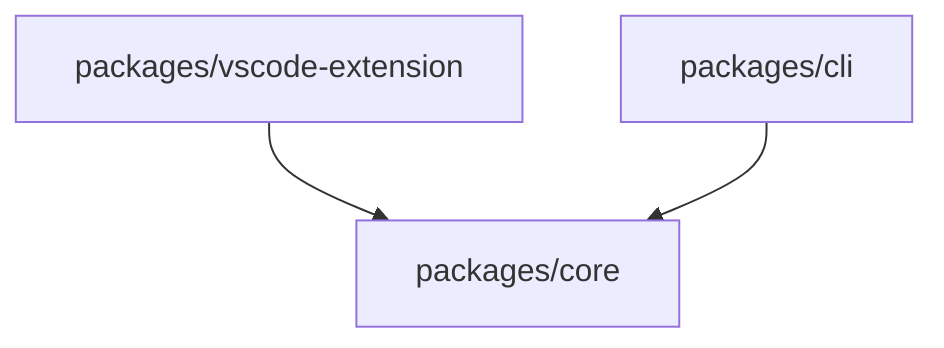

# Architecture

## Package Topology

| Package | Responsibility | Depends On |
| --- | --- | --- |
| `packages/core` | 翻译流程、配置模型、运行时抽象、共享测试 | 无 workspace 依赖 |
| `packages/vscode-extension` | VSCode 激活入口、配置桥接、市场发布元数据 | `@project-translator/core` |
| `packages/cli` | CLI 子命令、npm 发布 | `@project-translator/core` |

## Boundaries

| Area | Rule |
| --- | --- |
| VSCode API | 只能出现在 `packages/vscode-extension` |
| CLI entry | 只能出现在 `packages/cli/src/cli.ts` |
| Shared prompts / services / config | 统一在 `packages/core` 定义 |
| 发布脚本 | 扩展和 CLI 各自放在对应 package |
