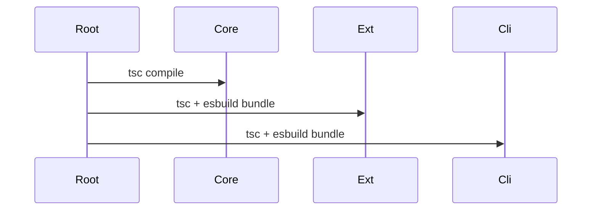

# Development

## Local Workflow

| Command | Purpose |
| --- | --- |
| `npm install` | 安装全部 workspace 依赖 |
| `npm run build` | 构建全部包 |
| `npm run test` | 执行 `core` 与 `cli` 测试 |
| `npm run watch:extension` | 监听扩展构建 |
| `npm run watch:cli` | 监听 CLI 构建 |

## Package Commands

| Package | Build | Test |
| --- | --- | --- |
| `packages/core` | `npm run build -w packages/core` | `npm run test -w packages/core` |
| `packages/vscode-extension` | `npm run build -w packages/vscode-extension` | N/A |
| `packages/cli` | `npm run build -w packages/cli` | `npm run test -w packages/cli` |

## Build Flow

