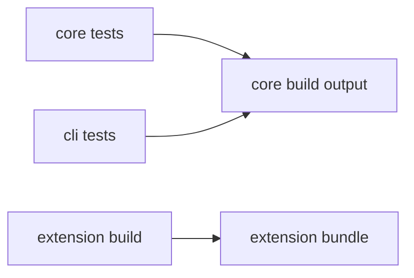

# Testing

## Test Matrix

| Package | Test Type | Entry Command |
| --- | --- | --- |
| `packages/core` | 共享单元 / 集成测试 | `npm run test -w packages/core` |
| `packages/cli` | CLI 集成测试 | `npm run test -w packages/cli` |
| `packages/vscode-extension` | 构建校验 | `npm run build -w packages/vscode-extension` |

## Acceptance Scenarios

| Scenario | Expected Result |
| --- | --- |
| `npm run build` | 产出 `packages/core/out`、`packages/vscode-extension/out/extension.js`、`packages/cli/out/cli.js` |
| `npm run test` | `core` 与 `cli` 测试通过 |
| `npm run package:extension` | 生成可安装 `.vsix` |
| `npm pack -w packages/cli` | 生成 `project-translator-cli` tarball |

## Notes

