# مترجم المشروع

إضافة لـ VSCode: أداة سهلة الاستخدام لتوطين المشاريع بمتعدد اللغات.

## الترجمات المتاحة

تدعم الإضافة الترجمة إلى هذه اللغات:

- [الصينية المبسطة (zh-cn)](./readmes/README.zh-cn.md)
- [الصينية التقليدية (zh-tw)](./readmes/README.zh-tw.md)
- [اليابانية (ja-jp)](./readmes/README.ja-jp.md)
- [الكورية (ko-kr)](./readmes/README.ko-kr.md)
- [الفرنسية (fr-fr)](./readmes/README.fr-fr.md)
- [الألمانية (de-de)](./readmes/README.de-de.md)
- [الإسبانية (es-es)](./readmes/README.es-es.md)
- [البرتغالية (pt-br)](./readmes/README.pt-br.md)
- [الروسية (ru-ru)](./readmes/README.ru-ru.md)
- [العربية (ar-sa)](./readmes/README.ar-sa.md)
- [العربية (ar-ae)](./readmes/README.ar-ae.md)
- [العربية (ar-eg)](./readmes/README.ar-eg.md)

## العينات

| المشروع                                                   | اللغات                                                                                                                                                 |
| --------------------------------------------------------- | --------------------------------------------------------------------------------------------------------------------------------------------------------- |
| [google/styleguide](https://github.com/google/styleguide) | [en-us](https://github.com/google/styleguide) الأصل من @google<br>[zh-cn](https://github.com/Project-Translation/styleguide-zh-cn) ترجمة من @jqknono |

## طلب ترجمة مشروع

إذا كنت ترغب في المساهمة في ترجمة أو تحتاج إلى ترجمة مشروع:

1. أنشئ مشكلة باستخدام القالب التالي:

```md
**المشروع**: [project_url]
**اللغة المستهدفة**: [target_lang]
**الوصف**: وصف مختصر لسبب قيمة هذه الترجمة
```

2. سير العمل:

```mermaid
sequenceDiagram
  Contributor->>Project Translator: إنشاء مشكلة ترجمة
  Project Translator->>Community: مراجعة المشكلة
  Community-->>Contributor: الموافقة/التعليق
  Contributor->>New Project: بدء الترجمة
  Contributor->>New Project: إرسال إلى المشروع الجديد
  Contributor->>Project Translator: إنشاء طلب سحب، تعديل README.Samples
  Project Translator-->>Project Translator: مراجعة ودمج
```



3. بعد دمج طلب السحب، ستُضاف الترجمة إلى قسم العينات.

الترجمات الجارية: [عرض المشكلات](https://github.com/Project-Translation/project_translator/issues)

## الميزات
- 📁 دعم ترجمة مستوى المجلد
  - ترجمة مجلدات المشروع بأكملها إلى لغات متعددة
  - الحفاظ على هيكل المجلد الأصلي وتسلسله
  - دعم الترجمة التكرارية للمجلدات الفرعية
  - الكشف التلقائي عن المحتوى القابل للترجمة
  - معالجة الدفعات لترجمات ذات نطاق كبير بكفاءة
- 📄 دعم ترجمة مستوى الملف
  - ترجمة ملفات فردية إلى لغات متعددة
  - الحفاظ على هيكل الملف الأصلي وتنسيقه
  - دعم لوضعي الترجمة للمجلد والملف
- 💡 الترجمة الذكية باستخدام الذكاء الاصطناعي
  - يحافظ تلقائيًا على سلامة هيكل الكود
  - يترجم فقط تعليقات الكود، ويحافظ على منطق الكود
  - يحافظ على تنسيقات هياكل البيانات مثل JSON/XML وغيرها
  - جودة ترجمة الوثائق التقنية المهنية
- ⚙️ تكوين مرن
  - تكوين مجلد المصدر ومجلدات الهدف المتعددة
  - دعم لفترات ترجمة ملفات مخصصة
  - تحديد أنواع الملفات التي يجب تجاهلها
  - دعم لخيارات نماذج الذكاء الاصطناعي المتعددة
- 🚀 عمليات سهلة الاستخدام
  - عرض تقدم الترجمة في الوقت الفعلي
  - دعم لإيقاف/استئناف/إيقاف الترجمة
  - الحفاظ التلقائي على هيكل مجلد الهدف
  - الترجمة التدريجية لتجنب العمل المكرر

## التثبيت

1. ابحث عن "[Project Translator](https://marketplace.visualstudio.com/items?itemName=techfetch-dev.project-translator)" في سوق توسيعات VS Code
2. انقر على تثبيت

## التكوين

يدعم التوسيع الخيارات التالية للتكوين:

```json
{
  "projectTranslator.specifiedFolders": [
    {
      "sourceFolder": {
        "path": "مسار مجلد المصدر",
        "lang": "رمز لغة المصدر"
      },
      "destFolders": [
        {
          "path": "مسار مجلد الهدف",
          "lang": "رمز لغة الهدف"
        }
      ]
    }
  ],
  "projectTranslator.specifiedFiles": [
    {
      "sourceFile": {
        "path": "مسار ملف المصدر",
        "lang": "رمز لغة المصدر"
      },
      "destFiles": [
        {
          "path": "مسار ملف الهدف",
          "lang": "رمز لغة الهدف"
        }
      ]
    }
  ],
  "projectTranslator.currentVendor": "openai",
  "projectTranslator.vendors": [
    {
      "name": "openai",
      "apiEndpoint": "عنوان URL لنقطة الوصول للواجهة البرمجية",
      "apiKey": "مفتاح توثيق الواجهة البرمجية",
      "model": "اسم النموذج المستخدم",
      "rpm": "الحد الأقصى للطلبات في الدقيقة",
      "maxTokensPerSegment": 4096,
      "timeout": 30,
      "temperature": 0.0
    }
  ]
}
```

تفاصيل التكوين الرئيسية:
| خيار التكوين                                   | الوصف                                                                                          |
| ---------------------------------------------- | ---------------------------------------------------------------------------------------------- |
| `projectTranslator.specifiedFolders`           | مجلدات مصدر متعددة مع مجلدات الوجهة المقابلة للترجمة                                          |
| `projectTranslator.specifiedFiles`             | ملفات مصدر متعددة مع ملفات الوجهة المقابلة للترجمة                                            |
| `projectTranslator.translationIntervalDays`    | فترة الترجمة بالأيام (الافتراضي 7 أيام)                                                        |
| `projectTranslator.ignoreTranslationExtensions`| قائمة بامتدادات ملفات النصوص التي لا تحتاج إلى ترجمة، سيتم نسخ هذه الملفات مباشرة                |
| `projectTranslator.ignorePaths`                | قائمة بأنماط المسارات المهملة باستخدام البدائل، لن يتم نسخ هذه الملفات                         |
| `projectTranslator.currentVendor`              | البائع الحالي للواجهة البرمجية المستخدمة                                                           |
| `projectTranslator.vendors`                    | قائمة تكوين بائع الواجهة البرمجية                                                                  |
| `projectTranslator.systemPrompts`              | مصفوفة التحفيزات النظامية لتوجيه عملية الترجمة                                                  |
| `projectTranslator.userPrompts`                | مصفوفة التحفيزات المحددة من قبل المستخدم، ستتم إضافة هذه التحفيزات بعد التحفيزات النظامية خلال الترجمة |
| `projectTranslator.segmentationMarkers`        | علامات التقسيم المكونة حسب نوع الملف، تدعم التعبيرات النظامية                                     |

## الاستخدام

1. افتح لوحة الأوامر (Ctrl+Shift+P / Cmd+Shift+P)
2. اكتب "ترجمة المشروع" وحدد الأمر
3. إذا لم يتم تكوين مجلد المصدر، سيظهر مربع حوار اختيار المجلد
4. انتظر حتى تكتمل الترجمة

خلال الترجمة:

- يمكن إيقاف/استئناف الترجمة عبر أزرار شريط الحالة
- يمكن إيقاف عملية الترجمة في أي وقت
- يتم عرض تقدم الترجمة في منطقة الإشعارات
- يتم عرض السجلات المفصلة في لوحة الإخراج

## ملاحظات

- تأكد من كفاية حصة استخدام الواجهة البرمجية
- من المستحسن اختباره مع مشاريع صغيرة أولاً
- استخدم مفاتيح واجهة برمجة التطبيقات المخصصة وقم بإزالتها بعد الانتهاء

## الترخيص

[الترخيص](LICENSE)