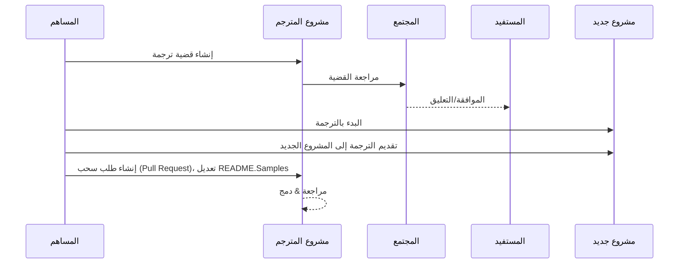

# مشروع المترجم

ملحق لـ VSCode: أداة سهلة الاستخدام لتحويل مشاريع البرمجة إلى عدة لغات.

## أمثلة

| المشروع                                                                             | المستودع الأصلي                                                                                       | الوصف                                                                                                                                                               | النجوم | العلامات                                                                                                                                                                                                                                                                                                                                                                                                                                                                                                                                                                                                                                                                 |
| ----------------------------------------------------------------------------------- | --------------------------------------------------------------------------------------------------------- | ------------------------------------------------------------------------------------------------------------------------------------------------------------------------- | ----- | -------------------------------------------------------------------------------------------------------------------------------------------------------------------------------------------------------------------------------------------------------------------------------------------------------------------------------------------------------------------------------------------------------------------------------------------------------------------------------------------------------------------------------------------------------------------------------------------------------------------------------------------------------------------- |
| [algorithm-visualizer](https://github.com/Project-Translation/algorithm-visualizer) | [algorithm-visualizer/algorithm-visualizer](https://github.com/algorithm-visualizer/algorithm-visualizer) | :الألعاب النارية: منصة تفاعلية عبر الإنترنت تصور الخوارزميات من الشيفرة                                                                                               | 47301 | [`الخوارزمية`](https://github.com/topics/algorithm), [`الرسوم المتحركة`](https://github.com/topics/animation), [`بنية البيانات`](https://github.com/topics/data-structure), [`التصور`](https://github.com/topics/visualization)                                                                                                                                                                                                                                                                                                                                                                                                                                     |
| [algorithms](https://github.com/Project-Translation/algorithms)                     | [algorithm-visualizer/algorithms](https://github.com/algorithm-visualizer/algorithms)                     | :كرة البلور: تصوير الخوارزميات                                                                                                                                    | 401   | لا يوجد                                                                                                                                                                                                                                                                                                                                                                                                                                                                                                                                                                                                                                                                  |
| [cline-docs](https://github.com/Project-Translation/cline-docs)                     | [cline/cline](https://github.com/cline/cline)                                                             | وكيل ترميز مستقل في بيئة التطوير الخاصة بك، قادر على إنشاء/تحرير الملفات، تنفيذ الأوامر، استخدام المتصفح، والمزيد بإذنك في كل خطوة من الخطوات. | 39572 | لا يوجد                                                                                                                                                                                                                                                                                                                                                                                                                                                                                                                                                                                                                                                                  |
| [cursor-docs](https://github.com/Project-Translation/cursor-docs)                   | [getcursor/docs](https://github.com/getcursor/docs)                                                       | وثائق كورسور المفتوحة المصدر                                                                                                                                        | 309   | لا يوجد                                                                                                                                                                                                                                                                                                                                                                                                                                                                                                                                                                                                                                                                  |
| [gobyexample](https://github.com/Project-Translation/gobyexample)                   | [mmcgrana/gobyexample](https://github.com/mmcgrana/gobyexample)                                           | Go بالنموذج                                                                                                                                                             | 7523  | لا يوجد                                                                                                                                                                                                                                                                                                                                                                                                                                                                                                                                                                                                                                                                  |
| [golang-website](https://github.com/Project-Translation/golang-website)             | [golang/website](https://github.com/golang/website)                                                       | [مرآة] موقع go.dev و golang.org                                                                                                                       | 402   | لا يوجد                                                                                                                                                                                                                                                                                                                                                                                                                                                                                                                                                                                                                                                                  |
| [reference-en-us](https://github.com/Project-Translation/reference-en-us)           | [Fechin/reference](https://github.com/Fechin/reference)                                                   | ⭕ مشاركة ورقة ملخص سريعة للمراجعات التي يحتاجها المطورون.                                                                                                                      | 7808  | [`awk`](https://github.com/topics/awk), [`bash`](https://github.com/topics/bash), [`chatgpt`](https://github.com/topics/chatgpt), [`ورقة ملخص`](https://github.com/topics/cheatsheet), [`ورق ملخص`](https://github.com/topics/cheatsheets), [`css`](https://github.com/topics/css), [`golang`](https://github.com/topics/golang), [`grep`](https://github.com/topics/grep), [`الemarkdown`](https://github.com/topics/markdown), [`بايثون`](https://github.com/topics/python), [`المصدر`](https://github.com/topics/reference), [`sed`](https://github.com/topics/sed), [`مقتطفات`](https://github.com/topics/snippets), [`vim`](https://github.com/topics/vim) |
| [styleguide](https://github.com/Project-Translation/styleguide)                     | [google/styleguide](https://github.com/google/styleguide)                                                 | أدلة الأسلوب للمشاريع مفتوحة المصدر التي تعود أصولها إلى جوجل                                                                                                                   | 38055 | [`cpplint`](https://github.com/topics/cpplint), [`دليل الأسلوب`](https://github.com/topics/style-guide), [`دليل الأسلوب`](https://github.com/topics/styleguide)                                                                                                                                                                                                                                                                                                                                                                                                                                                                                                         |
| [vscode-docs](https://github.com/Project-Translation/vscode-docs)                   | [microsoft/vscode-docs](https://github.com/microsoft/vscode-docs)                                         | الوثائق العامة لبرنامج Visual Studio Code                                                                                                                               | 5914  | [`vscode`](https://github.com/topics/vscode)                                                                                                                                                                                                                                                                                                                                                                                                                                                                                                                                                                                                                         |

## طلب ترجمة مشروع

إذا كنت ترغب في المساهمة بترجمة أو تحتاج إلى ترجمة مشروع:

1. قم بإنشاء قضية باستخدام القالب التالي:

```md
**المشروع**: [project_url]
**اللغة المستهدفة**: [target_lang]
**الوصف**: وصف مختصر لماذا ستكون هذه الترجمة ذات قيمة
```

2. سير العمل:



3. بعد دمج الطلب، سيتم إضافة الترجمة إلى قسم الأمثلة.

الترجمات قيد التقدم: [عرض القضايا](https://github.com/Project-Translation/project_translator/issues)

## المزايا

- 📁 دعم ترجمة على مستوى المجلدات
  - ترجمة كامل مجلدات المشروع إلى عدة لغات
  - الحفاظ على هيكل المجلدات الأصلي
  - دعم الترجمة التكرارية للمجلدات الفرعية
  - الكشف التلقائي عن المحتوى القابل للترجمة
  - معالجة دفعات لتحسين الترجمة على نطاق واسع
- 📄 دعم ترجمة على مستوى الملفات
  - ترجمة ملفات فردية إلى عدة لغات
  - الحفاظ على هيكل الملفات وتنسيقها
  - دعم الوضعين: ترجمة المجلدات والملفات
- 💡 ترجمة ذكية باستخدام الذكاء الاصطناعي
  - الحفاظ تلقائيًا على سلامة بنية الشيفرة
  - ترجمة تعليقات الشيفرة فقط، الحفاظ على المنطق
  - الحفاظ على تنسيقات JSON/XML وبنى البيانات الأخرى
  - جودة ترجمة وثائق تقنية متخصصة
- ⚙️ إعدادات مرنة
  - تكوين مجلد المصدر والمجلدات المستهدفة المتعددة
  - دعم فترات تخصيص ترجمة الملفات
  - تحديد أنواع الملفات التي يجب تجاهلها
  - دعم خيارات متعددة لنموذج الذكاء الاصطناعي
- 🚀 عمليات سهلة الاستخدام
  - عرض تقدم الترجمة في الوقت الفعلي
  - دعم الإيقاف المؤقت/استئناف/إيقاف الترجمة
  - الحفاظ التلقائي على هيكل مجلد الهدف
  - ترجمة تدريجية لتجنب العمل المتكرر
- 🔄 ترجمة متقدمة باستخدام المقارنة
  - **تحديثات دقيقة**: ترجمة المحتوى الذي تغير فعليًا فقط
  - **تحكم سطري**: الحفاظ على التنسيق والبنية بدقة
  - **ترجمة تدريجية**: مثالية للحفاظ على الوثائق المترجمة
  - **صديق لتحكم الإصدارات**: إنشاء تغييرات دقيقة ومحددة
  - **كفاءة مالية**: يقلل من استدعاءات الواجهة البرمجية من خلال ترجمة الاختلافات فقط
  - **نسخ احتياطي تلقائي**: إنشاء ملفات احتياطية قبل تطبيق التغييرات تلقائيًا

## التثبيت

1. ابحث عن "[Project Translator](https://marketplace.visualstudio.com/items?itemName=techfetch-dev.project-translator)" في متجر امتدادات VS Code
2. انقر على تثبيت

## الإعداد

الامتداد يدعم الخيارات التالية للإعداد:

```json
{
  "projectTranslator.specifiedFolders": [
    {
      "sourceFolder": {
        "path": "مسار المجلد المصدر",
        "lang": "رمز اللغة المصدر"
      },
      "targetFolders": [
        {
          "path": "مسار المجلد المستهدف",
          "lang": "رمز اللغة المستهدفة"
        }
      ]
    }
  ],
  "projectTranslator.diffApply": {
    "enabled": true,
    "validationLevel": "normal",
    "autoBackup": true,
    "maxOperationsPerFile": 100
  },
  "projectTranslator.specifiedFiles": [
    {
      "sourceFile": {
        "path": "مسار الملف المصدر",
        "lang": "رمز اللغة المصدر"
      },
      "targetFiles": [
        {
          "path": "مسار الملف المستهدف",
          "lang": "رمز اللغة المستهدفة"
        }
      ]
    }
  ],
  "projectTranslator.currentVendor": "openai",
  "projectTranslator.vendors": [
    {
      "name": "openai",
      "apiEndpoint": "عنوان واجهة برمجة التطبيقات",
      "apiKey": "مفتاح المصادقة لواجهة برمجة التطبيقات",
      "model": "اسم النموذج المستخدم",
      "rpm": "الحد الأقصى للطلبات في الدقيقة",
      "maxTokensPerSegment": 4096,
      "timeout": 30,
      "temperature": 0.0
    }
  ]
}
```

تفاصيل الإعداد الرئيسية:

| خيار الإعداد                        | الوصف                                                                                    |
| ------------------------------------------- | ---------------------------------------------------------------------------------------------- |
| `projectTranslator.specifiedFolders`        | عدة مجلدات مصدر مع مجلدات الهدف المقابلة لها لإجراء الترجمة           |
| `projectTranslator.specifiedFiles`          | عدة ملفات مصدر مع ملفات الهدف المقابلة لها لإجراء الترجمة               |
| `projectTranslator.translationIntervalDays` | فترة الترجمة بال أيام (الافتراضي 7 أيام)                                                  |
| `projectTranslator.copyOnly`                | ملفات لنسخها دون ترجمة (مع مصفوفات `paths` و `extensions`)                         |
| `projectTranslator.ignore`                  | ملفات تتجاهل تمامًا (مع مصفوفات `paths` و `extensions`)                              |
| `projectTranslator.currentVendor`           | مزود واجهة برمجة التطبيقات الحالي قيد الاستخدام                                                                      |
| `projectTranslator.vendors`                 | قائمة إعدادات مزوّد واجهة برمجة التطبيقات                                                                  |
| `projectTranslator.systemPrompts`           | مصفوفة التعليمات النظام لدليل عملية الترجمة                                        |
| `projectTranslator.userPrompts`             | مصفوفة التعليمات المعرفة من قبل المستخدم، سيتم إضافتها بعد تعليمات النظام أثناء الترجمة |
| `projectTranslator.segmentationMarkers`     | علامات التجزئة المُكوَّنة حسب نوع الملف، تدعم التعبيرات العادية                     |
| `projectTranslator.debug`                   | تفعيل وضع التصحيح لتسجيل جميع طلبات واستجابات واجهة برمجة التطبيقات في قناة الإخراج (الافتراضي: false)    |
| `projectTranslator.logFile`                 | إعدادات ملفات السجل (اطلع على [مزايا ملف السجل](./docs/log-file-feature.md))        |

## الاستخدام

1. افتح لوحة الأوامر (Ctrl+Shift+P / Cmd+Shift+P)
2. اكتب "Translate Project" وحدد الأمر
3. إذا لم يتم تكوين مجلد المصدر، سيظهر مربع حوار لاختيار المجلد
4. انتظر حتى تكتمل الترجمة

أثناء الترجمة:

- يمكن إيقاف الترجمة مؤقتًا أو استئنافها عبر أزرار شريط الحالة
- يمكن إيقاف عملية الترجمة في أي وقت
- تقدم الترجمة المعروض في منطقة الإشعارات
- السجلات التفصيلية المعروضة في لوحة الإخراج

## التطوير

### نظام البناء

يستخدم هذا الملحق esbuild لإنشاء الحزم بسرعة والتطوير:

#### النصوص المتوفرة

- `npm run build` - إنشاء إصدار إنتاج مع التضمين
- `npm run compile` - إنشاء إصدار تطوير
- `npm run watch` - وضع المراقبة للتطوير
- `npm test` - تشغيل الاختبارات

#### مهام VS Code

- **البناء** (Ctrl+Shift+P → "Tasks: Run Task" → "build") - تجميع الملحق للإنتاج
- **المراقبة** (Ctrl+Shift+P → "Tasks: Run Task" → "watch") - وضع التطوير مع إعادة البناء التلقائية

### إعداد التطوير

1. استنساخ المستودع
2. قم بتشغيل `npm install` لتثبيت الاعتمادات
3. اضغط `F5` لبدء التصحيح أو تشغيل مهمة "watch" للتطوير

تكوين esbuild:

- يجمع كل ملفات TypeScript في ملف واحد `out/extension.js`
- يستبعد واجهة برمجة التطبيقات الخاصة بـ VS Code (محددة كمكوّن خارجي)

## المزايا المتقدمة

### ترجمة باستخدام المقارنة

للحصول على معلومات مفصلة حول وضع الترجمة المتقدم باستخدام المقارنة، راجع [دليل استخدام الترجمة باستخدام المقارنة](./docs/diff-apply-usage.md).

تتيح هذه الميزة:
- تحديثات دقيقة سطر بسطر
- تقليل التكاليف المتعلقة بواجهة برمجة التطبيقات للملفات الكبيرة
- تكامل أفضل مع التحكم بالإصدارات
- الحفاظ على تنسيق الوثيقة

### الوثائق التقنية

للحصول على تفاصيل تقنية حول تنفيذ المقارنة، راجع [تصميم ترجمة المقارنة](./docs/diff-apply-translation-design.md).
- إنشاء خرائط مصدر للإصدارات التنموية
- تضمين الشيفرة للإصدارات الإنتاجية
- توفير دمج معالج مشاكل VS Code

## الملاحظات

- تأكد من وجود حصص كافية في واجهة برمجة التطبيقات
- يُوصى باختباره أولًا مع مشاريع صغيرة
- استخدم مفاتيح واجهة برمجة التطبيقات المخصصة وقم بإزالتها بعد الانتهاء

## الرخصة

[الرخصة](LICENSE)