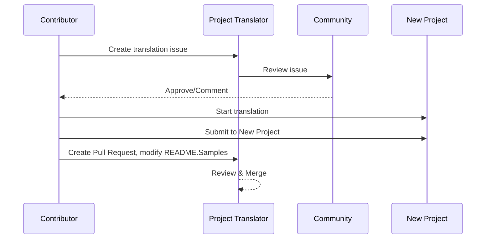

# Project Translator

امتداد vscode سهل الاستخدام للتوطين متعدد اللغات للمشاريع.

مستودع المشروع: `https://github.com/Project-Translation/project_translator`

<!--  -->


## Available Translations

يدد الامتداد الترجمة إلى هذه اللغات:

- [简体中文 (zh-cn)](./readmes/README.zh-cn.md)
- [繁體中文 (zh-tw)](./readmes/README.zh-tw.md)
- [日本語 (ja-jp)](./readmes/README.ja-jp.md)
- [한국어 (ko-kr)](./readmes/README.ko-kr.md)
- [Français (fr-fr)](./readmes/README.fr-fr.md)
- [Deutsch (de-de)](./readmes/README.de-de.md)
- [Español (es-es)](./readmes/README.es-es.md)
- [Português (pt-br)](./readmes/README.pt-br.md)
- [Русский (ru-ru)](./readmes/README.ru-ru.md)
- [العربية (ar-sa)](./readmes/README.ar-sa.md)
- [العربية (ar-ae)](./readmes/README.ar-ae.md)
- [العربية (ar-eg)](./readmes/README.ar-eg.md)

## Samples

| Project                                                                             | Original Repository                                                                                       | Description                                                                                                                                                               | Stars | Tags                                                                                                                                                                                                                                                                                                                                                                                                                                                                                                                                                                                                                                                                 |
| ----------------------------------------------------------------------------------- | --------------------------------------------------------------------------------------------------------- | ------------------------------------------------------------------------------------------------------------------------------------------------------------------------- | ----- | -------------------------------------------------------------------------------------------------------------------------------------------------------------------------------------------------------------------------------------------------------------------------------------------------------------------------------------------------------------------------------------------------------------------------------------------------------------------------------------------------------------------------------------------------------------------------------------------------------------------------------------------------------------------- |
| [algorithm-visualizer](https://github.com/Project-Translation/algorithm-visualizer) | [algorithm-visualizer/algorithm-visualizer](https://github.com/algorithm-visualizer/algorithm-visualizer) | :fireworks:منصة تفاعلية عبر الإنترنت لتصور الخوارزميات من الكود                                                                                                             | 47301 | [`algorithm`](https://github.com/topics/algorithm), [`animation`](https://github.com/topics/animation), [`data-structure`](https://github.com/topics/data-structure), [`visualization`](https://github.com/topics/visualization)                                                                                                                                                                                                                                                                                                                                                                                                                                     |
| [algorithms](https://github.com/Project-Translation/algorithms)                     | [algorithm-visualizer/algorithms](https://github.com/algorithm-visualizer/algorithms)                     | :crystal_ball:تصورات الخوارزميات                                                                                                                                           | 401   | N/A                                                                                                                                                                                                                                                                                                                                                                                                                                                                                                                                                                                                                                                                  |
| [cline-docs](https://github.com/Project-Translation/cline-docs)                     | [cline/cline](https://github.com/cline/cline)                                                             | وكيل ترميز مستقل في بيئة التطوير المتكاملة الخاصة بك، قادر على إنشاء/تحرير الملفات، وتنفيذ الأوامر، واستخدام المتصفح، والمزيد مع إذنك في كل خطوة.                         | 39572 | N/A                                                                                                                                                                                                                                                                                                                                                                                                                                                                                                                                                                                                                                                                  |
| [cursor-docs](https://github.com/Project-Translation/cursor-docs)                   | [getcursor/docs](https://github.com/getcursor/docs)                                                       | الوثائق مفتوحة المصدر لـ Cursor                                                                                                                                          | 309   | N/A                                                                                                                                                                                                                                                                                                                                                                                                                                                                                                                                                                                                                                                                  |
| [gobyexample](https://github.com/Project-Translation/gobyexample)                   | [mmcgrana/gobyexample](https://github.com/mmcgrana/gobyexample)                                           | Go بالأمثلة                                                                                                                                                             | 7523  | N/A                                                                                                                                                                                                                                                                                                                                                                                                                                                                                                                                                                                                                                                                  |
| [golang-website](https://github.com/Project-Translation/golang-website)             | [golang/website](https://github.com/golang/website)                                                       | [mirror] مواقع go.dev و golang.org                                                                                                                                        | 402   | N/A                                                                                                                                                                                                                                                                                                                                                                                                                                                                                                                                                                                                                                                                  |
| [reference-en-us](https://github.com/Project-Translation/reference-en-us)           | [Fechin/reference](https://github.com/Fechin/reference)                                                   | ⭕ شارك ورقة غش مرجع سريعة للمطورين.                                                                                                                                      | 7808  | [`awk`](https://github.com/topics/awk), [`bash`](https://github.com/topics/bash), [`chatgpt`](https://github.com/topics/chatgpt), [`cheatsheet`](https://github.com/topics/cheatsheet), [`cheatsheets`](https://github.com/topics/cheatsheets), [`css`](https://github.com/topics/css), [`golang`](https://github.com/topics/golang), [`grep`](https://github.com/topics/grep), [`markdown`](https://github.com/topics/markdown), [`python`](https://github.com/topics/python), [`reference`](https://github.com/topics/reference), [`sed`](https://github.com/topics/sed), [`snippets`](https://github.com/topics/snippets), [`vim`](https://github.com/topics/vim) |
| [styleguide](https://github.com/Project-Translation/styleguide)                     | [google/styleguide](https://github.com/google/styleguide)                                                 | أدلة الأسلوب للمشاريع مفتوحة المصدر من Google                                                                                                                            | 38055 | [`cpplint`](https://github.com/topics/cpplint), [`style-guide`](https://github.com/topics/style-guide), [`styleguide`](https://github.com/topics/styleguide)                                                                                                                                                                                                                                                                                                                                                                                                                                                                                                         |
| [vscode-docs](https://github.com/Project-Translation/vscode-docs)                   | [microsoft/vscode-docs](https://github.com/microsoft/vscode-docs)                                         | الوثائق العامة لـ Visual Studio Code                                                                                                                                    | 5914  | [`vscode`](https://github.com/topics/vscode)                                                                                                                                                                                                                                                                                                                                                                                                                                                                                                                                                                                                                         |

## Requesting Project Translation

إذا كنت ترغب في المساهمة بترجمة أو تحتاج إلى ترجمة مشروع:

1. أنشئ مشكلة باستخدام القالب التالي:

```md
**Project**: [project_url]
**Target Language**: [target_lang]
**Description**: Brief description of why this translation would be valuable
```

2. سير العمل:



3. بعد دمج الطلب السحبي، ستتم إضافة الترجمة إلى قسم العينات.

الترجمات الحالية قيد التقدم: [عرض المشاكل](https://github.com/Project-Translation/project_translator/issues)

## Features

- 📁 دعم الترجمة على مستوى المجلد
  - ترجمة مجلدات المشروع بأكملها إلى لغات متعددة
  - الحفاظ على بنية المجلد الأصلية والتسلسل الهرمي
  - دعم الترجمة التكرارية للمجلدات الفرعية
  - الكشف التلقائي عن المحتوى القابل للترجمة
  - المعالجة المجمعة للترجمات واسعة النطاق بكفاءة
- 📄 دعم الترجمة على مستوى الملف
  - ترجمة الملفات الفردية إلى لغات متعددة
  - الحفاظ على بنية الملف الأصلية والتنسيق
  - دعم كل من وضعي الترجمة للمجلد والملف
- 💡 ترجمة ذكية بالذكاء الاصطناعي
  - يحافظ تلقائيًا على سلامة بنية الكود
  - يترجم فقط تعليقات الكود، يحافظ على منطق الكود
  - يحافظ على تنسيقات هياكل البيانات مثل JSON/XML
  - جودة احترافية لترجمة الوثائق التقنية
- ⚙️ تكوين مرن
  - تكوين المجلد المصدر ومجلدات الهدف المتعددة
  - دعم فترات ترجمة مخصصة للملفات
  - تعيين أنواع ملفات محددة لتجاهلها
  - دعم خيارات نماذج الذكاء الاصطناعي المتعددة
- 🚀 عمليات سهلة للمستخدم
  - عرض تقدم الترجمة في الوقت الفعلي
  - دعم الإيقاف المؤقت/الاستئناف/إيقاف الترجمة
  - الصيانة التلقائية لبنية المجلد الهدف
  - الترجمة التزايدية لتجنب العمل المكرر
- 🔄 الترجمة التفاضلية (تجريبي)
  - وضع diff-apply لتحديثات فعالة للترجمات الموجودة
  - يقلل من استخدام API عن طريق ترجمة المحتوى المتغير فقط
  - يحافظ على تاريخ الإصدارات بالحد الأدنى من التعديلات
  - ⚠️ ميزة تجريبية - انظر [الميزات المتقدمة](#differential-translation-diff-apply-mode) للتفاصيل

## Installation

1. ابحث عن "[Project Translator](https://marketplace.visualstudio.com/items?itemName=techfetch-dev.project-translator)" في سوق امتدادات VS Code
2. انقر على تثبيت
   
بدلاً من ذلك، قم بالتثبيت من Visual Studio Marketplace: `https://marketplace.visualstudio.com/items?itemName=techfetch-dev.project-translator` أو ابحث عن `techfetch-dev.project-translator` في عرض امتدادات VS Code.

## Configuration

يدد الامتداد خيارات التكوين التالية:

```json
{
  "projectTranslator.specifiedFolders": [
    {
      "sourceFolder": {
        "path": "Source folder path",
        "lang": "Source language code"
      },
      "targetFolders": [
        {
          "path": "Target folder path",
          "lang": "Target language code"
        }
      ]
    }
  ],
  "projectTranslator.specifiedFiles": [
    {
      "sourceFile": {
        "path": "Source file path",
        "lang": "Source language code"
      },
      "targetFiles": [
        {
          "path": "Target file path",
          "lang": "Target language code"
        }
      ]
    }
  ],
  "projectTranslator.currentVendor": "openai",
  "projectTranslator.vendors": [
    {
      "name": "openai",
      "apiEndpoint": "API endpoint URL",
      "apiKeyEnvVarName": "MY_OPENAI_API_KEY",
      "model": "gpt-4o",
      "rpm": "10",
      "maxTokensPerSegment": 4096,
      "timeout": 180,
      "temperature": 0.1
    }
  ],
  "projectTranslator.userPrompts": [
      "1. Should return no need translate if the markdown file has 'draft' set to 'true' in the front matter.",
      "2. './readmes/' in the sentences should replace with './'",
  ],
  "projectTranslator.ignore": {
    "paths": [
      "**/node_modules/**"
    ],
    "extensions": [
      ".log"
    ]
  },
}
```

تفاصيل التكوين الرئيسية:

| Configuration Option                        | Description                                                                                    |
| ------------------------------------------- | ---------------------------------------------------------------------------------------------- |
| `projectTranslator.specifiedFolders`        | مجلدات مصدر متعددة مع مجلدات الوجهة المقابلة لها للترجمة                                       |
| `projectTranslator.specifiedFiles`          | ملفات مصدر متعددة مع ملفات الوجهة المقابلة لها للترجمة                                         |
| `projectTranslator.translationIntervalDays` | فترة الترجمة بالأيام (الافتراضي 7 أيام)                                                        |
| `projectTranslator.copyOnly`                | ملفات للنسخ ولكن لا للترجمة (مع مصفوفات `paths` و `extensions`)                               |
| `projectTranslator.ignore`                  | ملفات لتجاهلها تمامًا (مع مصفوفات `paths` و `extensions`)                                    |
| `projectTranslator.skipFrontMatterMarkers`  | تخطي الملفات بناءً على علامات front matter (مع مصفوفات `enabled` و `markers`)                  |
| `projectTranslator.currentVendor`           | مورد API الحالي قيد الاستخدام                                                                  |
| `projectTranslator.vendors`                 | قائمة تكوين مورد API (يمكن استخدام apiKey مباشرة أو apiKeyEnvVarName للمتغيرات البيئية)      |
| `projectTranslator.systemPrompts`           | مصفوفة الأوامر النظامية لإرشاد عملية الترجمة                                                  |
| `projectTranslator.userPrompts`             | مصفوفة الأوامر المعرفة من قبل المستخدم، ستتم إضافة هذه الأوامر بعد أوامر النظام أثناء الترجمة |
| `projectTranslator.segmentationMarkers`     | علامات التجزئة حسب نوع الملف، تدعم التعبيرات النمطية                                         |
| `projectTranslator.debug`                   | تفعيل وضع التصحيح لتسجيل جميع طلبات وردود API في قناة الإخراج (الافتراضي: false)             |
| `projectTranslator.logFile`                 | تكوين ملفات سجل التصحيح (انظر [ميزة ملف السجل](./docs/log-file-feature.md))                   |
| `projectTranslator.diffApply.enabled`       | تفعيل وضع الترجمة التفاضلية التجريبي (الافتراضي: false)                                       |

## Usage

1. افتح لوحة الأوامر (Ctrl+Shift+P / Cmd+Shift+P)
2. اكتب "Translate Project" واختر الأمر
3. إذا لم يتم تكوين المجلد المصدر، ستظهر نافذة حوار اختيار المجلد
4. انتظر حتى تكتمل الترجمة

أثناء الترجمة:

- يمكن إيقاف الترجمة مؤقتًا/استئنافها عبر أزرار شريط الحالة
- يمكن إيقاف عملية الترجمة في أي وقت
- تقدم الترجمة يظهر في منطقة الإشعارات
- السجلات التفصيلية تعرض في لوحة الإخراج

## Development

### Build System

يستخدم هذا الامتداد esbuild للحزم السريعة والتطوير:

#### Available Scripts

- `npm run build` - بناء الإنتاج مع الضغط
- `npm run compile` - بناء التطوير
- `npm run watch` - وضع المراقبة للتطوير
- `npm test` - تشغيل الاختبارات

#### VS Code Tasks

- **Build** (Ctrl+Shift+P → "Tasks: Run Task" → "build") - يحزم الامتداد للإنتاج
- **Watch** (Ctrl+Shift+P → "Tasks: Run Task" → "watch") - وضع التطوير مع إعادة البناء التلقائي

### Development Setup

1. استنساخ المستودع
2. تشغيل `npm install` لتثبيت الاعتماديات
3. اضغط `F5` لبدء التصحيح أو تشغيل مهمة "watch" للتطوير

تكوين esbuild:

- يحزم جميع ملفات TypeScript في ملف واحد `out/extension.js`
- يستثني VS Code API (محدد كخارجي)

## Advanced Features

### Using Environment Variables for API Keys

يدد Project Translator استخدام متغيرات البيئة لمفاتيح API، وهو نهج أكثر أمانًا من تخزين مفاتيح API مباشرة في ملفات التكوين:

1. قم بتكوين المورد الخاص بك بخاصية `apiKeyEnvVarName`:

```json
{
  "projectTranslator.vendors": [
    {
      "name": "openai",
      "apiEndpoint": "https://api.openai.com/v1",
      "apiKeyEnvVarName": "OPENAI_API_KEY",
      "model": "gpt-4"
    },
    {
      "name": "openrouter",
      "apiEndpoint": "https://openrouter.ai/api/v1",
      "apiKeyEnvVarName": "OPENROUTER_API_KEY",
      "model": "anthropic/claude-3-opus"
    }
  ]
}
```

2. قم بتعيين متغير البيئة في نظامك:
   - على Windows: `set OPENAI_API_KEY=your_api_key`
   - على macOS/Linux: `export OPENAI_API_KEY=your_api_key`

3. عند تشغيل الامتداد، سيفعل ما يلي:
   - أولاً يتحقق مما إذا تم توفير `apiKey` مباشرة في التكوين
   - إذا لم يكن كذلك، سيبحث عن متغير البيئة المحدد بواسطة `apiKeyEnvVarName`

هذا النهج يبقي مفاتيح API بعيدًا عن ملفات التكوين وأنظمة التحكم في الإصدار.

### Skip Translation Based on Front Matter

يمكن لـ Project Translator تخطي ترجمة ملفات Markdown بناءً على بيانات وصفية front matter الخاصة بها. هذا مفيد للمستندات المسودة أو الملفات الموسومة بأنها لا تتطلب ترجمة.

لتفعيل هذه الميزة، قم بتكوين خيار `projectTranslator.skipFrontMatterMarkers`:

```json
{
  "projectTranslator.skipFrontMatterMarkers": {
    "enabled": true,
    "markers": [
      {
        "key": "draft",
        "value": "true"
      },
      {
        "key": "translate",
        "value": "false"
      }
    ]
  }
}
```

مع هذا التكوين، أي ملف Markdown يحتوي على front matter يحتوي على `draft: true` أو `translate: false` سيتم تخطيه أثناء الترجمة ونسخه مباشرة إلى الموقع الهدف.

ملف Markdown مثال سيتم تخطيه:
```
---
draft: true
title: "Draft Document"
---

This document is a draft and should not be translated.
```

### Differential Translation (Diff-Apply) Mode

> **⚠️ تحذير الميزة التجريبية**: وضع الترجمة التفاضلية هو حاليًا ميزة تجريبية وقد يكون لديه مشاكل في الاستقرار والتوافق. يوصى باستخدامه بحذر في بيئات الإنتاج ودائمًا نسخ الملفات المهمة احتياطيًا.

يدد الامتداد وضع ترجمة تفاضلية اختياري (diff-apply). عند تفعيله، يرسل الامتداد كلًا من المحتوى المصدر وملف الترجمة الهدف الموجود إلى النموذج. يجب أن يُرجع النموذج كتلة واحدة أو أكثر من SEARCH/REPLACE (نص عادي، بدون سياج كود). يطبق الامتداد هذه الكتل محليًا لتقليل التغييرات، وتقليل استخدام API، والحفاظ بشكل أفضل على تاريخ الإصدار.

- **تبديل**: قم بتكوين `projectTranslator.diffApply.enabled` في إعدادات VS Code أو `project.translation.json` (الافتراضي: `false`).
- **خيارات**:
  - `validationLevel`: `normal` أو `strict` (الافتراضي: `normal`). في الوضع `strict`، سيسبب العلامات غير الصالحة أو فشل المطابقة خطأ ويعود الامتداد إلى تدفق الترجمة القياسي.
  - `autoBackup`: إذا كان true، ينشئ نسخة احتياطية `.bak` من الملف الهدف قبل تطبيق التعديلات (الافتراضي: `true`).
  - `maxOperationsPerFile`: (محتفظ بها للتوافق) لا تستخدمها الاستراتيجية الجديدة.

سير العمل:
1. إذا كان `diffApply.enabled` هو `true` وملف الهدف موجود، يقرأ الامتداد كلًا من المحتويات المصدر والهدف.
2. يستدعي النموذج بموجه تفاضلي ويطالب بإرجاع كتل SEARCH/REPLACE بالنص العادي.
3. محليًا، يحلل الامتداد ويطبق كتل SEARCH/REPLACE. إذا فشل التطبيق، يعود إلى الترجمة الكاملة العادية ويكتب فوق الملف الهدف.

مثال SEARCH/REPLICATE (كتل متعددة مسموح بها):

```
<<<<<<< SEARCH
:start_line: 10
-------
const label = "Old"
=======
const label = "New"
>>>>>>> REPLACE

<<<<<<< SEARCH
:start_line: 25
-------
function foo() {
  return 1
}
=======
function foo() {
  return 2
}
>>>>>>> REPLACE
```

ملاحظات:
- استخدم المحتوى الدقيق بما في ذلك المسافات البادئة والمسافات البيضاء في أقسام SEARCH. إذا لم تكن متأكدًا، استخدم أحدث محتوى للملف.
- احتفظ بخط واحد من `=======` بين SEARCH و REPLACE.
- إذا لم يكن هناك حاجة للتغيير، يجب أن يُرجع النموذج سلسلة فارغة.

لماذا الترجمة التفاضلية تؤدي بشكل سيء حاليًا (شرح)

- **تحديات المحاذاة والمقارنة عبر اللغات**: تتطلب الترجمة التفاضلية إرسال المستند المصدر الأصلي والمستند المترجم الموجود إلى النموذج، ويجب على النموذج مقارنتهما عبر اللغات لتحديد أجزاء الترجمة التي تحتاج إلى تغيير. هذه مهمة أصعب بشكل أساسي من تعديل مستند واحد في مكانه لأن النموذج يجب أن يحاذي بدقة مقاطع في لغات مختلفة ويحكم على الاختلافات الدلالية.

- **تعقيد الحفاظ على التنسيق والحدود**: تحتوي العديد من المستندات على كتل كود، جداول، علامات أمامية، أو عناصر نائبة خاصة. يتطلب سير عمل diff موثوق الحفاظ على هذه الهياكل مع إجراء تعديلات نصية. إذا لم يتمكن النموذج من إنتاج نتائج تتبع بدقة تنسيق SEARCH/REPLACE، قد تؤدي التعديلات التلقائية إلى انحدارات في التنسيق أو أخطاء هيكلية.

- **مشاكل الاتساق في السياق والمصطلحات**: غالبًا ما تعتمد التعديلات الصغيرة والموضعية على سياق أوسع وقاموس مصطلحات/أسلوب موجود. عند إجراء تعديلات دقيقة، قد يهمل النموذج الاتساق العالمي (المصطلحات، الأسلوب، التعليقات، أسماء المتغيرات)، مما يؤدي إلى ترجمات غير متسقة أو منحرفة دلاليًا.

- **توازن استقرار النموذج والتكلفة**: يتطلب تحقيق ترجمة تفاضلية موثوقة نماذج ذات استدلال مقارن قوي ومخرجات مستقرة وقابلة للتنبؤ. النماذج السائدة الحالية لا توفر بشكل موثوق كلاً من المحاذاة القوية عبر اللغات والمخرجات المنسقة بدقة بتكلفة معقولة، لذا غالبًا ما تعود الأنظمة إلى إعادة الترجمة الكاملة لضمان الصحة.

لذلك، بينما يمكن نظريًا للترجمة التفاضلية تقليل رموز الإخراج المكلفة والحفاظ بشكل أفضل على تاريخ الإصدار، هي محدودة حاليًا بقدرات النماذج على المقارنة عبر اللغات واستقرار المخرجات. تبقى هذه الميزة تجريبية؛ التخفيات الموصى بها تشمل الحفاظ على النسخ الاحتياطية التلقائية (`autoBackup: true`)، استخدام مستوى تحقق متسامح (`validationLevel: "normal"`)، والعودة إلى إعادة الترجمة الكاملة عند فشل المطابقة أو التنسيق. في المستقبل، قد تحسن معالجات ما بعد المحاذاة ثنائية اللغة المتخصصة أو نماذج أصغر مخصصة من استقرار نهج diff.

توفير التكلفة ولماذا يساعد

- **تكلفة رمز الإدخال مقابل الإخراج**: غالبًا ما تفرض واجهات برمجة التطبيقات للنماذج الكبيرة رسومًا مختلفة لرموز الإدخال (الموجه) والإخراج (الإكمال). غالبًا ما تكون رموز الإخراج أكثر تكلفة بشكل كبير لأن النموذج يولد نصًا أطول. يساعد diff-apply لأننا نرسل **المصدر المحدث (إدخال)** و**ملف الترجمة الموجود (إدخال)** إلى النموذج ونطلب JSON مضغوط للتعديلات. استجابة النموذج هي JSON صغير (عدد قليل من رموز الإخراج) بدلاً من ملف مترجم بالكامل (العديد من رموز الإخراج)، لذا تدفع أقل بكثير لجزء الإخراج المكلف.

- **إرسال ما تغير فقط**: بدلاً من إعادة ترجمة الملف بالكامل كلما حدثت تغييرات صغيرة، يوجه diff-apply النموذج لحساب عمليات التحرير الدنيا لتحديث الترجمة الموجودة. هذا فعال بشكل خاص للملفات التي تمت ترجمتها مسبقًا وتتلقى فقط تعديلات تزايدية.

- **الأفضل للملفات المنسقة**: تستفيد الملفات ذات التنسيق الصارم (JSON, XML, Markdown مع كتل الكود) بشكل كبير لأن diff-apply يحافظ على الهيكل ويغير فقط الأجزاء النصية التي تحتاج إلى ترجمة. هذا يقلل من فرص انحدارات التنسيق ورموز الإخراج الإضافية الناتجة عن إعادة تنسيق النموذج.

- **وحدة أساسية موجهة للخط، تجميع أكثر ذكاءً**: يعامل الأداة وحدة الترجمة الأساسية كـ "خط"، وتطبق استراتيجية SEARCH/REPLACE المطابقة الدقيقة أو الضبابية بالقرب من `:start_line:`. استخدم `validationLevel: "normal"` للسلوك المتسامح و `"strict"` عندما تحتاج إلى تعديلات محافظة ودقيقة.

متى تستخدم diff-apply:

- استخدم عندما يكون ملف الهدف موجودًا بالفعل وتمت ترجمته مسبقًا.
- استخدم للمستندات الكبيرة المنسقة حيث ستكون إعادة ترجمة الملف بأكمله مكلفة.
- تجنب للملفات الجديدة تمامًا بدون أي ترجمة سابقة، أو عندما تريد إعادة ترجمة جديدة.


### Design Documentation

- يولد خرائط المصدر لبناء التطوير
- يضغط الكود لبناء الإنتاج
- يوفر تكامل مطابقة المشاكل لـ VS Code

## Notes

- تأكد من كفاية حصة استخدام API
- يوصى بالاختبار أولاً بمشاريع صغيرة
- استخدم مفاتيح API مخصصة وقم بإزالتها بعد الإنجاز

## License

[الرخصة](LICENSE)
