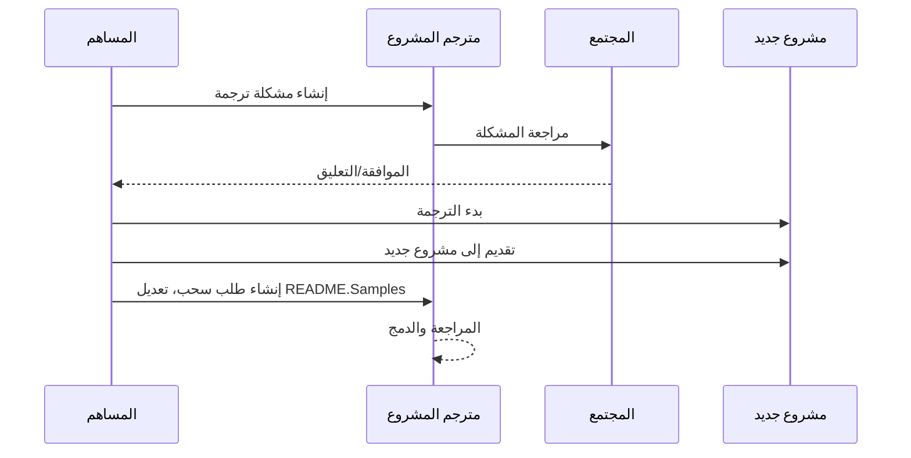

# مترجم المشروع

امتداد سهل الاستخدام لـ VS Code لترجمة المشاريع إلى لغات متعددة.

مستودع المشروع: `https://github.com/Project-Translation/project_translator`

## التثبيت

1. السوق:
   - سوق امتدادات VS Code: [https://marketplace.visualstudio.com/items?itemName=techfetch-dev.project-translator](https://marketplace.visualstudio.com/items?itemName=techfetch-dev.project-translator)
   - سجل Open VSX: [https://open-vsx.org/extension/techfetch-dev/project-translator](https://open-vsx.org/extension/techfetch-dev/project-translator)
2. ابحث عن `techfetch-dev.project-translator` في نافذة امتدادات VS Code وقم بالتثبيت

<!--  -->


## اللغات المتاحة

يدعم الامتداد الترجمة إلى هذه اللغات:

- [简体中文 (zh-cn)](./README.zh-cn.md)
- [繁體中文 (zh-tw)](./README.zh-tw.md)
- [日本語 (ja-jp)](./README.ja-jp.md)
- [한국어 (ko-kr)](./README.ko-kr.md)
- [Français (fr-fr)](./README.fr-fr.md)
- [Deutsch (de-de)](./README.de-de.md)
- [Español (es-es)](./README.es-es.md)
- [Português (pt-br)](./README.pt-br.md)
- [Русский (ru-ru)](./README.ru-ru.md)
- [العربية (ar-sa)](./README.ar-sa.md)
- [العربية (ar-ae)](./README.ar-ae.md)
- [العربية (ar-eg)](./README.ar-eg.md)

## عينات

| المشروع                                                                             | المستودع الأصلي                                                                                       | الوصف                                                                                                                                                               | النجوم | الوسوم                                                                                                                                                                                                                                                                                                                                                                                                                                                                                                                                                                                                                                                                 |
| ----------------------------------------------------------------------------------- | --------------------------------------------------------------------------------------------------------- | ------------------------------------------------------------------------------------------------------------------------------------------------------------------------- | ----- | -------------------------------------------------------------------------------------------------------------------------------------------------------------------------------------------------------------------------------------------------------------------------------------------------------------------------------------------------------------------------------------------------------------------------------------------------------------------------------------------------------------------------------------------------------------------------------------------------------------------------------------------------------------------- |
| [algorithm-visualizer](https://github.com/Project-Translation/algorithm-visualizer) | [algorithm-visualizer/algorithm-visualizer](https://github.com/algorithm-visualizer/algorithm-visualizer) | :fireworks:منصة تفاعلية على الإنترنت لتصور الخوارزميات من الكود                                                                                               | 47301 | [`algorithm`](https://github.com/topics/algorithm), [`animation`](https://github.com/topics/animation), [`data-structure`](https://github.com/topics/data-structure), [`visualization`](https://github.com/topics/visualization)                                                                                                                                                                                                                                                                                                                                                                                                                                     |
| [algorithms](https://github.com/Project-Translation/algorithms)                     | [algorithm-visualizer/algorithms](https://github.com/algorithm-visualizer/algorithms)                     | :crystal_ball:تصورات الخوارزميات                                                                                                                                    | 401   | N/A                                                                                                                                                                                                                                                                                                                                                                                                                                                                                                                                                                                                                                                                  |
| [cline-docs](https://github.com/Project-Translation/cline-docs)                     | [cline/cline](https://github.com/cline/cline)                                                             | وكيل ترميز مستقل داخل بيئة التطوير الخاص بك، قادر على إنشاء/تحرير الملفات، تنفيذ الأوامر، استخدام المتصفح، والمزيد بإذن منك في كل خطوة. | 39572 | N/A                                                                                                                                                                                                                                                                                                                                                                                                                                                                                                                                                                                                                                                                  |
| [cursor-docs](https://github.com/Project-Translation/cursor-docs)                   | [getcursor/docs](https://github.com/getcursor/docs)                                                       | الوثائق مفتوحة المصدر لـ Cursor                                                                                                                                        | 309   | N/A                                                                                                                                                                                                                                                                                                                                                                                                                                                                                                                                                                                                                                                                  |
| [gobyexample](https://github.com/Project-Translation/gobyexample)                   | [mmcgrana/gobyexample](https://github.com/mmcgrana/gobyexample)                                           | Go بالأمثلة                                                                                                                                                             | 7523  | N/A                                                                                                                                                                                                                                                                                                                                                                                                                                                                                                                                                                                                                                                                  |
| [golang-website](https://github.com/Project-Translation/golang-website)             | [golang/website](https://github.com/golang/website)                                                       | [مرآة] موقعي go.dev و golang.org                                                                                                                       | 402   | N/A                                                                                                                                                                                                                                                                                                                                                                                                                                                                                                                                                                                                                                                                  |
| [reference-en-us](https://github.com/Project-Translation/reference-en-us)           | [Fechin/reference](https://github.com/Fechin/reference)                                                   | ⭕ مشاركة ورقة غش سريعة للمرجع للمطورين.                                                                                                                      | 7808  | [`awk`](https://github.com/topics/awk), [`bash`](https://github.com/topics/bash), [`chatgpt`](https://github.com/topics/chatgpt), [`cheatsheet`](https://github.com/topics/cheatsheet), [`cheatsheets`](https://github.com/topics/cheatsheets), [`css`](https://github.com/topics/css), [`golang`](https://github.com/topics/golang), [`grep`](https://github.com/topics/grep), [`markdown`](https://github.com/topics/markdown), [`python`](https://github.com/topics/python), [`reference`](https://github.com/topics/reference), [`sed`](https://github.com/topics/sed), [`snippets`](https://github.com/topics/snippets), [`vim`](https://github.com/topics/vim) |
| [styleguide](https://github.com/Project-Translation/styleguide)                     | [google/styleguide](https://github.com/google/styleguide)                                                 | أدلة أسلوب لمشاريع Google مفتوحة المصدر                                                                                                                   | 38055 | [`cpplint`](https://github.com/topics/cpplint), [`style-guide`](https://github.com/topics/style-guide), [`styleguide`](https://github.com/topics/styleguide)                                                                                                                                                                                                                                                                                                                                                                                                                                                                                                         |
| [vscode-docs](https://github.com/Project-Translation/vscode-docs)                   | [microsoft/vscode-docs](https://github.com/microsoft/vscode-docs)                                         | الوثائق العامة لـ Visual Studio Code                                                                                                                               | 5914  | [`vscode`](https://github.com/topics/vscode)                                                                                                                                                                                                                                                                                                                                                                                                                                                                                                                                                                                                                         |

## طلب ترجمة مشروع

إذا كنت ترغب في المساهمة بترجمة أو تحتاج إلى ترجمة مشروع:

1. أنشئ مشكلة باستخدام القالب التالي:

```md
**المشروع**: [project_url]
**اللغة المستهدفة**: [target_lang]
**الوصف**: وصف موجز عن قيمة هذه الترجمة
```

2. سير العمل:



3. بعد دمج الطلب، ستضاف الترجمة إلى قسم العينات.

الترجمات قيد التنفيذ حالياً: [عرض المشكلات](https://github.com/Project-Translation/project_translator/issues)

## الميزات

- 📁 دعم الترجمة على مستوى المجلد
  - ترجمة مجلدات المشروع بأكملها إلى لغات متعددة
  - الحفاظ على هيكل المجلد الأصلي والتسلسل الهرمي
  - دعم الترجمة التلقائية للمجلدات الفرعية
  - الكشف التلقائي عن المحتوى القابل للترجمة
  - معالجة الدُفعات للترجمات واسعة النطاق بكفاءة
- 📄 دعم الترجمة على مستوى الملف
  - ترجمة ملفات فردية إلى لغات متعددة
  - الحفاظ على هيكل الملف الأصلي وتنسيقه
  - دعم كل من أوضاع ترجمة المجلد والملف
- 💡 ترجمة ذكية باستخدام الذكاء الاصطناعي
  - الحفاظ تلقائياً على سلامة هيكل الكود
  - ترجمة تعليقات الكود فقط، والحفاظ على منطق الكود
  - الحفاظ على تنسيقات هياكل البيانات مثل JSON/XML وغيرها
  - جودة ترجمة احترافية للوثائق التقنية
- ⚙️ تكوين مرن
  - تكوين مجلد المصدر ومجلدات الهدف المتعددة
  - دعم فترات ترجمة ملفات مخصصة
  - تعيين أنواع ملفات محددة لتجاهلها
  - دعم خيارات نماذج ذكاء اصطناعي متعددة
- 🚀 عمليات سهلة الاستخدام
  - عرض تقدم الترجمة في الوقت الفعلي
  - دعم إيقاف/استئناف/إيقاف الترجمة
  - صيانة تلقائية لهيكل مجلد الهدف
  - ترجمة تزايدية لتجنب العمل المكرر
- 🔄 ترجمة تفاضلية (تجريبية)
  - وضع Diff-apply لترقية الترجمات الحالية بكفاءة
  - تقليل استخدام واجهة برمجة التطبيقات عن طريق ترجمة المحتوى المتغير فقط
  - الحفاظ على سجل الإصدارات مع أقل التعديلات
  - ⚠️ ميزة تجريبية - انظر [الميزات المتقدمة](#differential-translation-diff-apply-mode) للتفاصيل

## التكوين

يدعم الامتداد خيارات التكوين التالية:

```json
{
  "projectTranslator.specifiedFolders": [
    {
      "sourceFolder": {
        "path": "مسار مجلد المصدر",
        "lang": "رمز لغة المصدر"
      },
      "targetFolders": [
        {
          "path": "مسار مجلد الهدف",
          "lang": "رمز لغة الهدف"
        }
      ]
    }
  ],
  "projectTranslator.specifiedFiles": [
    {
      "sourceFile": {
        "path": "مسار ملف المصدر",
        "lang": "رمز لغة المصدر"
      },
      "targetFiles": [
        {
          "path": "مسار ملف الهدف",
          "lang": "رمز لغة الهدف"
        }
      ]
    }
  ],
  "projectTranslator.currentVendor": "openai",
  "projectTranslator.vendors": [
    {
      "name": "openai",
      "apiEndpoint": "رابط نهاية واجهة برمجة التطبيقات",
      "apiKeyEnvVarName": "MY_OPENAI_API_KEY",
      "model": "gpt-4o",
      "rpm": "10",
      "maxTokensPerSegment": 4096,
      "timeout": 180,
      "temperature": 0.1
    }
  ],
  "projectTranslator.userPrompts": [
      "1. يجب أن يعيد عدم الحاجة للترجمة إذا كان ملف markdown يحتوي على 'draft' مضبوط على 'true' في front matter.",
      "2. './readmes/' في الجمل يجب استبدالها بـ './'",
  ],
  "projectTranslator.ignore": {
    "paths": [
      "**/node_modules/**"
    ],
    "extensions": [
      ".log"
    ]
  },
}
```

تفاصيل التكوين الرئيسية:

| خيار التكوين                        | الوصف                                                                                    |
| ------------------------------------------- | ---------------------------------------------------------------------------------------------- |
| `projectTranslator.specifiedFolders`        | مجلدات مصدر متعددة مع مجلدات الهدف المقابلة لها للترجمة           |
| `projectTranslator.specifiedFiles`          | ملفات مصدر متعددة مع ملفات الهدف المقابلة لها للترجمة               |
| `projectTranslator.translationIntervalDays` | فاصل الترجمة بالأيام (افتراضي 7 أيام)                                                  |
| `projectTranslator.copyOnly`                | ملفات للنسخ فقط دون ترجمة (مع مصفوفات `paths` و `extensions`)                         |
| `projectTranslator.ignore`                  | ملفات لتجاهلها تماماً (مع مصفوفات `paths` و `extensions`)                              |
| `projectTranslator.skipFrontMatterMarkers`  | تخطي الملفات بناءً على علامات front matter (مع `enabled` و `markers` كمصفوفات)                 |
| `projectTranslator.currentVendor`           | موفر واجهة برمجة التطبيقات الحالي المستخدم                                                                      |
| `projectTranslator.vendors`                 | قائمة تكوين موفر واجهة برمجة التطبيقات (يمكن استخدام apiKey مباشرة أو apiKeyEnvVarName للمتغيرات البيئية) |
| `projectTranslator.systemPromptLanguage`    | اللغة المستخدمة في التعليمات المدمجة للنظام (افتراضي: en). يؤثر على كيفية توجيه النموذج، وليس لغة الواجهة |
| `projectTranslator.systemPrompts`           | مصفوفة التعليمات للنظام لتوجيه عملية الترجمة                                        |
| `projectTranslator.userPrompts`             | مصفوفة التعليمات المحددة من المستخدم، ستضاف هذه التعليمات بعد تعليمات النظام أثناء الترجمة |
| `projectTranslator.segmentationMarkers`     | علامات التجزئة المكونة حسب نوع الملف، تدعم التعبيرات العادية                     |
| `projectTranslator.debug`                   | تمكين وضع التصحيح لتسجيل جميع طلبات واجهة برمجة التطبيقات والاستجابات إلى قناة الإخراج (افتراضي: false)     |
| `projectTranslator.logFile`                 | تكوين ملفات سجل التصحيح (انظر [ميزة ملف السجل](./docs/log-file-feature.md))         |
| `projectTranslator.diffApply.enabled`       | تمكين وضع الترجمة التفاضلية التجريبي (افتراضي: false)                             |

## الاستخدام

1. افتح لوحة الأوامر (Ctrl+Shift+P / Cmd+Shift+P)
2. اكتب "Translate Project" واختر الأمر
3. إذا لم يتم تكوين مجلد المصدر، ستظهر نافذة اختيار المجلد
4. انتظر حتى تكتمل الترجمة

أثناء الترجمة:

- يمكن إيقاف/استئناف الترجمة عبر أزرار شريط الحالة
- يمكن إيقاف عملية الترجمة في أي وقت
- يظهر تقدم الترجمة في منطقة الإشعارات
- تظهر السجلات التفصيلية في لوحة الإخراج

## التطوير

### نظام البناء

يستخدم هذا الامتداد esbuild للبناء السريع والتطوير:

#### البرامج النصية المتاحة

- `npm run build` - بناء الإنتاج مع التصغير
- `npm run compile` - بناء التطوير
- `npm run watch` - وضع المراقبة للتطوير
- `npm test` - تشغيل الاختبارات

#### مهام VS Code

- **Build** (Ctrl+Shift+P → "Tasks: Run Task" → "build") - حزمة الامتداد للإنتاج
- **Watch** (Ctrl+Shift+P → "Tasks: Run Task" → "watch") - وضع التطوير مع إعادة البناء التلقائي

### إعداد التطوير

1. استنسخ المستودع
2. قم بتشغيل `npm install` لتثبيت التبعيات
3. اضغط على `F5` لبدء التصحيح أو قم بتشغيل مهمة "watch" للتطوير

تكوين esbuild:

- يحزم جميع ملفات TypeScript في ملف واحد `out/extension.js`
- يستثني واجهة برمجة تطبيقات VS Code (معلمة كخارجية)

## ميزات متقدمة

### استخدام المتغيرات البيئية لمفاتيح واجهة برمجة التطبيقات

يدعم مترجم المشروع استخدام المتغيرات البيئية لمفاتيح واجهة برمجة التطبيقات، وهو نهج أكثر أماناً من تخزين مفاتيح واجهة برمجة التطبيقات مباشرة في ملفات التكوين:

1. قم بتكوين موفرك بخاصية `apiKeyEnvVarName`:

```json
{
  "projectTranslator.vendors": [
    {
      "name": "openai",
      "apiEndpoint": "https://api.openai.com/v1",
      "apiKeyEnvVarName": "OPENAI_API_KEY",
      "model": "gpt-4"
    },
    {
      "name": "openrouter",
      "apiEndpoint": "https://openrouter.ai/api/v1",
      "apiKeyEnvVarName": "OPENROUTER_API_KEY",
      "model": "anthropic/claude-3-opus"
    }
  ]
}
```

2. قم بتعيين المتغير البيئي في نظامك:
   - على Windows: `set OPENAI_API_KEY=your_api_key`
   - على macOS/Linux: `export OPENAI_API_KEY=your_api_key`

3. عند تشغيل الامتداد، سيقوم بما يلي:
   - التحقق أولاً مما إذا تم توفير `apiKey` مباشرة في التكوين
   - إذا لم يكن كذلك، سيبحث عن المتغير البيئي المحدد بواسطة `apiKeyEnvVarName`

يحافظ هذا النهج على مفاتيح واجهة برمجة التطبيقات خارج ملفات التكوين وأنظمة التحكم في الإصدار.

### تخطي الترجمة بناءً على Front Matter

يمكن لمترجم المشروع تخطي ترجمة ملفات Markdown بناءً على بيانات وصفية في front matter. هذا مفيد للمستندات المسودة أو الملفات المحددة على أنها لا تحتاج إلى ترجمة.

لتمكين هذه الميزة، قم بتكوين خيار `projectTranslator.skipFrontMatterMarkers`:

```json
{
  "projectTranslator.skipFrontMatterMarkers": {
    "enabled": true,
    "markers": [
      {
        "key": "draft",
        "value": "true"
      },
      {
        "key": "translate",
        "value": "false"
      }
    ]
  }
}
```

مع هذا التكوين، سيتم تخطي أي ملف Markdown يحتوي على front matter يحتوي على `draft: true` أو `translate: false` أثناء الترجمة ونسخه مباشرة إلى موقع الهدف.

مثال لملف Markdown سيتم تخطيه:
```
---
draft: true
title: "مسودة المستند"
---

هذا المستند مسودة ولا يجب ترجمته.
```

### وضع الترجمة التفاضلية (Diff-Apply)

> **⚠️ تحذير ميزة تجريبية**: وضع الترجمة التفاضلية حالياً ميزة تجريبية وقد يكون لها مشاكل في الاستقرار والتوافق. يوصى باستخدامها بحذر في بيئات الإنتاج ونسخ الملفات المهمة دائماً.

يدعم الامتداد وضع ترجمة تفاضلية اختياري (diff-apply). عند التمكين، يرسل الامتداد كل من محتوى المصدر وملف الهدف المترجم الحالي إلى النموذج. يجب أن يعيد النموذج واحداً أو أكثر من كتل SEARCH/REPLACE (نص عادي، بدون أسوار كود). يطبق الامتداد هذه الكتل محلياً لتقليل التغييرات، وتقليل استخدام واجهة برمجة التطبيقات، والحفاظ بشكل أفضل على سجل الإصدارات.

- **تبديل**: قم بتكوين `projectTranslator.diffApply.enabled` في إعدادات VS Code أو `project.translation.json` (افتراضي: `false`).
- **خيارات**:
  - `validationLevel`: `normal` أو `strict` (افتراضي: `normal`). في الوضع `strict`، ستسبب العلامات غير الصالحة أو فشل المطابقة خطأً وسيعود الامتداد إلى تدفق الترجمة القياسي.
  - `autoBackup`: إذا كان true، قم بإنشاء نسخة احتياطية `.bak` لملف الهدف قبل تطبيق التعديلات (افتراضي: `true`).
  - `maxOperationsPerFile`: (محفوظ للتطابق) غير مستخدم بواسطة الإستراتيجية الجديدة.

سير العمل:
1. إذا كان `diffApply.enabled` هو `true` وملف الهدف موجود، يقرأ الامتداد محتويات المصدر والهدف.
2. يستدعي النموذج مع تعليمات تفاضلية ويتطلب إعادة كتل SEARCH/REPLACE كنص عادي.
3. محلياً، يحلل الامتداد ويطبق كتل SEARCH/REPLACE. إذا فشل التطبيق، يعود إلى الترجمة الكاملة العادية ويكتب فوق ملف الهدف.

مثال SEARCH/REPLACE (يسمح بكتل متعددة):

```
<<<<<<< SEARCH
:start_line: 10
-------
const label = "Old"
=======
const label = "New"
>>>>>>> REPLACE

<<<<<<< SEARCH
:start_line: 25
-------
function foo() {
  return 1
}
=======
function foo() {
  return 2
}
>>>>>>> REPLACE
```

ملاحظات:
- استخدم المحتوى الدقيق بما في ذلك المسافات البادئة والبيضاء في أقسام SEARCH. إذا لم تكن متأكداً، استخدم أحدث محتوى ملف.
- احتفظ بخط واحد من `=======` بين SEARCH و REPLACE.
- إذا لم يكن هناك حاجة لتغيير، يجب أن يعيد النموذج سلسلة فارغة.

لماذا تعمل الترجمة التفاضلية حالياً بشكل ضعيف (شرح)

- **تحديات محاذاة ومقارنة اللغات المتعددة**: تتطلب الترجمة التفاضلية إرسال كل من المستند المصدر الأصلي والمستند المترجم الحالي إلى النموذج، ويجب على النموذج مقارنتها عبر اللغات لتحديد أجزاء الترجمة التي تحتاج إلى تغيير. هذه مهمة أصعب بشكل أساسي من تعديل مستند واحد في مكانه لأن النموذج يجب أن يحاذي المقاطع بدقة في لغات مختلفة ويحكم على الاختلافات الدلالية.

- **تعقيد الحفاظ على التنسيق والحدود**: تحتوي العديد من المستندات على كتل كود، جداول، علامات واجهة أمامية، أو عناصر نائبة خاصة. يجب أن يحافظ تدفق diff الموثوق على هذه الهياكل أثناء إجراء التعديلات النصية. إذا لم يتمكن النموذج من إنتاج نتائج تتبع تنسيق SEARCH/REPLACE بدقة، فقد يؤدي التطبيق التلقائي للتعديلات إلى تراجعات في التنسيق أو أخطاء هيكلية.

- **مشاكل السياق واتساق المصطلحات**: تعتمد التعديلات الصغيرة المحلية غالباً على سياق أوسع وقائمة مصطلحات/أسلوب موجودة. عند الطلب بإجراء تعديلات طفيفة، قد يهمل النموذج الاتساق العالمي (المصطلحات، الأسلوب، التعليقات، أسماء المتغيرات)، مما يؤدي إلى ترجمات غير متسقة أو منحرفة دلالياً.

- **مقايضات استقرار النموذج والتكلفة**: تحقيق ترجمة تفاضلية موثوقة يتطلب نماذج ذات تفكير مقارن قوي وتنسيقات إخراج مستقرة ومتوقعة. النماذج السائدة الحالية لا توفر بشكل موثوق كل من المحاذاة ثنائية اللغة القوية وتنسيقات الإخراج الصارمة بتكلفة معقولة، لذا غالباً ما تعود الأنظمة إلى إعادة الترجمة الكاملة لضمان الصحة.

لذلك، بينما يمكن نظرياً للترجمة التفاضلية تقليل الرموز المكلفة في الإخراج والحفاظ بشكل أفضل على سجل الإصدارات، فإنها محدودة حالياً بقدرات النماذج على المقارنة عبر اللغات واستقرار الإخراج. تظل هذه الميزة تجريبية؛ التوصيات للتخفيف تشمل الاحتفاظ بنسخ احتياطية تلقائية (`autoBackup: true`)، واستخدام مستوى تحمل (`validationLevel: "normal"`)، والرجوع إلى إعادة الترجمة الكاملة عند فشل المطابقة أو التنسيق. في المستقبل، قد تحسن معالجات ما بعد المحاذاة ثنائية اللغة المتخصصة أو النماذج الأصغر المخصصة استقرار نهج diff.

توفير التكاليف ولماذا يساعد

- **تكلفة رمز الإدخال مقابل الإخراج**: تفرض واجهات برمجة التطبيقات للنماذج الكبيرة عادةً رسوماً مختلفة لرموز الإدخال (التعليمات) والإخراج (الإكمال). غالباً، تكون رموز الإخراج أكثر تكلفة بشكل كبير لأن النموذج يولد نصاً أطول. يساعد Diff-apply لأننا نرسل **المصدر المحدث (إدخال)** و **ملف الترجمة الحالي (إدخال)** إلى النموذج ونطلب JSON مضغوطاً من التعديلات. استجابة النموذج هي JSON صغير (رموز إخراج قليلة) بدلاً من ملف مترجم كامل (رموز إخراج كثيرة)، لذا تدفع أقل بكثير للجزء المكلف من الإخراج.

- **إرسال ما تغير فقط**: بدلاً من إعادة ترجمة الملف بأكمله عند حدوث تغييرات صغيرة، توجه diff-apply النموذج لحساب عمليات التعديل الدنيا لتحديث الترجمة الحالية. هذا فعال بشكل خاص للملفات التي تمت ترجمتها مسبقاً وتتلقى تعديلات تزايدية فقط.

- **الأفضل للملفات المنسقة**: تستفيد الملفات ذات التنسيق الصارم (JSON، XML، Markdown مع كتل كود) بشكل كبير لأن diff-apply يحافظ على الهيكل ويغير فقط الأجزاء النصية التي تحتاج إلى ترجمة. هذا يقلل من فرصة التراجعات المتعلقة بالتنسيق ورموز الإخراج الإضافية الناتجة عن إعادة تنسيق النموذج.

- **وحدة الأساس الموجهة للأسطر، تجميع أذكى**: تعامل الأداة الوحدة الأساسية للترجمة على أنها "سطر"، وتطبق إستراتيجية SEARCH/REPLACE مطابقة دقيقة أو تقريبية بالقرب من `:start_line:`. استخدم `validationLevel: "normal"` للسلوك المتسامح و `"strict"` عندما تحتاج إلى تعديلات محافظة ودقيقة.

متى تستخدم diff-apply:

- استخدم عندما يكون ملف الهدف موجوداً بالفعل وتمت ترجمته مسبقاً.
- استخدم للمستندات الكبيرة المنسقة حيث ستكون إعادة ترجمة الملف بأكمله مكلفة.
- تجنب للملفات الجديدة تماماً بدون أي ترجمة سابقة، أو عندما تريد إعادة ترجمة جديدة.

### وثائق التصميم

- يولد خرائط المصدر لبناء التطوير
- يصغر الكود لبناء الإنتاج
- يوفر تكامل مطابق المشاكل لـ VS Code

## ملاحظات

- تأكد من وجود حصة كافية لاستخدام واجهة برمجة التطبيقات
- يوصى باختبار المشاريع الصغيرة أولاً
- استخدم مفاتيح واجهة برمجة التطبيقات المخصصة وأزلها بعد الانتهاء

## الترخيص

[الترخيص](LICENSE)