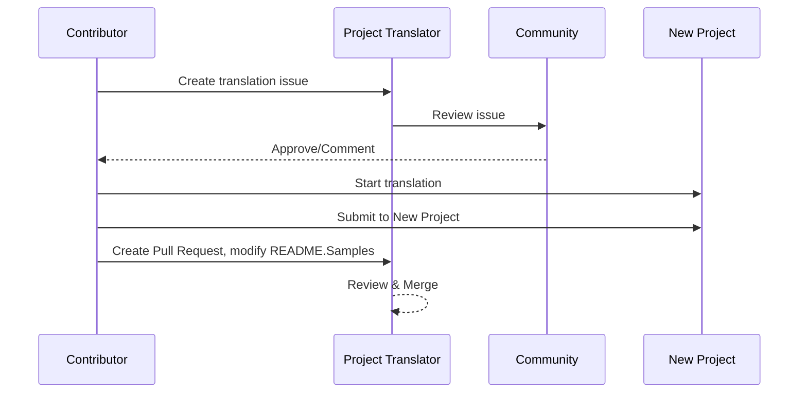

# مترجم المشروع

امتداد VSCode: أداة سهلة الاستخدام لتحقيق التوطين متعدد اللغات للمشاريع.

<!--
## الترجمات المتاحة

يدعم الامتداد الترجمة إلى هذه اللغات:

- [简体中文 (zh-cn)](./README.zh-cn.md)
- [繁體中文 (zh-tw)](./README.zh-tw.md)
- [日本語 (ja-jp)](./README.ja-jp.md)
- [한국어 (ko-kr)](./README.ko-kr.md)
- [Français (fr-fr)](./README.fr-fr.md)
- [Deutsch (de-de)](./README.de-de.md)
- [Español (es-es)](./README.es-es.md)
- [Português (pt-br)](./README.pt-br.md)
- [Русский (ru-ru)](./README.ru-ru.md)
- [العربية (ar-sa)](./README.ar-sa.md)
- [العربية (ar-ae)](./README.ar-ae.md)
- [العربية (ar-eg)](./README.ar-eg.md) -->

## عينات
| المشروع                                                                             | المستودع الأصلي                                                                                       | الوصف                                                                                                                                                               | النجوم | العلامات                                                                                                                                                                                                                                                                                                                                                                                                                                                                                                                                                                                                                                                                 |
| ----------------------------------------------------------------------------------- | --------------------------------------------------------------------------------------------------------- | ------------------------------------------------------------------------------------------------------------------------------------------------------------------------- | ----- | -------------------------------------------------------------------------------------------------------------------------------------------------------------------------------------------------------------------------------------------------------------------------------------------------------------------------------------------------------------------------------------------------------------------------------------------------------------------------------------------------------------------------------------------------------------------------------------------------------------------------------------------------------------------- |
| [algorithm-visualizer](https://github.com/Project-Translation/algorithm-visualizer) | [algorithm-visualizer/algorithm-visualizer](https://github.com/algorithm-visualizer/algorithm-visualizer) | :fireworks:منصة تفاعلية عبر الإنترنت تُظهر الخوارزميات من خلال الكود                                                                                               | 47301 | [`خوارزمية`](https://github.com/topics/algorithm), [`رسوم متحركة`](https://github.com/topics/animation), [`هيكل بيانات`](https://github.com/topics/data-structure), [`تصوير`](https://github.com/topics/visualization)                                                                                                                                                                                                                                                                                                                                                                                                                                     |
| [algorithms](https://github.com/Project-Translation/algorithms)                     | [algorithm-visualizer/algorithms](https://github.com/algorithm-visualizer/algorithms)                     | :crystal_ball:تصورات الخوارزميات                                                                                                                                    | 401   | N/A                                                                                                                                                                                                                                                                                                                                                                                                                                                                                                                                                                                                                                                                  |
| [cline-docs](https://github.com/Project-Translation/cline-docs)                     | [cline/cline](https://github.com/cline/cline)                                                             | وكيل ترميز ذاتي داخل محرر الكود الخاص بك، قادر على إنشاء/تحرير الملفات، تنفيذ الأوامر، استخدام المتصفح، وأكثر بإذنك في كل خطوة. | 39572 | N/A                                                                                                                                                                                                                                                                                                                                                                                                                                                                                                                                                                                                                                                                  |
| [cursor-docs](https://github.com/Project-Translation/cursor-docs)                   | [getcursor/docs](https://github.com/getcursor/docs)                                                       | وثائق Cursor المفتوحة المصدر                                                                                                                                        | 309   | N/A                                                                                                                                                                                                                                                                                                                                                                                                                                                                                                                                                                                                                                                                  |
| [gobyexample](https://github.com/Project-Translation/gobyexample)                   | [mmcgrana/gobyexample](https://github.com/mmcgrana/gobyexample)                                           | Go by Example                                                                                                                                                             | 7523  | N/A                                                                                                                                                                                                                                                                                                                                                                                                                                                                                                                                                                                                                                                                  |
| [golang-website](https://github.com/Project-Translation/golang-website)             | [golang/website](https://github.com/golang/website)                                                       | [mirror] موقع go.dev و golang.org الرئيسي                                                                                                                       | 402   | N/A                                                                                                                                                                                                                                                                                                                                                                                                                                                                                                                                                                                                                                                                  |
| [reference-en-us](https://github.com/Project-Translation/reference-en-us)           | [Fechin/reference](https://github.com/Fechin/reference)                                                   | ⭕ مشاركة دليل مرجعي سريع للمطورين.                                                                                                                      | 7808  | [`awk`](https://github.com/topics/awk), [`bash`](https://github.com/topics/bash), [`chatgpt`](https://github.com/topics/chatgpt), [`cheatsheet`](https://github.com/topics/cheatsheet), [`cheatsheets`](https://github.com/topics/cheatsheets), [`css`](https://github.com/topics/css), [`golang`](https://github.com/topics/golang), [`grep`](https://github.com/topics/grep), [`markdown`](https://github.com/topics/markdown), [`python`](https://github.com/topics/python), [`reference`](https://github.com/topics/reference), [`sed`](https://github.com/topics/sed), [`snippets`](https://github.com/topics/snippets), [`vim`](https://github.com/topics/vim) |
| [styleguide](https://github.com/Project-Translation/styleguide)                     | [google/styleguide](https://github.com/google/styleguide)                                                 | دليل أساليب للمشاريع المفتوحة المصدر المنشأة من Google                                                                                                                   | 38055 | [`cpplint`](https://github.com/topics/cpplint), [`style-guide`](https://github.com/topics/style-guide), [`styleguide`](https://github.com/topics/styleguide)                                                                                                                                                                                                                                                                                                                                                                                                                                                                                                         |
| [vscode-docs](https://github.com/Project-Translation/vscode-docs)                   | [microsoft/vscode-docs](https://github.com/microsoft/vscode-docs)                                         | الوثائق العامة لـ Visual Studio Code                                                                                                                               | 5914  | [`vscode`](https://github.com/topics/vscode)                                                                                                                                                                                                                                                                                                                                                                                                                                                                                                                                                                                                                         |

## طلب ترجمة المشروع

إذا كنت ترغب في المساهمة في ترجمة أو تحتاج إلى ترجمة مشروع:

1. أنشئ قضية باستخدام القالب التالي:

```md
**المشروع**: [project_url]
**اللغة المستهدفة**: [target_lang]
**الوصف**: وصف موجز لسبب قيمة هذه الترجمة
```

2. تدفق العمل:


3. بعد دمج الـ PR، سيتم إضافة الترجمة إلى قسم العينات.

الترجمات الحالية قيد التنفيذ: [عرض القضايا](https://github.com/Project-Translation/project_translator/issues)

## الميزات

- 📁 دعم الترجمة على مستوى المجلد
  - ترجمة مجلدات المشروع بأكملها إلى عدة لغات
  - الحفاظ على هيكل المجلد الأصلي وتسلسله
  - دعم الترجمة الترابطية للمجلدات الفرعية
  - اكتشاف تلقائي للمحتوى القابل للترجمة
  - معالجة دفعي للترجمات الكبيرة الحجم بكفاءة
- 📄 دعم الترجمة على مستوى الملف
  - ترجمة ملفات فردية إلى عدة لغات
  - الحفاظ على هيكل الملف الأصلي والتنسيق
  - دعم لأوضاع الترجمة سواء للمجلدات أو الملفات
- 💡 ترجمة ذكية باستخدام الذكاء الاصطناعي
  - الحفاظ التلقائي على سلامة هيكل الرمز
  - ترجمة تعليقات الرمز فقط، مع الحفاظ على المنطق البرمجي
  - الحفاظ على تنسيقات JSON/XML وغيرها من هياكل البيانات
  - جودة ترجمة احترافية للوثائق التقنية
- ⚙️ تهيئة مرنة
  - تهيئة مجلد المصدر وعدة مجلدات هدف
  - دعم لفواصل الترجمة المخصصة للملفات
  - تحديد أنواع الملفات المراد تجاهلها
  - دعم لخيارات نماذج الذكاء الاصطناعي المتعددة
- 🚀 عمليات سهلة الاستخدام
  - عرض تقدم الترجمة في الوقت الفعلي
  - دعم إيقاف مؤقت/استئناف/إيقاف الترجمة
  - صيانة تلقائية لهيكل المجلد الهدف
  - ترجمة تدريجية لتجنب العمل المتكرر

## التثبيت

1. ابحث عن "[مترجم المشروع](https://marketplace.visualstudio.com/items?itemName=techfetch-dev.project-translator)" في سوق الإضافات لـ VS Code
2. انقر على تثبيت

## التهيئة

الإضافة تدعم الخيارات التالية للتهيئة:

```json
{
  "projectTranslator.specifiedFolders": [
    {
      "sourceFolder": {
        "path": "Source folder path",
        "lang": "Source language code"
      },
      "destFolders": [
        {
          "path": "Target folder path",
          "lang": "Target language code"
        }
      ]
    }
  ],
  "projectTranslator.specifiedFiles": [
    {
      "sourceFile": {
        "path": "Source file path",
        "lang": "Source language code"
      },
      "destFiles": [
        {
          "path": "Target file path",
          "lang": "Target language code"
        }
      ]
    }
  ],
  "projectTranslator.currentVendor": "openai",
  "projectTranslator.vendors": [
    {
      "name": "openai",
      "apiEndpoint": "API endpoint URL",
      "apiKey": "API authentication key",
      "model": "Model name to use",
      "rpm": "Maximum requests per minute",
      "maxTokensPerSegment": 4096,
      "timeout": 30,
      "temperature": 0.0
    }
  ]
}
```

تفاصيل التهيئة الرئيسية:

| خيار التهيئة                        | الوصف                                                                                    |
| ----------------------------------- | ---------------------------------------------------------------------------------------- |
| `projectTranslator.specifiedFolders`        | عدة مجلدات مصدر مع مجلدات الوجهة المقابلة للترجمة           |
| `projectTranslator.specifiedFiles`          | عدة ملفات مصدر مع ملفات الوجهة المقابلة للترجمة               |
| `projectTranslator.translationIntervalDays` | فاصل الترجمة بالأيام (الافتراضي 7 أيام)                                                  |
| `projectTranslator.copyOnly`                | الملفات التي يجب نسخها فقط دون ترجمتها (مع مصفوفات `paths` و `extensions`)                         |
| `projectTranslator.ignore`                  | الملفات التي يجب تجاهلها تمامًا (مع مصفوفات `paths` و `extensions`)                              |
| `projectTranslator.currentVendor`           | المزود الحالي للواجهة البرمجية المستخدم                                                                      |
| `projectTranslator.vendors`                 | قائمة تهيئة مزودي الواجهات البرمجية                                                                  |
| `projectTranslator.systemPrompts`           | مصفوفة التلميحات النظامية لتوجيه عملية الترجمة                                        |
| `projectTranslator.userPrompts`             | مصفوفة التلميحات المحددة من قبل المستخدم، ستتم إضافتها بعد تلميحات النظام أثناء الترجمة |
| `projectTranslator.segmentationMarkers`     | علامات التقسيم المحتددة حسب نوع الملف، تدعم التعبيرات المنظمة                     |

## الاستخدام

1. افتح قائمة الأوامر (Ctrl+Shift+P / Cmd+Shift+P)
2. اكتب "Translate Project" واختر الأمر
3. إذا لم يتم تهيئة مجلد المصدر، س Apper ظهر مربع حوار لتحديد المجلد
4. انتظر حتى اكتمال الترجمة

أثناء الترجمة:

- يمكن إيقاف الترجمة مؤقتًا/استئنافها عبر أزرار شريط الحالة
- يمكن إيقاف عملية الترجمة في أي وقت
- يتم عرض تقدم الترجمة في منطقة الإشعارات
- يتم عرض السجلات التفصيلية في لوحة الإخراج

## ملاحظات
- تأكد من وجود حصة كافية لاستخدام API
- يُوصى باختبار مع مشاريع صغيرة أولاً
- استخدم مفاتيح API مخصصة وأزلها بعد الانتهاء

## رخصة

[رخصة](LICENSE)