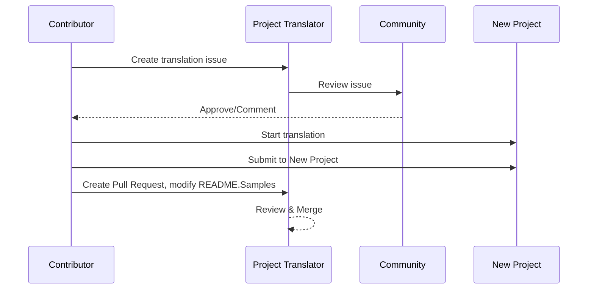

# Project Translator

A VSCode extension: An easy-to-use tool for multi-language localization of projects.

## Available Translations

The extension supports translation to these languages:

- [简体中文 (zh-cn)](./readmes/README.zh-cn.md)
- [繁體中文 (zh-tw)](./readmes/README.zh-tw.md)
- [日本語 (ja-jp)](./readmes/README.ja-jp.md)
- [한국어 (ko-kr)](./readmes/README.ko-kr.md)
- [Français (fr-fr)](./readmes/README.fr-fr.md)
- [Deutsch (de-de)](./readmes/README.de-de.md)
- [Español (es-es)](./readmes/README.es-es.md)
- [Português (pt-br)](./readmes/README.pt-br.md)
- [Русский (ru-ru)](./readmes/README.ru-ru.md)
- [العربية (ar-sa)](./readmes/README.ar-sa.md)
- [العربية (ar-ae)](./readmes/README.ar-ae.md)
- [العربية (ar-eg)](./readmes/README.ar-eg.md)

## Samples

| Project                                                                             | Original Repository                                                                                       | Description                                                                                                                                                               | Stars | Tags                                                                                                                                                                                                                                                                                                                                                                                                                                                                                                                                                                                                                                                                 |
| ----------------------------------------------------------------------------------- | --------------------------------------------------------------------------------------------------------- | ------------------------------------------------------------------------------------------------------------------------------------------------------------------------- | ----- | -------------------------------------------------------------------------------------------------------------------------------------------------------------------------------------------------------------------------------------------------------------------------------------------------------------------------------------------------------------------------------------------------------------------------------------------------------------------------------------------------------------------------------------------------------------------------------------------------------------------------------------------------------------------- |
| [algorithm-visualizer](https://github.com/Project-Translation/algorithm-visualizer) | [algorithm-visualizer/algorithm-visualizer](https://github.com/algorithm-visualizer/algorithm-visualizer) | :fireworks:Interactive Online Platform that Visualizes Algorithms from Code                                                                                               | 47301 | [`algorithm`](https://github.com/topics/algorithm), [`animation`](https://github.com/topics/animation), [`data-structure`](https://github.com/topics/data-structure), [`visualization`](https://github.com/topics/visualization)                                                                                                                                                                                                                                                                                                                                                                                                                                     |
| [algorithms](https://github.com/Project-Translation/algorithms)                     | [algorithm-visualizer/algorithms](https://github.com/algorithm-visualizer/algorithms)                     | :crystal_ball:Algorithm Visualizations                                                                                                                                    | 401   | N/A                                                                                                                                                                                                                                                                                                                                                                                                                                                                                                                                                                                                                                                                  |
| [cline-docs](https://github.com/Project-Translation/cline-docs)                     | [cline/cline](https://github.com/cline/cline)                                                             | Autonomous coding agent right in your IDE, capable of creating/editing files, executing commands, using the browser, and more with your permission every step of the way. | 39572 | N/A                                                                                                                                                                                                                                                                                                                                                                                                                                                                                                                                                                                                                                                                  |
| [cursor-docs](https://github.com/Project-Translation/cursor-docs)                   | [getcursor/docs](https://github.com/getcursor/docs)                                                       | Cursor's Open Source Documentation                                                                                                                                        | 309   | N/A                                                                                                                                                                                                                                                                                                                                                                                                                                                                                                                                                                                                                                                                  |
| [gobyexample](https://github.com/Project-Translation/gobyexample)                   | [mmcgrana/gobyexample](https://github.com/mmcgrana/gobyexample)                                           | Go by Example                                                                                                                                                             | 7523  | N/A                                                                                                                                                                                                                                                                                                                                                                                                                                                                                                                                                                                                                                                                  |
| [golang-website](https://github.com/Project-Translation/golang-website)             | [golang/website](https://github.com/golang/website)                                                       | [mirror] Home of the go.dev and golang.org websites                                                                                                                       | 402   | N/A                                                                                                                                                                                                                                                                                                                                                                                                                                                                                                                                                                                                                                                                  |
| [reference-en-us](https://github.com/Project-Translation/reference-en-us)           | [Fechin/reference](https://github.com/Fechin/reference)                                                   | ⭕ Share quick reference cheat sheet for developers.                                                                                                                      | 7808  | [`awk`](https://github.com/topics/awk), [`bash`](https://github.com/topics/bash), [`chatgpt`](https://github.com/topics/chatgpt), [`cheatsheet`](https://github.com/topics/cheatsheet), [`cheatsheets`](https://github.com/topics/cheatsheets), [`css`](https://github.com/topics/css), [`golang`](https://github.com/topics/golang), [`grep`](https://github.com/topics/grep), [`markdown`](https://github.com/topics/markdown), [`python`](https://github.com/topics/python), [`reference`](https://github.com/topics/reference), [`sed`](https://github.com/topics/sed), [`snippets`](https://github.com/topics/snippets), [`vim`](https://github.com/topics/vim) |
| [styleguide](https://github.com/Project-Translation/styleguide)                     | [google/styleguide](https://github.com/google/styleguide)                                                 | Style guides for Google-originated open-source projects                                                                                                                   | 38055 | [`cpplint`](https://github.com/topics/cpplint), [`style-guide`](https://github.com/topics/style-guide), [`styleguide`](https://github.com/topics/styleguide)                                                                                                                                                                                                                                                                                                                                                                                                                                                                                                         |
| [vscode-docs](https://github.com/Project-Translation/vscode-docs)                   | [microsoft/vscode-docs](https://github.com/microsoft/vscode-docs)                                         | Public documentation for Visual Studio Code                                                                                                                               | 5914  | [`vscode`](https://github.com/topics/vscode)                                                                                                                                                                                                                                                                                                                                                                                                                                                                                                                                                                                                                         |

## Requesting Project Translation

If you want to contribute a translation or need a project to be translated:

1. Create an issue using the following template:

```md
**Project**: [project_url]
**Target Language**: [target_lang]
**Description**: Brief description of why this translation would be valuable
```

2. Workflow:



3. After the PR is merged, the translation will be added to the Samples section.

Current translations in progress: [View Issues](https://github.com/Project-Translation/project_translator/issues)

## Features

- 📁 Folder-level Translation Support
  - Translate entire project folders to multiple languages
  - Maintain original folder structure and hierarchy
  - Support for recursive translation of subfolders
  - Automatic detection of translatable content
  - Batch processing for efficient large-scale translations
- 📄 File-level Translation Support
  - Translate individual files to multiple languages
  - Preserve original file structure and formatting
  - Support for both folder and file translation modes
- 💡 Smart Translation with AI
  - Automatically maintains code structure integrity
  - Only translates code comments, preserves code logic
  - Maintains JSON/XML and other data structure formats
  - Professional technical documentation translation quality
- ⚙️ Flexible Configuration
  - Configure source folder and multiple target folders
  - Support for custom file translation intervals
  - Set specific file types to ignore
  - Support for multiple AI model options
- 🚀 User-Friendly Operations
  - Real-time translation progress display
  - Support for pause/resume/stop translation
  - Automatic maintenance of target folder structure
  - Incremental translation to avoid duplicate work

## Installation

1. Search for "[Project Translator](https://marketplace.visualstudio.com/items?itemName=techfetch-dev.project-translator)" in VS Code extension marketplace
2. Click install

## Configuration

The extension supports the following configuration options:

```json
{
  "projectTranslator.specifiedFolders": [
    {
      "sourceFolder": {
        "path": "Source folder path",
        "lang": "Source language code"
      },
      "targetFolders": [
        {
          "path": "Target folder path",
          "lang": "Target language code"
        }
      ]
    }
  ],
  "projectTranslator.specifiedFiles": [
    {
      "sourceFile": {
        "path": "Source file path",
        "lang": "Source language code"
      },
      "targetFiles": [
        {
          "path": "Target file path",
          "lang": "Target language code"
        }
      ]
    }
  ],
  "projectTranslator.currentVendor": "openai",
  "projectTranslator.vendors": [
    {
      "name": "openai",
      "apiEndpoint": "API endpoint URL",
      "apiKey": "API authentication key",
      "apiKeyEnvVarName": "Environment variable name for API key",
      "model": "Model name to use",
      "rpm": "Maximum requests per minute",
      "maxTokensPerSegment": 4096,
      "timeout": 30,
      "temperature": 0.0
    }
  ]
}
```

Key configuration details:

| خيار التهيئة                                | الوصف                                                                                     |
| ------------------------------------------- | ----------------------------------------------------------------------------------------- |
| `projectTranslator.specifiedFolders`        | مجلدات مصدر متعددة مع مجلدات الوجهة المقابلة لها للترجمة                                   |
| `projectTranslator.specifiedFiles`          | ملفات مصدر متعددة مع ملفات الوجهة المقابلة لها للترجمة                                     |
| `projectTranslator.translationIntervalDays` | الفاصل الزمني للترجمة بال أيام (القيمة الافتراضية 7 أيام)                                  |
| `projectTranslator.copyOnly`                | الملفات التي سيتم نسخها دون ترجمة (مع مصفوفتي `paths` و`extensions`)                      |
| `projectTranslator.ignore`                  | الملفات التي يتم تجاهلها تمامًا (مع مصفوفتي `paths` و`extensions`)                         |
| `projectTranslator.skipFrontMatterMarkers`  | تخطي الملفات استنادًا إلى علامات الـ front matter (مع `enabled` ومصفوفة `markers`)         |
| `projectTranslator.currentVendor`           | مزوّد واجهة برمجة التطبيقات الحالي المستخدم                                                |
| `projectTranslator.vendors`                 | قائمة تهيئة مزوّدي واجهة برمجة التطبيقات (يمكن استخدام مفتاح API مباشرة أو `apiKeyEnvVarName` للمتغيرات البيئية) |
| `projectTranslator.systemPrompts`           | مصفوفة الأوامر النظامية لتوجيه عملية الترجمة                                               |
| `projectTranslator.userPrompts`             | مصفوفة الأوامر المحددة من قبل المستخدم، تُضاف هذه الأوامر بعد الأوامر النظامية أثناء الترجمة |
| `projectTranslator.segmentationMarkers`     | علامات التقسيم المُعدّة حسب نوع الملف، وتُدعم التعبيرات المنتظمة                          |
| `projectTranslator.debug`                   | تفعيل وضع التصحيح لتسجيل جميع طلبات وردود واجهة برمجة التطبيقات إلى قناة الإخراج (القيمة الافتراضية: false) |
| `projectTranslator.logFile`                 | تهيئة ملفات سجل التصحيح (انظر [ميزة ملف السجل](./docs/log-file-feature.md))               |

## الاستخدام

1. افتح لوحة الأوامر (Ctrl+Shift+P / Cmd+Shift+P)
2. اكتب "ترجمة المشروع" وحدد الأمر
3. إذا لم يتم تهيئة مجلد المصدر، ستظهر نافذة اختيار المجلد
4. انتظر حتى تكتمل الترجمة

أثناء الترجمة:

- يمكن إيقاف الترجمة مؤقتًا / استئنافها عبر أزرار شريط الحالة
- يمكن إيقاف عملية الترجمة في أي وقت
- يتم عرض تقدم الترجمة في منطقة الإشعارات
- تظهر السجلات التفصيلية في لوحة المخرجات

## التطوير

### نظام البناء

يستخدم هذا الامتداد esbuild للحزم السريعة والتطوير:

#### النصوص المتاحة

- `npm run build` - بناء للإنتاج مع التصغير
- `npm run compile` - بناء للتطوير
- `npm run watch` - الوضع المراقب للتطوير
- `npm test` - تشغيل الاختبارات

#### مهام VS Code

- **Build** (Ctrl+Shift+P → "Tasks: Run Task" → "build") - يُجمّع الامتداد للإنتاج
- **Watch** (Ctrl+Shift+P → "Tasks: Run Task" → "watch") - وضع التطوير مع إعادة البناء التلقائية

### إعدادات التطوير

1. قم بنسخ المستودع
2. قم بتشغيل `npm install` لتثبيت التبعيات
3. اضغط `F5` لبدء التصحيح أو قم بتشغيل مهمة "watch" للتطوير

تهيئة esbuild:

- يُجمّع جميع ملفات TypeScript في ملف واحد `out/extension.js`
- يستثني واجهة برمجة تطبيقات VS Code (مُعلّم كمحتوى خارجي)

## الميزات المتقدمة

### استخدام المتغيرات البيئية لمفاتيح API

يدعم Project Translator استخدام المتغيرات البيئية لمفاتيح API، وهي طريقة أكثر أمانًا من تخزين المفاتيح مباشرة في ملفات التهيئة:

1. قم بتهيئة المزوّد الخاص بك باستخدام الخاصية `apiKeyEnvVarName`:

```json
{
  "projectTranslator.vendors": [
    {
      "name": "openai",
      "apiEndpoint": "https://api.openai.com/v1",
      "apiKeyEnvVarName": "OPENAI_API_KEY",
      "model": "gpt-4"
    },
    {
      "name": "openrouter",
      "apiEndpoint": "https://openrouter.ai/api/v1",
      "apiKeyEnvVarName": "OPENROUTER_API_KEY",
      "model": "anthropic/claude-3-opus"
    }
  ]
}
```

2. قم بتعيين المتغير البيئي في نظامك:
   - في ويندوز: `set OPENAI_API_KEY=your_api_key`
   - في ماك أو إس/لينكس: `export OPENAI_API_KEY=your_api_key`

3. عندما يعمل الامتداد، فإنه سيقوم بما يلي:
   - التحقق أولًا مما إذا تم توفير `apiKey` مباشرة في التهيئة
   - إذا لم يكن متوفرًا، فسيبحث عن المتغير البيئي المحدد بواسطة `apiKeyEnvVarName`

تُبقي هذه الطريقة مفاتيح API الخاصة بك خارج ملفات التهيئة وأنظمة التحكم بالإصدار.

### تخطي الترجمة استنادًا إلى الـ Front Matter

يمكن لـ Project Translator تخطي ترجمة ملفات Markdown استنادًا إلى بيانات الـ front matter الوصفية. وهذا مفيد للمستندات الأولية أو الملفات المعلمة بعدم الحاجة إلى الترجمة.

لتمكين هذه الميزة، قم بتهيئة خيار `projectTranslator.skipFrontMatterMarkers`:

```json
{
  "projectTranslator.skipFrontMatterMarkers": {
    "enabled": true,
    "markers": [
      {
        "key": "draft",
        "value": "true"
      },
      {
        "key": "translate",
        "value": "false"
      }
    ]
  }
}
```

مع هذا الإعداد، سيتم تخطي أي ملف Markdown يحتوي على front matter يحتوي على `draft: true` أو `translate: false` أثناء الترجمة، وسيتم نسخه مباشرة إلى الموقع الهدف.

مثال على ملف Markdown سيتم تخطيه:
```
---
draft: true
title: "مستند أولي"
---

هذا المستند هو مسودة ولا ينبغي ترجمته.
```


### توثيق التصميم

- يُولّد خرائط المصدر للبناءات الخاصة بالتطوير
- يُصغّر الكود للبناءات الخاصة بالإنتاج
- يوفر دمجًا مع problem matcher في VS Code

## ملاحظات

- تأكد من توفر رصيد كافٍ لاستخدام واجهة برمجة التطبيقات
- يُوصى بالاختبار مع مشاريع صغيرة أولًا
- استخدم مفاتيح API مخصصة واحذفها بعد الانتهاء

## الترخيص

[الترخيص](LICENSE)
