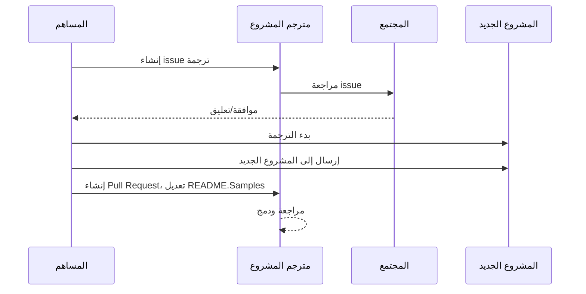

# مترجم المشروع

إضافة VS Code سهلة الاستخدام لترجمة المشاريع إلى لغات متعددة.

مستودع المشروع: `https://github.com/Project-Translation/project_translator`


## التثبيت

1. Marketplace:
   - VS Code Extensions Marketplace: [https://marketplace.visualstudio.com/items?itemName=techfetch-dev.project-translator](https://marketplace.visualstudio.com/items?itemName=techfetch-dev.project-translator)
   - Open VSX Registry: [https://open-vsx.org/extension/techfetch-dev/project-translator](https://open-vsx.org/extension/techfetch-dev/project-translator)
2. ابحث عن `techfetch-dev.project-translator` في عرض إضافات VS Code وانقر على تثبيت


<!--  -->


## الترجمات المتاحة

تدعم الإضافة الترجمة إلى هذه اللغات:

- [简体中文 (zh-cn)](./README.zh-cn.md)
- [繁體中文 (zh-tw)](./README.zh-tw.md)
- [日本語 (ja-jp)](./README.ja-jp.md)
- [한국어 (ko-kr)](./README.ko-kr.md)
- [Français (fr-fr)](./README.fr-fr.md)
- [Deutsch (de-de)](./README.de-de.md)
- [Español (es-es)](./README.es-es.md)
- [Português (pt-br)](./README.pt-br.md)
- [Русский (ru-ru)](./README.ru-ru.md)
- [العربية (ar-sa)](./README.ar-sa.md)
- [العربية (ar-ae)](./README.ar-ae.md)
- [العربية (ar-eg)](./README.ar-eg.md)

## العينات

| المشروع                                                                             | المستودع الأصلي                                                                                       | الوصف                                                                                                                                                               | النجوم | العلامات                                                                                                                                                                                                                                                                                                                                                                                                                                                                                                                                                                                                                                                                 |
| ----------------------------------------------------------------------------------- | --------------------------------------------------------------------------------------------------------- | ------------------------------------------------------------------------------------------------------------------------------------------------------------------------- | ----- | -------------------------------------------------------------------------------------------------------------------------------------------------------------------------------------------------------------------------------------------------------------------------------------------------------------------------------------------------------------------------------------------------------------------------------------------------------------------------------------------------------------------------------------------------------------------------------------------------------------------------------------------------------------------- |
| [algorithm-visualizer](https://github.com/Project-Translation/algorithm-visualizer) | [algorithm-visualizer/algorithm-visualizer](https://github.com/algorithm-visualizer/algorithm-visualizer) | :fireworks:منصة تفاعلية عبر الإنترنت تعرض الخوارزميات من الكود                                                                                               | 47301 | [`algorithm`](https://github.com/topics/algorithm), [`animation`](https://github.com/topics/animation), [`data-structure`](https://github.com/topics/data-structure), [`visualization`](https://github.com/topics/visualization)                                                                                                                                                                                                                                                                                                                                                                                                                                     |
| [algorithms](https://github.com/Project-Translation/algorithms)                     | [algorithm-visualizer/algorithms](https://github.com/algorithm-visualizer/algorithms)                     | :crystal_ball:عرض الخوارزميات المرئي                                                                                                                                    | 401   | N/A                                                                                                                                                                                                                                                                                                                                                                                                                                                                                                                                                                                                                                                                  |
| [cline-docs](https://github.com/Project-Translation/cline-docs)                     | [cline/cline](https://github.com/cline/cline)                                                             | وكيل برمجة ذاتي في IDE الخاص بك، قادر على إنشاء/تعديل الملفات، تنفيذ الأوامر، استخدام المتصفح، والمزيد بإذنك في كل خطوة. | 39572 | N/A                                                                                                                                                                                                                                                                                                                                                                                                                                                                                                                                                                                                                                                                  |
| [cursor-docs](https://github.com/Project-Translation/cursor-docs)                   | [getcursor/docs](https://github.com/getcursor/docs)                                                       | الوثائق المفتوحة المصدر لـ Cursor                                                                                                                                        | 309   | N/A                                                                                                                                                                                                                                                                                                                                                                                                                                                                                                                                                                                                                                                                  |
| [gobyexample](https://github.com/Project-Translation/gobyexample)                   | [mmcgrana/gobyexample](https://github.com/mmcgrana/gobyexample)                                           | Go by Example                                                                                                                                                             | 7523  | N/A                                                                                                                                                                                                                                                                                                                                                                                                                                                                                                                                                                                                                                                                  |
| [golang-website](https://github.com/Project-Translation/golang-website)             | [golang/website](https://github.com/golang/website)                                                       | [mirror] Home of the go.dev and golang.org websites                                                                                                                       | 402   | N/A                                                                                                                                                                                                                                                                                                                                                                                                                                                                                                                                                                                                                                                                  |
| [reference-en-us](https://github.com/Project-Translation/reference-en-us)           | [Fechin/reference](https://github.com/Fechin/reference)                                                   | ⭕ شارك ورقة غش مرجع سريعة للمطورين.                                                                                                                      | 7808  | [`awk`](https://github.com/topics/awk), [`bash`](https://github.com/topics/bash), [`chatgpt`](https://github.com/topics/chatgpt), [`cheatsheet`](https://github.com/topics/cheatsheet), [`cheatsheets`](https://github.com/topics/cheatsheets), [`css`](https://github.com/topics/css), [`golang`](https://github.com/topics/golang), [`grep`](https://github.com/topics/grep), [`markdown`](https://github.com/topics/markdown), [`python`](https://github.com/topics/python), [`reference`](https://github.com/topics/reference), [`sed`](https://github.com/topics/sed), [`snippets`](https://github.com/topics/snippets), [`vim`](https://github.com/topics/vim) |
| [styleguide](https://github.com/Project-Translation/styleguide)                     | [google/styleguide](https://github.com/google/styleguide)                                                 | أدوات التوجيه للمشاريع مفتوحة المصدر المنبثقة من Google                                                                                                                   | 38055 | [`cpplint`](https://github.com/topics/cpplint), [`style-guide`](https://github.com/topics/style-guide), [`styleguide`](https://github.com/topics/styleguide)                                                                                                                                                                                                                                                                                                                                                                                                                                                                                                         |
| [vscode-docs](https://github.com/Project-Translation/vscode-docs)                   | [microsoft/vscode-docs](https://github.com/microsoft/vscode-docs)                                         | الوثائق العامة لـ Visual Studio Code                                                                                                                                      | 5914  | [`vscode`](https://github.com/topics/vscode)                                                                                                                                                                                                                                                                                                                                                                                                                                                                                                                                                                                                                         |

## طلب ترجمة المشروع

إذا كنت تريد المساهمة في ترجمة أو تحتاج إلى ترجمة مشروع:

1. إنشاء issue باستخدام القالب التالي:

```md
**المشروع**: [project_url]
**اللغة المستهدفة**: [target_lang]
**الوصف**: وصف موجز لسبب قيمة هذه الترجمة
```

2. سير العمل:


```mermaid
sequenceDiagram
  المساهم->>مترجم المشروع: إنشاء issue ترجمة
  مترجم المشروع->>المجتمع: مراجعة issue
  المجتمع-->>المساهم: موافقة/تعليق
  المساهم->>المشروع الجديد: بدء الترجمة
  المساهم->>المشروع الجديد: إرسال إلى المشروع الجديد
  المساهم->>مترجم المشروع: إنشاء Pull Request، تعديل README.Samples
  مترجم المشروع-->>مترجم المشروع: مراجعة ودمج
```

3. بعد دمج PR، ستتم إضافة الترجمة إلى قسم العينات.

الترجمات الجارية حاليًا: [عرض Issues](https://github.com/Project-Translation/project_translator/issues)

## الميزات

- 📁 دعم ترجمة على مستوى المجلدات
  - ترجمة مجلدات المشروع بالكامل إلى لغات متعددة
  - الحفاظ على هيكل المجلدات الأصلي والتسلسل الهرمي
  - دعم ترجمة متكررة للمجلدات الفرعية
  - الكشف التلقائي عن المحتوى القابل للترجمة
  - المعالجة الدفعية للترجمات واسعة النطاق بكفاءة
- 📄 دعم ترجمة على مستوى الملفات
  - ترجمة الملفات الفردية إلى لغات متعددة
  - الحفاظ على هيكل الملفات الأصلي والتنسيق
  - دعم كلا وضعي ترجمة المجلدات والملفات
- 💡 ترجمة ذكية بالذكاء الاصطناعي
  - الحفاظ التلقائي على سلامة هيكل الكود
  - ترجمة تعليقات الكود فقط، الحفاظ على منطق الكود
  - الحفاظ على تنسيقات JSON/XML وهياكل البيانات الأخرى
  - جودة ترجمة احترافية للوثائق التقنية
- ⚙️ تكوين مرن
  - تكوين المجلد المصدر ومجلدات الوجهة المتعددة
  - دعم فترات ترجمة مخصصة للملفات
  - تعيين أنواع ملفات محددة لتجاهلها
  - دعم خيارات نماذج ذكاء اصطناعي متعددة
- 🚀 عمليات سهلة الاستخدام
  - عرض تقدم الترجمة في الوقت الحقيقي
  - دعم إيقاف مؤقت/استئناف/إيقاف الترجمة
  - الصيانة التلقائية لهيكل مجلد الوجهة
  - ترجمة تزايدية لتجنب العمل المكرر
- 🔄 ترجمة تفاضلية (تجريبية)
  - وضع diff-apply لتحديثات فعالة للترجمات الموجودة
  - يقلل استخدام API بترجمة المحتوى المتغير فقط
  - يحفظ سجل الإصدارات بتعديلات بسيطة
  - ⚠️ ميزة تجريبية - راجع [الميزات المتقدمة](#differential-translation-diff-apply-mode) للتفاصيل

## التكوين

تدعم الإضافة خيارات التكوين التالية:

```json
{
  "projectTranslator.specifiedFolders": [
    {
      "sourceFolder": {
        "path": "مسار المجلد المصدر",
        "lang": "رمز اللغة المصدر"
      },
      "targetFolders": [
        {
          "path": "مسار مجلد الوجهة",
          "lang": "رمز اللغة الوجهة"
        }
      ]
    }
  ],
  "projectTranslator.specifiedFiles": [
    {
      "sourceFile": {
        "path": "مسار الملف المصدر",
        "lang": "رمز اللغة المصدر"
      },
      "targetFiles": [
        {
          "path": "مسار ملف الوجهة",
          "lang": "رمز اللغة الوجهة"
        }
      ]
    }
  ],
  "projectTranslator.currentVendor": "openai",
  "projectTranslator.vendors": [
    {
      "name": "openai",
      "apiEndpoint": "عنوان URL لنقطة نهاية API",
      "apiKeyEnvVarName": "MY_OPENAI_API_KEY",
      "model": "gpt-4o",
      "rpm": "10",
      "maxTokensPerSegment": 4096,
      "timeout": 180,
      "temperature": 0.1
    }
  ],
  "projectTranslator.userPrompts": [
      "1. يجب أن يرجع عدم الحاجة للترجمة إذا كان ملف markdown يحتوي على 'draft' معينًا على 'true' في front matter.",
      "2. './readmes/' في الجمل يجب استبدالها بـ './'",
  ],
  "projectTranslator.ignore": {
    "paths": [
      "**/node_modules/**"
    ],
    "extensions": [
      ".log"
    ]
  },
}
```

تفاصيل التكوين الرئيسية:

| خيار التكوين                        | الوصف                                                                                    |
| ------------------------------------------- | ---------------------------------------------------------------------------------------------- |
| `projectTranslator.specifiedFolders`        | مجلدات مصدر متعددة مع مجلدات الوجهة المقابلة للترجمة           |
| `projectTranslator.specifiedFiles`          | ملفات مصدر متعددة مع ملفات الوجهة المقابلة للترجمة               |
| `projectTranslator.translationIntervalDays` | فترة الترجمة بالأيام (افتراضي 7 أيام)                                                  |
| `projectTranslator.copyOnly`                | ملفات للنسخ فقط دون ترجمة (مع مصفوفات `paths` و `extensions`)                         |
| `projectTranslator.ignore`                  | ملفات لتجاهلها تمامًا (مع مصفوفات `paths` و `extensions`)                              |
| `projectTranslator.skipFrontMatterMarkers`  | تخطي الملفات بناءً على علامات front matter (مع مصفوفات `enabled` و `markers`)                 |
| `projectTranslator.currentVendor`           | بائع API الحالي قيد الاستخدام                                                                      |
| `projectTranslator.vendors`                 | قائمة تكوين بائعي API (يمكن استخدام apiKey مباشرة أو apiKeyEnvVarName لمتغيرات البيئة) |
| `projectTranslator.systemPromptLanguage`    | اللغة المستخدمة للمطالبات النظامية المدمجة (افتراضي: en). تؤثر على كيفية توجيه النموذج، وليست لغة الواجهة |
| `projectTranslator.systemPrompts`           | مصفوفة المطالبات النظامية لتوجيه عملية الترجمة                                        |
| `projectTranslator.userPrompts`             | مصفوفة المطالبات المعرفة من المستخدم، ستضاف هذه المطالبات بعد المطالبات النظامية أثناء الترجمة |
| `projectTranslator.segmentationMarkers`     | علامات التجزئة المكونة حسب نوع الملف، تدعم التعبيرات النمطية                     |
| `projectTranslator.debug`                   | تمكين وضع التصحيح لتسجيل جميع طلبات واستجابات API إلى قناة الإخراج (افتراضي: false)     |
| `projectTranslator.logFile`                 | تكوين لملفات سجل التصحيح (انظر [ميزة ملف السجل](./docs/log-file-feature.md))         |
| `projectTranslator.diffApply.enabled`       | تمكين وضع الترجمة التفاضلية التجريبي (افتراضي: false)                             |

## الاستخدام

1. افتح لوحة الأوامر (Ctrl+Shift+P / Cmd+Shift+P)
2. اكتب "Translate Project" وحدد الأمر
3. إذا لم يتم تكوين المجلد المصدر، ستظهر نافذة اختيار المجلد
4. انتظر اكتمال الترجمة

أثناء الترجمة:

- يمكن إيقاف/استئناف الترجمة عبر أزرار شريط الحالة
- يمكن إيقاف عملية الترجمة في أي وقت
- يتم عرض تقدم الترجمة في منطقة الإشعارات
- يتم عرض السجلات التفصيلية في لوحة الإخراج

## استخدام CLI

يدعم المشروع الآن تنفيذ CLI بالإضافة إلى إضافة VS Code.

بناء مخرجات CLI:

```bash
npm run compile
```

تشغيل الترجمة:

```bash
# اللغة الهدف الافتراضية: en-us
npx project-translator translate project --workspace . --config project.translation.json

# حدد اللغة الهدف
npx project-translator translate project --workspace . --config project.translation.json --lang ja-jp
```

إدارة التكوين:

```bash
npx project-translator config list --workspace . --config project.translation.json --json
npx project-translator config set currentVendor deepseek --workspace . --config project.translation.json
npx project-translator config schema --workspace .
npx project-translator config validate --workspace . --config project.translation.json
```

`config schema` سيقوم بتصدير `project.translation.schema.json` افتراضيًا.  
`config validate` يقوم بالتحقق من صحة JSON Schema لملف التكوين ويعيد رمز خروج غير صفر عند عدم الصلاحية.

## التطوير

### نظام البناء

تستخدم هذه الإضافة esbuild للربط السريع والتطوير:

#### النصوص المتاحة

- `npm run build` - بناء الإنتاج مع التصغير
- `npm run compile` - بناء التطوير
- `npm run watch` - وضع المراقبة للتطوير
- `npm test` - تشغيل الاختبارات

#### مهام VS Code

- **Build** (Ctrl+Shift+P → "Tasks: Run Task" → "build") - يربط الإضافة للإنتاج
- **Watch** (Ctrl+Shift+P → "Tasks: Run Task" → "watch") - وضع التطوير مع إعادة بناء تلقائية

### إعداد التطوير

1. استنسخ المستودع
2. شغل `npm install` لتثبيت التبعيات
3. اضغط `F5` لبدء التصحيح أو شغل مهمة "watch" للتطوير

تكوين esbuild:

- يربط جميع ملفات TypeScript في ملف واحد `out/extension.js`
- يستبعد VS Code API (مُعلَّك كخارجي)

## الميزات المتقدمة

### استخدام متغيرات البيئة لمفاتيح API

يدعم مترجم المشروع استخدام متغيرات البيئة لمفاتيح API، وهي طريقة أكثر أمانًا من تخزين مفاتيح API مباشرة في ملفات التكوين:

1. قم بتكوين المورد الخاص بك بخاصية `apiKeyEnvVarName`:

```json
{
  "projectTranslator.vendors": [
    {
      "name": "openai",
      "apiEndpoint": "https://api.openai.com/v1",
      "apiKeyEnvVarName": "OPENAI_API_KEY",
      "model": "gpt-4"
    },
    {
      "name": "openrouter",
      "apiEndpoint": "https://openrouter.ai/api/v1",
      "apiKeyEnvVarName": "OPENROUTER_API_KEY",
      "model": "anthropic/claude-3-opus"
    }
  ]
}
```

2. قم بتعيين متغير البيئة في نظامك:
   - على Windows: `set OPENAI_API_KEY=your_api_key`
   - على macOS/Linux: `export OPENAI_API_KEY=your_api_key`

3. عند تشغيل الإضافة، سوف:
   - أولاً يتحقق مما إذا تم توفير `apiKey` مباشرة في التكوين
   - إذا لم يكن، سيبحث عن متغير البيئة المحدد بواسطة `apiKeyEnvVarName`

هذه الطريقة تحافظ على مفاتيح API الخاصة بك بعيدًا عن ملفات التكوين وأنظمة التحكم في الإصدارات.

### تخطي الترجمة بناءً على Front Matter

يمكن لمترجم المشروع تخطي ترجمة ملفات Markdown بناءً على بياناتها الوصفية في front matter. هذا مفيد للمستندات المسودة أو الملفات المعلمة بعدم الحاجة للترجمة.

لتمكين هذه الميزة، قم بتكوين خيار `projectTranslator.skipFrontMatterMarkers`:

```json
{
  "projectTranslator.skipFrontMatterMarkers": {
    "enabled": true,
    "markers": [
      {
        "key": "draft",
        "value": "true"
      },
      {
        "key": "translate",
        "value": "false"
      }
    ]
  }
}
```

مع هذا التكوين، أي ملف Markdown يحتوي front matter على `draft: true` أو `translate: false` سيتم تخطيه أثناء الترجمة ونسخه مباشرة إلى الموقع الهدف.

مثال لملف Markdown سيتم تخطيه:
```
---
draft: true
title: "مستند مسودة"
---

هذا المستند مسودة ولا يجب ترجمته.
```

### وضع الترجمة التفاضلية (Diff-Apply)

> **⚠️ تحذير ميزة تجريبية**: وضع الترجمة التفاضلية حاليًا ميزة تجريبية وقد تكون لها مشاكل استقرار وتوافق. يوصى باستخدامها بحذر في بيئات الإنتاج وعمل نسخ احتياطية دائمًا للملفات المهمة.

تدعم الإضافة وضع ترجمة تفاضلي اختياري (diff-apply). عند التمكين، ترسل الإضافة كل من المحتوى المصدر والملف المترجم الهدف الموجود إلى النموذج. يجب أن يعيد النموذج كتلة أو أكثر من SEARCH/REPLACE (نص عادي، بدون أسوار كود). تطبق الإضافة هذه الكتل محليًا لتقليل التغييرات، تقليل استخدام API، والحفاظ بشكل أفضل على سجل الإصدارات.

- **التبديل**: قم بتكوين `projectTranslator.diffApply.enabled` في إعدادات VS Code أو `project.translation.json` (الافتراضي: `false`).
- **الخيارات**:
  - `validationLevel`: `normal` أو `strict` (الافتراضي: `normal`). في وضع `strict`، ستسبب العلامات غير الصالحة أو فشلات المطابقة خطأ وستعود الإضافة إلى سير الترجمة القياسي.
  - `autoBackup`: إذا كان صحيحًا، قم بإنشاء نسخة احتياطية `.bak` من ملف الهدف قبل تطبيق التعديلات (الافتراضي: `true`).
  - `maxOperationsPerFile`: (محتفظ بها للتوافق) غير مستخدمة من قبل الاستراتيجية الجديدة.

سير العمل:
1. إذا كان `diffApply.enabled` هو `true` وملف الهدف موجود، تقرأ الإضافة كلا المحتوىين المصدر والهدف.
2. تستدعي النموذج مع موجه تفاضلي وتتطلب إعادة كتل SEARCH/REPLACE كنص عادي.
3. محليًا، تقوم الإضافة بتحليل وتطبيق كتل SEARCH/REPLACE. إذا فشل التطبيق، تعود إلى الترجمة الكاملة العادية وتستبدل ملف الهدف.

مثال SEARCH/REPLACE (مسموح بكتل متعددة):

```
<<<<<<< SEARCH
:start_line: 10
-------
const label = "Old"
=======
const label = "New"
>>>>>>> REPLACE

<<<<<<< SEARCH
:start_line: 25
-------
function foo() {
  return 1
}
=======
function foo() {
  return 2
}
>>>>>>> REPLACE
```

ملاحظات:
- استخدم المحتوى الدقيق بما في ذلك المسافات البادئة والمساحات البيضاء في أقسام SEARCH. إذا كنت غير متأكد، استخدم أحدث محتوى ملف.
- احتفظ بسطر واحد من `=======` بين SEARCH و REPLACE.
- إذا لم يكن هناك تغيير مطلوب، يجب أن يعيد النموذج سلسلة فارغة.

لماذا تعمل الترجمة التفاضلية حاليًا بشكل سيء (شرح)

- **تحديات المحاذاة والمقارنة عبر اللغات**: تتطلب الترجمة التفاضلية إرسال كل من المستند المصدر الأصلي والمستند المترجم الموجود إلى النموذج، ويجب أن يقارن النموذج عبر اللغات ليقرر أي أجزاء من الترجمة تحتاج إلى التغيير. هذه مهمة أصعب جذريًا من تعديل مستند واحد في مكانه لأن النموذج يجب أن يمحاذي بدقة المقاطع بلغات مختلفة ويحكم على الاختلافات الدلالية.

- **تعقيد الحفاظ على التنسيق والحدود**: تحتوي العديد من المستندات على كتل كود، جداول، علامات واجهة أمامية، أو عناصر نائبة خاصة. يجب أن يحافظ سير عمل diff موثوق على هذه الهياكل أثناء إجراء التعديلات النصية. إذا لم يستطع النموذج إنتاج نتائج تتبع بدقة تنسيق SEARCH/REPLACE، فقد يؤدي تطبيق التعديلات تلقائيًا إلى إدخال تراجعات في التنسيق أو أخطاء هيكلية.

- **مشكلات اتساق السياق والمصطلحات**: غالبًا ما تعتمد التعديلات الصغيرة المحددة على سياق أوسع ومسرد مصطلحات/أسلوب موجود. عند طلب إنتاج تعديلات بسيطة، قد يتجاهل النموذج الاتساق العالمي (المصطلحات، الأسلوب، التعليقات، أسماء المتغيرات)، مما يؤدي إلى ترجمات غير متسقة أو منحرفة دلاليًا.

- **توفير الاستقرار وتكلفة النماذج**: تحقيق ترجمة تفاضلية موثوقة يتطلب نماذج ذات قدرة استدلالية مقارنة قوية وتنسيقات إخراج مستقرة وقابلة للتنبؤ. النماذج السائدة الحالية لا توفر بشكل موثوق كلًا من المحاذاة عبر اللغات القوية والمخرجات المنسقة بدقة بتكلفة معقولة، لذا غالبًا ما تعود الأنظمة إلى إعادة ترجمة كاملة لضمان الصحة.

لذلك، بينما يمكن للترجمة التفاضلية نظريًا تقليل رموز الإخراج المكلفة والحفاظ بشكل أفضل على سجل الإصدارات، فإنها محدودة حاليًا بقدرات النماذج في المقارنة عبر اللغات واستقرار الإخراج. تبقى هذه الميزة تجريبية؛ تشمل التخفيفات الموصى بها الاحتفاظ بالنسخ الاحتياطية التلقائية (`autoBackup: true`)، واستخدام مستوى تحقق متسامح (`validationLevel: "normal"`)، والعودة إلى إعادة ترجمة كاملة عندما تفشل المطابقة أو التنسيق. في المستقبل، قد تحسن معالجات ما بعد المحاذاة الثنائية المتخصصة أو النماذج الصغيرة المخصصة استقرار نهج diff.

توفير التكاليف وسبب فائدته

- **تكلفة رموز الإدخال مقابل الإخراج**: تفرض واجهات برمجة تطبيقات النماذج الكبيرة عادةً رسومًا مختلفة للرموز (الموجه) والإخراج (الاكتمال). غالبًا ما تكون رموز الإخراج أغلى بكثير لأن النموذج يولد نصًا أطول. يساعد diff-apply لأننا نرسل **المصدر المحدث (إدخال)** و **الملف المترجم الموجود (إدخال)** إلى النموذج ونسأل عن JSON مدمج من التعديلات. رد النموذج هو JSON صغير (قليل من رموز الإخراج) بدلاً من ملف معاد ترجمته بالكامل (العديد من رموز الإخراج)، لذا تدفع أقل بكثير للجزء الإخراجي المكلف.

- **إرسال ما تغير فقط**: بدلاً من إعادة ترجمة الملف بالكامل في كل حدوث تغييرات صغيرة، تعليمات diff-apply تحث النموذج على حساب عمليات التعديل الدنيا لتحديث الترجمة الموجودة. هذا فعال بشكل خاص للملفات التي تمت ترجمتها سابقًا وتتلقى فقط تعديلات تزايدية.

- **الأفضل للملفات المنسقة**: تستفيد الملفات ذات التنسيق الصارم (JSON، XML، Markdown مع كتل كود) بشكل كبير لأن diff-apply يحافظ على الهيكل ويغير فقط الأجزاء النصية التي تحتاج للترجمة. هذا يقلل من فرص التراجعات المتعلقة بالتنسيق ورموز الإخراج الإضافية الناتجة عن إعادة تنسيق النموذج.

- **وحدة أساسية موجهة للأسطر، تجميع أكثر ذكاءً**: تعامل الأداة الوحدة الأساسية للترجمة كـ "سطر"، وتطبق استراتيجية SEARCH/REPLACE مطابقة دقيقة أو ضبابية قرب `:start_line:`. استخدم `validationLevel: "normal"` لسلوك متسامح و `"strict"` عندما تحتاج إلى تعديلات محافظة ودقيقة.

متى تستخدم diff-apply:

- استخدم عندما يكون ملف الهدف موجودًا وتمت ترجمته سابقًا.
- استخدم للمستندات الكبيرة المنسقة حيث ستكون إعادة ترجمة الملف بالكامل مكلفة.
- تجنب للملفات الجديدة تمامًا بدون أي ترجمة سابقة، أو عندما تريد إعادة ترجمة جديدة.

### وثائق التصميم

- يولد خرائط المصدر لبناء التطوير
- يصغر الكود لبناء الإنتاج
- يوفر تكامل مصحح المشاكل لـ VS Code

## ملاحظات

- تأكد من حصة استخدام API كافية
- يوصى باختبار مع مشاريع صغيرة أولاً
- استخدم مفاتيح API مخصصة وأزلهم بعد الانتهاء

## الترخيص

[الترخيص](LICENSE)