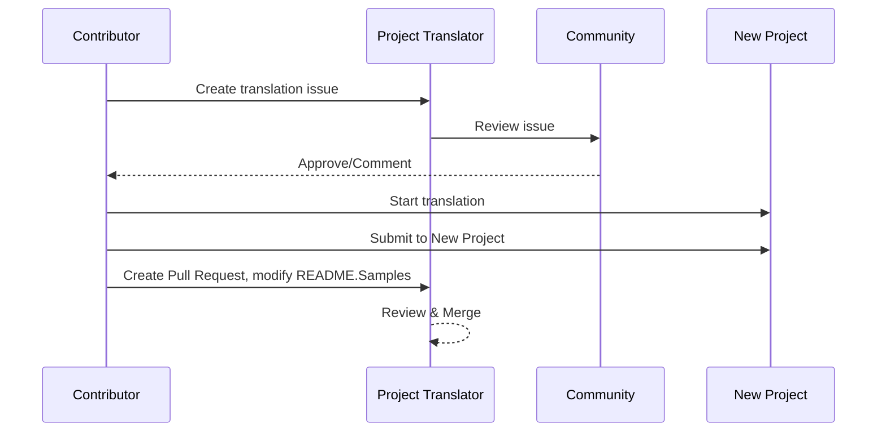

# Projektübersetzer

Eine VSCode-Erweiterung: Ein benutzerfreundliches Tool für die Mehrsprachen-Lokalisierung von Projekten.

<!--
## Verfügbare Übersetzungen

Die Erweiterung unterstützt Übersetzungen in diese Sprachen:

- [简体中文 (zh-cn)](./README.zh-cn.md)
- [繁體中文 (zh-tw)](./README.zh-tw.md)
- [日本語 (ja-jp)](./README.ja-jp.md)
- [한국어 (ko-kr)](./README.ko-kr.md)
- [Français (fr-fr)](./README.fr-fr.md)
- [Deutsch (de-de)](./README.de-de.md)
- [Español (es-es)](./README.es-es.md)
- [Português (pt-br)](./README.pt-br.md)
- [Русский (ru-ru)](./README.ru-ru.md)
- [العربية (ar-sa)](./README.ar-sa.md)
- [العربية (ar-ae)](./README.ar-ae.md)
- [العربية (ar-eg)](./README.ar-eg.md) -->

## Beispiele
| Project                                                                             | Original Repository                                                                                       | Description                                                                                                                                                                  | Stars | Tags                                                                                                                                                                                                                                                                                                                                                                                                                                                                                                                                                                                                                                                                 |
| ----------------------------------------------------------------------------------- | --------------------------------------------------------------------------------------------------------- | ---------------------------------------------------------------------------------------------------------------------------------------------------------------------------- | ----- | -------------------------------------------------------------------------------------------------------------------------------------------------------------------------------------------------------------------------------------------------------------------------------------------------------------------------------------------------------------------------------------------------------------------------------------------------------------------------------------------------------------------------------------------------------------------------------------------------------------------------------------------------------------------- |
| [algorithm-visualizer](https://github.com/Project-Translation/algorithm-visualizer) | [algorithm-visualizer/algorithm-visualizer](https://github.com/algorithm-visualizer/algorithm-visualizer) | :fireworks:Interaktive Online-Plattform, die Algorithmen aus Code visualisiert                                                                                              | 47301 | [`algorithm`](https://github.com/topics/algorithm), [`animation`](https://github.com/topics/animation), [`data-structure`](https://github.com/topics/data-structure), [`visualization`](https://github.com/topics/visualization)                                                                                                                                                                                                                                                                                                                                                                                                                                     |
| [algorithms](https://github.com/Project-Translation/algorithms)                     | [algorithm-visualizer/algorithms](https://github.com/algorithm-visualizer/algorithms)                     | :crystal_ball:Visualisierungen von Algorithmen                                                                                                                              | 401   | N/A                                                                                                                                                                                                                                                                                                                                                                                                                                                                                                                                                                                                                                                                  |
| [cline-docs](https://github.com/Project-Translation/cline-docs)                     | [cline/cline](https://github.com/cline/cline)                                                             | Autonomer Codings-Agent direkt in Ihrer IDE, der mit Ihrer Erlaubnis Dateien erstellen/bearbeiten, Befehle ausführen, den Browser nutzen und mehr kann.                      | 39572 | N/A                                                                                                                                                                                                                                                                                                                                                                                                                                                                                                                                                                                                                                                                  |
| [cursor-docs](https://github.com/Project-Translation/cursor-docs)                   | [getcursor/docs](https://github.com/getcursor/docs)                                                       | Die Open-Source-Dokumentation von Cursor                                                                                                                                     | 309   | N/A                                                                                                                                                                                                                                                                                                                                                                                                                                                                                                                                                                                                                                                                  |
| [gobyexample](https://github.com/Project-Translation/gobyexample)                   | [mmcgrana/gobyexample](https://github.com/mmcgrana/gobyexample)                                           | Go by Example                                                                                                                                                                | 7523  | N/A                                                                                                                                                                                                                                                                                                                                                                                                                                                                                                                                                                                                                                                                  |
| [golang-website](https://github.com/Project-Translation/golang-website)             | [golang/website](https://github.com/golang/website)                                                       | [Spiegel] Die Heimat der Websites go.dev und golang.org                                                                                                                      | 402   | N/A                                                                                                                                                                                                                                                                                                                                                                                                                                                                                                                                                                                                                                                                  |
| [reference-en-us](https://github.com/Project-Translation/reference-en-us)           | [Fechin/reference](https://github.com/Fechin/reference)                                                   | ⭕ Freigegebene Schnellreferenz-Betrugszettel für Entwickler.                                                                                                                | 7808  | [`awk`](https://github.com/topics/awk), [`bash`](https://github.com/topics/bash), [`chatgpt`](https://github.com/topics/chatgpt), [`cheatsheet`](https://github.com/topics/cheatsheet), [`cheatsheets`](https://github.com/topics/cheatsheets), [`css`](https://github.com/topics/css), [`golang`](https://github.com/topics/golang), [`grep`](https://github.com/topics/grep), [`markdown`](https://github.com/topics/markdown), [`python`](https://github.com/topics/python), [`reference`](https://github.com/topics/reference), [`sed`](https://github.com/topics/sed), [`snippets`](https://github.com/topics/snippets), [`vim`](https://github.com/topics/vim) |
| [styleguide](https://github.com/Project-Translation/styleguide)                     | [google/styleguide](https://github.com/google/styleguide)                                                 | Stilrichtlinien für bei Google entstandene Open-Source-Projekte                                                                                                              | 38055 | [`cpplint`](https://github.com/topics/cpplint), [`style-guide`](https://github.com/topics/style-guide), [`styleguide`](https://github.com/topics/styleguide)                                                                                                                                                                                                                                                                                                                                                                                                                                                                                                         |
| [vscode-docs](https://github.com/Project-Translation/vscode-docs)                   | [microsoft/vscode-docs](https://github.com/microsoft/vscode-docs)                                         | Öffentliche Dokumentation für Visual Studio Code                                                                                                                             | 5914  | [`vscode`](https://github.com/topics/vscode)                                                                                                                                                                                                                                                                                                                                                                                                                                                                                                                                                                                                                         |

## Projektübersetzung anfordern

Wenn Sie eine Übersetzung beitragen oder ein Projekt übersetzt haben möchten:

1. Erstellen Sie ein Issue mit der folgenden Vorlage:

```md
**Project**: [project_url]
**Target Language**: [target_lang]
**Description**: Brief description of why this translation would be valuable
```

2. Workflow:


3. Nach dem Zusammenführen des PRs wird die Übersetzung zum Abschnitt „Samples“ hinzugefügt.

Aktuelle Übersetzungen in Bearbeitung: [View Issues](https://github.com/Project-Translation/project_translator/issues)

## Funktionen

- 📁 Unterstützung für Ordnerübersetzungen
  - Übersetzen ganzer Projektordner in mehrere Sprachen
  - Beibehaltung der ursprünglichen Ordnerstruktur und Hierarchie
  - Unterstützung für rekursive Übersetzung von Unterordnern
  - Automatische Erkennung übersetzbarer Inhalte
  - Stapelverarbeitung für effiziente Großprojekte
- 📄 Unterstützung für Dateiübersetzungen
  - Übersetzen einzelner Dateien in mehrere Sprachen
  - Beibehaltung der ursprünglichen Dateistruktur und Formatierung
  - Unterstützung für Ordner- und Datei-Übersetzungsmodi
- 💡 Intelligente Übersetzung mit KI
  - Automatische Beibehaltung der Code-Strukturintegrität
  - Übersetzt nur Code-Kommentare, behält Code-Logik bei
  - Beibehaltung von JSON/XML und anderen Datenstrukturformaten
  - Professionelle Qualität für die Übersetzung technischer Dokumentation
- ⚙️ Flexible Konfiguration
  - Konfigurieren des Quellordners und mehrerer Zielordner
  - Unterstützung für benutzerdefinierte Datei-Übersetzungsintervalle
  - Festlegen spezifischer Dateitypen zum Ignorieren
  - Unterstützung für mehrere KI-Modelloptionen
- 🚀 Benutzerfreundliche Bedienung
  - Anzeige des Übersetzungsfortschritts in Echtzeit
  - Unterstützung für Pausieren/Wiederaufnehmen/Stoppen der Übersetzung
  - Automatische Wartung der Zielordnerstruktur
  - Inkrementelle Übersetzung zur Vermeidung doppelter Arbeit

## Installation

1. Suchen Sie nach „[Project Translator](https://marketplace.visualstudio.com/items?itemName=techfetch-dev.project-translator)“ im VS Code Extension Marketplace
2. Klicken Sie auf Installieren

## Konfiguration

Die Erweiterung unterstützt die folgenden Konfigurationsoptionen:

```json
{
  "projectTranslator.specifiedFolders": [
    {
      "sourceFolder": {
        "path": "Source folder path",
        "lang": "Source language code"
      },
      "destFolders": [
        {
          "path": "Target folder path",
          "lang": "Target language code"
        }
      ]
    }
  ],
  "projectTranslator.specifiedFiles": [
    {
      "sourceFile": {
        "path": "Source file path",
        "lang": "Source language code"
      },
      "destFiles": [
        {
          "path": "Target file path",
          "lang": "Target language code"
        }
      ]
    }
  ],
  "projectTranslator.currentVendor": "openai",
  "projectTranslator.vendors": [
    {
      "name": "openai",
      "apiEndpoint": "API endpoint URL",
      "apiKey": "API authentication key",
      "model": "Model name to use",
      "rpm": "Maximum requests per minute",
      "maxTokensPerSegment": 4096,
      "timeout": 30,
      "temperature": 0.0
    }
  ]
}
```

Wichtige Konfigurationsdetails:

| Konfigurationsoption                       | Beschreibung                                                                                  |
| ------------------------------------------ | -------------------------------------------------------------------------------------------- |
| `projectTranslator.specifiedFolders`       | Mehrere Quellordner mit entsprechenden Zielordnern für die Übersetzung                       |
| `projectTranslator.specifiedFiles`         | Mehrere Quelldateien mit entsprechenden Zieldateien für die Übersetzung                      |
| `projectTranslator.translationIntervalDays`| Übersetzungsintervall in Tagen (Standard: 7 Tage)                                            |
| `projectTranslator.copyOnly`               | Dateien, die kopiert, aber nicht übersetzt werden sollen (mit `paths` und `extensions` Arrays)|
| `projectTranslator.ignore`                 | Dateien, die vollständig ignoriert werden sollen (mit `paths` und `extensions` Arrays)       |
| `projectTranslator.currentVendor`          | Aktueller API-Anbieter in Verwendung                                                         |
| `projectTranslator.vendors`                | Liste der API-Anbieter-Konfigurationen                                                       |
| `projectTranslator.systemPrompts`          | System-Prompt-Array zur Steuerung des Übersetzungsprozesses                                  |
| `projectTranslator.userPrompts`            | Benutzerdefiniertes Prompt-Array, das während der Übersetzung nach System-Prompts hinzugefügt wird |
| `projectTranslator.segmentationMarkers`    | Segmentierungsmarker pro Dateityp, unterstützt reguläre Ausdrücke                             |

## Nutzung

1. Öffnen Sie die Kommando-Palette (Ctrl+Shift+P / Cmd+Shift+P)
2. Geben Sie „Translate Project“ ein und wählen Sie den Befehl aus
3. Wenn der Quellordner nicht konfiguriert ist, erscheint ein Dialog zur Ordnerauswahl
4. Warten Sie, bis die Übersetzung abgeschlossen ist

Während der Übersetzung:

- Übersetzung über Statusleisten-Schaltflächen pausieren/wiederaufnehmen
- Übersetzungsprozess jederzeit stoppen
- Übersetzungsfortschritt in der Benachrichtigungsarea anzeigen
- Detaillierte Protokolle im Ausgabebereich anzeigen

## Hinweise
- Sicherstellen, dass genügend API-Nutzungsquota verfügbar ist
- Es wird empfohlen, zuerst mit kleinen Projekten zu testen
- Verwenden Sie dedizierte API-Schlüssel und entfernen Sie diese nach Abschluss

## Lizenz

[Lizenz](LICENSE)