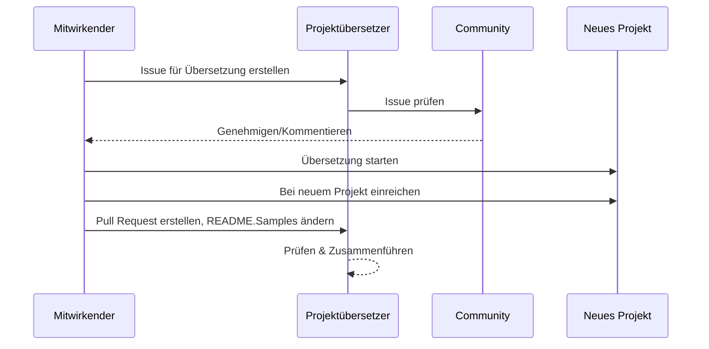

# Projektübersetzer

Eine VSCode-Erweiterung: Ein benutzerfreundliches Tool für die Mehrsprach-Lokalisierung von Projekten.

<!--
## Verfügbare Übersetzungen

Die Erweiterung unterstützt die Übersetzung in folgende Sprachen:

- [简体中文 (zh-cn)](./README.zh-cn.md)
- [繁體中文 (zh-tw)](./README.zh-tw.md)
- [日本語 (ja-jp)](./README.ja-jp.md)
- [한국어 (ko-kr)](./README.ko-kr.md)
- [Français (fr-fr)](./README.fr-fr.md)
- [Deutsch (de-de)](./README.de-de.md)
- [Español (es-es)](./README.es-es.md)
- [Português (pt-br)](./README.pt-br.md)
- [Русский (ru-ru)](./README.ru-ru.md)
- [العربية (ar-sa)](./README.ar-sa.md)
- [العربية (ar-ae)](./README.ar-ae.md)
- [العربية (ar-eg)](./README.ar-eg.md) -->

## Beispiele

| Projekt                                                                                     | Ursprüngliches Repository                                                                             | Beschreibung                                                                                                                                           | Sterne | Tags                                                                                                                                                                                                                                                                                                                                                                                                                                                                                                                                                                                                                                                       |
| ------------------------------------------------------------------------------------------- | ----------------------------------------------------------------------------------------------------- | ------------------------------------------------------------------------------------------------------------------------------------------------------ | ------ | ---------------------------------------------------------------------------------------------------------------------------------------------------------------------------------------------------------------------------------------------------------------------------------------------------------------------------------------------------------------------------------------------------------------------------------------------------------------------------------------------------------------------------------------------------------------------------------------------------------------------------------------------------------- |
| [algorithm-visualizer](https://github.com/Project-Translation/algorithm-visualizer)         | [algorithm-visualizer/algorithm-visualizer](https://github.com/algorithm-visualizer/algorithm-visualizer) | :feuerwerk:Interaktive Online-Plattform zur Visualisierung von Algorithmen aus Code                                                                   | 47301  | [`algorithm`](https://github.com/topics/algorithm), [`animation`](https://github.com/topics/animation), [`data-structure`](https://github.com/topics/data-structure), [`visualization`](https://github.com/topics/visualization)                                                                                                                                                                                                                                                                                                                                                                 |
| [algorithms](https://github.com/Project-Translation/algorithms)                           | [algorithm-visualizer/algorithms](https://github.com/algorithm-visualizer/algorithms)                 | :kristallkugel:Algorithmus-Visualisierungen                                                                                                            | 401    | N/A                                                                                                                                                                                                                                                                                                                                                                                                                                                                                                                                                                                              |
| [cline-docs](https://github.com/Project-Translation/cline-docs)                           | [cline/cline](https://github.com/cline/cline)                                                         | Autonomer Codierungsagent direkt in Ihrer IDE, der Dateien erstellen/bearbeiten, Befehle ausführen, den Browser nutzen und mehr kann - mit Ihrer Erlaubnis bei jedem Schritt | 39572  | N/A                                                                                                                                                                                                                                                                                                                                                                                                                                                                                                                                                                                              |
| [cursor-docs](https://github.com/Project-Translation/cursor-docs)                         | [getcursor/docs](https://github.com/getcursor/docs)                                                   | Offene Dokumentation von Cursor                                                                                                                        | 309    | N/A                                                                                                                                                                                                                                                                                                                                                                                                                                                                                                                                                                                              |
| [gobyexample](https://github.com/Project-Translation/gobyexample)                         | [mmcgrana/gobyexample](https://github.com/mmcgrana/gobyexample)                                       | Go by Example                                                                                                                                          | 7523   | N/A                                                                                                                                                                                                                                                                                                                                                                                                                                                                                                                                                                                              |
| [golang-website](https://github.com/Project-Translation/golang-website)                   | [golang/website](https://github.com/golang/website)                                                   | [mirror] Zuhause der Webseiten go.dev und golang.org                                                                                                    | 402    | N/A                                                                                                                                                                                                                                                                                                                                                                                                                                                                                                                                                                                              |
| [reference-en-us](https://github.com/Project-Translation/reference-en-us)                 | [Fechin/reference](https://github.com/Fechin/reference)                                               | ⭕ Schnellreferenz-Cheatsheet für Entwickler                                                                                                            | 7808   | [`awk`](https://github.com/topics/awk), [`bash`](https://github.com/topics/bash), [`chatgpt`](https://github.com/topics/chatgpt), [`cheatsheet`](https://github.com/topics/cheatsheet), [`cheatsheets`](https://github.com/topics/cheatsheets), [`css`](https://github.com/topics/css), [`golang`](https://github.com/topics/golang), [`grep`](https://github.com/topics/grep), [`markdown`](https://github.com/topics/markdown), [`python`](https://github.com/topics/python), [`reference`](https://github.com/topics/reference), [`sed`](https://github.com/topics/sed), [`snippets`](https://github.com/topics/snippets), [`vim`](https://github.com/topics/vim) |
| [styleguide](https://github.com/Project-Translation/styleguide)                           | [google/styleguide](https://github.com/google/styleguide)                                             | Stilrichtlinien für Open-Source-Projekte von Google                                                                                                     | 38055  | [`cpplint`](https://github.com/topics/cpplint), [`style-guide`](https://github.com/topics/style-guide), [`styleguide`](https://github.com/topics/styleguide)                                                                                                                                                                                                                                                                                                                                                                                                                                                                                               |
| [vscode-docs](https://github.com/Project-Translation/vscode-docs)                         | [microsoft/vscode-docs](https://github.com/microsoft/vscode-docs)                                   | Öffentliche Dokumentation für Visual Studio Code                                                                                                         | 5914   | [`vscode`](https://github.com/topics/vscode)                                                                                                                                                                                                                                                                                                                                                                                                                                                                                                                                                                                                              |

## Anforderung einer Projektsübersetzung

Wenn Sie eine Übersetzung beitragen möchten oder ein Projekt übersetzt haben möchten:

1. Erstellen Sie ein Issue mit folgender Vorlage:

```md
**Projekt**: [projekt_url]
**Zielsprache**: [ziel_sprache]
**Beschreibung**: Kurze Beschreibung, warum diese Übersetzung wertvoll wäre
```

2. Arbeitsablauf:



3. Nachdem der Pull Request zusammengeführt wurde, wird die Übersetzung dem Beispiele-Bereich hinzugefügt.

Aktuelle Übersetzungen in Bearbeitung: [Issues ansehen](https://github.com/Project-Translation/project_translator/issues)

## Funktionen

- 📁 Unterstützung auf Ordner-Ebene
  - Übersetzen Sie gesamte Projektordner in mehrere Sprachen
  - Original-Ordnerstruktur und Hierarchie beibehalten
  - Unterstützung für rekursive Untersucher-Übersetzung
  - Automatische Erkennung von übersetzbarem Inhalt
  - Stapelverarbeitung für effiziente Großübersetzungen
- 📄 Unterstützung auf Datei-Ebene
  - Übersetzen Sie einzelne Dateien in mehrere Sprachen
  - Original-Dateistruktur und Formatierung beibehalten
  - Unterstützung für beide Modi: Ordner- und Datei-Übersetzung
- 💡 Intelligente Übersetzung mit KI
  - Behält automatisch die Code-Strukturintegrität bei
  - Übersetzt nur Code-Kommentare, behält Code-Logik bei
  - Behält JSON/XML und andere Datenstrukturen bei
  - Professionelle Qualität bei technischen Dokumentationen
- ⚙️ Flexible Konfiguration
  - Konfigurieren Sie Quellordner und mehrere Zielordner
  - Unterstützung für benutzerdefinierte Datei-Übersetzungsintervalle
  - Festlegen bestimmter Dateitypen zum Ignorieren
  - Unterstützung für mehrere KI-Modelloptionen
- 🚀 Benutzerfreundliche Bedienung
  - Echtzeit-Anzeige des Übersetzungsfortschritts
  - Unterstützung für Pause/Fortsetzen/Stoppen der Übersetzung
  - Automatische Wartung der Zielordnerstruktur
  - Inkrementelle Übersetzung, um doppelte Arbeit zu vermeiden
- 🔄 Erweiterte Differenz-Übertragungs-Übersetzung
  - **Präzise Updates**: Nur den Inhalt übersetzen, der sich tatsächlich geändert hat
  - **Zeilenweise Steuerung**: Exaktes Format und Struktur beibehalten
  - **Inkrementelle Übersetzung**: Ideal für die Pflege übersetzter Dokumentation
  - **Versionskontroll-freundlich**: Erzeugt minimale, gezielte Änderungen
  - **Kosteneffizient**: Reduziert API-Aufrufe durch Übersetzen nur von Differenzen
  - **Automatisches Backup**: Erstellt automatisch Sicherungsdateien vor Änderungsanwendung

## Installation

1. Suchen Sie nach "[Projektübersetzer](https://marketplace.visualstudio.com/items?itemName=techfetch-dev.project-translator)" im VS Code-Erweiterungsmarktplatz
2. Klicken Sie auf Installieren

## Konfiguration

Die Erweiterung unterstützt folgende Konfigurationsoptionen:

```json
{
  "projectTranslator.specifiedFolders": [
    {
      "sourceFolder": {
        "path": "Pfad zum Quellordner",
        "lang": "Quellsprach-Code"
      },
      "targetFolders": [
        {
          "path": "Pfad zum Zielordner",
          "lang": "Zielsprach-Code"
        }
      ]
    }
  ],
  "projectTranslator.diffApply": {
    "enabled": true,
    "validationLevel": "normal",
    "autoBackup": true,
    "maxOperationsPerFile": 100
  },
  "projectTranslator.specifiedFiles": [
    {
      "sourceFile": {
        "path": "Pfad zur Quelldatei",
        "lang": "Quellsprach-Code"
      },
      "targetFiles": [
        {
          "path": "Pfad zur Zieldatei",
          "lang": "Zielsprach-Code"
        }
      ]
    }
  ],
  "projectTranslator.currentVendor": "openai",
  "projectTranslator.vendors": [
    {
      "name": "openai",
      "apiEndpoint": "API-Endpunkt-URL",
      "apiKey": "API-Authentifizierungsschlüssel",
      "model": "Zu verwendender Modellname",
      "rpm": "Maximale Anfragen pro Minute",
      "maxTokensPerSegment": 4096,
      "timeout": 30,
      "temperature": 0.0
    }
  ]
}
```

Wichtige Konfigurationsdetails:

| Konfigurationsoption                        | Beschreibung                                                                                     |
| ------------------------------------------- | ------------------------------------------------------------------------------------------------ |
| `projectTranslator.specifiedFolders`        | Mehrere Quellordner mit zugehörigen Zielordnern für die Übersetzung                             |
| `projectTranslator.specifiedFiles`          | Mehrere Quelldateien mit zugehörigen Zieldateien für die Übersetzung                             |
| `projectTranslator.translationIntervalDays` | Übersetzungsintervall in Tagen (Standard 7 Tage)                                                |
| `projectTranslator.copyOnly`                | Dateien, die kopiert aber nicht übersetzt werden sollen (mit `paths` und `extensions` Arrays)   |
| `projectTranslator.ignore`                  | Dateien, die vollständig ignoriert werden sollen (mit `paths` und `extensions` Arrays)          |
| `projectTranslator.currentVendor`           | Aktuell verwendeter API-Anbieter                                                                |
| `projectTranslator.vendors`                 | API-Anbieter-Konfigurationsliste                                                                |
| `projectTranslator.systemPrompts`           | Systemprompt-Array für die Steuerung des Übersetzungsprozesses                                  |
| `projectTranslator.userPrompts`             | Benutzerdefinierte Prompt-Arrays, diese werden während der Übersetzung nach Systemprompts hinzugefügt |
| `projectTranslator.segmentationMarkers`     | Segmentierungsmarker konfiguriert nach Dateityp, unterstützt reguläre Ausdrücke                 |
| `projectTranslator.debug`                   | Debug-Modus aktivieren, um alle API-Anfragen/Antworten im Ausgabekanal zu protokollieren (Standard: false) |
| `projectTranslator.logFile`                 | Konfiguration für Debug-Logdateien (siehe [Log-Datei-Funktion](./docs/log-file-feature.md))    |

## Verwendung

1. Befehlspalette öffnen (Ctrl+Shift+P / Cmd+Shift+P)
2. Geben Sie "Projekt übersetzen" ein und wählen Sie den Befehl
3. Falls kein Quellordner konfiguriert ist, erscheint ein Ordnerauswahldialog
4. Auf Abschluss der Übersetzung warten

Während der Übersetzung:

- Übersetzung kann über Statusleistenbuttons pausiert/fortgesetzt werden
- Übersetzungsprozess kann jederzeit abgebrochen werden
- Übersetzungsfortschritt wird in der Benachrichtigungsleiste angezeigt
- Detaillierte Logs werden im Ausgabepanel angezeigt

## Entwicklung

### Build-System

Diese Erweiterung verwendet esbuild für schnelles Bündeln und Entwicklung:

#### Verfügbare Skripte

- `npm run build` - Produktionsbuild mit Minimierung
- `npm run compile` - Entwicklungsbuild
- `npm run watch` - Watch-Modus für Entwicklung
- `npm test` - Tests ausführen

#### VS Code-Tasks

- **Build** (Ctrl+Shift+P → "Tasks: Run Task" → "build") - Bündelt die Erweiterung für Produktion
- **Watch** (Ctrl+Shift+P → "Tasks: Run Task" → "watch") - Entwicklungsmodus mit automatischem Rebuild

### Entwicklungskonfiguration

1. Repository klonen
2. Führen Sie `npm install` aus, um Abhängigkeiten zu installieren
3. Drücken Sie `F5`, um das Debuggen zu starten oder führen Sie den "watch"-Task für Entwicklung aus

Die esbuild-Konfiguration:

- Bündelt alle TypeScript-Dateien in eine einzige `out/extension.js`
- Schließt VS Code API (als extern markiert)

## Erweiterte Funktionen

### Differenz-Übertragungs-Übersetzung

Für detaillierte Informationen über den erweiterten Diff Apply-Übersetzungsmodus siehe das [Differenz-Übertragungs-Nutzungshandbuch](./docs/diff-apply-usage.md).

Diese Funktion ermöglicht:
- Präzise zeilenweise Übersetzungsaktualisierungen
- Reduzierte API-Kosten für große Dateien
- Bessere Integration in Versionskontrollsysteme
- Erhaltene Dokumentformatierung

### Design-Dokumentation

Für technische Details zur Differenz-Übertragungs-Implementierung siehe die [Differenz-Übertragungs-Design-Dokumentation](./docs/diff-apply-translation-design.md).
- Generiert Source Maps für Entwicklungsbuilds
- Minimiert Code für Produktionsbuilds
- Stellt Problem-Matcher-Integration für VS Code bereit

## Hinweise

- Stellen Sie ausreichendes API-Nutzungskontingent sicher
- Empfohlen ist es, zunächst mit kleinen Projekten zu testen
- Verwenden Sie dedizierte API-Schlüssel und entfernen Sie diese nach Abschluss

## Lizenz

[Lizenz](LICENSE)