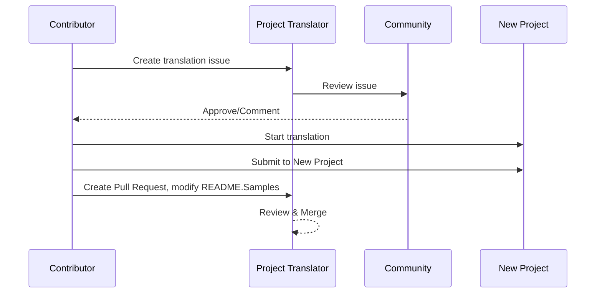

# Projektübersetzer

Eine VSCode-Erweiterung: Ein benutzerfreundliches Tool für die Mehrsprachlokalisierung von Projekten.

<!--
## Verfügbare Übersetzungen

Die Erweiterung unterstützt Übersetzungen in diese Sprachen:

- [简体中文 (zh-cn)](./README.zh-cn.md)
- [繁體中文 (zh-tw)](./README.zh-tw.md)
- [日本語 (ja-jp)](./README.ja-jp.md)
- [한국어 (ko-kr)](./README.ko-kr.md)
- [Français (fr-fr)](./README.fr-fr.md)
- [Deutsch (de-de)](./README.de-de.md)
- [Español (es-es)](./README.es-es.md)
- [Português (pt-br)](./README.pt-br.md)
- [Русский (ru-ru)](./README.ru-ru.md)
- [العربية (ar-sa)](./README.ar-sa.md)
- [العربية (ar-ae)](./README.ar-ae.md)
- [العربية (ar-eg)](./README.ar-eg.md) -->

## Beispiele
| Projekt                                                                             | Originales Repository                                                                                       | Beschreibung                                                                                                                                                               | Stars | Tags                                                                                                                                                                                                                                                                                                                                                                                                                                                                                                                                                                                                                                                                 |
| ----------------------------------------------------------------------------------- | --------------------------------------------------------------------------------------------------------- | ------------------------------------------------------------------------------------------------------------------------------------------------------------------------- | ----- | -------------------------------------------------------------------------------------------------------------------------------------------------------------------------------------------------------------------------------------------------------------------------------------------------------------------------------------------------------------------------------------------------------------------------------------------------------------------------------------------------------------------------------------------------------------------------------------------------------------------------------------------------------------------- |
| [algorithm-visualizer](https://github.com/Project-Translation/algorithm-visualizer) | [algorithm-visualizer/algorithm-visualizer](https://github.com/algorithm-visualizer/algorithm-visualizer) | :fireworks:Interaktive Online-Plattform, die Algorithmen aus dem Code visualisiert                                                                                       | 47301 | [`algorithm`](https://github.com/topics/algorithm), [`animation`](https://github.com/topics/animation), [`data-structure`](https://github.com/topics/data-structure), [`visualization`](https://github.com/topics/visualization)                                                                                                                                                                                                                                                                                                                                                                                                                                     |
| [algorithms](https://github.com/Project-Translation/algorithms)                     | [algorithm-visualizer/algorithms](https://github.com/algorithm-visualizer/algorithms)                     | :crystal_ball:Visualisierungen von Algorithmen                                                                                                                            | 401   | N/A                                                                                                                                                                                                                                                                                                                                                                                                                                                                                                                                                                                                                                                                  |
| [cline-docs](https://github.com/Project-Translation/cline-docs)                     | [cline/cline](https://github.com/cline/cline)                                                             | Autonomer Codings-Agent direkt in Ihrer IDE, der in der Lage ist, Dateien zu erstellen/bearbeiten, Befehle auszuführen, den Browser zu nutzen und mehr, mit Ihrer Erlaubnis bei jedem Schritt.                                  | 39572 | N/A                                                                                                                                                                                                                                                                                                                                                                                                                                                                                                                                                                                                                                                                  |
| [cursor-docs](https://github.com/Project-Translation/cursor-docs)                   | [getcursor/docs](https://github.com/getcursor/docs)                                                       | Open-Source-Dokumentation von Cursor                                                                                                                                      | 309   | N/A                                                                                                                                                                                                                                                                                                                                                                                                                                                                                                                                                                                                                                                                  |
| [gobyexample](https://github.com/Project-Translation/gobyexample)                   | [mmcgrana/gobyexample](https://github.com/mmcgrana/gobyexample)                                           | Go by Example                                                                                                                                                             | 7523  | N/A                                                                                                                                                                                                                                                                                                                                                                                                                                                                                                                                                                                                                                                                  |
| [golang-website](https://github.com/Project-Translation/golang-website)             | [golang/website](https://github.com/golang/website)                                                       | [Spiegel] Heimat der Websites go.dev und golang.org                                                                                                                       | 402   | N/A                                                                                                                                                                                                                                                                                                                                                                                                                                                                                                                                                                                                                                                                  |
| [reference-en-us](https://github.com/Project-Translation/reference-en-us)           | [Fechin/reference](https://github.com/Fechin/reference)                                                   | ⭕ Freigegebene Schnellreferenz-Betrugszettel für Entwickler.                                                                                                              | 7808  | [`awk`](https://github.com/topics/awk), [`bash`](https://github.com/topics/bash), [`chatgpt`](https://github.com/topics/chatgpt), [`cheatsheet`](https://github.com/topics/cheatsheet), [`cheatsheets`](https://github.com/topics/cheatsheets), [`css`](https://github.com/topics/css), [`golang`](https://github.com/topics/golang), [`grep`](https://github.com/topics/grep), [`markdown`](https://github.com/topics/markdown), [`python`](https://github.com/topics/python), [`reference`](https://github.com/topics/reference), [`sed`](https://github.com/topics/sed), [`snippets`](https://github.com/topics/snippets), [`vim`](https://github.com/topics/vim) |
| [styleguide](https://github.com/Project-Translation/styleguide)                     | [google/styleguide](https://github.com/google/styleguide)                                                 | Stilrichtlinien für bei Google entstandene Open-Source-Projekte                                                                                                           | 38055 | [`cpplint`](https://github.com/topics/cpplint), [`style-guide`](https://github.com/topics/style-guide), [`styleguide`](https://github.com/topics/styleguide)                                                                                                                                                                                                                                                                                                                                                                                                                                                                                                         |
| [vscode-docs](https://github.com/Project-Translation/vscode-docs)                   | [microsoft/vscode-docs](https://github.com/microsoft/vscode-docs)                                         | Öffentliche Dokumentation für Visual Studio Code                                                                                                                           | 5914  | [`vscode`](https://github.com/topics/vscode)                                                                                                                                                                                                                                                                                                                                                                                                                                                                                                                                                                                                                         |

## Projektübersetzung anfordern

Wenn Sie eine Übersetzung beitragen oder ein Projekt übersetzt haben möchten:

1. Erstellen Sie ein Issue mit dem folgenden Template:

```md
**Projekt**: [project_url]
**Zielsprache**: [target_lang]
**Beschreibung**: Kurze Beschreibung, warum diese Übersetzung wertvoll wäre
```

2. Ablauf:


3. Nach dem Zusammenführen des PRs wird die Übersetzung zum Samples-Bereich hinzugefügt.

Aktuelle Übersetzungen in Bearbeitung: [Issues anzeigen](https://github.com/Project-Translation/project_translator/issues)

## Funktionen

- 📁 Unterstützung für Ordnerübersetzung
  - Ganze Projektordner in mehrere Sprachen übersetzen
  - Ursprüngliche Ordnerstruktur und Hierarchie beibehalten
  - Unterstützung für rekursive Übersetzung von Unterordnern
  - Automatische Erkennung von übersetzbaren Inhalten
  - Stapelverarbeitung für effiziente groß angelegte Übersetzungen
- 📄 Unterstützung für Dateiübersetzung
  - Einzelne Dateien in mehrere Sprachen übersetzen
  - Ursprüngliche Dateistruktur und Formatierung beibehalten
  - Unterstützung für Ordner- und Datei-Übersetzungsmodi
- 💡 Intelligente Übersetzung mit KI
  - Automatische Beibehaltung der Code-Strukturintegrität
  - Übersetzt nur Code-Kommentare, behält Code-Logik bei
  - Beibehaltung von JSON/XML- und anderen Datenstrukturformaten
  - Professionelle Qualität bei der Übersetzung technischer Dokumentation
- ⚙️ Flexible Konfiguration
  - Konfiguration des Quellordners und mehrerer Zielordner
  - Unterstützung für benutzerdefinierte Datei-Übersetzungsintervalle
  - Festlegung spezifischer Dateitypen zum Ignorieren
  - Unterstützung für mehrere KI-Modelloptionen
- 🚀 Benutzerfreundliche Bedienung
  - Anzeige des Übersetzungsfortschritts in Echtzeit
  - Unterstützung zum Pausieren/Wiederaufnehmen/Stoppen der Übersetzung
  - Automatische Wartung der Zielordnerstruktur
  - Inkrementelle Übersetzung, um doppelte Arbeit zu vermeiden

## Installation

1. Suchen Sie nach "[Project Translator](https://marketplace.visualstudio.com/items?itemName=techfetch-dev.project-translator)" im VS Code-Erweiterungsmarkt
2. Klicken Sie auf Installieren

## Konfiguration

Die Erweiterung unterstützt die folgenden Konfigurationsoptionen:

```json
{
  "projectTranslator.specifiedFolders": [
    {
      "sourceFolder": {
        "path": "Source folder path",
        "lang": "Source language code"
      },
      "targetFolders": [
        {
          "path": "Target folder path",
          "lang": "Target language code"
        }
      ]
    }
  ],
  "projectTranslator.specifiedFiles": [
    {
      "sourceFile": {
        "path": "Source file path",
        "lang": "Source language code"
      },
      "targetFiles": [
        {
          "path": "Target file path",
          "lang": "Target language code"
        }
      ]
    }
  ],
  "projectTranslator.currentVendor": "openai",
  "projectTranslator.vendors": [
    {
      "name": "openai",
      "apiEndpoint": "API endpoint URL",
      "apiKey": "API authentication key",
      "model": "Model name to use",
      "rpm": "Maximum requests per minute",
      "maxTokensPerSegment": 4096,
      "timeout": 30,
      "temperature": 0.0
    }
  ]
}
```

Wichtige Konfigurationsdetails:

| Konfigurationsoption                       | Beschreibung                                                                                  |
| ------------------------------------------ | -------------------------------------------------------------------------------------------- |
| `projectTranslator.specifiedFolders`       | Mehrere Quellordner mit ihren entsprechenden Zielordnern für die Übersetzung                 |
| `projectTranslator.specifiedFiles`         | Mehrere Quelldateien mit ihren entsprechenden Zieldateien für die Übersetzung                |
| `projectTranslator.translationIntervalDays`| Übersetzungsintervall in Tagen (Standard: 7 Tage)                                            |
| `projectTranslator.copyOnly`               | Dateien, die kopiert, aber nicht übersetzt werden sollen (mit `paths`- und `extensions`-Arrays) |
| `projectTranslator.ignore`                 | Dateien, die vollständig ignoriert werden sollen (mit `paths`- und `extensions`-Arrays)      |
| `projectTranslator.currentVendor`          | Aktuell genutzter API-Anbieter                                                                |
| `projectTranslator.vendors`                | Liste der API-Anbieter-Konfigurationen                                                       |
| `projectTranslator.systemPrompts`          | System-Prompt-Array zur Steuerung des Übersetzungsprozesses                                  |
| `projectTranslator.userPrompts`            | Benutzerdefiniertes Prompt-Array, das während der Übersetzung nach System-Prompts hinzugefügt wird |
| `projectTranslator.segmentationMarkers`    | Segmentierungsmarker, konfiguriert nach Dateityp, unterstützt reguläre Ausdrücke              |

## Nutzung

1. Öffnen Sie die Befehlspalette (Ctrl+Shift+P / Cmd+Shift+P)
2. Geben Sie "Translate Project" ein und wählen Sie den Befehl
3. Wenn der Quellordner nicht konfiguriert ist, erscheint ein Ordner-Auswahldialog
4. Warten Sie, bis die Übersetzung abgeschlossen ist

Während der Übersetzung:

- Übersetzung über Statusleisten-Schaltflächen pausieren/wiederaufnehmen
- Übersetzungsprozess jederzeit stoppen
- Übersetzungsfortschritt in der Benachrichtigungsarea anzeigen
- Detaillierte Protokolle in der Ausgabe-Panel anzeigen

## Entwicklung
### Build-System

Diese Erweiterung verwendet esbuild für schnelles Bündeln und Entwicklung:

#### Verfügbare Skripte

- `npm run build` - Produktionsbuild mit Minifikation
- `npm run compile` - Entwicklungsbau 
- `npm run watch` - Watch-Modus für die Entwicklung
- `npm test` - Tests ausführen

#### Legacy TypeScript-Skripte (Fallback)

- `npm run compile-tsc` - Nur TypeScript-Kompilierung
- `npm run watch-tsc` - TypeScript-Watch-Modus

#### VS Code-Aufgaben

- **Build** (Strg+Umschalt+P → "Tasks: Run Task" → "build") - Bündelt die Erweiterung für die Produktion
- **Watch** (Strg+Umschalt+P → "Tasks: Run Task" → "watch") - Entwicklungmodus mit automatischem Neubau

### Entwicklungseinrichtung

1. Klone das Repository
2. Führe `npm install` aus, um Abhängigkeiten zu installieren
3. Drücke `F5`, um das Debugging zu starten, oder führe die "watch"-Aufgabe für die Entwicklung aus

Die esbuild-Konfiguration:
- Bündelt alle TypeScript-Dateien in eine einzelne `out/extension.js`
- Schließt die VS Code-API aus (als extern markiert)
- Generiert Sourcemaps für Entwicklungsbauten
- Minifiziert Code für Produktionsbauten
- Bietet Problem-Matcher-Integration für VS Code

## Hinweise

- Stellen Sie sicher, dass genügend API-Nutzungsquota vorhanden ist
- Es wird empfohlen, zunächst mit kleinen Projekten zu testen
- Verwenden Sie dedizierte API-Schlüssel und entfernen Sie sie nach Abschluss

## Lizenz

[Lizenz](LICENSE)