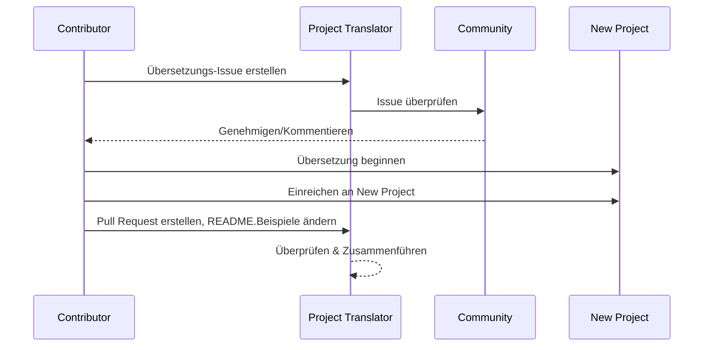

# Projektübersetzer

Eine VSCode-Erweiterung: Ein benutzerfreundliches Werkzeug für die Mehrsprachige Lokalisierung von Projekten.

## Verfügbare Übersetzungen

Die Erweiterung unterstützt Übersetzungen in diese Sprachen:

- [简体中文 (zh-cn)](./readmes/README.zh-cn.md)
- [繁體中文 (zh-tw)](./readmes/README.zh-tw.md)
- [日本語 (ja-jp)](./readmes/README.ja-jp.md)
- [한국어 (ko-kr)](./readmes/README.ko-kr.md)
- [Français (fr-fr)](./readmes/README.fr-fr.md)
- [Deutsch (de-de)](./readmes/README.de-de.md)
- [Español (es-es)](./readmes/README.es-es.md)
- [Português (pt-br)](./readmes/README.pt-br.md)
- [Русский (ru-ru)](./readmes/README.ru-ru.md)
- [العربية (ar-sa)](./readmes/README.ar-sa.md)
- [العربية (ar-ae)](./readmes/README.ar-ae.md)
- [العربية (ar-eg)](./readmes/README.ar-eg.md)

## Beispiele

| Projekt                                                   | Sprachen                                                                                                                                                 |
| --------------------------------------------------------- | --------------------------------------------------------------------------------------------------------------------------------------------------------- |
| [google/styleguide](https://github.com/google/styleguide) | [en-us](https://github.com/google/styleguide) Original von @google<br>[zh-cn](https://github.com/Project-Translation/styleguide-zh-cn) übersetzt von @jqknono |

## Anfrage einer Projektübersetzung

Wenn Sie eine Übersetzung beisteuern möchten oder ein Projekt übersetzt werden soll:

1. Erstellen Sie ein Issue mit der folgenden Vorlage:

```md
**Projekt**: [project_url]
**Zielsprache**: [target_lang]
**Beschreibung**: Kurze Beschreibung, warum diese Übersetzung wertvoll wäre
```

2. Arbeitsablauf:



3. Nach dem Zusammenführen des PRs wird die Übersetzung im Abschnitt Beispiele hinzugefügt.

Aktuelle Übersetzungen im Gange: [Issues anzeigen](https://github.com/Project-Translation/project_translator/issues)

## Funktionen
- 📁 Unterstützung für Übersetzungen auf Ordner Ebene
  - Übersetzen Sie gesamte Projektordner in mehrere Sprachen
  - Beibehalten der ursprünglichen Ordnerstruktur und Hierarchie
  - Unterstützung für rekursive Übersetzung von Unterordnern
  - Automatische Erkennung von übersetzbarem Inhalt
  - Batchverarbeitung für effiziente Übersetzungen im großen Stil
- 📄 Unterstützung für Übersetzungen auf Dateiebene
  - Übersetzen Sie einzelne Dateien in mehrere Sprachen
  - Beibehalten der ursprünglichen Dateistruktur und Formatierung
  - Unterstützung für sowohl Ordner- als auch Dateiübersetzungsmodi
- 💡 Intelligente Übersetzung mit KI
  - Automatische Aufrechterhaltung der Code-Strukturintegrität
  - Übersetzt nur Code-Kommentare, bewahrt Code-Logik
  - Beibehaltung von JSON/XML und anderen Datenstrukturformaten
  - Professionelle Qualität der technischen Dokumentation Übersetzung
- ⚙️ Flexible Konfiguration
  - Konfigurieren Sie Quellordner und mehrere Zielordner
  - Unterstützung für benutzerdefinierte Dateiübersetzungsintervalle
  - Festlegen bestimmter Dateitypen, die ignoriert werden sollen
  - Unterstützung für mehrere KI-Modelloptionen
- 🚀 Benutzerfreundliche Operationen
  - Anzeige des Übersetzungsfortschritts in Echtzeit
  - Unterstützung für Pausieren/Fortsetzen/Stoppen der Übersetzung
  - Automatische Aufrechterhaltung der Zielordnerstruktur
  - Inkrementelle Übersetzung, um doppelte Arbeit zu vermeiden

## Installation

1. Suchen Sie nach "[Project Translator](https://marketplace.visualstudio.com/items?itemName=techfetch-dev.project-translator)" im VS Code Erweiterungsmarktplatz
2. Klicken Sie auf Installieren

## Konfiguration

Die Erweiterung unterstützt die folgenden Konfigurationsoptionen:

```json
{
  "projectTranslator.specifiedFolders": [
    {
      "sourceFolder": {
        "path": "Pfad zum Quellordner",
        "lang": "Quellsprachencode"
      },
      "destFolders": [
        {
          "path": "Pfad zum Zielordner",
          "lang": "Zielsprachencode"
        }
      ]
    }
  ],
  "projectTranslator.specifiedFiles": [
    {
      "sourceFile": {
        "path": "Pfad zur Quelldatei",
        "lang": "Quellsprachencode"
      },
      "destFiles": [
        {
          "path": "Pfad zur Zieldatei",
          "lang": "Zielsprachencode"
        }
      ]
    }
  ],
  "projectTranslator.currentVendor": "openai",
  "projectTranslator.vendors": [
    {
      "name": "openai",
      "apiEndpoint": "API-Endpunkt-URL",
      "apiKey": "API-Authentifizierungsschlüssel",
      "model": "Zu verwendendes Modell",
      "rpm": "Maximale Anfragen pro Minute",
      "maxTokensPerSegment": 4096,
      "timeout": 30,
      "temperature": 0.0
    }
  ]
}
```

Wichtige Konfigurationsdetails:
| Konfigurationsparameter                        | Beschreibung                                                                                   |
| ----------------------------------------------- | ---------------------------------------------------------------------------------------------- |
| `projectTranslator.specifiedFolders`            | Mehrere Quellordner mit ihren entsprechenden Zielordnern für die Übersetzung                   |
| `projectTranslator.specifiedFiles`              | Mehrere Quelldateien mit ihren entsprechenden Zieldateien für die Übersetzung                  |
| `projectTranslator.translationIntervalDays`     | Übersetzungsintervall in Tagen (Standard 7 Tage)                                               |
| `projectTranslator.ignoreTranslationExtensions` | Liste der Textdateierweiterungen, die nicht übersetzt werden müssen, diese Dateien werden direkt kopiert |
| `projectTranslator.ignorePaths`                 | Liste der ignorierten Pfadmuster mit Platzhaltern, diese Dateien werden nicht kopiert          |
| `projectTranslator.currentVendor`               | Der aktuell verwendete API-Anbieter                                                            |
| `projectTranslator.vendors`                     | Liste der API-Anbieter-Konfigurationen                                                         |
| `projectTranslator.systemPrompts`               | Systemaufforderungsarray zur Steuerung des Übersetzungsprozesses                               |
| `projectTranslator.userPrompts`                 | Benutzerdefinierte Aufforderungsarray, diese Aufforderungen werden nach den Systemaufforderungen während der Übersetzung hinzugefügt |
| `projectTranslator.segmentationMarkers`         | Segmentierungsmarkierungen, konfiguriert nach Dateityp, unterstützt reguläre Ausdrücke         |

## Nutzung

1. Öffnen Sie die Befehlspalette (Strg+Umschalt+P / Cmd+Umschalt+P)
2. Geben Sie "Projekt übersetzen" ein und wählen Sie den Befehl aus
3. Wenn der Quellordner nicht konfiguriert ist, erscheint ein Ordnerauswahldialog
4. Warten Sie, bis die Übersetzung abgeschlossen ist

Während der Übersetzung:

- Kann die Übersetzung über die Statusleistungsknöpfe pausieren/fortsetzen
- Kann den Übersetzungsprozess jederzeit stoppen
- Übersetzungsfortschritt wird im Benachrichtigungsbereich angezeigt
- Detaillierte Protokolle werden im Ausgabepanel angezeigt

## Hinweise

- Stellen Sie sicher, dass genügend API-Nutzungsquote vorhanden ist
- Es wird empfohlen, zunächst mit kleinen Projekten zu testen
- Verwenden Sie dedizierte API-Schlüssel und entfernen Sie diese nach Abschluss

## Lizenz

[Lizenz](LICENSE)