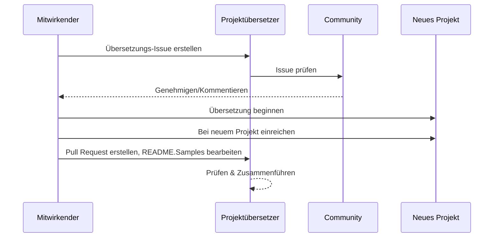

# Projektübersetzer

Eine VSCode-Erweiterung: Ein einfach zu verwendendes Tool zur Mehrsprachigkeitslokalisierung von Projekten.

## Verfügbare Übersetzungen

Die Erweiterung unterstützt die Übersetzung in folgende Sprachen:

- [简体中文 (zh-cn)](./README.zh-cn.md)
- [繁體中文 (zh-tw)](./README.zh-tw.md)
- [日本語 (ja-jp)](./README.ja-jp.md)
- [한국어 (ko-kr)](./README.ko-kr.md)
- [Français (fr-fr)](./README.fr-fr.md)
- [Deutsch (de-de)](./README.de-de.md)
- [Español (es-es)](./README.es-es.md)
- [Português (pt-br)](./README.pt-br.md)
- [Русский (ru-ru)](./README.ru-ru.md)
- [العربية (ar-sa)](./README.ar-sa.md)
- [العربية (ar-ae)](./README.ar-ae.md)
- [العربية (ar-eg)](./README.ar-eg.md)

## Beispiele

| Projekt                                                                             | Ursprüngliches Repository                                                                                 | Beschreibung                                                                                                                                                               | Sterne | Tags                                                                                                                                                                                                                                                                                                                                                                                                                                                                                                                                                                                                                                                                 |
| ----------------------------------------------------------------------------------- | --------------------------------------------------------------------------------------------------------- | ------------------------------------------------------------------------------------------------------------------------------------------------------------------------- | ------ | -------------------------------------------------------------------------------------------------------------------------------------------------------------------------------------------------------------------------------------------------------------------------------------------------------------------------------------------------------------------------------------------------------------------------------------------------------------------------------------------------------------------------------------------------------------------------------------------------------------------------------------------------------------------- |
| [algorithm-visualizer](https://github.com/Project-Translation/algorithm-visualizer) | [algorithm-visualizer/algorithm-visualizer](https://github.com/algorithm-visualizer/algorithm-visualizer) | :fireworks: Interaktive Online-Plattform, die Algorithmen aus Code visualisiert                                                                                           | 47301  | [`algorithm`](https://github.com/topics/algorithm), [`animation`](https://github.com/topics/animation), [`data-structure`](https://github.com/topics/data-structure), [`visualization`](https://github.com/topics/visualization)                                                                                                                                                                                                                                                                                                                                                                                                                                     |
| [algorithms](https://github.com/Project-Translation/algorithms)                     | [algorithm-visualizer/algorithms](https://github.com/algorithm-visualizer/algorithms)                     | :crystal_ball: Algorithmus-Visualisierungen                                                                                                                               | 401    | N/A                                                                                                                                                                                                                                                                                                                                                                                                                                                                                                                                                                                                                                                                  |
| [cline-docs](https://github.com/Project-Translation/cline-docs)                     | [cline/cline](https://github.com/cline/cline)                                                             | Autonomer Codierungsagent direkt in Ihrer IDE, der mit Ihrer Erlaubnis Schritt für Schritt Dateien erstellen/bearbeiten, Befehle ausführen, den Browser nutzen und mehr kann. | 39572  | N/A                                                                                                                                                                                                                                                                                                                                                                                                                                                                                                                                                                                                                                                                  |
| [cursor-docs](https://github.com/Project-Translation/cursor-docs)                   | [getcursor/docs](https://github.com/getcursor/docs)                                                       | Öffentliche Dokumentation von Cursor                                                                                                                                      | 309    | N/A                                                                                                                                                                                                                                                                                                                                                                                                                                                                                                                                                                                                                                                                  |
| [gobyexample](https://github.com/Project-Translation/gobyexample)                   | [mmcgrana/gobyexample](https://github.com/mmcgrana/gobyexample)                                           | Go by Example                                                                                                                                                             | 7523   | N/A                                                                                                                                                                                                                                                                                                                                                                                                                                                                                                                                                                                                                                                                  |
| [golang-website](https://github.com/Project-Translation/golang-website)             | [golang/website](https://github.com/golang/website)                                                       | [mirror] Zuhause der Websites go.dev und golang.org                                                                                                                       | 402    | N/A                                                                                                                                                                                                                                                                                                                                                                                                                                                                                                                                                                                                                                                                  |
| [reference-en-us](https://github.com/Project-Translation/reference-en-us)           | [Fechin/reference](https://github.com/Fechin/reference)                                                   | ⭕ Schnellreferenz-Cheat-Sheet für Entwickler teilen.                                                                                                                      | 7808   | [`awk`](https://github.com/topics/awk), [`bash`](https://github.com/topics/bash), [`chatgpt`](https://github.com/topics/chatgpt), [`cheatsheet`](https://github.com/topics/cheatsheet), [`cheatsheets`](https://github.com/topics/cheatsheets), [`css`](https://github.com/topics/css), [`golang`](https://github.com/topics/golang), [`grep`](https://github.com/topics/grep), [`markdown`](https://github.com/topics/markdown), [`python`](https://github.com/topics/python), [`reference`](https://github.com/topics/reference), [`sed`](https://github.com/topics/sed), [`snippets`](https://github.com/topics/snippets), [`vim`](https://github.com/topics/vim) |
| [styleguide](https://github.com/Project-Translation/styleguide)                     | [google/styleguide](https://github.com/google/styleguide)                                                 | Stilrichtlinien für Open-Source-Projekte von Google                                                                                                                       | 38055  | [`cpplint`](https://github.com/topics/cpplint), [`style-guide`](https://github.com/topics/style-guide), [`styleguide`](https://github.com/topics/styleguide)                                                                                                                                                                                                                                                                                                                                                                                                                                                                                                         |
| [vscode-docs](https://github.com/Project-Translation/vscode-docs)                   | [microsoft/vscode-docs](https://github.com/microsoft/vscode-docs)                                         | Öffentliche Dokumentation für Visual Studio Code                                                                                                                          | 5914   | [`vscode`](https://github.com/topics/vscode)                                                                                                                                                                                                                                                                                                                                                                                                                                                                                                                                                                                                                         |

## Anfrage zur Projektübersetzung

Wenn Sie einen Beitrag zur Übersetzung leisten möchten oder eine Projektübersetzung benötigen:

1. Erstellen Sie ein Issue mit folgender Vorlage:

```md
**Projekt**: [project_url]
**Zielsprache**: [target_lang]
**Beschreibung**: Kurze Beschreibung, warum diese Übersetzung wertvoll wäre
```

2. Ablauf:



3. Nachdem der PR zusammengeführt wurde, wird die Übersetzung dem Abschnitt Beispiele hinzugefügt.

Aktuelle Übersetzungen in Bearbeitung: [Issues anzeigen](https://github.com/Project-Translation/project_translator/issues)

## Funktionen

- 📁 Ordnerübergreifende Übersetzungsunterstützung
  - Übersetzen ganzer Projektordner in mehrere Sprachen
  - Beibehaltung der ursprünglichen Ordnerstruktur und Hierarchie
  - Unterstützung für rekursive Übersetzung von Unterordnern
  - Automatische Erkennung übersetzbaren Inhalts
  - Stapelverarbeitung für effiziente Großübersetzungen
- 📄 Dateiübergreifende Übersetzungsunterstützung
  - Übersetzen einzelner Dateien in mehrere Sprachen
  - Beibehaltung der ursprünglichen Dateistruktur und Formatierung
  - Unterstützung für sowohl Ordner- als auch Dateiübersetzungsmodi
- 💡 Intelligente Übersetzung mit KI
  - Automatische Beibehaltung der Code-Strukturintegrität
  - Übersetzt nur Code-Kommentare, bewahrt die Code-Logik
  - Beibehaltung von JSON/XML und anderen Datenstrukturformaten
  - Professionelle Qualität bei der Übersetzung technischer Dokumentation
- ⚙️ Flexible Konfiguration
  - Konfiguration von Quellordner und mehreren Zielordnern
  - Unterstützung für benutzerdefinierte Intervalle zur Dateiübersetzung
  - Festlegen bestimmter Dateitypen, die ignoriert werden sollen
  - Unterstützung für mehrere KI-Modell-Optionen
- 🚀 Benutzerfreundliche Bedienung
  - Echtzeit-Anzeige des Übersetzungsfortschritts
  - Unterstützung für Pause/Fortsetzen/Stop der Übersetzung
  - Automatische Pflege der Zielordnerstruktur
  - Inkrementelle Übersetzung zur Vermeidung doppelter Arbeit

## Installation

1. Suchen Sie im VS Code-Erweiterungsmarktplatz nach „[Projektübersetzer](https://marketplace.visualstudio.com/items?itemName=techfetch-dev.project-translator)“
2. Klicken Sie auf Installieren

## Konfiguration

Die Erweiterung unterstützt folgende Konfigurationsoptionen:

```json
{
  "projectTranslator.specifiedFolders": [
    {
      "sourceFolder": {
        "path": "Pfad des Quellordners",
        "lang": "Sprachcode der Quelle"
      },
      "targetFolders": [
        {
          "path": "Pfad des Zielordners",
          "lang": "Sprachcode des Ziels"
        }
      ]
    }
  ],
  "projectTranslator.specifiedFiles": [
    {
      "sourceFile": {
        "path": "Pfad der Quelldatei",
        "lang": "Sprachcode der Quelle"
      },
      "targetFiles": [
        {
          "path": "Pfad der Zieldatei",
          "lang": "Sprachcode des Ziels"
        }
      ]
    }
  ],
  "projectTranslator.currentVendor": "openai",
  "projectTranslator.vendors": [
    {
      "name": "openai",
      "apiEndpoint": "API-Endpunkt-URL",
      "apiKey": "API-Authentifizierungsschlüssel",
      "apiKeyEnvVarName": "Umgebungsvariablenname für API-Schlüssel",
      "model": "Zu verwendendes Modell",
      "rpm": "Maximale Anfragen pro Minute",
      "maxTokensPerSegment": 4096,
      "timeout": 30,
      "temperature": 0.0
    }
  ]
}
```

Wichtige Konfigurationsdetails:

| Konfigurationsoption                        | Beschreibung                                                                                    |
| ------------------------------------------- | ---------------------------------------------------------------------------------------------- |
| `projectTranslator.specifiedFolders`        | Mehrere Quellordner mit ihren entsprechenden Zielordnern für die Übersetzung                    |
| `projectTranslator.specifiedFiles`          | Mehrere Quelldateien mit ihren entsprechenden Zieldateien für die Übersetzung                   |
| `projectTranslator.translationIntervalDays` | Übersetzungsintervall in Tagen (Standard: 7 Tage)                                               |
| `projectTranslator.copyOnly`                | Dateien, die kopiert aber nicht übersetzt werden sollen (mit `paths`- und `extensions`-Arrays)  |
| `projectTranslator.ignore`                  | Vollständig zu ignorierende Dateien (mit `paths`- und `extensions`-Arrays)                      |
| `projectTranslator.skipFrontMatterMarkers`  | Dateien basierend auf Front-Matter-Markierungen überspringen (mit `enabled` und `markers`-Arrays) |
| `projectTranslator.currentVendor`           | Aktuell verwendeter API-Anbieter                                                                |
| `projectTranslator.vendors`                 | Liste der API-Anbieterkonfigurationen (kann apiKey direkt oder apiKeyEnvVarName für Umgebungsvariablen verwenden) |
| `projectTranslator.systemPrompts`           | System-Prompt-Array zur Steuerung des Übersetzungsprozesses                                    |
| `projectTranslator.userPrompts`             | Benutzerdefiniertes Prompt-Array; diese Prompts werden während der Übersetzung nach den Systemprompts hinzugefügt |
| `projectTranslator.segmentationMarkers`     | Nach Dateityp konfigurierte Segmentierungsmarkierungen, unterstützt reguläre Ausdrücke          |
| `projectTranslator.debug`                   | Aktiviert den Debug-Modus, um alle API-Anfragen und -Antworten im Ausgabekanal zu protokollieren (Standard: false) |
| `projectTranslator.logFile`                 | Konfiguration für Debug-Protokolldateien (siehe [Protokolldatei-Funktion](./docs/log-file-feature.md)) |

## Verwendung

1. Befehlspalette öffnen (Strg+Umschalt+P / Cmd+Umschalt+P)
2. "Projekt übersetzen" eingeben und den Befehl auswählen
3. Falls der Quellordner nicht konfiguriert ist, erscheint ein Ordnerauswahldialog
4. Auf Abschluss der Übersetzung warten

Während der Übersetzung:

- Übersetzung über Schaltflächen in der Statusleiste pausieren/fortsetzen
- Übersetzungsprozess jederzeit beenden
- Übersetzungsfortschritt im Benachrichtigungsbereich anzeigen
- Detaillierte Protokolle im Ausgabefenster anzeigen

## Entwicklung

### Build-System

Diese Erweiterung verwendet esbuild für schnelles Bündeln und Entwicklung:

#### Verfügbare Skripte

- `npm run build` - Produktionsbuild mit Minimierung
- `npm run compile` - Entwicklungsbuild
- `npm run watch` - Überwachungsmodus für die Entwicklung
- `npm test` - Tests ausführen

#### VS Code-Aufgaben

- **Build** (Strg+Umschalt+P → "Aufgaben: Aufgabe ausführen" → "build") - Bündelt die Erweiterung für die Produktion
- **Watch** (Strg+Umschalt+P → "Aufgaben: Aufgabe ausführen" → "watch") - Entwicklungsmodus mit automatischem Neubau

### Entwicklungsumgebung einrichten

1. Repository klonen
2. `npm install` ausführen, um Abhängigkeiten zu installieren
3. `F5` drücken, um das Debuggen zu starten, oder die "watch"-Aufgabe für die Entwicklung ausführen

Die esbuild-Konfiguration:

- Bündelt alle TypeScript-Dateien in eine einzige `out/extension.js`
- Schließt die VS Code-API aus (als extern markiert)

## Erweiterte Funktionen

### Verwendung von Umgebungsvariablen für API-Schlüssel

Project Translator unterstützt die Verwendung von Umgebungsvariablen für API-Schlüssel, was sicherer ist, als API-Schlüssel direkt in Konfigurationsdateien zu speichern:

1. Konfigurieren Sie Ihren Anbieter mit einer `apiKeyEnvVarName`-Eigenschaft:

```json
{
  "projectTranslator.vendors": [
    {
      "name": "openai",
      "apiEndpoint": "https://api.openai.com/v1",
      "apiKeyEnvVarName": "OPENAI_API_KEY",
      "model": "gpt-4"
    },
    {
      "name": "openrouter",
      "apiEndpoint": "https://openrouter.ai/api/v1",
      "apiKeyEnvVarName": "OPENROUTER_API_KEY",
      "model": "anthropic/claude-3-opus"
    }
  ]
}
```

2. Legen Sie die Umgebungsvariable in Ihrem System fest:
   - Unter Windows: `set OPENAI_API_KEY=Ihr_API_Schlüssel`
   - Unter macOS/Linux: `export OPENAI_API_KEY=Ihr_API_Schlüssel`

3. Wenn die Erweiterung ausgeführt wird, wird:
   - Zuerst geprüft, ob `apiKey` direkt in der Konfiguration angegeben ist
   - Wenn nicht, wird nach der Umgebungsvariable gesucht, die durch `apiKeyEnvVarName` angegeben ist

Dieser Ansatz hält Ihre API-Schlüssel aus Konfigurationsdateien und Versionskontrollsystemen heraus.

### Übersetzung basierend auf Front Matter überspringen

Project Translator kann die Übersetzung von Markdown-Dateien basierend auf ihren Front-Matter-Metadaten überspringen. Dies ist nützlich für Entwurfsdokumente oder Dateien, die als nicht übersetzungsbedürftig markiert sind.

Um diese Funktion zu aktivieren, konfigurieren Sie die Option `projectTranslator.skipFrontMatterMarkers`:

```json
{
  "projectTranslator.skipFrontMatterMarkers": {
    "enabled": true,
    "markers": [
      {
        "key": "draft",
        "value": "true"
      },
      {
        "key": "translate",
        "value": "false"
      }
    ]
  }
}
```

Mit dieser Konfiguration wird jede Markdown-Datei mit Front Matter, die `draft: true` oder `translate: false` enthält, während der Übersetzung übersprungen und direkt an den Zielort kopiert.

Beispiel für eine Markdown-Datei, die übersprungen würde:
```
---
draft: true
title: "Entwurfsdokument"
---

Dieses Dokument ist ein Entwurf und sollte nicht übersetzt werden.
```


### Design-Dokumentation

- Erzeugt Quellzuordnungen (Source Maps) für Entwicklungsbuilds
- Minimiert Code für Produktionsbuilds
- Bietet Problem-Matcher-Integration für VS Code

## Hinweise

- Stellen Sie ausreichendes API-Nutzungskontingent sicher
- Empfohlen: Erst mit kleinen Projekten testen
- Verwenden Sie dedizierte API-Schlüssel und entfernen Sie sie nach Abschluss

## Lizenz

[Lizenz](LICENSE)