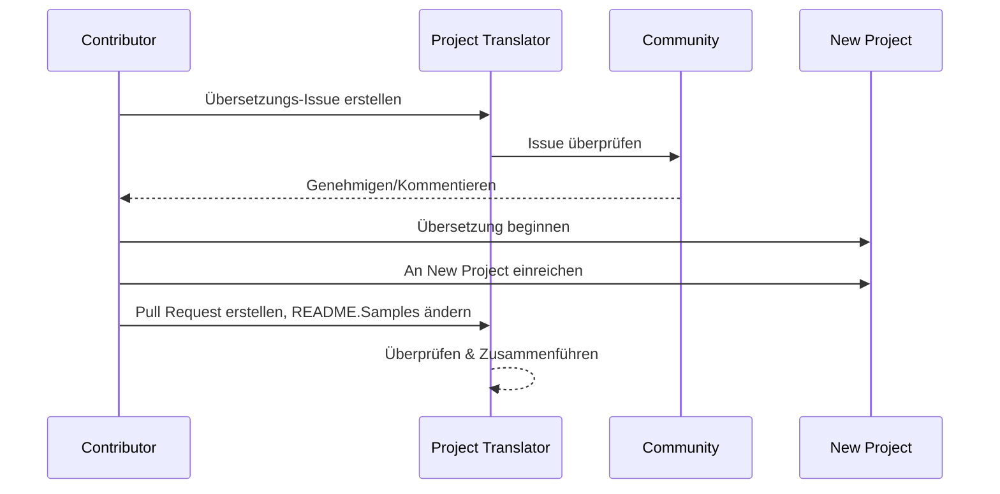

# Project Translator

Eine benutzerfreundliche VS Code-Erweiterung für die mehrsprachige Lokalisierung von Projekten.

Projekt-Repository: `https://github.com/Project-Translation/project_translator`

<!--  -->


## Verfügbare Übersetzungen

Die Erweiterung unterstützt Übersetzungen in folgende Sprachen:

- [简体中文 (zh-cn)](./readmes/README.zh-cn.md)
- [繁體中文 (zh-tw)](./readmes/README.zh-tw.md)
- [日本語 (ja-jp)](./readmes/README.ja-jp.md)
- [한국어 (ko-kr)](./readmes/README.ko-kr.md)
- [Français (fr-fr)](./readmes/README.fr-fr.md)
- [Deutsch (de-de)](./readmes/README.de-de.md)
- [Español (es-es)](./readmes/README.es-es.md)
- [Português (pt-br)](./readmes/README.pt-br.md)
- [Русский (ru-ru)](./readmes/README.ru-ru.md)
- [العربية (ar-sa)](./readmes/README.ar-sa.md)
- [العربية (ar-ae)](./readmes/README.ar-ae.md)
- [العربية (ar-eg)](./readmes/README.ar-eg.md)

## Beispiele

| Projekt                                                                             | Original-Repository                                                                                       | Beschreibung                                                                                                                                                              | Sterne | Tags                                                                                                                                                                                                                                                                                                                                                                                                                                                                                                                                                                                                                                                                 |
| ----------------------------------------------------------------------------------- | --------------------------------------------------------------------------------------------------------- | ------------------------------------------------------------------------------------------------------------------------------------------------------------------------- | ------ | -------------------------------------------------------------------------------------------------------------------------------------------------------------------------------------------------------------------------------------------------------------------------------------------------------------------------------------------------------------------------------------------------------------------------------------------------------------------------------------------------------------------------------------------------------------------------------------------------------------------------------------------------------------------- |
| [algorithm-visualizer](https://github.com/Project-Translation/algorithm-visualizer) | [algorithm-visualizer/algorithm-visualizer](https://github.com/algorithm-visualizer/algorithm-visualizer) | :fireworks:Interaktive Online-Plattform, die Algorithmen aus Code visualisiert                                                                                             | 47301  | [`algorithm`](https://github.com/topics/algorithm), [`animation`](https://github.com/topics/animation), [`data-structure`](https://github.com/topics/data-structure), [`visualization`](https://github.com/topics/visualization)                                                                                                                                                                                                                                                                                                                                                                                                                                     |
| [algorithms](https://github.com/Project-Translation/algorithms)                     | [algorithm-visualizer/algorithms](https://github.com/algorithm-visualizer/algorithms)                     | :crystal_ball:Algorithmus-Visualisierungen                                                                                                                                | 401    | N/A                                                                                                                                                                                                                                                                                                                                                                                                                                                                                                                                                                                                                                                                  |
| [cline-docs](https://github.com/Project-Translation/cline-docs)                     | [cline/cline](https://github.com/cline/cline)                                                             | Autonomer Codierungs-Agent direkt in Ihrer IDE, der in der Lage ist, Dateien zu erstellen/bearbeiten, Befehle auszuführen, den Browser zu nutzen und mehr – und das alles mit Ihrer Erlaubnis bei jedem Schritt. | 39572  | N/A                                                                                                                                                                                                                                                                                                                                                                                                                                                                                                                                                                                                                                                                  |
| [cursor-docs](https://github.com/Project-Translation/cursor-docs)                   | [getcursor/docs](https://github.com/getcursor/docs)                                                       | Open-Source-Dokumentation von Cursor                                                                                                                                      | 309    | N/A                                                                                                                                                                                                                                                                                                                                                                                                                                                                                                                                                                                                                                                                  |
| [gobyexample](https://github.com/Project-Translation/gobyexample)                   | [mmcgrana/gobyexample](https://github.com/mmcgrana/gobyexample)                                           | Go by Example                                                                                                                                                             | 7523   | N/A                                                                                                                                                                                                                                                                                                                                                                                                                                                                                                                                                                                                                                                                  |
| [golang-website](https://github.com/Project-Translation/golang-website)             | [golang/website](https://github.com/golang/website)                                                       | [Spiegel] Heimat der Websites go.dev und golang.org                                                                                                                       | 402    | N/A                                                                                                                                                                                                                                                                                                                                                                                                                                                                                                                                                                                                                                                                  |
| [reference-en-us](https://github.com/Project-Translation/reference-en-us)           | [Fechin/reference](https://github.com/Fechin/reference)                                                   | ⭕ Teile schnelle Referenz-Cheatsheets für Entwickler.                                                                                                                    | 7808   | [`awk`](https://github.com/topics/awk), [`bash`](https://github.com/topics/bash), [`chatgpt`](https://github.com/topics/chatgpt), [`cheatsheet`](https://github.com/topics/cheatsheet), [`cheatsheets`](https://github.com/topics/cheatsheets), [`css`](https://github.com/topics/css), [`golang`](https://github.com/topics/golang), [`grep`](https://github.com/topics/grep), [`markdown`](https://github.com/topics/markdown), [`python`](https://github.com/topics/python), [`reference`](https://github.com/topics/reference), [`sed`](https://github.com/topics/sed), [`snippets`](https://github.com/topics/snippets), [`vim`](https://github.com/topics/vim) |
| [styleguide](https://github.com/Project-Translation/styleguide)                     | [google/styleguide](https://github.com/google/styleguide)                                                 | Style-Guides für von Google stammende Open-Source-Projekte                                                                                                                | 38055  | [`cpplint`](https://github.com/topics/cpplint), [`style-guide`](https://github.com/topics/style-guide), [`styleguide`](https://github.com/topics/styleguide)                                                                                                                                                                                                                                                                                                                                                                                                                                                                                                         |
| [vscode-docs](https://github.com/Project-Translation/vscode-docs)                   | [microsoft/vscode-docs](https://github.com/microsoft/vscode-docs)                                         | Öffentliche Dokumentation für Visual Studio Code                                                                                                                           | 5914   | [`vscode`](https://github.com/topics/vscode)                                                                                                                                                                                                                                                                                                                                                                                                                                                                                                                                                                                                                         |

## Projektübersetzung anfordern

Wenn Sie eine Übersetzung beisteuern oder ein Projekt übersetzt haben möchten:

1.  Erstellen Sie ein Issue mit der folgenden Vorlage:

```md
**Project**: [project_url]
**Target Language**: [target_lang]
**Description**: Kurze Beschreibung, warum diese Übersetzung wertvoll wäre
```

2.  Arbeitsablauf:



3.  Nachdem der PR zusammengeführt wurde, wird die Übersetzung zum Abschnitt "Beispiele" hinzugefügt.

Aktuelle Übersetzungen in Arbeit: [Issues ansehen](https://github.com/Project-Translation/project_translator/issues)

## Funktionen

- 📁 Unterstützung für die Übersetzung auf Ordnerebene
  - Ganze Projektordner in mehrere Sprachen übersetzen
  - Originalordnerstruktur und -hierarchie beibehalten
  - Unterstützung für die rekursive Übersetzung von Unterordnern
  - Automatische Erkennung von übersetzbaren Inhalten
  - Stapelverarbeitung für effiziente Großübersetzungen
- 📄 Unterstützung für die Übersetzung auf Dateiebene
  - Einzelne Dateien in mehrere Sprachen übersetzen
  - Originaldateistruktur und -formatierung beibehalten
  - Unterstützung für sowohl Ordner- als auch Dateiübersetzungsmodi
- 💡 Intelligente Übersetzung mit KI
  - Erhält automatisch die Integrität der Codestruktur
  - Übersetzt nur Codekommentare, bewahrt die Codelogik
  - Beibehaltung von JSON/XML- und anderen Datenstrukturformaten
  - Professionelle Qualität der technischen Dokumentationsübersetzung
- ⚙️ Flexible Konfiguration
  - Quellordner und mehrere Zielordner konfigurieren
  - Unterstützung für benutzerdefinierte Dateiübersetzungsintervalle
  - Festlegung spezifischer zu ignorierender Dateitypen
  - Unterstützung für mehrere KI-Modell-Optionen
- 🚀 Benutzerfreundliche Bedienung
  - Anzeige des Übersetzungsfortschritts in Echtzeit
  - Unterstützung für das Anhalten/Fortsetzen/Beenden der Übersetzung
  - Automatische Beibehaltung der Zielordnerstruktur
  - Inkrementelle Übersetzung zur Vermeidung doppelter Arbeit
- 🔄 Differentialübersetzung (Experimentell)
  - Diff-Apply-Modus für effiziente Aktualisierungen bestehender Übersetzungen
  - Reduziert die API-Nutzung durch Übersetzung nur geänderter Inhalte
  - Bewahrt die Versionshistorie mit minimalen Bearbeitungen
  - ⚠️ Experimentelle Funktion – siehe [Erweiterte Funktionen](#differentialübersetzung-diff-apply-modus) für Details

## Installation

1.  Suchen Sie nach "[Project Translator](https://marketplace.visualstudio.com/items?itemName=techfetch-dev.project-translator)" im VS Code-Erweiterungsmarktplatz
2.  Klicken Sie auf Installieren

Alternativ können Sie vom Visual Studio Marketplace installieren: `https://marketplace.visualstudio.com/items?itemName=techfetch-dev.project-translator` oder suchen Sie nach `techfetch-dev.project-translator` in der Ansicht der VS Code-Erweiterungen.

## Konfiguration

Die Erweiterung unterstützt die folgenden Konfigurationsoptionen:

```json
{
  "projectTranslator.specifiedFolders": [
    {
      "sourceFolder": {
        "path": "Quellordner-Pfad",
        "lang": "Quellsprach-Code"
      },
      "targetFolders": [
        {
          "path": "Zielordner-Pfad",
          "lang": "Zielsprach-Code"
        }
      ]
    }
  ],
  "projectTranslator.specifiedFiles": [
    {
      "sourceFile": {
        "path": "Quelldatei-Pfad",
        "lang": "Quellsprach-Code"
      },
      "targetFiles": [
        {
          "path": "Zieldatei-Pfad",
          "lang": "Zielsprach-Code"
        }
      ]
    }
  ],
  "projectTranslator.currentVendor": "openai",
  "projectTranslator.vendors": [
    {
      "name": "openai",
      "apiEndpoint": "API-Endpunkt-URL",
      "apiKeyEnvVarName": "MY_OPENAI_API_KEY",
      "model": "gpt-4o",
      "rpm": "10",
      "maxTokensPerSegment": 4096,
      "timeout": 30,
      "temperature": 0.0
    }
  ],
  "projectTranslator.userPrompts": [
      "1. Sollte 'Keine Übersetzung erforderlich' zurückgeben, wenn die Markdown-Datei im Front Matter 'draft' auf 'true' gesetzt hat.",
      "2. './readmes/' in den Sätzen sollte durch './' ersetzt werden.",
  ],
  "projectTranslator.ignore": {
    "paths": [
      "**/node_modules/**"
    ],
    "extensions": [
      ".log"
    ]
  },
}
```

Wichtige Konfigurationsdetails:

| Konfigurationsoption                     | Beschreibung                                                                                                   |
| ---------------------------------------- | -------------------------------------------------------------------------------------------------------------- |
| `projectTranslator.specifiedFolders`     | Mehrere Quellordner mit ihren entsprechenden Zielordnern für die Übersetzung                                   |
| `projectTranslator.specifiedFiles`       | Mehrere Quelldateien mit ihren entsprechenden Zieldateien für die Übersetzung                                   |
| `projectTranslator.translationIntervalDays` | Übersetzungsintervall in Tagen (Standard 7 Tage)                                                              |
| `projectTranslator.copyOnly`             | Dateien, die nur kopiert, aber nicht übersetzt werden sollen (mit `paths`- und `extensions`-Arrays)            |
| `projectTranslator.ignore`               | Dateien, die vollständig ignoriert werden sollen (mit `paths`- und `extensions`-Arrays)                        |
| `projectTranslator.skipFrontMatterMarkers` | Dateien basierend auf Front-Matter-Markern überspringen (mit `enabled`- und `markers`-Arrays)                   |
| `projectTranslator.currentVendor`        | Der aktuell verwendete API-Anbieter                                                                             |
| `projectTranslator.vendors`              | Liste der API-Anbieter-Konfigurationen (kann apiKey direkt oder apiKeyEnvVarName für Umgebungsvariablen verwenden) |
| `projectTranslator.systemPrompts`        | System-Prompt-Array zur Steuerung des Übersetzungsprozesses                                                    |
| `projectTranslator.userPrompts`          | Benutzerdefiniertes Prompt-Array, diese Prompts werden während der Übersetzung nach den System-Prompts hinzugefügt |
| `projectTranslator.segmentationMarkers`  | Segmentierungsmarker, nach Dateityp konfiguriert, unterstützt reguläre Ausdrücke                               |
| `projectTranslator.debug`                | Debug-Modus aktivieren, um alle API-Anfragen und -Antworten im Ausgabekanal zu protokollieren (Standard: false) |
| `projectTranslator.logFile`              | Konfiguration für Debug-Log-Dateien (siehe [Log-Datei-Funktion](./docs/log-file-feature.md))                   |
| `projectTranslator.diffApply.enabled`    | Experimentellen Differentialübersetzungsmodus aktivieren (Standard: false)                                    |

## Verwendung

1.  Befehlspalette öffnen (Strg+Umschalt+P / Cmd+Umschalt+P)
2.  "Translate Project" eingeben und den Befehl auswählen
3.  Wenn der Quellordner nicht konfiguriert ist, erscheint ein Ordnerauswahldialog
4.  Warten Sie, bis die Übersetzung abgeschlossen ist

Während der Übersetzung:

-   Kann die Übersetzung über Schaltflächen in der Statusleiste angehalten/fortgesetzt werden
-   Kann der Übersetzungsprozess jederzeit gestoppt werden
-   Übersetzungsfortschritt wird im Benachrichtigungsbereich angezeigt
-   Detaillierte Protokolle werden im Ausgabefenster angezeigt

## Entwicklung

### Build-System

Diese Erweiterung verwendet esbuild für schnelles Bündeln und Entwicklung:

#### Verfügbare Skripte

-   `npm run build` - Produktions-Build mit Minifizierung
-   `npm run compile` - Entwicklungs-Build
-   `npm run watch` - Überwachungsmodus für die Entwicklung
-   `npm test` - Tests ausführen

#### VS Code-Aufgaben

-   **Build** (Strg+Umschalt+P → "Tasks: Run Task" → "build") - Bündelt die Erweiterung für die Produktion
-   **Watch** (Strg+Umschalt+P → "Tasks: Run Task" → "watch") - Entwicklungsmodus mit automatischem Neubuild

### Entwicklungseinrichtung

1.  Repository klonen
2.  `npm install` ausführen, um Abhängigkeiten zu installieren
3.  `F5` drücken, um das Debuggen zu starten, oder die "watch"-Aufgabe für die Entwicklung ausführen

Die esbuild-Konfiguration:

-   Bündelt alle TypeScript-Dateien in eine einzige `out/extension.js`
-   Schließt die VS Code API aus (als extern markiert)

## Erweiterte Funktionen

### Verwendung von Umgebungsvariablen für API-Schlüssel

Project Translator unterstützt die Verwendung von Umgebungsvariablen für API-Schlüssel, was ein sichererer Ansatz ist als das Speichern von API-Schlüsseln direkt in Konfigurationsdateien:

1.  Konfigurieren Sie Ihren Anbieter mit einer `apiKeyEnvVarName`-Eigenschaft:

```json
{
  "projectTranslator.vendors": [
    {
      "name": "openai",
      "apiEndpoint": "https://api.openai.com/v1",
      "apiKeyEnvVarName": "OPENAI_API_KEY",
      "model": "gpt-4"
    },
    {
      "name": "openrouter",
      "apiEndpoint": "https://openrouter.ai/api/v1",
      "apiKeyEnvVarName": "OPENROUTER_API_KEY",
      "model": "anthropic/claude-3-opus"
    }
  ]
}
```

2.  Setzen Sie die Umgebungsvariable in Ihrem System:
    -   Unter Windows: `set OPENAI_API_KEY=your_api_key`
    -   Unter macOS/Linux: `export OPENAI_API_KEY=your_api_key`

3.  Wenn die Erweiterung läuft, wird sie:
    -   Zuerst prüfen, ob `apiKey` direkt in der Konfiguration angegeben ist
    -   Wenn nicht, wird sie nach der durch `apiKeyEnvVarName` angegebenen Umgebungsvariable suchen

Dieser Ansatz hält Ihre API-Schlüssel aus Konfigurationsdateien und Versionskontrollsystemen heraus.

### Übersetzung basierend auf Front Matter überspringen

Project Translator kann die Übersetzung von Markdown-Dateien basierend auf ihren Front-Matter-Metadaten überspringen. Dies ist nützlich für Entwurfsdokumente oder Dateien, die als nicht übersetzungsbedürftig markiert sind.

Um diese Funktion zu aktivieren, konfigurieren Sie die Option `projectTranslator.skipFrontMatterMarkers`:

```json
{
  "projectTranslator.skipFrontMatterMarkers": {
    "enabled": true,
    "markers": [
      {
        "key": "draft",
        "value": "true"
      },
      {
        "key": "translate",
        "value": "false"
      }
    ]
  }
}
```

Mit dieser Konfiguration wird jede Markdown-Datei mit Front Matter, das `draft: true` oder `translate: false` enthält, während der Übersetzung übersprungen und direkt an den Zielspeicherort kopiert.

Beispiel für eine Markdown-Datei, die übersprungen würde:
```
---
draft: true
title: "Entwurfsdokument"
---

Dieses Dokument ist ein Entwurf und sollte nicht übersetzt werden.
```

### Differentialübersetzung (Diff-Apply) Modus

> **⚠️ Warnung für experimentelle Funktion**: Der Differentialübersetzungsmodus ist derzeit eine experimentelle Funktion und kann Stabilitäts- und Kompatibilitätsprobleme aufweisen. Es wird empfohlen, ihn in Produktionsumgebungen mit Vorsicht zu verwenden und wichtige Dateien immer zu sichern.

Die Erweiterung unterstützt einen optionalen Differentialübersetzungsmodus (Diff-Apply). Wenn dieser aktiviert ist, sendet die Erweiterung sowohl den Quellinhalt als auch die vorhandene übersetzte Zieldatei an das Modell. Das Modell sollte einen oder mehrere SEARCH/REPLACE-Blöcke (Nur-Text, keine Code-Zäune) zurückgeben. Die Erweiterung wendet diese Blöcke lokal an, um Änderungen zu minimieren, die API-Nutzung zu reduzieren und die Versionshistorie besser zu bewahren.

-   **Umschalten**: Konfigurieren Sie `projectTranslator.diffApply.enabled` in den VS Code-Einstellungen oder `project.translation.json` (Standard: `false`).
-   **Optionen**:
    -   `validationLevel`: `normal` oder `strict` (Standard: `normal`). Im `strict`-Modus führen ungültige Marker oder Matching-Fehler zu einem Fehler, und die Erweiterung fällt auf den Standardübersetzungsablauf zurück.
    -   `autoBackup`: Wenn true, wird vor dem Anwenden von Bearbeitungen eine `.bak`-Sicherung der Zieldatei erstellt (Standard: `true`).
    -   `maxOperationsPerFile`: (aus Kompatibilitätsgründen beibehalten) wird von der neuen Strategie nicht verwendet.

Arbeitsablauf:
1.  Wenn `diffApply.enabled` `true` ist und die Zieldatei existiert, liest die Erweiterung sowohl Quell- als auch Zielinhalte.
2.  Sie ruft das Modell mit einem Differential-Prompt auf und erfordert die Rückgabe von Nur-Text-SEARCH/REPLACE-Blöcken.
3.  Lokal analysiert und wendet die Erweiterung die SEARCH/REPLACE-Blöcke an. Wenn das Anwenden fehlschlägt, fällt sie auf die normale vollständige Übersetzung zurück und überschreibt die Zieldatei.

Beispiel SEARCH/REPLACE (mehrere Blöcke erlaubt):

```
<<<<<<< SEARCH
:start_line: 10
-------
const label = "Old"
=======
const label = "New"
>>>>>>> REPLACE

<<<<<<< SEARCH
:start_line: 25
-------
function foo() {
  return 1
}
=======
function foo() {
  return 2
}
>>>>>>> REPLACE
```

Hinweise:
-   Verwenden Sie den exakten Inhalt einschließlich Einrückung und Leerzeichen in SEARCH-Abschnitten. Wenn Sie unsicher sind, verwenden Sie den neuesten Dateiinhalt.
-   Halten Sie eine einzelne Zeile `=======` zwischen SEARCH und REPLACE.
-   Wenn keine Änderung erforderlich ist, sollte das Modell einen leeren String zurückgeben.

Warum die Differentialübersetzung derzeit schlecht abschneidet (Erklärung)

-   **Herausforderungen bei der跨sprachigen Ausrichtung und dem Vergleich**: Die Differentialübersetzung erfordert das Senden sowohl des ursprünglichen Quelldokuments als auch des vorhandenen übersetzten Dokuments an das Modell, und das muss sie sprachübergreifend vergleichen, um zu entscheiden, welche Teile der Übersetzung geändert werden müssen. Dies ist eine grundlegend schwierigere Aufgabe als das direkte Ändern eines einzelnen Dokuments, da das Modell Segmente in verschiedenen Sprachen genau ausrichten und semantische Unterschiede beurteilen muss.

-   **Komplexität von Format und Grenzerhaltung**: Viele Dokumente enthalten Codeblöcke, Tabellen, Frontend-Marker oder spezielle Platzhalter. Ein zuverlässiger Diff-Workflow muss diese Strukturen bewahren, während er Textbearbeitungen vornimmt. Wenn das Modell nicht konsistent Ergebnisse liefern kann, die dem SEARCH/REPLACE-Format strikt folgen, kann das automatische Anwenden von Bearbeitungen zu Formatregressionen oder strukturellen Fehlern führen.

-   **Probleme mit Kontext und Terminologie-Konsistenz**: Kleine, lokalisierte Bearbeitungen hängen oft vom breiteren Kontext und einem vorhandenen Glossar für Terminologie/Stil ab. Wenn aufgefordert wird, minimale Bearbeitungen zu produzieren, kann das Modell die globale Konsistenz (Terminologie, Stil, Kommentare, Variablennamen) vernachlässigen, was zu inkonsistenten oder semantisch verschobenen Übersetzungen führt.

-   **Modellstabilität und Kostenausgleich**: Eine zuverlässige Differentialübersetzung erfordert Modelle mit starken Vergleichsfähigkeiten und stabilen, vorhersagbaren Ausgabeformaten. Aktuelle Mainstream-Modelle bieten nicht zuverlässig sowohl robuste跨sprachige Ausrichtung als auch streng formatierte Outputs zu angemessenen Kosten, sodass Systeme oft auf eine vollständige Neuübersetzung zurückgreifen, um Korrektheit zu gewährleisten.

Daher kann die Differentialübersetzung theoretisch teure Output-Tokens reduzieren und die Versionshistorie besser bewahren, ist aber derzeit durch die跨sprachigen Vergleichsfähigkeiten und die Ausgabestabilität der Modelle begrenzt. Diese Funktion bleibt experimentell; empfohlene Abhilfemaßnahmen sind das automatische Erstellen von Sicherungen (`autoBackup: true`), die Verwendung eines toleranten Validierungslevels (`validationLevel: "normal"`) und das Zurückfallen auf eine vollständige Neuübersetzung, wenn das Matching oder die Formatierung fehlschlägt. In der Zukunft könnten spezialisierte bilinguale Ausrichtungs-Postprozessoren oder benutzerdefinierte kleinere Modelle die Stabilität des Diff-Ansatzes verbessern.

Kosteneinsparungen und warum es hilft

-   **Input- vs. Output-Token-Kosten**: Large-Model-APIs berechnen oft unterschiedlich für Input- (Prompt) und Output- (Completion) Tokens. Oft sind Output-Tokens deutlich teurer, weil das Modell längeren Text generiert. Diff-Apply hilft, weil wir das **aktualisierte Quellmaterial (Input)** und die **vorhandene übersetzte Datei (Input)** an das Modell senden und ein kompaktes JSON der Bearbeitungen anfordern. Die Antwort des Modells ist ein kleines JSON (wenige Output-Tokens) anstelle einer vollständig neuübersetzten Datei (viele Output-Tokens), sodass Sie viel weniger für den teuren Output-Anteil zahlen.

-   **Nur senden, was sich geändert hat**: Anstatt die gesamte Datei bei kleinen Änderungen neu zu übersetzen, weist Diff-Apply das Modell an, die minimalen Bearbeitungsvorgänge zu berechnen, um die vorhandene Übersetzung zu aktualisieren. Dies ist besonders effektiv für Dateien, die bereits übersetzt wurden und nur inkrementelle Bearbeitungen erhalten.

-   **Am besten für formatierte Dateien**: Dateien mit strenger Formatierung (JSON, XML, Markdown mit Codeblöcken) profitieren stark, da Diff-Apply die Struktur bewahrt und nur Textteile ändert, die eine Übersetzung benötigen. Dies reduziert die Chance auf formatbedingte Regressionen und zusätzliche Output-Tokens durch Modellneuformatierung.

-   **Zeilenorientierte Basiseinheit, intelligentere Aggregation**: Das Werkzeug behandelt die grundlegende Übersetzungseinheit als "Zeile", und die SEARCH/REPLACE-Strategie wendet exaktes oder unscharfes Matching in der Nähe von `:start_line:` an. Verwenden Sie `validationLevel: "normal"` für tolerantes Verhalten und `"strict"`, wenn Sie konservative, exakte Bearbeitungen benötigen.

Wann man Diff-Apply verwendet:

-   Verwenden Sie es, wenn die Zieldatei bereits existiert und zuvor übersetzt wurde.
-   Verwenden Sie es für große, formatierte Dokumente, bei denen eine Neuübersetzung der gesamten Datei teuer wäre.
-   Vermeiden Sie es für brandneue Dateien ohne vorherige Übersetzung oder wenn Sie eine frische Neuübersetzung wünschen.


### Designdokumentation

-   Erzeugt Source-Maps für Entwicklungs-Builds
-   Minifiziert Code für Produktions-Builds
-   Bietet Problem-Matcher-Integration für VS Code

## Hinweise

-   Sorgen Sie für ausreichendes API-Nutzungskontingent
-   Es wird empfohlen, zuerst mit kleinen Projekten zu testen
-   Verwenden Sie dedizierte API-Schlüssel und entfernen Sie sie nach Abschluss

## Lizenz

[Lizenz](LICENSE)