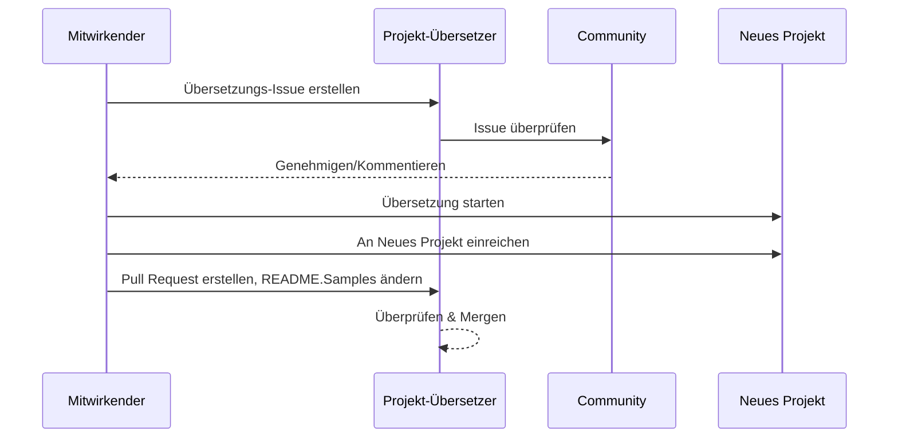

# Projekt-Übersetzer

Eine einfach zu verwendende VS Code-Erweiterung für die Mehrsprachigkeit von Projekten.

Projekt-Repository: `https://github.com/Project-Translation/project_translator`


## Installation

1. Marketplace:
   - VS Code Extensions Marketplace: [https://marketplace.visualstudio.com/items?itemName=techfetch-dev.project-translator](https://marketplace.visualstudio.com/items?itemName=techfetch-dev.project-translator)
   - Open VSX Registry: [https://open-vsx.org/extension/techfetch-dev/project-translator](https://open-vsx.org/extension/techfetch-dev/project-translator)
2. Suchen Sie nach `techfetch-dev.project-translator` in der VS Code-Erweiterungsansicht und klicken Sie auf Installieren


<!--  -->


## Verfügbare Übersetzungen

Die Erweiterung unterstützt Übersetzungen in diese Sprachen:

- [简体中文 (zh-cn)](./README.zh-cn.md)
- [繁體中文 (zh-tw)](./README.zh-tw.md)
- [日本語 (ja-jp)](./README.ja-jp.md)
- [한국어 (ko-kr)](./README.ko-kr.md)
- [Français (fr-fr)](./README.fr-fr.md)
- [Deutsch (de-de)](./README.de-de.md)
- [Español (es-es)](./README.es-es.md)
- [Português (pt-br)](./README.pt-br.md)
- [Русский (ru-ru)](./README.ru-ru.md)
- [العربية (ar-sa)](./README.ar-sa.md)
- [العربية (ar-ae)](./README.ar-ae.md)
- [العربية (ar-eg)](./README.ar-eg.md)

## Beispiele

| Projekt                                                                             | Original-Repository                                                                                       | Beschreibung                                                                                                                                                               | Sterne | Tags                                                                                                                                                                                                                                                                                                                                                                                                                                                                                                                                                                                                                                                                 |
| ----------------------------------------------------------------------------------- | --------------------------------------------------------------------------------------------------------- | ------------------------------------------------------------------------------------------------------------------------------------------------------------------------- | ----- | -------------------------------------------------------------------------------------------------------------------------------------------------------------------------------------------------------------------------------------------------------------------------------------------------------------------------------------------------------------------------------------------------------------------------------------------------------------------------------------------------------------------------------------------------------------------------------------------------------------------------------------------------------------------- |
| [algorithm-visualizer](https://github.com/Project-Translation/algorithm-visualizer) | [algorithm-visualizer/algorithm-visualizer](https://github.com/algorithm-visualizer/algorithm-visualizer) | :fireworks:Interaktive Online-Plattform, die Algorithmen aus Code visualisiert                                                                                               | 47301 | [`algorithm`](https://github.com/topics/algorithm), [`animation`](https://github.com/topics/animation), [`data-structure`](https://github.com/topics/data-structure), [`visualization`](https://github.com/topics/visualization)                                                                                                                                                                                                                                                                                                                                                                                                                                     |
| [algorithms](https://github.com/Project-Translation/algorithms)                     | [algorithm-visualizer/algorithms](https://github.com/algorithm-visualizer/algorithms)                     | :crystal_ball:Algorithmus-Visualisierungen                                                                                                                                    | 401   | N/A                                                                                                                                                                                                                                                                                                                                                                                                                                                                                                                                                                                                                                                                  |
| [cline-docs](https://github.com/Project-Translation/cline-docs)                     | [cline/cline](https://github.com/cline/cline)                                                             | Autonomer Codierungsagent direkt in Ihrer IDE, der Dateien erstellen/bearbeiten, Befehle ausführen, den Browser verwenden und mehr kann, mit Ihrer Erlaubnis bei jedem Schritt. | 39572 | N/A                                                                                                                                                                                                                                                                                                                                                                                                                                                                                                                                                                                                                                                                  |
| [cursor-docs](https://github.com/Project-Translation/cursor-docs)                   | [getcursor/docs](https://github.com/getcursor/docs)                                                       | Cursors Open-Source-Dokumentation                                                                                                                                        | 309   | N/A                                                                                                                                                                                                                                                                                                                                                                                                                                                                                                                                                                                                                                                                  |
| [gobyexample](https://github.com/Project-Translation/gobyexample)                   | [mmcgrana/gobyexample](https://github.com/mmcgrana/gobyexample)                                           | Go by Example                                                                                                                                                             | 7523  | N/A                                                                                                                                                                                                                                                                                                                                                                                                                                                                                                                                                                                                                                                                  |
| [golang-website](https://github.com/Project-Translation/golang-website)             | [golang/website](https://github.com/golang/website)                                                       | [Mirror] Startseite der go.dev- und golang.org-Websites                                                                                                                       | 402   | N/A                                                                                                                                                                                                                                                                                                                                                                                                                                                                                                                                                                                                                                                                  |
| [reference-en-us](https://github.com/Project-Translation/reference-en-us)           | [Fechin/reference](https://github.com/Fechin/reference)                                                   | ⭕ Teilt schnelle Referenz-Cheatsheets für Entwickler.                                                                                                                      | 7808  | [`awk`](https://github.com/topics/awk), [`bash`](https://github.com/topics/bash), [`chatgpt`](https://github.com/topics/chatgpt), [`cheatsheet`](https://github.com/topics/cheatsheet), [`cheatsheets`](https://github.com/topics/cheatsheets), [`css`](https://github.com/topics/css), [`golang`](https://github.com/topics/golang), [`grep`](https://github.com/topics/grep), [`markdown`](https://github.com/topics/markdown), [`python`](https://github.com/topics/python), [`reference`](https://github.com/topics/reference), [`sed`](https://github.com/topics/sed), [`snippets`](https://github.com/topics/snippets), [`vim`](https://github.com/topics/vim) |
| [styleguide](https://github.com/Project-Translation/styleguide)                     | [google/styleguide](https://github.com/google/styleguide)                                                 | Stilrichtlinien für von Google stammende Open-Source-Projekte                                                                                                                   | 38055 | [`cpplint`](https://github.com/topics/cpplint), [`style-guide`](https://github.com/topics/style-guide), [`styleguide`](https://github.com/topics/styleguide)                                                                                                                                                                                                                                                                                                                                                                                                                                                                                                         |
| [vscode-docs](https://github.com/Project-Translation/vscode-docs)                   | [microsoft/vscode-docs](https://github.com/microsoft/vscode-docs)                                         | Öffentliche Dokumentation für Visual Studio Code                                                                                                                               | 5914  | [`vscode`](https://github.com/topics/vscode)                                                                                                                                                                                                                                                                                                                                                                                                                                                                                                                                                                                                                         |

## Projektübersetzung anfordern

Wenn Sie eine Übersetzung beitragen oder ein Projekt übersetzt haben möchten:

1. Erstellen Sie ein Issue mit folgender Vorlage:

```md
**Projekt**: [project_url]
**Zielsprache**: [target_lang]
**Beschreibung**: Kurze Beschreibung, warum diese Übersetzung wertvoll wäre
```

2. Workflow:


```mermaid
sequenceDiagram
  Mitwirkender->>Projekt-Übersetzer: Übersetzungs-Issue erstellen
  Projekt-Übersetzer->>Community: Issue überprüfen
  Community-->>Mitwirkender: Genehmigen/Kommentieren
  Mitwirkender->>Neues Projekt: Übersetzung starten
  Mitwirkender->>Neues Projekt: An Neues Projekt einreichen
  Mitwirkender->>Projekt-Übersetzer: Pull Request erstellen, README.Samples ändern
  Projekt-Übersetzer-->>Projekt-Übersetzer: Überprüfen & Mergen
```

3. Nach dem Merge des PR wird die Übersetzung zum Abschnitt Beispiele hinzugefügt.

Aktuelle Übersetzungen in Arbeit: [Issues ansehen](https://github.com/Project-Translation/project_translator/issues)

## Funktionen

- 📁 Unterstützung auf Ordner-Ebene
  - Übersetzen Sie gesamte Projektordner in mehrere Sprachen
  - Behalten Sie die ursprüngliche Ordnerstruktur und Hierarchie bei
  - Unterstützung für rekursive Übersetzung von Unterordnern
  - Automatische Erkennung von übersetzbarem Inhalt
  - Batch-Verarbeitung für effiziente großangelegte Übersetzungen
- 📄 Unterstützung auf Datei-Ebene
  - Übersetzen Sie einzelne Dateien in mehrere Sprachen
  - Behalten Sie die ursprüngliche Dateistruktur und Formatierung bei
  - Unterstützung für sowohl Ordner- als auch Datei-Übersetzungsmodi
- 💡 Intelligente Übersetzung mit KI
  - Erhält automatisch die Code-Strukturintegrität
  - Übersetzt nur Code-Kommentare, erhält die Codelogik
  - Erhält JSON/XML- und andere Datenstrukturformate
  - Professionelle Qualität der technischen Dokumentationsübersetzung
- ⚙️ Flexible Konfiguration
  - Konfigurieren Sie Quellordner und mehrere Zielordner
  - Unterstützung für benutzerdefinierte Datei-Übersetzungsintervalle
  - Bestimmen Sie bestimmte Dateitypen, die ignoriert werden sollen
  - Unterstützung für mehrere KI-Modelloptionen
- 🚀 Benutzerfreundliche Operationen
  - Echtzeit-Anzeige des Übersetzungsfortschritts
  - Unterstützung für Pause/Fortsetzen/Stoppen der Übersetzung
  - Automatische Wartung der Zielordnerstruktur
  - Inkrementelle Übersetzung, um Doppelarbeit zu vermeiden
- 🔄 Differenzielle Übersetzung (Experimentell)
  - Diff-Apply-Modus für effiziente Updates bestehender Übersetzungen
  - Reduziert API-Nutzung, indem nur geänderter Inhalt übersetzt wird
  - Erhält die Versionshistorie mit minimalen Änderungen
  - ⚠️ Experimentelles Feature - siehe [Erweiterte Funktionen](#differential-translation-diff-apply-mode) für Details

## Konfiguration

Die Erweiterung unterstützt die folgenden Konfigurationsoptionen:

```json
{
  "projectTranslator.specifiedFolders": [
    {
      "sourceFolder": {
        "path": "Quellordnerpfad",
        "lang": "Quellsprachcode"
      },
      "targetFolders": [
        {
          "path": "Zielordnerpfad",
          "lang": "Zielsprachcode"
        }
      ]
    }
  ],
  "projectTranslator.specifiedFiles": [
    {
      "sourceFile": {
        "path": "Quelldateipfad",
        "lang": "Quellsprachcode"
      },
      "targetFiles": [
        {
          "path": "Zieldateipfad",
          "lang": "Zielsprachcode"
        }
      ]
    }
  ],
  "projectTranslator.currentVendor": "openai",
  "projectTranslator.vendors": [
    {
      "name": "openai",
      "apiEndpoint": "API-Endpunkt-URL",
      "apiKeyEnvVarName": "MY_OPENAI_API_KEY",
      "model": "gpt-4o",
      "rpm": "10",
      "maxTokensPerSegment": 4096,
      "timeout": 180,
      "temperature": 0.1
    }
  ],
  "projectTranslator.userPrompts": [
      "1. Sollte keine Übersetzung zurückgeben, wenn die Markdown-Datei im Front Matter 'draft' auf 'true' gesetzt hat.",
      "2. './readmes/' in den Sätzen sollte durch './' ersetzt werden.",
  ],
  "projectTranslator.ignore": {
    "paths": [
      "**/node_modules/**"
    ],
    "extensions": [
      ".log"
    ]
  },
}
```

Wichtige Konfigurationsdetails:

| Konfigurationsoption                        | Beschreibung                                                                                    |
| ------------------------------------------- | ---------------------------------------------------------------------------------------------- |
| `projectTranslator.specifiedFolders`        | Mehrere Quellordner mit ihren entsprechenden Zielordnern für die Übersetzung                   |
| `projectTranslator.specifiedFiles`          | Mehrere Quelldateien mit ihren entsprechenden Zieldateien für die Übersetzung                 |
| `projectTranslator.translationIntervalDays` | Übersetzungsintervall in Tagen (Standard 7 Tage)                                                |
| `projectTranslator.copyOnly`                | Dateien, die kopiert aber nicht übersetzt werden sollen (mit `paths`- und `extensions`-Arrays) |
| `projectTranslator.ignore`                  | Dateien, die vollständig ignoriert werden sollen (mit `paths`- und `extensions`-Arrays)        |
| `projectTranslator.skipFrontMatterMarkers`  | Dateien basierend auf Front-Matter-Markern überspringen (mit `enabled`- und `markers`-Arrays)  |
| `projectTranslator.currentVendor`           | Aktuell verwendeter API-Anbieter                                                               |
| `projectTranslator.vendors`                 | API-Anbieter-Konfigurationsliste (kann apiKey direkt oder apiKeyEnvVarName für Umgebungsvariablen verwenden) |
| `projectTranslator.systemPromptLanguage`    | Sprache, die für integrierte System-Prompts verwendet wird (Standard: en). Beeinflusst, wie das Modell angewiesen wird, nicht die UI-Sprache |
| `projectTranslator.systemPrompts`           | System-Prompt-Array zur Steuerung des Übersetzungsprozesses                                     |
| `projectTranslator.userPrompts`             | Benutzerdefinierte Prompt-Array, diese Prompts werden während der Übersetzung nach System-Prompts hinzugefügt |
| `projectTranslator.segmentationMarkers`     | Segmentierungsmarker, konfiguriert nach Dateityp, unterstützt reguläre Ausdrücke               |
| `projectTranslator.debug`                   | Debug-Modus aktivieren, um alle API-Anfragen und -Antworten im Ausgabekanal zu protokollieren (Standard: false) |
| `projectTranslator.logFile`                 | Konfiguration für Debug-Protokolldateien (siehe [Log-File-Feature](./docs/log-file-feature.md)) |
| `projectTranslator.diffApply.enabled`       | Experimentellen differenziellen Übersetzungsmodus aktivieren (Standard: false)                  |

## Verwendung

1. Öffnen Sie die Befehlspalette (Strg+Umschalt+P / Cmd+Umschalt+P)
2. Geben Sie "Translate Project" ein und wählen Sie den Befehl
3. Wenn der Quellordner nicht konfiguriert ist, erscheint ein Ordnerauswahldialog
4. Warten Sie, bis die Übersetzung abgeschlossen ist

Während der Übersetzung:

- Kann die Übersetzung über Statusleisten-Schaltflächen pausieren/fortsetzen
- Kann den Übersetzungsprozess jederzeit stoppen
- Übersetzungsfortschritt wird im Benachrichtigungsbereich angezeigt
- Detaillierte Protokolle werden im Ausgabepanel angezeigt

### Automatische Übersetzung beim Öffnen des Arbeitsbereichs

Sie können eine Auto-Übersetzungsaufgabe aktivieren, die beim Öffnen des Arbeitsbereichs ausgeführt wird:

1. Führen Sie den Befehl aus: `Enable Auto Translate On Open`
2. Die Erweiterung aktualisiert `.vscode/tasks.json`
3. Es wird beim nächsten Öffnen des Arbeitsbereichs wirksam (die Erweiterung löst kein Neuladen des Fensters aus)

Um es zu deaktivieren, führen Sie aus: `Disable Auto Translate On Open`.

## CLI-Verwendung

Das Projekt unterstützt jetzt zusätzlich zur VS Code-Erweiterung die CLI-Ausführung.

CLI-Ausgabe bauen:

```bash
npm run compile
```

Übersetzung ausführen:

```bash
# Standard-Zielsprache: en-us
npx project-translator translate project --workspace . --config project.translation.json

# Zielsprache angeben
npx project-translator translate project --workspace . --config project.translation.json --lang ja-jp
```

Konfiguration verwalten:

```bash
npx project-translator config list --workspace . --config project.translation.json --json
npx project-translator config set currentVendor deepseek --workspace . --config project.translation.json
npx project-translator config schema --workspace .
npx project-translator config validate --workspace . --config project.translation.json
```

`config schema` exportiert standardmäßig `project.translation.schema.json`.  
`config validate` führt JSON-Schema-Validierung der Konfigurationsdatei durch und gibt einen Nicht-Null-Exit-Code zurück, wenn sie ungültig ist.

## Entwicklung

### Build-System

Diese Erweiterung verwendet esbuild für schnelles Bündeln und Entwicklung:

#### Verfügbare Skripte

- `npm run build` - Produktionsbuild mit Minifizierung
- `npm run compile` - Entwicklungsbuild
- `npm run watch` - Watch-Modus für Entwicklung
- `npm test` - Tests ausführen

#### VS Code-Aufgaben

- **Build** (Strg+Umschalt+P → "Tasks: Run Task" → "build") - Bündelt Erweiterung für Produktion
- **Watch** (Strg+Umschalt+P → "Tasks: Run Task" → "watch") - Entwicklungsmodus mit automatischem Rebuild

### Entwicklungseinrichtung

1. Repository klonen
2. Führen Sie `npm install` aus, um Abhängigkeiten zu installieren
3. Drücken Sie `F5`, um mit dem Debuggen zu beginnen, oder führen Sie die "watch"-Aufgabe für die Entwicklung aus

Die esbuild-Konfiguration:

- Bündelt alle TypeScript-Dateien in eine einzelne `out/extension.js`
- Schließt VS Code API aus (als extern markiert)

## Erweiterte Funktionen

### Verwenden von Umgebungsvariablen für API-Schlüssel

Project Translator unterstützt die Verwendung von Umgebungsvariablen für API-Schlüssel, was ein sichererer Ansatz ist als das direkte Speichern von API-Schlüsseln in Konfigurationsdateien:

1. Konfigurieren Sie Ihren Anbieter mit einer `apiKeyEnvVarName`-Eigenschaft:

```json
{
  "projectTranslator.vendors": [
    {
      "name": "openai",
      "apiEndpoint": "https://api.openai.com/v1",
      "apiKeyEnvVarName": "OPENAI_API_KEY",
      "model": "gpt-4"
    },
    {
      "name": "openrouter",
      "apiEndpoint": "https://openrouter.ai/api/v1",
      "apiKeyEnvVarName": "OPENROUTER_API_KEY",
      "model": "anthropic/claude-3-opus"
    }
  ]
}
```

2. Setzen Sie die Umgebungsvariable in Ihrem System:
   - Unter Windows: `set OPENAI_API_KEY=your_api_key`
   - Unter macOS/Linux: `export OPENAI_API_KEY=your_api_key`

3. Wenn die Erweiterung ausgeführt wird, wird sie:
   - Zuerst prüfen, ob `apiKey` direkt in der Konfiguration angegeben ist
   - Wenn nicht, wird sie nach der durch `apiKeyEnvVarName` angegebenen Umgebungsvariable suchen

Dieser Ansatz hält Ihre API-Schlüssel aus Konfigurationsdateien und Versionskontrollsystemen fern.

### Übersetzung basierend auf Front Matter überspringen

Project Translator kann die Übersetzung von Markdown-Dateien basierend auf deren Front-Matter-Metadaten überspringen. Dies ist nützlich für Entwurfsdokumente oder Dateien, die als nicht übersetzungsbedürftig markiert sind.

Um dieses Feature zu aktivieren, konfigurieren Sie die Option `projectTranslator.skipFrontMatterMarkers`:

```json
{
  "projectTranslator.skipFrontMatterMarkers": {
    "enabled": true,
    "markers": [
      {
        "key": "draft",
        "value": "true"
      },
      {
        "key": "translate",
        "value": "false"
      }
    ]
  }
}
```

Mit dieser Konfiguration werden alle Markdown-Dateien mit Front Matter, die `draft: true` oder `translate: false` enthalten, während der Übersetzung übersprungen und direkt an den Zielort kopiert.

Beispiel für eine Markdown-Datei, die übersprungen würde:
```
---
draft: true
title: "Draft Document"
---

This document is a draft and should not be translated.
```

### Differenzielle Übersetzung (Diff-Apply)-Modus

> **⚠️ Warnung vor experimentellem Feature**: Der differenzielle Übersetzungsmodus ist derzeit ein experimentelles Feature und kann Stabilitäts- und Kompatibilitätsprobleme aufweisen. Es wird empfohlen, es in Produktionsumgebungen mit Vorsicht zu verwenden und immer wichtige Dateien zu sichern.

Die Erweiterung unterstützt einen optionalen differenziellen Übersetzungsmodus (diff-apply). Wenn aktiviert, sendet die Erweiterung sowohl den Quellinhalt als auch die vorhandene übersetzte Zieldatei an das Modell. Das Modell sollte einen oder mehrere SEARCH/REPLACE-Blöcke (Klartext, keine Code-Fences) zurückgeben. Die Erweiterung wendet diese Blöcke lokal an, um Änderungen zu minimieren, die API-Nutzung zu reduzieren und die Versionshistorie besser zu erhalten.

- **Umschalter**: Konfigurieren Sie `projectTranslator.diffApply.enabled` in den VS Code-Einstellungen oder `project.translation.json` (Standard: `false`).
- **Optionen**:
  - `validationLevel`: `normal` oder `strict` (Standard: `normal`). Im `strict`-Modus führen ungültige Marker oder Übereinstimmungsfehler zu einem Fehler und die Erweiterung greift auf den Standard-Übersetzungsfluss zurück.
  - `autoBackup`: Wenn true, erstellen Sie eine `.bak`-Sicherung der Zieldatei vor dem Anwenden von Änderungen (Standard: `true`).
  - `maxOperationsPerFile`: (aus Kompatibilitätsgründen beibehalten) wird von der neuen Strategie nicht verwendet.

Workflow:
1. Wenn `diffApply.enabled` `true` ist und die Zieldatei existiert, liest die Erweiterung sowohl Quell- als auch Zielinhalt.
2. Sie ruft das Modell mit einem differenziellen Prompt auf und erfordert die Rückgabe von Klartext-SEARCH/REPLACE-Blöcken.
3. Lokal parst und wendet die Erweiterung die SEARCH/REPLACE-Blöcke an. Wenn die Anwendung fehlschlägt, greift sie auf die normale vollständige Übersetzung zurück und überschreibt die Zieldatei.

Beispiel SEARCH/REPLACE (mehrere Blöcke erlaubt):

```
<<<<<<< SEARCH
:start_line: 10
-------
const label = "Old"
=======
const label = "New"
>>>>>>> REPLACE

<<<<<<< SEARCH
:start_line: 25
-------
function foo() {
  return 1
}
=======
function foo() {
  return 2
}
>>>>>>> REPLACE
```

Hinweise:
- Verwenden Sie exakten Inhalt einschließlich Einrückung und Leerzeichen in SEARCH-Abschnitten. Wenn unsicher, verwenden Sie den neuesten Dateiinhalt.
- Behalten Sie eine einzelne Zeile `=======` zwischen SEARCH und REPLACE.
- Wenn keine Änderung benötigt wird, sollte das Modell einen leeren String zurückgeben.

Warum differenzielle Übersetzung derzeit schlecht funktioniert (Erklärung)

- **Herausforderungen bei der sprachübergreifenden Ausrichtung und dem Vergleich**: Die differenzielle Übersetzung erfordert das Senden sowohl des ursprünglichen Quelldokuments als auch des vorhandenen übersetzten Dokuments an das Modell, und das Modell muss sie sprachübergreifend vergleichen, um zu entscheiden, welche Teile der Übersetzung geändert werden müssen. Dies ist eine grundsätzlich schwierigere Aufgabe als die Änderung eines einzelnen Dokuments an Ort und Stelle, da das Modell Segmente in verschiedenen Sprachen genau ausrichten und semantische Unterschiede beurteilen muss.

- **Komplexität der Format- und Grenzerhaltung**: Viele Dokumente enthalten Codeblöcke, Tabellen, Frontend-Marker oder spezielle Platzhalter. Ein zuverlässiger Diff-Workflow muss diese Strukturen erhalten, während textuelle Änderungen vorgenommen werden. Wenn das Modell nicht konsistent Ergebnisse liefern kann, die streng dem SEARCH/REPLACE-Format folgen, kann das automatische Anwenden von Änderungen Formatierungsregressionen oder strukturelle Fehler einführen.

- **Kontext- und Terminologie-Konsistenzprobleme**: Kleine, lokalisierte Änderungen hängen oft von einem breiteren Kontext und einem vorhandenen Terminologie-/Stilglossar ab. Wenn das Modell aufgefordert wird, minimale Änderungen zu produzieren, kann es die globale Konsistenz (Terminologie, Stil, Kommentare, Variablennamen) vernachlässigen, was zu inkonsistenten oder semantisch verschobenen Übersetzungen führt.

- **Modellstabilität und Kostenabwägungen**: Um eine zuverlässige differenzielle Übersetzung zu erreichen, sind Modelle mit starker vergleichender Argumentation und stabilen, vorhersehbaren Ausgabeformaten erforderlich. Aktuelle Mainstream-Modelle bieten nicht zuverlässig sowohl robuste sprachübergreifende Ausrichtung als auch streng formatierte Ausgaben zu angemessenen Kosten, daher greifen Systeme oft auf eine vollständige Neuübersetzung zurück, um Korrektheit zu gewährleisten.

Daher kann die differenzielle Übersetzung theoretisch teure Ausgabetokens reduzieren und die Versionshistorie besser erhalten, ist aber derzeit durch die sprachübergreifenden Vergleichsfähigkeiten und Ausgabestabilität der Modelle begrenzt. Dieses Feature bleibt experimentell; empfohlene Abhilfemaßnahmen umfassen das Behalten automatischer Sicherungen (`autoBackup: true`), die Verwendung einer toleranten Validierungsebene (`validationLevel: "normal"`) und das Zurückgreifen auf eine vollständige Neuübersetzung, wenn die Übereinstimmung oder Formatierung fehlschlägt. In der Zukunft könnten spezialisierte bilinguale Ausrichtungs-Post-Prozessoren oder benutzerdefinierte kleinere Modelle die Stabilität des Diff-Ansatzes verbessern.

Kosteneinsparungen und warum es hilft

- **Eingabe- vs. Ausgabe-Token-Kosten**: Large-Model-APIs berechnen häufig unterschiedlich für Eingabe (Prompt) und Ausgabe (Completion) Tokens. Oft sind Ausgabe-Tokens deutlich teurer, weil das Modell längeren Text generiert. Diff-Apply hilft, weil wir die **aktualisierte Quelle (Eingabe)** und die **vorhandene übersetzte Datei (Eingabe)** an das Modell senden und um ein kompaktes JSON von Änderungen bitten. Die Antwort des Modells ist ein kleines JSON (wenige Ausgabe-Tokens) anstelle einer vollständig neu übersetzten Datei (viele Ausgabe-Tokens), also zahlen Sie viel weniger für den teuren Ausgabeteil.

- **Nur senden, was geändert wurde**: Anstatt die gesamte Datei neu zu übersetzen, wenn kleine Änderungen auftreten, weist diff-apply das Modell an, die minimalen Editieroperationen zu berechnen, um die vorhandene Übersetzung zu aktualisieren. Dies ist besonders effektiv für Dateien, die zuvor übersetzt wurden und nur inkrementelle Änderungen erhalten.

- **Am besten für formatierte Dateien**: Dateien mit strenger Formatierung (JSON, XML, Markdown mit Codeblöcken) profitieren stark, weil diff-apply die Struktur erhält und nur textuelle Teile ändert, die übersetzt werden müssen. Dies reduziert die Wahrscheinlichkeit formatbezogener Regressionen und zusätzlicher Ausgabe-Tokens, die durch Modell-Neuformatierung verursacht werden.

- **Zeilenorientierte Basiseinheit, intelligentere Aggregation**: Das Tool behandelt die grundlegende Übersetzungseinheit als "Zeile", und die SEARCH/REPLACE-Strategie wendet exakte oder unscharfe Übereinstimmung in der Nähe von `:start_line:` an. Verwenden Sie `validationLevel: "normal"` für tolerantes Verhalten und `"strict"`, wenn Sie konservative, exakte Änderungen benötigen.

Wann diff-apply verwenden:

- Verwenden, wenn die Zieldatei bereits existiert und zuvor übersetzt wurde.
- Verwenden für große, formatierte Dokumente, bei denen die Neuübersetzung der gesamten Datei teuer wäre.
- Vermeiden für brandneue Dateien ohne vorherige Übersetzung oder wenn Sie eine frische Neuübersetzung wünschen.

### Design-Dokumentation

 - Generiert Source Maps für Entwicklungsbuilds
 - Minifiziert Code für Produktionsbuilds
 - Bietet Problem-Matcher-Integration für VS Code

## Hinweise

- Stellen Sie sicher, dass Sie über ausreichendes API-Kontingent verfügen
- Empfohlen, zuerst mit kleinen Projekten zu testen
- Verwenden Sie dedizierte API-Schlüssel und entfernen Sie sie nach Abschluss

## Lizenz

[Lizenz](LICENSE)