# Projektübersetzer

Eine benutzerfreundliche VS Code-Erweiterung für mehrsprachige Lokalisierung von Projekten.

Projektrepository: `https://github.com/Project-Translation/project_translator`

## Installation

1. Marketplace:
   - VS Code Extensions Marketplace: [https://marketplace.visualstudio.com/items?itemName=techfetch-dev.project-translator](https://marketplace.visualstudio.com/items?itemName=techfetch-dev.project-translator)
   - Open VSX Registry: [https://open-vsx.org/extension/techfetch-dev/project-translator](https://open-vsx.org/extension/techfetch-dev/project-translator)
2. Suchen Sie nach `techfetch-dev.project-translator` in der VS Code-Erweiterungsansicht und klicken Sie auf Installieren

<!--  -->


## Verfügbare Übersetzungen

Die Erweiterung unterstützt Übersetzungen in folgende Sprachen:

- [简体中文 (zh-cn)](./README.zh-cn.md)
- [繁體中文 (zh-tw)](./README.zh-tw.md)
- [日本語 (ja-jp)](./README.ja-jp.md)
- [한국어 (ko-kr)](./README.ko-kr.md)
- [Français (fr-fr)](./README.fr-fr.md)
- [Deutsch (de-de)](./README.de-de.md)
- [Español (es-es)](./README.es-es.md)
- [Português (pt-br)](./README.pt-br.md)
- [Русский (ru-ru)](./README.ru-ru.md)
- [العربية (ar-sa)](./README.ar-sa.md)
- [العربية (ar-ae)](./README.ar-ae.md)
- [العربية (ar-eg)](./README.ar-eg.md)

## Beispiele

| Projekt                                                                             | Original-Repository                                                                                       | Beschreibung                                                                                                                                                               | Sterne | Tags                                                                                                                                                                                                                                                                                                                                                                                                                                                                                                                                                                                                                                                                 |
| ----------------------------------------------------------------------------------- | --------------------------------------------------------------------------------------------------------- | ------------------------------------------------------------------------------------------------------------------------------------------------------------------------- | ----- | -------------------------------------------------------------------------------------------------------------------------------------------------------------------------------------------------------------------------------------------------------------------------------------------------------------------------------------------------------------------------------------------------------------------------------------------------------------------------------------------------------------------------------------------------------------------------------------------------------------------------------------------------------------------- |
| [algorithm-visualizer](https://github.com/Project-Translation/algorithm-visualizer) | [algorithm-visualizer/algorithm-visualizer](https://github.com/algorithm-visualizer/algorithm-visualizer) | :fireworks:Interaktive Online-Plattform zur Visualisierung von Algorithmen aus Code                                                                                       | 47301 | [`algorithm`](https://github.com/topics/algorithm), [`animation`](https://github.com/topics/animation), [`data-structure`](https://github.com/topics/data-structure), [`visualization`](https://github.com/topics/visualization)                                                                                                                                                                                                                                                                                                                                                                                                                                     |
| [algorithms](https://github.com/Project-Translation/algorithms)                     | [algorithm-visualizer/algorithms](https://github.com/algorithm-visualizer/algorithms)                     | :crystal_ball:Algorithmus-Visualisierungen                                                                                                                                | 401   | N/A                                                                                                                                                                                                                                                                                                                                                                                                                                                                                                                                                                                                                                                                  |
| [cline-docs](https://github.com/Project-Translation/cline-docs)                     | [cline/cline](https://github.com/cline/cline)                                                             | Autonomer Coding-Agent direkt in Ihrer IDE, der Dateien erstellen/bearbeiten, Befehle ausführen, den Browser nutzen und mehr kann – mit Ihrer Erlaubnis bei jedem Schritt. | 39572 | N/A                                                                                                                                                                                                                                                                                                                                                                                                                                                                                                                                                                                                                                                                  |
| [cursor-docs](https://github.com/Project-Translation/cursor-docs)                   | [getcursor/docs](https://github.com/getcursor/docs)                                                       | Open-Source-Dokumentation von Cursor                                                                                                                                        | 309   | N/A                                                                                                                                                                                                                                                                                                                                                                                                                                                                                                                                                                                                                                                                  |
| [gobyexample](https://github.com/Project-Translation/gobyexample)                   | [mmcgrana/gobyexample](https://github.com/mmcgrana/gobyexample)                                           | Go by Example                                                                                                                                                             | 7523  | N/A                                                                                                                                                                                                                                                                                                                                                                                                                                                                                                                                                                                                                                                                  |
| [golang-website](https://github.com/Project-Translation/golang-website)             | [golang/website](https://github.com/golang/website)                                                       | [Spiegel] Home der go.dev und golang.org Websites                                                                                                                       | 402   | N/A                                                                                                                                                                                                                                                                                                                                                                                                                                                                                                                                                                                                                                                                  |
| [reference-en-us](https://github.com/Project-Translation/reference-en-us)           | [Fechin/reference](https://github.com/Fechin/reference)                                                   | ⭕ Schnellreferenz-Cheat-Sheets für Entwickler teilen.                                                                                                                      | 7808  | [`awk`](https://github.com/topics/awk), [`bash`](https://github.com/topics/bash), [`chatgpt`](https://github.com/topics/chatgpt), [`cheatsheet`](https://github.com/topics/cheatsheet), [`cheatsheets`](https://github.com/topics/cheatsheets), [`css`](https://github.com/topics/css), [`golang`](https://github.com/topics/golang), [`grep`](https://github.com/topics/grep), [`markdown`](https://github.com/topics/markdown), [`python`](https://github.com/topics/python), [`reference`](https://github.com/topics/reference), [`sed`](https://github.com/topics/sed), [`snippets`](https://github.com/topics/snippets), [`vim`](https://github.com/topics/vim) |
| [styleguide](https://github.com/Project-Translation/styleguide)                     | [google/styleguide](https://github.com/google/styleguide)                                                 | Styleguides für Google-originierte Open-Source-Projekte                                                                                                                   | 38055 | [`cpplint`](https://github.com/topics/cpplint), [`style-guide`](https://github.com/topics/style-guide), [`styleguide`](https://github.com/topics/styleguide)                                                                                                                                                                                                                                                                                                                                                                                                                                                                                                         |
| [vscode-docs](https://github.com/Project-Translation/vscode-docs)                   | [microsoft/vscode-docs](https://github.com/microsoft/vscode-docs)                                         | Öffentliche Dokumentation für Visual Studio Code                                                                                                                               | 5914  | [`vscode`](https://github.com/topics/vscode)                                                                                                                                                                                                                                                                                                                                                                                                                                                                                                                                                                                                                         |

## Übersetzungsanfrage für Projekte

Wenn Sie eine Übersetzung beitragen möchten oder ein Projekt übersetzt werden soll:

1. Erstellen Sie ein Issue mit folgender Vorlage:

```md
**Projekt**: [project_url]
**Zielsprache**: [target_lang]
**Beschreibung**: Kurze Beschreibung, warum diese Übersetzung wertvoll wäre
```

2. Workflow:

```mermaid
sequenceDiagram
  Contributor->>Project Translator: Übersetzungs-Issue erstellen
  Project Translator->>Community: Issue prüfen
  Community-->>Contributor: Genehmigen/Kommentieren
  Contributor->>New Project: Übersetzung starten
  Contributor->>New Project: Zu New Project einreichen
  Contributor->>Project Translator: Pull Request erstellen, README.Samples anpassen
  Project Translator-->>Project Translator: Prüfen & Mergen
```



3. Nach dem Merge wird die Übersetzung dem Beispielabschnitt hinzugefügt.

Aktuelle Übersetzungen in Arbeit: [Issues ansehen](https://github.com/Project-Translation/project_translator/issues)

## Funktionen

- 📁 Ordnerebene Übersetzungsunterstützung
  - Übersetzt gesamte Projektordner in mehrere Sprachen
  - Behält originale Ordnerstruktur und Hierarchie bei
  - Unterstützt rekursive Übersetzung von Unterordnern
  - Automatische Erkennung übersetzbarer Inhalte
  - Stapelverarbeitung für effiziente Massenübersetzungen
- 📄 Dateiebene Übersetzungsunterstützung
  - Übersetzt einzelne Dateien in mehrere Sprachen
  - Behält originale Dateistruktur und Formatierung bei
  - Unterstützt sowohl Ordner- als auch Dateiübersetzungsmodi
- 💡 Intelligente Übersetzung mit KI
  - Automatische Wahrung der Code-Strukturintegrität
  - Übersetzt nur Code-Kommentare, behält Code-Logik bei
  - Behält JSON/XML und andere Datenstrukturformate bei
  - Professionelle Übersetzungsqualität für technische Dokumentation
- ⚙️ Flexible Konfiguration
  - Konfigurierbare Quellordner und mehrere Zielordner
  - Unterstützung für benutzerdefinierte Übersetzungsintervalle
  - Festlegung spezifischer zu ignorierender Dateitypen
  - Unterstützung mehrerer KI-Modelloptionen
- 🚀 Benutzerfreundliche Bedienung
  - Echtzeit-Fortschrittsanzeige der Übersetzung
  - Unterstützung für Pause/Fortsetzen/Abbruch der Übersetzung
  - Automatische Pflege der Zielordnerstruktur
  - Inkrementelle Übersetzung zur Vermeidung doppelter Arbeit
- 🔄 Differenzielle Übersetzung (Experimentell)
  - Diff-Apply-Modus für effiziente Aktualisierung bestehender Übersetzungen
  - Reduziert API-Nutzung durch Übersetzung nur geänderter Inhalte
  - Bewahrt Versionsverlauf mit minimalen Änderungen
  - ⚠️ Experimentelle Funktion - siehe [Erweiterte Funktionen](#differential-translation-diff-apply-mode) für Details

## Konfiguration

Die Erweiterung unterstützt folgende Konfigurationsoptionen:

```json
{
  "projectTranslator.specifiedFolders": [
    {
      "sourceFolder": {
        "path": "Quellordner-Pfad",
        "lang": "Quellsprachencode"
      },
      "targetFolders": [
        {
          "path": "Zielordner-Pfad",
          "lang": "Zielsprachencode"
        }
      ]
    }
  ],
  "projectTranslator.specifiedFiles": [
    {
      "sourceFile": {
        "path": "Quelldatei-Pfad",
        "lang": "Quellsprachencode"
      },
      "targetFiles": [
        {
          "path": "Zieldatei-Pfad",
          "lang": "Zielsprachencode"
        }
      ]
    }
  ],
  "projectTranslator.currentVendor": "openai",
  "projectTranslator.vendors": [
    {
      "name": "openai",
      "apiEndpoint": "API-Endpunkt-URL",
      "apiKeyEnvVarName": "MY_OPENAI_API_KEY",
      "model": "gpt-4o",
      "rpm": "10",
      "maxTokensPerSegment": 4096,
      "timeout": 180,
      "temperature": 0.1
    }
  ],
  "projectTranslator.userPrompts": [
      "1. Sollte keine Übersetzung zurückgeben, wenn die Markdown-Datei im Front Matter 'draft: true' gesetzt hat.",
      "2. './readmes/' in Sätzen sollte durch './' ersetzt werden",
  ],
  "projectTranslator.ignore": {
    "paths": [
      "**/node_modules/**"
    ],
    "extensions": [
      ".log"
    ]
  },
}
```

Wichtige Konfigurationsdetails:

| Konfigurationsoption                        | Beschreibung                                                                                    |
| ------------------------------------------- | ---------------------------------------------------------------------------------------------- |
| `projectTranslator.specifiedFolders`        | Mehrere Quellordner mit ihren entsprechenden Zielordnern für die Übersetzung           |
| `projectTranslator.specifiedFiles`          | Mehrere Quelldateien mit ihren entsprechenden Zieldateien für die Übersetzung               |
| `projectTranslator.translationIntervalDays` | Übersetzungsintervall in Tagen (Standard 7 Tage)                                                  |
| `projectTranslator.copyOnly`                | Dateien, die nur kopiert, aber nicht übersetzt werden sollen (mit `paths` und `extensions` Arrays)                         |
| `projectTranslator.ignore`                  | Komplett zu ignorierende Dateien (mit `paths` und `extensions` Arrays)                              |
| `projectTranslator.skipFrontMatterMarkers`  | Dateien basierend auf Front-Matter-Markern überspringen (mit `enabled` und `markers` Arrays)                 |
| `projectTranslator.currentVendor`           | Aktuell verwendeter API-Anbieter                                                                      |
| `projectTranslator.vendors`                 | API-Anbieter-Konfigurationsliste (kann apiKey direkt oder apiKeyEnvVarName für Umgebungsvariablen verwenden) |
| `projectTranslator.systemPromptLanguage`    | Für integrierte System-Prompts verwendete Sprache (Standard: en). Beeinflusst, wie das Modell instruiert wird, nicht die UI-Sprache |
| `projectTranslator.systemPrompts`           | System-Prompt-Array zur Steuerung des Übersetzungsprozesses                                        |
| `projectTranslator.userPrompts`             | Benutzerdefiniertes Prompt-Array, diese Prompts werden während der Übersetzung nach System-Prompts hinzugefügt |
| `projectTranslator.segmentationMarkers`     | Segmentierungsmarker nach Dateityp konfiguriert, unterstützt reguläre Ausdrücke                     |
| `projectTranslator.debug`                   | Debug-Modus aktivieren, um alle API-Anfragen und Antworten im Ausgabekanal zu protokollieren (Standard: false)     |
| `projectTranslator.logFile`                 | Konfiguration für Debug-Protokolldateien (siehe [Log-Datei-Funktion](./docs/log-file-feature.md))         |
| `projectTranslator.diffApply.enabled`       | Experimentellen differenziellen Übersetzungsmodus aktivieren (Standard: false)                             |

## Verwendung

1. Öffnen Sie die Befehlspalette (Strg+Umschalt+P / Cmd+Umschalt+P)
2. Tippen Sie "Translate Project" und wählen Sie den Befehl
3. Wenn kein Quellordner konfiguriert ist, erscheint ein Ordnerauswahldialog
4. Warten Sie auf den Abschluss der Übersetzung

Während der Übersetzung:

- Übersetzung kann über Statusleisten-Buttons pausiert/fortgesetzt werden
- Übersetzungsprozess kann jederzeit gestoppt werden
- Übersetzungsfortschritt wird im Benachrichtigungsbereich angezeigt
- Detaillierte Protokolle werden im Ausgabebereich angezeigt

## Entwicklung

### Build-System

Diese Erweiterung verwendet esbuild für schnelles Bundling und Entwicklung:

#### Verfügbare Skripte

- `npm run build` - Produktionsbuild mit Minifizierung
- `npm run compile` - Entwicklungsbuild
- `npm run watch` - Watch-Modus für Entwicklung
- `npm test` - Tests ausführen

#### VS Code Tasks

- **Build** (Strg+Umschalt+P → "Tasks: Run Task" → "build") - Bündelt die Erweiterung für die Produktion
- **Watch** (Strg+Umschalt+P → "Tasks: Run Task" → "watch") - Entwicklungsmodus mit automatischem Rebuild

### Entwicklungsumgebung

1. Klonen Sie das Repository
2. Führen Sie `npm install` aus, um Abhängigkeiten zu installieren
3. Drücken Sie `F5`, um das Debugging zu starten, oder führen Sie den "watch"-Task für die Entwicklung aus

Die esbuild-Konfiguration:

- Bündelt alle TypeScript-Dateien in eine einzelne `out/extension.js`
- Schließt VS Code-API aus (als extern markiert)

## Erweiterte Funktionen

### Verwendung von Umgebungsvariablen für API-Schlüssel

Project Translator unterstützt die Verwendung von Umgebungsvariablen für API-Schlüssel, was sicherer ist als die direkte Speicherung in Konfigurationsdateien:

1. Konfigurieren Sie Ihren Anbieter mit einer `apiKeyEnvVarName`-Eigenschaft:

```json
{
  "projectTranslator.vendors": [
    {
      "name": "openai",
      "apiEndpoint": "https://api.openai.com/v1",
      "apiKeyEnvVarName": "OPENAI_API_KEY",
      "model": "gpt-4"
    },
    {
      "name": "openrouter",
      "apiEndpoint": "https://openrouter.ai/api/v1",
      "apiKeyEnvVarName": "OPENROUTER_API_KEY",
      "model": "anthropic/claude-3-opus"
    }
  ]
}
```

2. Setzen Sie die Umgebungsvariable in Ihrem System:
   - Windows: `set OPENAI_API_KEY=your_api_key`
   - macOS/Linux: `export OPENAI_API_KEY=your_api_key`

3. Wenn die Erweiterung läuft:
   - Prüft zuerst, ob `apiKey` direkt in der Konfiguration angegeben ist
   - Falls nicht, sucht sie nach der durch `apiKeyEnvVarName` angegebenen Umgebungsvariable

Dieser Ansatz hält Ihre API-Schlüssel aus Konfigurationsdateien und Versionskontrollsystemen fern.

### Übersetzung basierend auf Front Matter überspringen

Project Translator kann die Übersetzung von Markdown-Dateien basierend auf ihren Front-Matter-Metadaten überspringen. Dies ist nützlich für Entwurfsdokumente oder als nicht übersetzbar markierte Dateien.

Aktivieren Sie diese Funktion durch Konfiguration der `projectTranslator.skipFrontMatterMarkers`-Option:

```json
{
  "projectTranslator.skipFrontMatterMarkers": {
    "enabled": true,
    "markers": [
      {
        "key": "draft",
        "value": "true"
      },
      {
        "key": "translate",
        "value": "false"
      }
    ]
  }
}
```

Mit dieser Konfiguration wird jede Markdown-Datei mit Front Matter, das `draft: true` oder `translate: false` enthält, während der Übersetzung übersprungen und direkt an den Zielort kopiert.

Beispiel-Markdown-Datei, die übersprungen würde:
```
---
draft: true
title: "Entwurfsdokument"
---

Dieses Dokument ist ein Entwurf und sollte nicht übersetzt werden.
```

### Differenzielle Übersetzung (Diff-Apply) Modus

> **⚠️ Experimentelle Funktionswarnung**: Der differenzielle Übersetzungsmodus ist derzeit experimentell und kann Stabilitäts- und Kompatibilitätsprobleme aufweisen. Es wird empfohlen, ihn in Produktionsumgebungen mit Vorsicht zu verwenden und wichtige Dateien immer zu sichern.

Die Erweiterung unterstützt einen optionalen differenziellen Übersetzungsmodus (diff-apply). Wenn aktiviert, sendet die Erweiterung sowohl den Quellinhalt als auch die bestehende übersetzte Zieldatei an das Modell. Das Modell sollte einen oder mehrere SEARCH/REPLACE-Blöcke (Klartext, ohne Code-Umrandung) zurückgeben. Die Erweiterung wendet diese Blöcke lokal an, um Änderungen zu minimieren, API-Nutzung zu reduzieren und den Versionsverlauf besser zu erhalten.

- **Umschalter**: Konfigurieren Sie `projectTranslator.diffApply.enabled` in den VS Code-Einstellungen oder `project.translation.json` (Standard: `false`).
- **Optionen**:
  - `validationLevel`: `normal` oder `strict` (Standard: `normal`). Im `strict`-Modus führen ungültige Marker oder Übereinstimmungsfehler zu einem Fehler, und die Erweiterung fällt auf den Standard-Übersetzungsfluss zurück.
  - `autoBackup`: Wenn true, wird vor dem Anwenden von Änderungen eine `.bak`-Sicherung der Zieldatei erstellt (Standard: `true`).
  - `maxOperationsPerFile`: (Zur Kompatibilität beibehalten) wird von der neuen Strategie nicht verwendet.

Workflow:
1. Wenn `diffApply.enabled` `true` ist und die Zieldatei existiert, liest die Erweiterung sowohl Quell- als auch Zielinhalte.
2. Sie ruft das Modell mit einem differenziellen Prompt auf und erfordert die Rückgabe von Klartext-SEARCH/REPLACE-Blöcken.
3. Die Erweiterung parst und wendet die SEARCH/REPLACE-Blöcke lokal an. Bei Anwendungsfehlern fällt sie auf die normale Vollübersetzung zurück und überschreibt die Zieldatei.

Beispiel SEARCH/REPLACE (mehrere Blöcke möglich):

```
<<<<<<< SEARCH
:start_line: 10
-------
const label = "Old"
=======
const label = "New"
>>>>>>> REPLACE

<<<<<<< SEARCH
:start_line: 25
-------
function foo() {
  return 1
}
=======
function foo() {
  return 2
}
>>>>>>> REPLACE
```

Hinweise:
- Verwenden Sie exakte Inhalte einschließlich Einrückung und Leerzeichen in SEARCH-Abschnitten. Im Zweifelsfall verwenden Sie den neuesten Dateiinhalt.
- Halten Sie eine einzelne Zeile `=======` zwischen SEARCH und REPLACE ein.
- Wenn keine Änderung benötigt wird, sollte das Modell eine leere Zeichenkette zurückgeben.

Warum differenzielle Übersetzung derzeit schlecht abschneidet (Erklärung)

- **Herausforderungen bei sprachübergreifender Ausrichtung und Vergleich**: Differenzielle Übersetzung erfordert das Senden sowohl des ursprünglichen Quelldokuments als auch der bestehenden übersetzten Zieldatei an das Modell, und das Modell muss sie sprachübergreifend vergleichen, um zu entscheiden, welche Teile der Übersetzung geändert werden müssen. Dies ist eine grundsätzlich schwierigere Aufgabe als die Änderung eines einzelnen Dokuments, da das Modell Segmente in verschiedenen Sprachen genau ausrichten und semantische Unterschiede beurteilen muss.

- **Komplexität der Format- und Grenzerhaltung**: Viele Dokumente enthalten Codeblöcke, Tabellen, Frontend-Marker oder spezielle Platzhalter. Ein zuverlässiger Diff-Workflow muss diese Strukturen bewahren, während Textteile geändert werden. Wenn das Modell nicht konsistent Ergebnisse liefern kann, die strikt dem SEARCH/REPLACE-Format folgen, kann das automatische Anwenden von Änderungen Formatierungsregressionen oder Strukturfehler verursachen.

- **Kontext- und Terminologiekonsistenzprobleme**: Kleine, lokalisierte Änderungen hängen oft von breiterem Kontext und einem bestehenden Terminologie-/Stil-Glossar ab. Wenn das Modell aufgefordert wird, minimale Änderungen vorzunehmen, kann es globale Konsistenz (Terminologie, Stil, Kommentare, Variablennamen) vernachlässigen, was zu inkonsistenten oder semantisch verschobenen Übersetzungen führt.

- **Modellstabilität und Kostenabwägungen**: Um eine zuverlässige differenzielle Übersetzung zu erreichen, benötigt man Modelle mit starken vergleichenden Denkfähigkeiten und stabilen, vorhersagbaren Ausgabeformaten. Aktuelle Mainstream-Modelle bieten beides nicht zuverlässig bei angemessenen Kosten, daher greifen Systeme oft auf eine vollständige Neuübersetzung zurück, um Korrektheit zu gewährleisten.

Daher kann differenzielle Übersetzung zwar theoretisch teure Ausgabe-Tokens reduzieren und den Versionsverlauf besser erhalten, ist aber derzeit durch die sprachübergreifenden Vergleichsfähigkeiten und Ausgabestabilität der Modelle begrenzt. Diese Funktion bleibt experimentell; empfohlene Gegenmaßnahmen umfassen automatische Backups (`autoBackup: true`), einen toleranten Validierungslevel (`validationLevel: "normal"`) und Rückfall auf Vollübersetzung bei Übereinstimmungs- oder Formatierungsfehlern. In Zukunft könnten spezialisierte bilinguale Ausrichtungspostprozessoren oder angepasste kleinere Modelle die Stabilität des Diff-Ansatzes verbessern.

Kosteneinsparungen und warum es hilft

- **Input vs Output Token-Kosten**: Große Modell-APIs berechnen häufig unterschiedlich für Input- (Prompt) und Output- (Completion) Tokens. Oft sind Output-Tokens deutlich teurer, da das Modell längeren Text generiert. Diff-apply hilft, weil wir die **aktualisierte Quelle (Input)** und die **bestehende übersetzte Datei (Input)** an das Modell senden und um ein kompaktes JSON mit Änderungen bitten. Die Antwort des Modells ist ein kleines JSON (wenige Output-Tokens) statt einer vollständig neu übersetzten Datei (viele Output-Tokens), sodass Sie viel weniger für den teuren Output-Teil zahlen.

- **Nur senden, was geändert wurde**: Anstatt die gesamte Datei bei kleinen Änderungen neu zu übersetzen, weist diff-apply das Modell an, minimale Bearbeitungsoperationen zur Aktualisierung der bestehenden Übersetzung zu berechnen. Dies ist besonders effektiv für Dateien, die bereits übersetzt wurden und nur inkrementelle Änderungen erhalten.

- **Am besten für formatierte Dateien**: Dateien mit strenger Formatierung (JSON, XML, Markdown mit Codeblöcken) profitieren stark, weil diff-apply die Struktur bewahrt und nur Textteile ändert, die übersetzt werden müssen. Das reduziert das Risiko von Formatierungsregressionen und zusätzlichen Output-Tokens durch Modellreformatierung.

- **Zeilenorientierte Basiseinheit, intelligentere Aggregation**: Das Tool behandelt die grundlegende Übersetzungseinheit als "Zeile", und die SEARCH/REPLACE-Strategie wendet exakte oder unscharfe Übereinstimmungen nahe `:start_line:` an. Verwenden Sie `validationLevel: "normal"` für tolerantes Verhalten und `"strict"`, wenn Sie konservative, exakte Änderungen benötigen.

Wann diff-apply verwenden:

- Verwenden Sie, wenn die Zieldatei bereits existiert und zuvor übersetzt wurde.
- Verwenden Sie für große, formatierte Dokumente, bei denen eine Neuübersetzung der gesamten Datei teuer wäre.
- Vermeiden Sie für brandneue Dateien ohne vorherige Übersetzung oder wenn Sie eine frische Neuübersetzung wünschen.

### Designdokumentation

- Generiert Source Maps für Entwicklungsbuilds
- Minifiziert Code für Produktionsbuilds
- Bietet Problem Matcher-Integration für VS Code

## Hinweise

- Stellen Sie ausreichendes API-Nutzungskontingent sicher
- Empfohlen, zuerst mit kleinen Projekten zu testen
- Verwenden Sie dedizierte API-Schlüssel und entfernen Sie sie nach Abschluss

## Lizenz

[Lizenz](LICENSE)