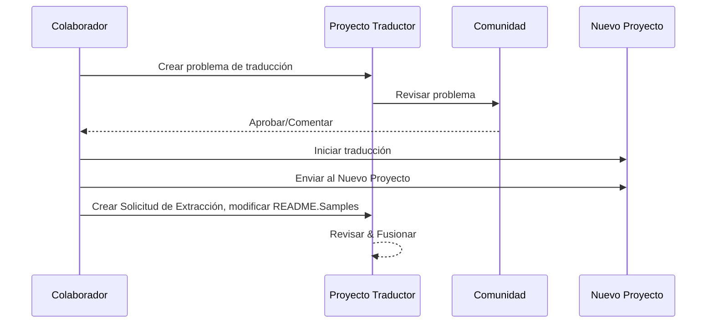

# Proyecto Traductor

Una extensión de VSCode: una herramienta fácil de usar para la localización multilingüe de proyectos.

<!--
## Traducciones Disponibles

La extensión admite traducción a estos idiomas:

- [简体中文 (zh-cn)](./README.zh-cn.md)
- [繁體中文 (zh-tw)](./README.zh-tw.md)
- [日本語 (ja-jp)](./README.ja-jp.md)
- [한국어 (ko-kr)](./README.ko-kr.md)
- [Français (fr-fr)](./README.fr-fr.md)
- [Deutsch (de-de)](./README.de-de.md)
- [Español (es-es)](./README.es-es.md)
- [Português (pt-br)](./README.pt-br.md)
- [Русский (ru-ru)](./README.ru-ru.md)
- [العربية (ar-sa)](./README.ar-sa.md)
- [العربية (ar-ae)](./README.ar-ae.md)
- [العربية (ar-eg)](./README.ar-eg.md) -->

## Ejemplos

| Proyecto                                                                             | Repositorio Original                                                                                       | Descripción                                                                                                                                                               | Estrellas | Etiquetas                                                                                                                                                                                                                                                                                                                                                                                                                                                                                                                                                                                                                                                            |
| ----------------------------------------------------------------------------------- | --------------------------------------------------------------------------------------------------------- | ------------------------------------------------------------------------------------------------------------------------------------------------------------------------- | ----- | -------------------------------------------------------------------------------------------------------------------------------------------------------------------------------------------------------------------------------------------------------------------------------------------------------------------------------------------------------------------------------------------------------------------------------------------------------------------------------------------------------------------------------------------------------------------------------------------------------------------------------------------------------------------- |
| [algorithm-visualizer](https://github.com/Project-Translation/algorithm-visualizer) | [algorithm-visualizer/algorithm-visualizer](https://github.com/algorithm-visualizer/algorithm-visualizer) | :fireworks:Plataforma en línea interactiva que visualiza algoritmos desde código                                                                                            | 47301 | [`algoritmo`](https://github.com/topics/algoritmo), [`animación`](https://github.com/topics/animacion), [`estructura-de-datos`](https://github.com/topics/estructura-de-datos), [`visualización`](https://github.com/topics/visualizacion)                                                                                                                                                                                                                                                                                                                                                                                                                                |
| [algorithms](https://github.com/Project-Translation/algorithms)                     | [algorithm-visualizer/algorithms](https://github.com/algorithm-visualizer/algorithms)                     | :crystal_ball:Visualizaciones de algoritmos                                                                                                                               | 401   | N/A                                                                                                                                                                                                                                                                                                                                                                                                                                                                                                                                                                                                                                                                  |
| [cline-docs](https://github.com/Project-Translation/cline-docs)                     | [cline/cline](https://github.com/cline/cline)                                                             | Agente de codificación autónomo directamente en tu IDE, capaz de crear/editar archivos, ejecutar comandos, usar el navegador y más con tu permiso en cada paso del proceso. | 39572 | N/A                                                                                                                                                                                                                                                                                                                                                                                                                                                                                                                                                                                                                                                                  |
| [cursor-docs](https://github.com/Project-Translation/cursor-docs)                   | [getcursor/docs](https://github.com/getcursor/docs)                                                       | Documentación de código abierto de Cursor                                                                                                                                  | 309   | N/A                                                                                                                                                                                                                                                                                                                                                                                                                                                                                                                                                                                                                                                                  |
| [gobyexample](https://github.com/Project-Translation/gobyexample)                   | [mmcgrana/gobyexample](https://github.com/mmcgrana/gobyexample)                                           | Go por ejemplo                                                                                                                                                            | 7523  | N/A                                                                                                                                                                                                                                                                                                                                                                                                                                                                                                                                                                                                                                                                  |
| [golang-website](https://github.com/Project-Translation/golang-website)             | [golang/website](https://github.com/golang/website)                                                       | [espejo] Hogar de los sitios web go.dev y golang.org                                                                                                                       | 402   | N/A                                                                                                                                                                                                                                                                                                                                                                                                                                                                                                                                                                                                                                                                  |
| [reference-en-us](https://github.com/Project-Translation/reference-en-us)           | [Fechin/reference](https://github.com/Fechin/reference)                                                   | ⭕ Comparte hojas de referencia rápidas para desarrolladores.                                                                                                              | 7808  | [`awk`](https://github.com/topics/awk), [`bash`](https://github.com/topics/bash), [`chatgpt`](https://github.com/topics/chatgpt), [`hoja-de-chuleta`](https://github.com/topics/cheatsheet), [`hojas-de-chuleta`](https://github.com/topics/cheatsheets), [`css`](https://github.com/topics/css), [`golang`](https://github.com/topics/golang), [`grep`](https://github.com/topics/grep), [`markdown`](https://github.com/topics/markdown), [`python`](https://github.com/topics/python), [`referencia`](https://github.com/topics/reference), [`fragmentos`](https://github.com/topics/snippets), [`vim`](https://github.com/topics/vim) |
| [styleguide](https://github.com/Project-Translation/styleguide)                     | [google/styleguide](https://github.com/google/styleguide)                                                 | Guías de estilo para proyectos de código abierto originados en Google                                                                                                      | 38055 | [`cpplint`](https://github.com/topics/cpplint), [`guia-de-estilo`](https://github.com/topics/style-guide), [`guia-de-estilos`](https://github.com/topics/styleguide)                                                                                                                                                                                                                                                                                                                                                                                                                                                                                                 |
| [vscode-docs](https://github.com/Project-Translation/vscode-docs)                   | [microsoft/vscode-docs](https://github.com/microsoft/vscode-docs)                                         | Documentación pública para Visual Studio Code                                                                                                                             | 5914  | [`vscode`](https://github.com/topics/vscode)                                                                                                                                                                                                                                                                                                                                                                                                                                                                                                                                                                                                                         |

## Solicitud de Traducción de Proyecto

Si deseas contribuir con una traducción o necesitas que se traduzca un proyecto:

1. Crea un problema usando la siguiente plantilla:

```md
**Proyecto**: [project_url]
**Idioma objetivo**: [target_lang]
**Descripción**: Breve descripción de por qué esta traducción sería valiosa
```

2. Flujo de trabajo:



3. Después de fusionar la solicitud de extracción, la traducción se agregará a la sección de Ejemplos.

Traducciones actuales en progreso: [Ver Problemas](https://github.com/Project-Translation/project_translator/issues)

## Características

- 📁 Soporte de Traducción a Nivel de Carpeta
  - Traducir carpetas completas de proyectos a múltiples idiomas
  - Mantener la estructura original de carpetas y jerarquía
  - Soporte para traducción recursiva de subcarpetas
  - Detección automática de contenido traducible
  - Procesamiento por lotes para traducciones eficientes a gran escala
- 📄 Soporte de Traducción a Nivel de Archivo
  - Traducir archivos individuales a múltiples idiomas
  - Preservar la estructura y formato originales del archivo
  - Soporte para modos de traducción de carpeta y archivo
- 💡 Traducción Inteligente con IA
  - Mantiene automáticamente la integridad de la estructura del código
  - Solo traduce comentarios de código, preserva la lógica del código
  - Mantiene formatos de estructuras de datos JSON/XML y otros
  - Calidad profesional en la traducción de documentación técnica
- ⚙️ Configuración Flexible
  - Configurar carpeta de origen y múltiples carpetas de destino
  - Soporte para intervalos personalizados de traducción de archivos
  - Establecer tipos específicos de archivos para ignorar
  - Soporte para múltiples opciones de modelos de IA
- 🚀 Operaciones Amigables
  - Visualización en tiempo real del progreso de traducción
  - Soporte para pausar/reanudar/detener la traducción
  - Mantenimiento automático de la estructura de carpetas de destino
  - Traducción incremental para evitar trabajo duplicado
- 🔄 Aplicación Avanzada de Traducción por Diferencias
  - **Actualizaciones Precisas**: Solo traduce contenido que realmente haya cambiado
  - **Control Línea por Línea**: Mantiene exactamente el formato y estructura
  - **Traducción Incremental**: Perfecta para mantener documentación traducida
  - **Amigable con Control de Versiones**: Genera cambios mínimos y específicos
  - **Eficiente en Costos**: Reduce llamadas a API traduciendo solo diferencias
  - **Copia de Seguridad Automática**: Crea automáticamente archivos de respaldo antes de aplicar cambios

## Instalación

1. Busca "[Proyecto Traductor](https://marketplace.visualstudio.com/items?itemName=techfetch-dev.project-translator)" en el mercado de extensiones de VS Code
2. Haz clic en instalar

## Configuración

La extensión admite las siguientes opciones de configuración:

```json
{
  "projectTranslator.specifiedFolders": [
    {
      "sourceFolder": {
        "path": "Ruta de la carpeta de origen",
        "lang": "Código de idioma de origen"
      },
      "targetFolders": [
        {
          "path": "Ruta de la carpeta de destino",
          "lang": "Código de idioma de destino"
        }
      ]
    }
  ],
  "projectTranslator.diffApply": {
    "enabled": true,
    "validationLevel": "normal",
    "autoBackup": true,
    "maxOperationsPerFile": 100
  },
  "projectTranslator.specifiedFiles": [
    {
      "sourceFile": {
        "path": "Ruta del archivo de origen",
        "lang": "Código de idioma de origen"
      },
      "targetFiles": [
        {
          "path": "Ruta del archivo de destino",
          "lang": "Código de idioma de destino"
        }
      ]
    }
  ],
  "projectTranslator.currentVendor": "openai",
  "projectTranslator.vendors": [
    {
      "name": "openai",
      "apiEndpoint": "URL del punto final de la API",
      "apiKey": "Clave de autenticación de API",
      "model": "Nombre del modelo a utilizar",
      "rpm": "Máximas solicitudes por minuto",
      "maxTokensPerSegment": 4096,
      "timeout": 30,
      "temperature": 0.0
    }
  ]
}
```

Detalles clave de configuración:

| Opción de Configuración                        | Descripción                                                                                    |
| ------------------------------------------- | ---------------------------------------------------------------------------------------------- |
| `projectTranslator.specifiedFolders`        | Múltiples carpetas de origen con sus correspondientes carpetas de destino para traducción     |
| `projectTranslator.specifiedFiles`          | Múltiples archivos de origen con sus correspondientes archivos de destino para traducción     |
| `projectTranslator.translationIntervalDays` | Intervalo de traducción en días (por defecto 7 días)                                          |
| `projectTranslator.copyOnly`                | Archivos a copiar pero no traducir (con matrices `paths` y `extensions`)                       |
| `projectTranslator.ignore`                  | Archivos a ignorar completamente (con matrices `paths` y `extensions`)                         |
| `projectTranslator.currentVendor`           | Proveedor de API actual en uso                                                                 |
| `projectTranslator.vendors`                 | Lista de configuración de proveedores de API                                                   |
| `projectTranslator.systemPrompts`           | Matriz de indicaciones del sistema para guiar el proceso de traducción                         |
| `projectTranslator.userPrompts`             | Matriz de indicaciones definidas por el usuario, que se agregarán después de las del sistema durante la traducción |
| `projectTranslator.segmentationMarkers`     | Marcadores de segmentación configurados por tipo de archivo, admite expresiones regulares     |
| `projectTranslator.debug`                   | Habilita el modo de depuración para registrar todas las solicitudes y respuestas de API en el canal de salida (por defecto: falso) |
| `projectTranslator.logFile`                 | Configuración para archivos de registro de depuración (ver [Característica de Registro](./docs/log-file-feature.md)) |

## Uso

1. Abre la paleta de comandos (Ctrl+Shift+P / Cmd+Shift+P)
2. Escribe "Traducir Proyecto" y selecciona el comando
3. Si no está configurada la carpeta de origen, aparecerá un diálogo de selección
4. Espera a que termine la traducción

Durante la traducción:

- Puedes pausar/reanudar la traducción mediante botones en la barra de estado
- Puedes detener el proceso en cualquier momento
- El progreso de traducción se muestra en el área de notificación
- Registros detallados se muestran en el panel de salida

## Desarrollo

### Sistema de Construcción

Esta extensión usa esbuild para empaquetado rápido y desarrollo:

#### Scripts Disponibles

- `npm run build` - Construcción para producción con minimización
- `npm run compile` - Construcción para desarrollo
- `npm run watch` - Modo de observación para desarrollo
- `npm test` - Ejecutar pruebas

#### Tareas de VS Code

- **Construir** (Ctrl+Shift+P → "Tareas: Ejecutar Tarea" → "build") - Empaqueta la extensión para producción
- **Observar** (Ctrl+Shift+P → "Tareas: Ejecutar Tarea" → "watch") - Modo de desarrollo con reconstrucción automática

### Configuración de Desarrollo

1. Clona el repositorio
2. Ejecuta `npm install` para instalar dependencias
3. Presiona `F5` para iniciar la depuración o ejecuta la tarea "watch" para desarrollo

La configuración de esbuild:

- Empaqueta todos los archivos TypeScript en un único `out/extension.js`
- Excluye la API de VS Code (marcada como externa)

## Características Avanzadas

### Aplicación de Traducción por Diferencias

Para información detallada sobre el modo avanzado de traducción por diferencia, consulta la [Guía de Uso de Aplicación por Diferencias](./docs/diff-apply-usage.md).

Esta característica permite:
- Actualizaciones precisas línea por línea
- Reducción de costos de API para archivos grandes
- Mejor integración con control de versiones
- Preservación del formato del documento

### Documentación de Diseño

Para detalles técnicos sobre la implementación de aplicación por diferencias, consulta el [Diseño de Traducción por Diferencias](./docs/diff-apply-translation-design.md).
- Genera mapas de origen para construcciones de desarrollo
- Minifica código para construcciones de producción
- Proporciona integración con verificador de problemas para VS Code

## Notas

- Asegúrate de tener suficiente cuota de uso de API
- Se recomienda probar primero con proyectos pequeños
- Usa claves API dedicadas y elimínalas después de completar el trabajo

## Licencia

[Licencia](LICENSE)