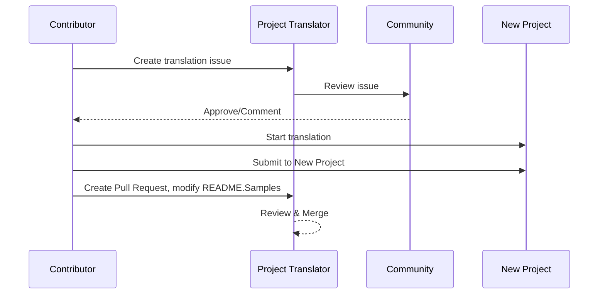

# Traductor de Proyectos

Una extensión de VSCode: Una herramienta fácil de usar para la localización multilingüe de proyectos.

<!--
## Traducciones Disponibles

La extensión soporta traducción a estos idiomas:

- [Chino simplificado (zh-cn)](./README.zh-cn.md)
- [Chino tradicional (zh-tw)](./README.zh-tw.md)
- [Japonés (ja-jp)](./README.ja-jp.md)
- [Coreano (ko-kr)](./README.ko-kr.md)
- [Francés (fr-fr)](./README.fr-fr.md)
- [Alemán (de-de)](./README.de-de.md)
- [Español (es-es)](./README.es-es.md)
- [Portugués (pt-br)](./README.pt-br.md)
- [Ruso (ru-ru)](./README.ru-ru.md)
- [Árabe (ar-sa)](./README.ar-sa.md)
- [Árabe (ar-ae)](./README.ar-ae.md)
- [Árabe (ar-eg)](./README.ar-eg.md) -->

## Ejemplos

| Proyecto                                                                             | Repositorio Original                                                                                       | Descripción                                                                                                                                                               | Estrellas | Etiquetas                                                                                                                                                                                                                                                                                                                                                                                                                                                                                                                                                                                                                                                                 |
| ----------------------------------------------------------------------------------- | --------------------------------------------------------------------------------------------------------- | ------------------------------------------------------------------------------------------------------------------------------------------------------------------------- | --------- | -------------------------------------------------------------------------------------------------------------------------------------------------------------------------------------------------------------------------------------------------------------------------------------------------------------------------------------------------------------------------------------------------------------------------------------------------------------------------------------------------------------------------------------------------------------------------------------------------------------------------------------------------------------------------- |
| [algorithm-visualizer](https://github.com/Project-Translation/algorithm-visualizer) | [algorithm-visualizer/algorithm-visualizer](https://github.com/algorithm-visualizer/algorithm-visualizer) | :fireworks:Plataforma en línea interactiva que visualiza algoritmos a partir de código                                                                                   | 47301    | [`algorithm`](https://github.com/topics/algorithm), [`animation`](https://github.com/topics/animation), [`data-structure`](https://github.com/topics/data-structure), [`visualization`](https://github.com/topics/visualization)                                                                                                                                                                                                                                                                                                                                                                                                                                       |
| [algorithms](https://github.com/Project-Translation/algorithms)                     | [algorithm-visualizer/algorithms](https://github.com/algorithm-visualizer/algorithms)                     | :crystal_ball:Visualizaciones de algoritmos                                                                                                                                 | 401      | N/A                                                                                                                                                                                                                                                                                                                                                                                                                                                                                                                                                                                                                                                                      |
| [cline-docs](https://github.com/Project-Translation/cline-docs)                     | [cline/cline](https://github.com/cline/cline)                                                             | Agente de codificación autónomo directamente en tu IDE, capaz de crear/editar archivos, ejecutar comandos, usar el navegador y más con tu permiso en cada paso.           | 39572    | N/A                                                                                                                                                                                                                                                                                                                                                                                                                                                                                                                                                                                                                                                                      |
| [cursor-docs](https://github.com/Project-Translation/cursor-docs)                   | [getcursor/docs](https://github.com/getcursor/docs)                                                       | Documentación de código abierto de Cursor                                                                                                                                 | 309      | N/A                                                                                                                                                                                                                                                                                                                                                                                                                                                                                                                                                                                                                                                                      |
| [gobyexample](https://github.com/Project-Translation/gobyexample)                   | [mmcgrana/gobyexample](https://github.com/mmcgrana/gobyexample)                                           | Go by Example                                                                                                                                                             | 7523     | N/A                                                                                                                                                                                                                                                                                                                                                                                                                                                                                                                                                                                                                                                                      |
| [golang-website](https://github.com/Project-Translation/golang-website)             | [golang/website](https://github.com/golang/website)                                                       | [espejo] Sitio web oficial de go.dev y golang.org                                                                                                                        | 402      | N/A                                                                                                                                                                                                                                                                                                                                                                                                                                                                                                                                                                                                                                                                      |
| [reference-en-us](https://github.com/Project-Translation/reference-en-us)           | [Fechin/reference](https://github.com/Fechin/reference)                                                   | ⭕ Hoja de referencia rápida para desarrolladores.                                                                                                                        | 7808     | [`awk`](https://github.com/topics/awk), [`bash`](https://github.com/topics/bash), [`chatgpt`](https://github.com/topics/chatgpt), [`cheatsheet`](https://github.com/topics/cheatsheet), [`cheatsheets`](https://github.com/topics/cheatsheets), [`css`](https://github.com/topics/css), [`golang`](https://github.com/topics/golang), [`grep`](https://github.com/topics/grep), [`markdown`](https://github.com/topics/markdown), [`python`](https://github.com/topics/python), [`reference`](https://github.com/topics/reference), [`sed`](https://github.com/topics/sed), [`snippets`](https://github.com/topics/snippets), [`vim`](https://github.com/topics/vim) |
| [styleguide](https://github.com/Project-Translation/styleguide)                     | [google/styleguide](https://github.com/google/styleguide)                                                 | Guías de estilo para proyectos de código abierto originados en Google                                                                                                    | 38055    | [`cpplint`](https://github.com/topics/cpplint), [`style-guide`](https://github.com/topics/style-guide), [`styleguide`](https://github.com/topics/styleguide)                                                                                                                                                                                                                                                                                                                                                                                                                                                                                                           |
| [vscode-docs](https://github.com/Project-Translation/vscode-docs)                   | [microsoft/vscode-docs](https://github.com/microsoft/vscode-docs)                                         | Documentación pública para Visual Studio Code                                                                                                                            | 5914     | [`vscode`](https://github.com/topics/vscode)                                                                                                                                                                                                                                                                                                                                                                                                                                                                                                                                                                                                                           |

## Solicitud de Traducción de Proyecto

Si deseas contribuir con una traducción o necesitas que se traduzca un proyecto:

1. Crea un issue usando la siguiente plantilla:

```md
**Project**: [project_url]
**Target Language**: [target_lang]
**Description**: Breve descripción de por qué esta traducción sería valiosa
```

2. Flujo de trabajo:



3. Después de que se fusione el PR, la traducción se agregará a la sección de Ejemplos.

Traducciones en progreso actuales: [Ver Issues](https://github.com/Project-Translation/project_translator/issues)

## Características

- 📁 Soporte de Traducción a Nivel de Carpeta
  - Traduce carpetas de proyectos enteras a múltiples idiomas
  - Mantiene la estructura y jerarquía de carpetas original
  - Soporte para traducción recursiva de subcarpetas
  - Detección automática de contenido traducible
  - Procesamiento por lotes para traducciones a gran escala eficientes
- 📄 Soporte de Traducción a Nivel de Archivo
  - Traduce archivos individuales a múltiples idiomas
  - Preserva la estructura y formato original del archivo
  - Soporte para modos de traducción de carpetas y archivos
- 💡 Traducción Inteligente con IA
  - Mantiene automáticamente la integridad de la estructura del código
  - Solo traduce comentarios de código, preserva la lógica del código
  - Mantiene formatos de JSON/XML y otras estructuras de datos
  - Calidad profesional en la traducción de documentación técnica
- ⚙️ Configuración Flexible
  - Configura carpeta de origen y múltiples carpetas de destino
  - Soporte para intervalos personalizados de traducción de archivos
  - Establece tipos de archivos específicos para ignorar
  - Soporte para múltiples opciones de modelos de IA
- 🚀 Operaciones Fáciles de Usar
  - Muestra el progreso de traducción en tiempo real
  - Soporte para pausar/reanudar/detener la traducción
  - Mantenimiento automático de la estructura de la carpeta de destino
  - Traducción incremental para evitar trabajo duplicado

## Instalación

1. Busca "[Traductor de Proyectos](https://marketplace.visualstudio.com/items?itemName=techfetch-dev.project-translator)" en el marketplace de extensiones de VS Code
2. Haz clic en instalar

## Configuración

La extensión soporta las siguientes opciones de configuración:

```json
{
  "projectTranslator.specifiedFolders": [
    {
      "sourceFolder": {
        "path": "Ruta de la carpeta de origen",
        "lang": "Código de idioma de origen"
      },
      "destFolders": [
        {
          "path": "Ruta de la carpeta de destino",
          "lang": "Código de idioma de destino"
        }
      ]
    }
  ],
  "projectTranslator.specifiedFiles": [
    {
      "sourceFile": {
        "path": "Ruta del archivo de origen",
        "lang": "Código de idioma de origen"
      },
      "destFiles": [
        {
          "path": "Ruta del archivo de destino",
          "lang": "Código de idioma de destino"
        }
      ]
    }
  ],
  "projectTranslator.currentVendor": "openai",
  "projectTranslator.vendors": [
    {
      "name": "openai",
      "apiEndpoint": "URL del punto de conexión de la API",
      "apiKey": "Clave de autenticación de la API",
      "model": "Nombre del modelo a usar",
      "rpm": "Máximo de solicitudes por minuto",
      "maxTokensPerSegment": 4096,
      "timeout": 30,
      "temperature": 0.0
    }
  ]
}
```

Detalles clave de configuración:

| Opción de Configuración                          | Descripción                                                                                    |
| ------------------------------------------------ | ---------------------------------------------------------------------------------------------- |
| `projectTranslator.specifiedFolders`             | Múltiples carpetas de origen con sus carpetas de destino correspondientes para traducción       |
| `projectTranslator.specifiedFiles`               | Múltiples archivos de origen con sus archivos de destino correspondientes para traducción       |
| `projectTranslator.translationIntervalDays`      | Intervalo de traducción en días (por defecto 7 días)                                           |
| `projectTranslator.ignoreTranslationExtensions`  | Lista de extensiones de archivos de texto que no necesitan traducción, estos se copiarán directamente |
| `projectTranslator.ignorePaths`                  | Lista de patrones de rutas ignoradas usando sintaxis glob, estos archivos no se copiarán       |
| `projectTranslator.currentVendor`                | Proveedor de API actual en uso                                                                 |
| `projectTranslator.vendors`                      | Lista de configuración de proveedores de API                                                   |
| `projectTranslator.systemPrompts`                | Matriz de indicaciones del sistema para guiar el proceso de traducción                         |
| `projectTranslator.userPrompts`                  | Matriz de indicaciones definidas por el usuario, estas se agregarán después de las indicaciones del sistema durante la traducción |
| `projectTranslator.segmentationMarkers`          | Marcadores de segmentación configurados por tipo de archivo, soporta expresiones regulares     |

## Uso

1. Abre la paleta de comandos (Ctrl+Shift+P / Cmd+Shift+P)
2. Escribe "Translate Project" y selecciona el comando
3. Si no se ha configurado la carpeta de origen, aparecerá un diálogo de selección de carpeta
4. Espera a que se complete la traducción

Durante la traducción:

- Puedes pausar/reanudar la traducción a través de los botones de la barra de estado
- Puedes detener el proceso de traducción en cualquier momento
- El progreso de traducción se muestra en el área de notificaciones
- Los registros detallados se muestran en el panel de salida

## Notas

- Asegúrate de tener cuota suficiente de uso de API
- Se recomienda probar primero con proyectos pequeños
- Usa claves de API dedicadas y eliminaas después de completar

## Licencia

[Licencia](LICENSE)