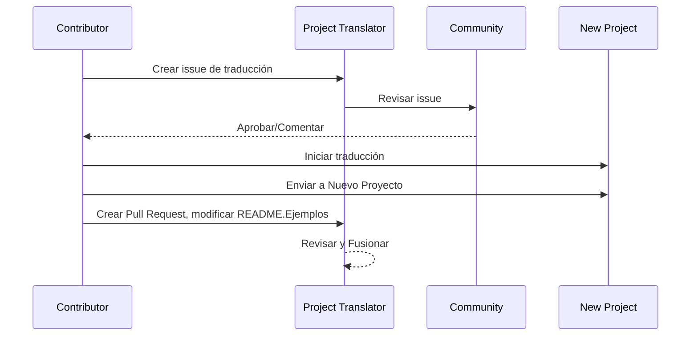

# Traductor de Proyectos

Una extensión de VSCode: Una herramienta fácil de usar para la localización multilingüe de proyectos.

## Traducciones Disponibles

La extensión soporta la traducción a estos idiomas:

- [简体中文 (zh-cn)](./readmes/README.zh-cn.md)
- [繁體中文 (zh-tw)](./readmes/README.zh-tw.md)
- [日本語 (ja-jp)](./readmes/README.ja-jp.md)
- [한국어 (ko-kr)](./readmes/README.ko-kr.md)
- [Français (fr-fr)](./readmes/README.fr-fr.md)
- [Deutsch (de-de)](./readmes/README.de-de.md)
- [Español (es-es)](./readmes/README.es-es.md)
- [Português (pt-br)](./readmes/README.pt-br.md)
- [Русский (ru-ru)](./readmes/README.ru-ru.md)
- [العربية (ar-sa)](./readmes/README.ar-sa.md)
- [العربية (ar-ae)](./readmes/README.ar-ae.md)
- [العربية (ar-eg)](./readmes/README.ar-eg.md)

## Ejemplos

| Proyecto                                                  | Idiomas                                                                                                                                                 |
| --------------------------------------------------------- | --------------------------------------------------------------------------------------------------------------------------------------------------------- |
| [google/styleguide](https://github.com/google/styleguide) | [en-us](https://github.com/google/styleguide) original por @google<br>[zh-cn](https://github.com/Project-Translation/styleguide-zh-cn) traducido por @jqknono |

## Solicitar Traducción de Proyecto

Si deseas contribuir con una traducción o necesitas que se traduzca un proyecto:

1. Crea un issue usando la siguiente plantilla:

```md
**Proyecto**: [project_url]
**Idioma Objetivo**: [target_lang]
**Descripción**: Breve descripción de por qué esta traducción sería valiosa
```

2. Flujo de trabajo:



3. Después de que se fusione el PR, la traducción se añadirá a la sección de Ejemplos.

Traducciones en curso: [Ver Issues](https://github.com/Project-Translation/project_translator/issues)

## Características
- 📁 Soporte de traducción a nivel de carpeta
  - Traducir carpetas de proyectos completas a múltiples idiomas
  - Mantener la estructura y jerarquía original de la carpeta
  - Soporte para traducción recursiva de subcarpetas
  - Detección automática de contenido traducible
  - Procesamiento por lotes para traducciones a gran escala eficientes
- 📄 Soporte de traducción a nivel de archivo
  - Traducir archivos individuales a múltiples idiomas
  - Preservar la estructura y formato original del archivo
  - Soporte para modos de traducción de carpetas y archivos
- 💡 Traducción inteligente con IA
  - Mantiene automáticamente la integridad de la estructura del código
  - Solo traduce comentarios de código, preserva la lógica del código
  - Mantiene formatos de estructuras de datos como JSON/XML
  - Calidad de traducción de documentación técnica profesional
- ⚙️ Configuración flexible
  - Configurar la carpeta de origen y múltiples carpetas de destino
  - Soporte para intervalos de traducción de archivos personalizados
  - Establecer tipos de archivos específicos para ignorar
  - Soporte para múltiples opciones de modelos de IA
- 🚀 Operaciones fáciles de usar
  - Mostrar el progreso de la traducción en tiempo real
  - Soporte para pausar/reanudar/detener la traducción
  - Mantenimiento automático de la estructura de la carpeta de destino
  - Traducción incremental para evitar trabajo duplicado

## Instalación

1. Busca "[Project Translator](https://marketplace.visualstudio.com/items?itemName=techfetch-dev.project-translator)" en el mercado de extensiones de VS Code
2. Haz clic en instalar

## Configuración

La extensión soporta las siguientes opciones de configuración:

```json
{
  "projectTranslator.specifiedFolders": [
    {
      "sourceFolder": {
        "path": "Ruta de la carpeta de origen",
        "lang": "Código de idioma de origen"
      },
      "destFolders": [
        {
          "path": "Ruta de la carpeta de destino",
          "lang": "Código de idioma de destino"
        }
      ]
    }
  ],
  "projectTranslator.specifiedFiles": [
    {
      "sourceFile": {
        "path": "Ruta del archivo de origen",
        "lang": "Código de idioma de origen"
      },
      "destFiles": [
        {
          "path": "Ruta del archivo de destino",
          "lang": "Código de idioma de destino"
        }
      ]
    }
  ],
  "projectTranslator.currentVendor": "openai",
  "projectTranslator.vendors": [
    {
      "name": "openai",
      "apiEndpoint": "URL del punto final de la API",
      "apiKey": "Clave de autenticación de la API",
      "model": "Nombre del modelo a usar",
      "rpm": "Máximo de solicitudes por minuto",
      "maxTokensPerSegment": 4096,
      "timeout": 30,
      "temperature": 0.0
    }
  ]
}
```

Detalles clave de la configuración:
| Opción de configuración                        | Descripción                                                                                    |
| ----------------------------------------------- | ---------------------------------------------------------------------------------------------- |
| `projectTranslator.specifiedFolders`            | Carpetas de origen múltiples con sus correspondientes carpetas de destino para la traducción   |
| `projectTranslator.specifiedFiles`              | Archivos de origen múltiples con sus correspondientes archivos de destino para la traducción   |
| `projectTranslator.translationIntervalDays`     | Intervalo de traducción en días (por defecto 7 días)                                          |
| `projectTranslator.ignoreTranslationExtensions` | Lista de extensiones de archivos de texto que no necesitan traducción, estos archivos se copiarán directamente  |
| `projectTranslator.ignorePaths`                 | Lista de patrones de rutas ignorados usando comodines, estos archivos no se copiarán           |
| `projectTranslator.currentVendor`               | Proveedor de API actual en uso                                                                |
| `projectTranslator.vendors`                     | Lista de configuración de proveedores de API                                                  |
| `projectTranslator.systemPrompts`               | Matriz de prompts del sistema para guiar el proceso de traducción                             |
| `projectTranslator.userPrompts`                 | Matriz de prompts definidos por el usuario, estos prompts se añadirán después de los prompts del sistema durante la traducción |
| `projectTranslator.segmentationMarkers`         | Marcadores de segmentación configurados por tipo de archivo, soporta expresiones regulares     |

## Uso

1. Abrir la paleta de comandos (Ctrl+Shift+P / Cmd+Shift+P)
2. Escribir "Traducir Proyecto" y seleccionar el comando
3. Si la carpeta de origen no está configurada, aparecerá un diálogo de selección de carpeta
4. Esperar a que la traducción se complete

Durante la traducción:

- Se puede pausar/reanudar la traducción mediante los botones de la barra de estado
- Se puede detener el proceso de traducción en cualquier momento
- El progreso de la traducción se muestra en el área de notificaciones
- Los registros detallados se muestran en el panel de salida

## Notas

- Asegurarse de tener un cupo de uso de API suficiente
- Se recomienda probar primero con proyectos pequeños
- Usar claves de API dedicadas y eliminarlas después de la finalización

## Licencia

[Licencia](LICENSE)