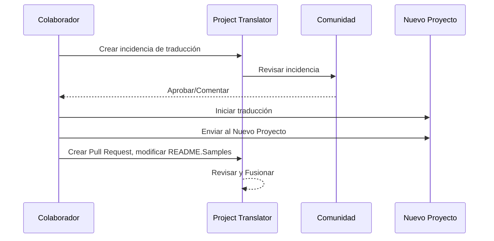

# Project Translator

Una extensión de vscode fácil de usar para la localización multilingüe de proyectos.

Repositorio del proyecto: `https://github.com/Project-Translation/project_translator`

<!--  -->


## Traducciones disponibles

La extensión admite la traducción a estos idiomas:

- [简体中文 (zh-cn)](./readmes/README.zh-cn.md)
- [繁體中文 (zh-tw)](./readmes/README.zh-tw.md)
- [日本語 (ja-jp)](./readmes/README.ja-jp.md)
- [한국어 (ko-kr)](./readmes/README.ko-kr.md)
- [Français (fr-fr)](./readmes/README.fr-fr.md)
- [Deutsch (de-de)](./readmes/README.de-de.md)
- [Español (es-es)](./readmes/README.es-es.md)
- [Português (pt-br)](./readmes/README.pt-br.md)
- [Русский (ru-ru)](./readmes/README.ru-ru.md)
- [العربية (ar-sa)](./readmes/README.ar-sa.md)
- [العربية (ar-ae)](./readmes/README.ar-ae.md)
- [العربية (ar-eg)](./readmes/README.ar-eg.md)

## Ejemplos

| Proyecto                                                                             | Repositorio Original                                                                                       | Descripción                                                                                                                                                               | Estrellas | Etiquetas                                                                                                                                                                                                                                                                                                                                                                                                                                                                                                                                                                                                                                                                 |
| ----------------------------------------------------------------------------------- | --------------------------------------------------------------------------------------------------------- | ------------------------------------------------------------------------------------------------------------------------------------------------------------------------- | --------- | -------------------------------------------------------------------------------------------------------------------------------------------------------------------------------------------------------------------------------------------------------------------------------------------------------------------------------------------------------------------------------------------------------------------------------------------------------------------------------------------------------------------------------------------------------------------------------------------------------------------------------------------------------------------- |
| [algorithm-visualizer](https://github.com/Project-Translation/algorithm-visualizer) | [algorithm-visualizer/algorithm-visualizer](https://github.com/algorithm-visualizer/algorithm-visualizer) | :fireworks:Plataforma interactiva en línea que visualiza algoritmos a partir del código                                                                                   | 47301     | [`algorithm`](https://github.com/topics/algorithm), [`animation`](https://github.com/topics/animation), [`data-structure`](https://github.com/topics/data-structure), [`visualization`](https://github.com/topics/visualization)                                                                                                                                                                                                                                                                                                                                                                                                                                     |
| [algorithms](https://github.com/Project-Translation/algorithms)                     | [algorithm-visualizer/algorithms](https://github.com/algorithm-visualizer/algorithms)                     | :crystal_ball:Visualizaciones de algoritmos                                                                                                                                | 401       | N/A                                                                                                                                                                                                                                                                                                                                                                                                                                                                                                                                                                                                                                                                  |
| [cline-docs](https://github.com/Project-Translation/cline-docs)                     | [cline/cline](https://github.com/cline/cline)                                                             | Agente de codificación autónomo directamente en tu IDE, capaz de crear/editar archivos, ejecutar comandos, usar el navegador y más con tu permiso en cada paso del camino. | 39572     | N/A                                                                                                                                                                                                                                                                                                                                                                                                                                                                                                                                                                                                                                                                  |
| [cursor-docs](https://github.com/Project-Translation/cursor-docs)                   | [getcursor/docs](https://github.com/getcursor/docs)                                                       | Documentación de código abierto de Cursor                                                                                                                                 | 309       | N/A                                                                                                                                                                                                                                                                                                                                                                                                                                                                                                                                                                                                                                                                  |
| [gobyexample](https://github.com/Project-Translation/gobyexample)                   | [mmcgrana/gobyexample](https://github.com/mmcgrana/gobyexample)                                           | Go by Example                                                                                                                                                             | 7523      | N/A                                                                                                                                                                                                                                                                                                                                                                                                                                                                                                                                                                                                                                                                  |
| [golang-website](https://github.com/Project-Translation/golang-website)             | [golang/website](https://github.com/golang/website)                                                       | [espejo] Hogar de los sitios web go.dev y golang.org                                                                                                                       | 402       | N/A                                                                                                                                                                                                                                                                                                                                                                                                                                                                                                                                                                                                                                                                  |
| [reference-en-us](https://github.com/Project-Translation/reference-en-us)           | [Fechin/reference](https://github.com/Fechin/reference)                                                   | ⭕ Comparte hojas de referencia rápida (cheat sheets) para desarrolladores.                                                                                                | 7808      | [`awk`](https://github.com/topics/awk), [`bash`](https://github.com/topics/bash), [`chatgpt`](https://github.com/topics/chatgpt), [`cheatsheet`](https://github.com/topics/cheatsheet), [`cheatsheets`](https://github.com/topics/cheatsheets), [`css`](https://github.com/topics/css), [`golang`](https://github.com/topics/golang), [`grep`](https://github.com/topics/grep), [`markdown`](https://github.com/topics/markdown), [`python`](https://github.com/topics/python), [`reference`](https://github.com/topics/reference), [`sed`](https://github.com/topics/sed), [`snippets`](https://github.com/topics/snippets), [`vim`](https://github.com/topics/vim) |
| [styleguide](https://github.com/Project-Translation/styleguide)                     | [google/styleguide](https://github.com/google/styleguide)                                                 | Guías de estilo para proyectos de código abierto originados por Google                                                                                                     | 38055     | [`cpplint`](https://github.com/topics/cpplint), [`style-guide`](https://github.com/topics/style-guide), [`styleguide`](https://github.com/topics/styleguide)                                                                                                                                                                                                                                                                                                                                                                                                                                                                                                         |
| [vscode-docs](https://github.com/Project-Translation/vscode-docs)                   | [microsoft/vscode-docs](https://github.com/microsoft/vscode-docs)                                         | Documentación pública para Visual Studio Code                                                                                                                              | 5914      | [`vscode`](https://github.com/topics/vscode)                                                                                                                                                                                                                                                                                                                                                                                                                                                                                                                                                                                                                         |

## Solicitar la traducción de un proyecto

Si quieres contribuir con una traducción o necesitas que un proyecto sea traducido:

1. Crea una incidencia (issue) usando la siguiente plantilla:

```md
**Proyecto**: [project_url]
**Idioma de destino**: [target_lang]
**Descripción**: Breve descripción de por qué esta traducción sería valiosa
```

2. Flujo de trabajo:



3. Después de que el PR se fusione, la traducción se añadirá a la sección Ejemplos.

Traducciones actualmente en progreso: [Ver Incidencias](https://github.com/Project-Translation/project_translator/issues)

## Características

- 📁 Soporte de traducción a nivel de carpeta
  - Traduce carpetas de proyectos completas a múltiples idiomas
  - Mantiene la estructura y jerarquía de carpetas original
  - Soporte para traducción recursiva de subcarpetas
  - Detección automática de contenido traducible
  - Procesamiento por lotes para traducciones a gran escala eficientes
- 📄 Soporte de traducción a nivel de archivo
  - Traduce archivos individuales a múltiples idiomas
  - Preserva la estructura y formato de archivos original
  - Soporte para modos de traducción de carpeta y archivo
- 💡 Traducción inteligente con IA
  - Mantiene automáticamente la integridad de la estructura del código
  - Traduce solo los comentarios del código, preserva la lógica del código
  - Mantiene formatos de estructura de datos como JSON/XML
  - Calidad de traducción profesional para documentación técnica
- ⚙️ Configuración flexible
  - Configura carpetas de origen y múltiples carpetas de destino
  - Soporte para intervalos de traducción de archivos personalizados
  - Establece tipos de archivo específicos para ignorar
  - Soporte para múltiples opciones de modelos de IA
- 🚀 Operaciones fáciles de usar
  - Visualización del progreso de la traducción en tiempo real
  - Soporte para pausar/reanudar/detener la traducción
  - Mantenimiento automático de la estructura de carpetas de destino
  - Traducción incremental para evitar trabajo duplicado
- 🔄 Traducción diferencial (Experimental)
  - Modo diff-apply para actualizaciones eficientes de traducciones existentes
  - Reduce el uso de la API al traducir solo el contenido modificado
  - Preserva el historial de versiones con ediciones mínimas
  - ⚠️ Función experimental - ver [Características Avanzadas](#diferencial-traducción-modo-diff-apply) para más detalles

## Instalación

1. Busca "[Project Translator](https://marketplace.visualstudio.com/items?itemName=techfetch-dev.project-translator)" en el mercado de extensiones de VS Code
2. Haz clic en instalar
   
Alternativamente, instala desde Visual Studio Marketplace: `https://marketplace.visualstudio.com/items?itemName=techfetch-dev.project-translator` o busca `techfetch-dev.project-translator` en la vista de Extensiones de VS Code.

## Configuración

La extensión admite las siguientes opciones de configuración:

```json
{
  "projectTranslator.specifiedFolders": [
    {
      "sourceFolder": {
        "path": "Ruta de la carpeta de origen",
        "lang": "Código del idioma de origen"
      },
      "targetFolders": [
        {
          "path": "Ruta de la carpeta de destino",
          "lang": "Código del idioma de destino"
        }
      ]
    }
  ],
  "projectTranslator.specifiedFiles": [
    {
      "sourceFile": {
        "path": "Ruta del archivo de origen",
        "lang": "Código del idioma de origen"
      },
      "targetFiles": [
        {
          "path": "Ruta del archivo de destino",
          "lang": "Código del idioma de destino"
        }
      ]
    }
  ],
  "projectTranslator.currentVendor": "openai",
  "projectTranslator.vendors": [
    {
      "name": "openai",
      "apiEndpoint": "URL del endpoint de la API",
      "apiKeyEnvVarName": "MY_OPENAI_API_KEY",
      "model": "gpt-4o",
      "rpm": "10",
      "maxTokensPerSegment": 4096,
      "timeout": 30,
      "temperature": 0.0
    }
  ],
  "projectTranslator.userPrompts": [
      "1. Should return no need translate if the markdown file has 'draft' set to 'true' in the front matter.",
      "2. './readmes/' in the sentences should replace with './'",
  ],
  "projectTranslator.ignore": {
    "paths": [
      "**/node_modules/**"
    ],
    "extensions": [
      ".log"
    ]
  },
}
```

Detalles clave de la configuración:

| Opción de Configuración                        | Descripción                                                                                    |
| ------------------------------------------- | ---------------------------------------------------------------------------------------------- |
| `projectTranslator.specifiedFolders`        | Múltiples carpetas de origen con sus carpetas de destino correspondientes para la traducción   |
| `projectTranslator.specifiedFiles`          | Múltiples archivos de origen con sus archivos de destino correspondientes para la traducción   |
| `projectTranslator.translationIntervalDays` | Intervalo de traducción en días (por defecto 7 días)                                           |
| `projectTranslator.copyOnly`                | Archivos para copiar pero no traducir (con arrays `paths` y `extensions`)                      |
| `projectTranslator.ignore`                  | Archivos para ignorar completamente (con arrays `paths` y `extensions`)                        |
| `projectTranslator.skipFrontMatterMarkers`  | Omitir archivos basándose en marcadores de front matter (con arrays `enabled` y `markers`)    |
| `projectTranslator.currentVendor`           | Proveedor de API actual en uso                                                                 |
| `projectTranslator.vendors`                 | Lista de configuración de proveedores de API (puede usar apiKey directamente o apiKeyEnvVarName para variables de entorno) |
| `projectTranslator.systemPrompts`           | Array de prompts del sistema para guiar el proceso de traducción                               |
| `projectTranslator.userPrompts`             | Array de prompts definidos por el usuario, estos prompts se añadirán después de los prompts del sistema durante la traducción |
| `projectTranslator.segmentationMarkers`     | Marcadores de segmentación configurados por tipo de archivo, soporta expresiones regulares      |
| `projectTranslator.debug`                   | Activar modo depuración para registrar todas las solicitudes y respuestas de la API en el canal de salida (por defecto: false) |
| `projectTranslator.logFile`                 | Configuración para archivos de registro de depuración (ver [Función de Archivo de Registro](./docs/log-file-feature.md)) |
| `projectTranslator.diffApply.enabled`       | Activar modo de traducción diferencial experimental (por defecto: false)                         |

## Uso

1. Abre la paleta de comandos (Ctrl+Shift+P / Cmd+Shift+P)
2. Escribe "Translate Project" y selecciona el comando
3. Si la carpeta de origen no está configurada, aparecerá un diálogo de selección de carpeta
4. Espera a que se complete la traducción

Durante la traducción:

- Se puede pausar/reanudar la traducción mediante los botones de la barra de estado
- Se puede detener el proceso de traducción en cualquier momento
- El progreso de la traducción se muestra en el área de notificaciones
- Los registros detallados se muestran en el panel de salida

## Desarrollo

### Sistema de compilación

Esta extensión utiliza esbuild para el empaquetado rápido y el desarrollo:

#### Scripts disponibles

- `npm run build` - Compilación para producción con minificación
- `npm run compile` - Compilación para desarrollo
- `npm run watch` - Modo vigilante para desarrollo
- `npm test` - Ejecutar pruebas

#### Tareas de VS Code

- **Build** (Ctrl+Shift+P → "Tasks: Run Task" → "build") - Empaqueta la extensión para producción
- **Watch** (Ctrl+Shift+P → "Tasks: Run Task" → "watch") - Modo de desarrollo con recompilación automática

### Configuración de desarrollo

1. Clona el repositorio
2. Ejecuta `npm install` para instalar las dependencias
3. Presiona `F5` para iniciar la depuración o ejecuta la tarea "watch" para el desarrollo

La configuración de esbuild:

- Empaqueta todos los archivos TypeScript en un único `out/extension.js`
- Excluye la API de VS Code (marcada como externa)

## Características Avanzadas

### Usar variables de entorno para las claves de API

Project Translator admite el uso de variables de entorno para las claves de API, un enfoque más seguro que almacenar las claves de API directamente en los archivos de configuración:

1. Configura tu proveedor con una propiedad `apiKeyEnvVarName`:

```json
{
  "projectTranslator.vendors": [
    {
      "name": "openai",
      "apiEndpoint": "https://api.openai.com/v1",
      "apiKeyEnvVarName": "OPENAI_API_KEY",
      "model": "gpt-4"
    },
    {
      "name": "openrouter",
      "apiEndpoint": "https://openrouter.ai/api/v1",
      "apiKeyEnvVarName": "OPENROUTER_API_KEY",
      "model": "anthropic/claude-3-opus"
    }
  ]
}
```

2. Establece la variable de entorno en tu sistema:
   - En Windows: `set OPENAI_API_KEY=tu_clave_api`
   - En macOS/Linux: `export OPENAI_API_KEY=tu_clave_api`

3. Cuando se ejecuta la extensión, hará lo siguiente:
   - Primero verificará si se proporciona `apiKey` directamente en la configuración
   - Si no, buscará la variable de entorno especificada por `apiKeyEnvVarName`

Este enfoque mantiene tus claves de API fuera de los archivos de configuración y de los sistemas de control de versiones.

### Omitir traducción basándose en el Front Matter

Project Translator puede omitir la traducción de archivos Markdown basándose en sus metadatos de front matter. Esto es útil para documentos borradores o archivos marcados como no requeridos para traducción.

Para activar esta función, configura la opción `projectTranslator.skipFrontMatterMarkers`:

```json
{
  "projectTranslator.skipFrontMatterMarkers": {
    "enabled": true,
    "markers": [
      {
        "key": "draft",
        "value": "true"
      },
      {
        "key": "translate",
        "value": "false"
      }
    ]
  }
}
```

Con esta configuración, cualquier archivo Markdown con front matter que contenga `draft: true` o `translate: false` se omitirá durante la traducción y se copiará directamente a la ubicación de destino.

Ejemplo de archivo Markdown que se omitiría:
```
---
draft: true
title: "Documento Borrador"
---

Este documento es un borrador y no debe ser traducido.
```

### Traducción diferencial (Modo Diff-Apply)

> **⚠️ Advertencia de Función Experimental**: El modo de traducción diferencial es actualmente una función experimental y puede tener problemas de estabilidad y compatibilidad. Se recomienda usarlo con precaución en entornos de producción y siempre hacer copias de seguridad de archivos importantes.

La extensión admite un modo de traducción diferencial opcional (diff-apply). Cuando está activado, la extensión envía tanto el contenido de origen como el archivo de destino traducido existente al modelo. El modelo debe devolver uno o más bloques SEARCH/REPLACE (texto plano, sin cercas de código). La extensión aplica estos bloques localmente para minimizar los cambios, reducir el uso de la API y preservar mejor el historial de versiones.

- **Activar**: Configura `projectTranslator.diffApply.enabled` en la configuración de VS Code o en `project.translation.json` (por defecto: `false`).
- **Opciones**:
  - `validationLevel`: `normal` o `strict` (por defecto: `normal`). En modo `strict`, marcadores inválidos o fallos en la correspondencia causarán un error y la extensión volverá al flujo de traducción estándar.
  - `autoBackup`: Si es true, crea una copia de seguridad `.bak` del archivo de destino antes de aplicar las ediciones (por defecto: `true`).
  - `maxOperationsPerFile`: (mantenido por compatibilidad) no utilizado por la nueva estrategia.

Flujo de trabajo:
1. Si `diffApply.enabled` es `true` y el archivo de destino existe, la extensión lee los contenidos de origen y destino.
2. Llama al modelo con un prompt diferencial y requiere que devuelva bloques SEARCH/REPLACE en texto plano.
3. Localmente, la extensión analiza y aplica los bloques SEARCH/REPLACE. Si la aplicación falla, vuelve a la traducción completa normal y sobrescribe el archivo de destino.

Ejemplo SEARCH/REPLACE (se permiten múltiples bloques):

```
<<<<<<< SEARCH
:start_line: 10
-------
const label = "Old"
=======
const label = "New"
>>>>>>> REPLACE

<<<<<<< SEARCH
:start_line: 25
-------
function foo() {
  return 1
}
=======
function foo() {
  return 2
}
>>>>>>> REPLACE
```

Notas:
- Usa el contenido exacto incluyendo sangría y espacios en blanco en las secciones SEARCH. Si no estás seguro, usa el contenido del archivo más reciente.
- Mantén una sola línea de `=======` entre SEARCH y REPLACE.
- Si no se necesita ningún cambio, el modelo debe devolver una cadena vacía.

Por qué la traducción diferencial actualmente funciona mal (explicación)

- **Desafíos de alineación y comparación entre idiomas**: La traducción diferencial requiere enviar tanto el documento fuente original como el documento traducido existente al modelo, y el modelo debe compararlos entre idiomas para decidir qué partes de la traducción necesitan ser cambiadas. Esta es una tarea fundamentalmente más difícil que modificar un único documento en su lugar porque el modelo debe alinear con precisión segmentos en diferentes idiomas y juzgar las diferencias semánticas.

- **Complejidad de la preservación de formato y límites**: Muchos documentos contienen bloques de código, tablas, marcadores front-end o marcadores de posición especiales. Un flujo de trabajo de diferencias fiable debe preservar estas estructuras mientras realiza ediciones de texto. Si el modelo no puede producir consistentemente resultados que sigan estrictamente el formato SEARCH/REPLACE, aplicar ediciones automáticamente puede introducir regresiones de formato o errores estructurales.

- **Problemas de consistencia de contexto y terminología**: Las ediciones pequeñas y localizadas a menudo dependen de un contexto más amplio y de un glosario de terminología/estilo existente. Cuando se le pide que produzca ediciones mínimas, el modelo puede descuidar la consistencia global (terminología, estilo, comentarios, nombres de variables), resultando en traducciones inconsistentes o semánticamente desplazadas.

- **Compromiso entre estabilidad y costo del modelo**: Lograr una traducción diferencial fiable requiere modelos con un razonamiento comparativo fuerte y una salida estable y predecible. Los modelos convencionales actuales no proporcionan de forma fiable tanto una alineación robusta entre idiomas como salidas con formato estricto a un coste razonable, por lo que los sistemas a menudo vuelven a una retraducción completa para garantizar la corrección.

Por lo tanto, aunque la traducción diferencial puede teóricamente reducir los costosos tokens de salida y preservar mejor el historial de versiones, actualmente está limitada por la capacidad de comparación entre idiomas de los modelos y la estabilidad de la salida. Esta característica sigue siendo experimental; las mitigaciones recomendadas incluyen mantener copias de seguridad automáticas (`autoBackup: true`), usar un nivel de validación tolerante (`validationLevel: "normal"`) y volver a la retraducción completa cuando la correspondencia o el formato fallen. En el futuro, post-procesadores especializados de alineación bilingüe o modelos personalizados más pequeños podrían mejorar la estabilidad del enfoque de diferencias.

Ahorro de costos y por qué ayuda

- **Costo de tokens de entrada vs salida**: Las APIs de modelos grandes a menudo cobran de manera diferente por los tokens de entrada (prompt) y de salida (completion). A menudo, los tokens de salida son significativamente más caros porque el modelo genera texto más largo. Diff-apply ayuda porque enviamos el **origen actualizado (entrada)** y el **archivo traducido existente (entrada)** al modelo y le pedimos un JSON compacto de ediciones. La respuesta del modelo es un JSON pequeño (pocos tokens de salida) en lugar de un archivo retraducido completo (muchos tokens de salida), por lo que pagas mucho menos por la porción de salida más cara.

- **Enviar solo lo que ha cambiado**: En lugar de retraducir el archivo completo cada vez que ocurren pequeños cambios, diff-apply instruye al modelo para que calcule las operaciones de edición mínimas para actualizar la traducción existente. Esto es particularmente efectivo para archivos que fueron traducidos previamente y solo reciben ediciones incrementales.

- **Mejor para archivos con formato**: Los archivos con formato estricto (JSON, XML, Markdown con bloques de código) se benefician enormemente porque diff-apply preserva la estructura y solo cambia las partes textuales que necesitan traducción. Eso reduce la probabilidad de regresiones de formato y tokens de salida adicionales causados por el reformateo del modelo.

- **Unidad base orientada a líneas, agregación más inteligente**: La herramienta trata la unidad básica de traducción como una "línea", y la estrategia SEARCH/REPLACE aplica correspondencia exacta o difusa cerca de `:start_line:`. Usa `validationLevel: "normal"` para un comportamiento tolerante y `"strict"` cuando necesitas ediciones conservadoras y exactas.

Cuándo usar diff-apply:

- Úsalo cuando el archivo de destino ya existe y fue traducido previamente.
- Úsalo para documentos grandes y con formato donde retraducir el archivo completo sería costoso.
- Evítalo para archivos completamente nuevos sin ninguna traducción previa, o cuando desees una retraducción completa desde cero.


### Documentación de diseño

- Genera source maps para compilaciones de desarrollo
- Minifica el código para compilaciones de producción
- Proporciona integración de problem matcher para VS Code

## Notas

- Asegúrate de tener suficiente cuota de uso de la API
- Se recomienda probar primero con proyectos pequeños
- Utiliza claves de API dedicadas y elimínalas después de completar

## Licencia

[Licencia](LICENSE)