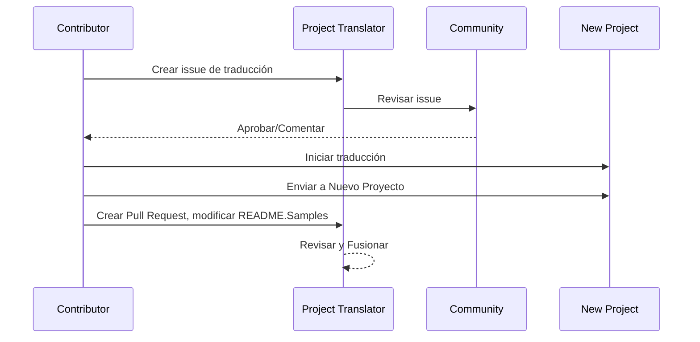

# Traductor de Proyectos

Una extensión de VS Code fácil de usar para la localización multiidioma de proyectos.

Repositorio del proyecto: `https://github.com/Project-Translation/project_translator`

## Instalación

1. Marketplace:
   - VS Code Extensions Marketplace: [https://marketplace.visualstudio.com/items?itemName=techfetch-dev.project-translator](https://marketplace.visualstudio.com/items?itemName=techfetch-dev.project-translator)
   - Open VSX Registry: [https://open-vsx.org/extension/techfetch-dev/project-translator](https://open-vsx.org/extension/techfetch-dev/project-translator)
2. Busque `techfetch-dev.project-translator` en la vista de Extensiones de VS Code y haga clic en instalar


<!--  -->


## Traducciones Disponibles

La extensión admite la traducción a estos idiomas:

- [简体中文 (zh-cn)](./README.zh-cn.md)
- [繁體中文 (zh-tw)](./README.zh-tw.md)
- [日本語 (ja-jp)](./README.ja-jp.md)
- [한국어 (ko-kr)](./README.ko-kr.md)
- [Français (fr-fr)](./README.fr-fr.md)
- [Deutsch (de-de)](./README.de-de.md)
- [Español (es-es)](./README.es-es.md)
- [Português (pt-br)](./README.pt-br.md)
- [Русский (ru-ru)](./README.ru-ru.md)
- [العربية (ar-sa)](./README.ar-sa.md)
- [العربية (ar-ae)](./README.ar-ae.md)
- [العربية (ar-eg)](./README.ar-eg.md)

## Muestras

| Proyecto                                                                             | Repositorio Original                                                                                       | Descripción                                                                                                                                                               | Estrellas | Etiquetas                                                                                                                                                                                                                                                                                                                                                                                                                                                                                                                                                                                                                                                                 |
| ----------------------------------------------------------------------------------- | --------------------------------------------------------------------------------------------------------- | ------------------------------------------------------------------------------------------------------------------------------------------------------------------------- | ----- | -------------------------------------------------------------------------------------------------------------------------------------------------------------------------------------------------------------------------------------------------------------------------------------------------------------------------------------------------------------------------------------------------------------------------------------------------------------------------------------------------------------------------------------------------------------------------------------------------------------------------------------------------------------------- |
| [algorithm-visualizer](https://github.com/Project-Translation/algorithm-visualizer) | [algorithm-visualizer/algorithm-visualizer](https://github.com/algorithm-visualizer/algorithm-visualizer) | :fireworks:Plataforma interactiva en línea que visualiza algoritmos a partir de código                                                                                               | 47301 | [`algorithm`](https://github.com/topics/algorithm), [`animation`](https://github.com/topics/animation), [`data-structure`](https://github.com/topics/data-structure), [`visualization`](https://github.com/topics/visualization)                                                                                                                                                                                                                                                                                                                                                                                                                                     |
| [algorithms](https://github.com/Project-Translation/algorithms)                     | [algorithm-visualizer/algorithms](https://github.com/algorithm-visualizer/algorithms)                     | :crystal_ball:Visualizaciones de algoritmos                                                                                                                                    | 401   | N/A                                                                                                                                                                                                                                                                                                                                                                                                                                                                                                                                                                                                                                                                  |
| [cline-docs](https://github.com/Project-Translation/cline-docs)                     | [cline/cline](https://github.com/cline/cline)                                                             | Agente de codificación autónomo directamente en tu IDE, capaz de crear/editar archivos, ejecutar comandos, usar el navegador y más con tu permiso en cada paso del camino. | 39572 | N/A                                                                                                                                                                                                                                                                                                                                                                                                                                                                                                                                                                                                                                                                  |
| [cursor-docs](https://github.com/Project-Translation/cursor-docs)                   | [getcursor/docs](https://github.com/getcursor/docs)                                                       | Documentación de código abierto de Cursor                                                                                                                                        | 309   | N/A                                                                                                                                                                                                                                                                                                                                                                                                                                                                                                                                                                                                                                                                  |
| [gobyexample](https://github.com/Project-Translation/gobyexample)                   | [mmcgrana/gobyexample](https://github.com/mmcgrana/gobyexample)                                           | Go por Ejemplo                                                                                                                                                             | 7523  | N/A                                                                                                                                                                                                                                                                                                                                                                                                                                                                                                                                                                                                                                                                  |
| [golang-website](https://github.com/Project-Translation/golang-website)             | [golang/website](https://github.com/golang/website)                                                       | [espejo] Página de inicio de los sitios web go.dev y golang.org                                                                                                                       | 402   | N/A                                                                                                                                                                                                                                                                                                                                                                                                                                                                                                                                                                                                                                                                  |
| [reference-en-us](https://github.com/Project-Translation/reference-en-us)           | [Fechin/reference](https://github.com/Fechin/reference)                                                   | ⭕ Comparte una hoja de referencia rápida para desarrolladores.                                                                                                                      | 7808  | [`awk`](https://github.com/topics/awk), [`bash`](https://github.com/topics/bash), [`chatgpt`](https://github.com/topics/chatgpt), [`cheatsheet`](https://github.com/topics/cheatsheet), [`cheatsheets`](https://github.com/topics/cheatsheets), [`css`](https://github.com/topics/css), [`golang`](https://github.com/topics/golang), [`grep`](https://github.com/topics/grep), [`markdown`](https://github.com/topics/markdown), [`python`](https://github.com/topics/python), [`reference`](https://github.com/topics/reference), [`sed`](https://github.com/topics/sed), [`snippets`](https://github.com/topics/snippets), [`vim`](https://github.com/topics/vim) |
| [styleguide](https://github.com/Project-Translation/styleguide)                     | [google/styleguide](https://github.com/google/styleguide)                                                 | Guías de estilo para proyectos de código abierto originados por Google                                                                                                                   | 38055 | [`cpplint`](https://github.com/topics/cpplint), [`style-guide`](https://github.com/topics/style-guide), [`styleguide`](https://github.com/topics/styleguide)                                                                                                                                                                                                                                                                                                                                                                                                                                                                                                         |
| [vscode-docs](https://github.com/Project-Translation/vscode-docs)                   | [microsoft/vscode-docs](https://github.com/microsoft/vscode-docs)                                         | Documentación pública de Visual Studio Code                                                                                                                                  | 5914  | [`vscode`](https://github.com/topics/vscode)                                                                                                                                                                                                                                                                                                                                                                                                                                                                                                                                                                                                                         |

## Solicitud de Traducción de Proyecto

Si deseas contribuir con una traducción o necesitas que se traduzca un proyecto:

1. Crea un issue usando la siguiente plantilla:

```md
**Proyecto**: [project_url]
**Idioma objetivo**: [target_lang]
**Descripción**: Breve descripción de por qué esta traducción sería valiosa
```

2. Flujo de trabajo:


```mermaid
sequenceDiagram
  Contributor->>Project Translator: Crear issue de traducción
  Project Translator->>Community: Revisar issue
  Community-->>Contributor: Aprobar/Comentar
  Contributor->>New Project: Iniciar traducción
  Contributor->>New Project: Enviar a Nuevo Proyecto
  Contributor->>Project Translator: Crear Pull Request, modificar README.Samples
  Project Translator-->>Project Translator: Revisar y Fusionar
```

3. Después de que el PR sea fusionado, la traducción se agregará a la sección de Muestras.

Traducciones en progreso: [Ver Issues](https://github.com/Project-Translation/project_translator/issues)

## Características

- 📁 Soporte de traducción a nivel de carpeta
  - Traduce carpetas de proyectos completas a múltiples idiomas
  - Mantiene la estructura y jerarquía original de carpetas
  - Admite traducción recursiva de subcarpetas
  - Detección automática de contenido traducible
  - Procesamiento por lotes para traducciones eficientes a gran escala
- 📄 Soporte de traducción a nivel de archivo
  - Traduce archivos individuales a múltiples idiomas
  - Preserva la estructura y formato original del archivo
  - Admite modos de traducción tanto de carpetas como de archivos
- 💡 Traducción inteligente con IA
  - Mantiene automáticamente la integridad de la estructura del código
  - Solo traduce comentarios de código, preserva la lógica del código
  - Mantiene formatos JSON/XML y otras estructuras de datos
  - Calidad de traducción profesional de documentación técnica
- ⚙️ Configuración flexible
  - Configura carpeta de origen y múltiples carpetas de destino
  - Admite intervalos de traducción de archivos personalizados
  - Establece tipos de archivo específicos para ignorar
  - Admite múltiples opciones de modelos de IA
- 🚀 Operaciones amigables para el usuario
  - Visualización del progreso de traducción en tiempo real
  - Admite pausa/reanudación/detención de la traducción
  - Mantenimiento automático de la estructura de carpetas de destino
  - Traducción incremental para evitar trabajo duplicado
- 🔄 Traducción Diferencial (Experimental)
  - Modo diff-apply para actualizaciones eficientes de traducciones existentes
  - Reduce el uso de API al traducir solo el contenido cambiado
  - Preserva el historial de versiones con ediciones mínimas
  - ⚠️ Función experimental - ver [Características Avanzadas](#differential-translation-diff-apply-mode) para detalles

## Configuración

La extensión admite las siguientes opciones de configuración:

```json
{
  "projectTranslator.specifiedFolders": [
    {
      "sourceFolder": {
        "path": "Source folder path",
        "lang": "Source language code"
      },
      "targetFolders": [
        {
          "path": "Target folder path",
          "lang": "Target language code"
        }
      ]
    }
  ],
  "projectTranslator.specifiedFiles": [
    {
      "sourceFile": {
        "path": "Source file path",
        "lang": "Source language code"
      },
      "targetFiles": [
        {
          "path": "Target file path",
          "lang": "Target language code"
        }
      ]
    }
  ],
  "projectTranslator.currentVendor": "openai",
  "projectTranslator.vendors": [
    {
      "name": "openai",
      "apiEndpoint": "API endpoint URL",
      "apiKeyEnvVarName": "MY_OPENAI_API_KEY",
      "model": "gpt-4o",
      "rpm": "10",
      "maxTokensPerSegment": 4096,
      "timeout": 180,
      "temperature": 0.1
    }
  ],
  "projectTranslator.userPrompts": [
      "1. Debe devolver que no es necesario traducir si el archivo markdown tiene 'draft' establecido en 'true' en el front matter.",
      "2. './readmes/' en las oraciones debe reemplazarse con './'",
  ],
  "projectTranslator.ignore": {
    "paths": [
      "**/node_modules/**"
    ],
    "extensions": [
      ".log"
    ]
  },
}
```

Detalles clave de configuración:

| Opción de Configuración                        | Descripción                                                                                    |
| ------------------------------------------- | ---------------------------------------------------------------------------------------------- |
| `projectTranslator.specifiedFolders`        | Múltiples carpetas de origen con sus correspondientes carpetas de destino para traducción           |
| `projectTranslator.specifiedFiles`          | Múltiples archivos de origen con sus correspondientes archivos de destino para traducción               |
| `projectTranslator.translationIntervalDays` | Intervalo de traducción en días (predeterminado 7 días)                                                  |
| `projectTranslator.copyOnly`                | Archivos para copiar pero no traducir (con arrays `paths` y `extensions`)                         |
| `projectTranslator.ignore`                  | Archivos para ignorar completamente (con arrays `paths` y `extensions`)                              |
| `projectTranslator.skipFrontMatterMarkers`  | Omitir archivos basado en marcadores de front matter (con arrays `enabled` y `markers`)                 |
| `projectTranslator.currentVendor`           | Vendor de API actual en uso                                                                      |
| `projectTranslator.vendors`                 | Lista de configuración de vendors de API (puede usar apiKey directamente o apiKeyEnvVarName para variables de entorno) |
| `projectTranslator.systemPromptLanguage`    | Idioma usado para los prompts del sistema integrados (predeterminado: en). Afecta cómo se instruye al modelo, no el idioma de la interfaz de usuario |
| `projectTranslator.systemPrompts`           | Array de prompts del sistema para guiar el proceso de traducción                                        |
| `projectTranslator.userPrompts`             | Array de prompts definidos por el usuario, estos prompts se agregarán después de los prompts del sistema durante la traducción |
| `projectTranslator.segmentationMarkers`     | Marcadores de segmentación configurados por tipo de archivo, admite expresiones regulares                     |
| `projectTranslator.debug`                   | Habilitar modo de depuración para registrar todas las solicitudes y respuestas de API en el canal de salida (predeterminado: false)     |
| `projectTranslator.logFile`                 | Configuración para archivos de registro de depuración (ver [Característica de Archivo de Registro](./docs/log-file-feature.md))         |
| `projectTranslator.diffApply.enabled`       | Habilitar modo de traducción diferencial experimental (predeterminado: false)                             |

## Uso

1. Abra la paleta de comandos (Ctrl+Shift+P / Cmd+Shift+P)
2. Escriba "Traducir Proyecto" y seleccione el comando
3. Si la carpeta de origen no está configurada, aparecerá un diálogo de selección de carpeta
4. Espere a que se complete la traducción

Durante la traducción:

- Puede pausar/reanudar la traducción mediante los botones de la barra de estado
- Puede detener el proceso de traducción en cualquier momento
- El progreso de la traducción se muestra en el área de notificaciones
- Los registros detallados se muestran en el panel de salida

### Traducción automática al abrir el espacio de trabajo

Puedes habilitar una tarea de traducción automática que se ejecuta cuando abres el espacio de trabajo:

1. Ejecuta el comando: `Enable Auto Translate On Open`
2. La extensión actualizará `.vscode/tasks.json`
3. Tiene efecto la próxima vez que abras el espacio de trabajo (la extensión no activa una recarga de la ventana)

Para deshabilitarla, ejecuta: `Disable Auto Translate On Open`.

## Uso de CLI

El proyecto ahora admite ejecución de CLI además de la extensión de VS Code.

Construir salida de CLI:

```bash
npm run compile
```

Ejecutar traducción:

```bash
# Idioma objetivo predeterminado: en-us
npx project-translator translate project --workspace . --config project.translation.json

# Especificar idioma objetivo
npx project-translator translate project --workspace . --config project.translation.json --lang ja-jp
```

Gestionar configuración:

```bash
npx project-translator config list --workspace . --config project.translation.json --json
npx project-translator config set currentVendor deepseek --workspace . --config project.translation.json
npx project-translator config schema --workspace .
npx project-translator config validate --workspace . --config project.translation.json
```

`config schema` exportará `project.translation.schema.json` por defecto.  
`config validate` realiza validación de JSON Schema en el archivo de configuración y devuelve un código de salida no cero cuando es inválido.

## Desarrollo

### Sistema de Construcción

Esta extensión usa esbuild para empaquetado rápido y desarrollo:

#### Scripts Disponibles

- `npm run build` - Build de producción con minificación
- `npm run compile` - Build de desarrollo
- `npm run watch` - Modo watch para desarrollo
- `npm test` - Ejecutar pruebas

#### Tareas de VS Code

- **Construir** (Ctrl+Shift+P → "Tasks: Run Task" → "build") - Empaqueta la extensión para producción
- **Observar** (Ctrl+Shift+P → "Tasks: Run Task" → "watch") - Modo de desarrollo con reconstrucción automática

### Configuración de Desarrollo

1. Clona el repositorio
2. Ejecuta `npm install` para instalar dependencias
3. Presiona `F5` para iniciar la depuración o ejecuta la tarea "watch" para desarrollo

La configuración de esbuild:

- Empaqueta todos los archivos TypeScript en un solo `out/extension.js`
- Excluye la API de VS Code (marcada como externa)

## Características Avanzadas

### Uso de Variables de Entorno para Claves API

Project Translator admite el uso de variables de entorno para claves API, lo cual es un enfoque más seguro que almacenar claves API directamente en archivos de configuración:

1. Configura tu vendor con la propiedad `apiKeyEnvVarName`:

```json
{
  "projectTranslator.vendors": [
    {
      "name": "openai",
      "apiEndpoint": "https://api.openai.com/v1",
      "apiKeyEnvVarName": "OPENAI_API_KEY",
      "model": "gpt-4"
    },
    {
      "name": "openrouter",
      "apiEndpoint": "https://openrouter.ai/api/v1",
      "apiKeyEnvVarName": "OPENROUTER_API_KEY",
      "model": "anthropic/claude-3-opus"
    }
  ]
}
```

2. Establece la variable de entorno en tu sistema:
   - En Windows: `set OPENAI_API_KEY=your_api_key`
   - En macOS/Linux: `export OPENAI_API_KEY=your_api_key`

3. Cuando la extensión se ejecute, hará:
   - Primero verifica si `apiKey` se proporciona directamente en la configuración
   - Si no, buscará la variable de entorno especificada por `apiKeyEnvVarName`

Este enfoque mantiene tus claves API fuera de archivos de configuración y sistemas de control de versiones.

### Omitir Traducción Basada en Front Matter

Project Translator puede omitir la traducción de archivos Markdown basándose en sus metadatos de front matter. Esto es útil para documentos de borrador o archivos marcados como que no requieren traducción.

Para habilitar esta función, configura la opción `projectTranslator.skipFrontMatterMarkers`:

```json
{
  "projectTranslator.skipFrontMatterMarkers": {
    "enabled": true,
    "markers": [
      {
        "key": "draft",
        "value": "true"
      },
      {
        "key": "translate",
        "value": "false"
      }
    ]
  }
}
```

Con esta configuración, cualquier archivo Markdown con front matter que contenga `draft: true` o `translate: false` se omitirá durante la traducción y se copiará directamente a la ubicación de destino.

Ejemplo de archivo Markdown que se omitiría:
```
---
draft: true
title: "Borrador Documento"
---

Este documento es un borrador y no debe ser traducido.
```

### Modo de Traducción Diferencial (Diff-Apply)

> **⚠️ Advertencia de Función Experimental**: El modo de traducción diferencial es actualmente una función experimental y puede tener problemas de estabilidad y compatibilidad. Se recomienda usarlo con precaución en entornos de producción y siempre hacer copias de seguridad de archivos importantes.

La extensión admite un modo de traducción diferencial opcional (diff-apply). Cuando está habilitado, la extensión envía tanto el contenido de origen como el archivo de destino traducido existente al modelo. El modelo debe devolver uno o más bloques SEARCH/REPLACE (texto plano, sin fences de código). La extensión aplica estos bloques localmente para minimizar cambios, reducir el uso de API y preservar mejor el historial de versiones.

- **Alternar**: Configura `projectTranslator.diffApply.enabled` en la configuración de VS Code o `project.translation.json` (predeterminado: `false`).
- **Opciones**:
  - `validationLevel`: `normal` o `strict` (predeterminado: `normal`). En modo `strict`, los marcadores inválidos o fallos de coincidencia causarán un error y la extensión volverá al flujo de traducción estándar.
  - `autoBackup`: Si es true, crea una copia de seguridad `.bak` del archivo de destino antes de aplicar ediciones (predeterminado: `true`).
  - `maxOperationsPerFile`: (retenido por compatibilidad) no usado por la nueva estrategia.

Flujo de trabajo:
1. Si `diffApply.enabled` es `true` y el archivo de destino existe, la extensión lee tanto el contenido de origen como el de destino.
2. Llama al modelo con un prompt diferencial y requiere devolver bloques SEARCH/REPLACE de texto plano.
3. Localmente, la extensión analiza y aplica los bloques SEARCH/REPLACE. Si la aplicación falla, vuelve a la traducción completa normal y sobrescribe el archivo de destino.

Ejemplo SEARCH/REPLACE (se permiten múltiples bloques):

```
<<<<<<< SEARCH
:start_line: 10
-------
const label = "Old"
=======
const label = "New"
>>>>>>> REPLACE

<<<<<<< SEARCH
:start_line: 25
-------
function foo() {
  return 1
}
=======
function foo() {
  return 2
}
>>>>>>> REPLACE
```

Notas:
- Usa contenido exacto incluyendo indentación y espacios en blanco en las secciones SEARCH. Si no estás seguro, usa el contenido más reciente del archivo.
- Mantén una sola línea de `=======` entre SEARCH y REPLACE.
- Si no se necesita ningún cambio, el modelo debe devolver una cadena vacía.

¿Por qué la traducción diferencial actualmente funciona mal (explicación)

- **Desafíos de alineación y comparación entre idiomas**: La traducción diferencial requiere enviar tanto el documento fuente original como el documento traducido existente al modelo, y el modelo debe compararlos entre idiomas para decidir qué partes de la traducción necesitan ser cambiadas. Esta es una tarea fundamentalmente más difícil que modificar un solo documento in-situ porque el modelo debe alinear con precisión segmentos en diferentes idiomas y juzgar diferencias semánticas.

- **Complejidad de preservación de formato y límites**: Muchos documentos contienen bloques de código, tablas, marcadores frontend o marcadores de posición especiales. Un flujo de trabajo diff confiable debe preservar estas estructuras mientras realiza ediciones de texto. Si el modelo no puede producir consistentemente resultados que sigan estrictamente el formato SEARCH/REPLACE, aplicar ediciones automáticamente puede introducir regresiones de formato o errores estructurales.

- **Problemas de consistencia de contexto y terminología**: Las ediciones pequeñas y localizadas a menudo dependen de un contexto más amplio y de un glosario de terminología/estilo existente. Cuando se le pide que produzca ediciones mínimas, el modelo puede descuidar la consistencia global (terminología, estilo, comentarios, nombres de variables), resultando en traducciones inconsistentes o con cambios semánticos.

- **Compensaciones de estabilidad y costo del modelo**: Lograr una traducción diferencial confiable requiere modelos con razonamiento comparativo fuerte y formatos de salida estables y predecibles. Los modelos principales actuales no proporcionan de manera confiable tanto alineación robusta entre idiomas como formatos de salida estrictos a un costo razonable, por lo que los sistemas a menudo recurren a una retraducción completa para garantizar la corrección.

Por lo tanto, aunque la traducción diferencial puede reducir teóricamente los tokens de salida costosos y preservar mejor el historial de versiones, actualmente está limitada por las capacidades de comparación entre idiomas de los modelos y la estabilidad de la salida. Esta función sigue siendo experimental; las mitigaciones recomendadas incluyen mantener copias de seguridad automáticas (`autoBackup: true`), usar un nivel de validación tolerante (`validationLevel: "normal"`), y recurrir a retraducción completa cuando fallen la coincidencia o el formato. En el futuro, procesadores post-alineación bilingüe especializados o modelos personalizados más pequeños pueden mejorar la estabilidad del enfoque diff.

Ahorro de costos y por qué ayuda

- **Costo de tokens de entrada vs salida**: Las APIs de modelos grandes comúnmente cobran de manera diferente por tokens de entrada (prompt) y tokens de salida (completion). A menudo, los tokens de salida son significativamente más caros porque el modelo genera texto más largo. Diff-apply ayuda porque enviamos el **código fuente actualizado (entrada)** y el **archivo traducido existente (entrada)** al modelo y pedimos un JSON compacto de ediciones. La respuesta del modelo es un JSON pequeño (pocos tokens de salida) en lugar de un archivo retraducido completo (muchos tokens de salida), por lo que pagas mucho menos por la porción de salida costosa.

- **Solo enviar lo que ha cambiado**: En lugar de retraducir el archivo completo cada vez que ocurren pequeños cambios, diff-apply instruye al modelo para que calcule las operaciones de edición mínimas para actualizar la traducción existente. Esto es particularmente efectivo para archivos que fueron previamente traducidos y solo reciben ediciones incrementales.

- **Mejor para archivos formateados**: Los archivos con formato estricto (JSON, XML, Markdown con bloques de código) se benefician enormemente porque diff-apply preserva la estructura y solo cambia las partes de texto que necesitan traducción. Esto reduce la posibilidad de regresiones relacionadas con el formato y tokens de salida adicionales causados por el reformateo del modelo.

- **Unidad base orientada a líneas, agregación más inteligente**: La herramienta trata la unidad de traducción básica como una "línea", y la estrategia SEARCH/REPLACE aplica coincidencia exacta o difusa cerca de `:start_line:`. Usa `validationLevel: "normal"` para comportamiento tolerante y `"strict"` cuando necesites ediciones conservadoras y exactas.

Cuándo usar diff-apply:

- Usa cuando el archivo de destino ya existe y fue previamente traducido.
- Usa para documentos grandes y formateados donde retraducir el archivo completo sería costoso.
- Evita para archivos completamente nuevos sin traducción previa, o cuando quieras una retraducción fresca.

### Documentación de Diseño

- Genera mapas de fuente para builds de desarrollo
- Minifica código para builds de producción
- Proporciona integración de problem matcher para VS Code

## Notas

- Asegúrate de tener cuota de uso de API suficiente
- Se recomienda probar con proyectos pequeños primero
- Usa claves API dedicadas y elimínalas después de completar

## Licencia

[Licencia](LICENSE)