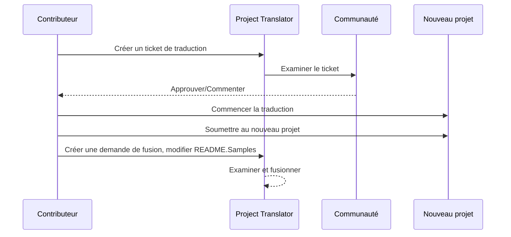

# Project Translator

Une extension VSCode : un outil facile à utiliser pour la localisation multilingue de projets.

## Traductions disponibles

L'extension prend en charge la traduction vers les langues suivantes :

- [简体中文 (zh-cn)](./README.zh-cn.md)
- [繁體中文 (zh-tw)](./README.zh-tw.md)
- [日本語 (ja-jp)](./README.ja-jp.md)
- [한국어 (ko-kr)](./README.ko-kr.md)
- [Français (fr-fr)](./README.fr-fr.md)
- [Deutsch (de-de)](./README.de-de.md)
- [Español (es-es)](./README.es-es.md)
- [Português (pt-br)](./README.pt-br.md)
- [Русский (ru-ru)](./README.ru-ru.md)
- [العربية (ar-sa)](./README.ar-sa.md)
- [العربية (ar-ae)](./README.ar-ae.md)
- [العربية (ar-eg)](./README.ar-eg.md)

## Exemples

| Projet                                                                             | Dépôt d'origine                                                                                       | Description                                                                                                                                                               | Étoiles | Tags                                                                                                                                                                                                                                                                                                                                                                                                                                                                                                                                                                                                                                                                  |
| ----------------------------------------------------------------------------------- | --------------------------------------------------------------------------------------------------------- | ------------------------------------------------------------------------------------------------------------------------------------------------------------------------- | ----- | -------------------------------------------------------------------------------------------------------------------------------------------------------------------------------------------------------------------------------------------------------------------------------------------------------------------------------------------------------------------------------------------------------------------------------------------------------------------------------------------------------------------------------------------------------------------------------------------------------------------------------------------------------------------- |
| [algorithm-visualizer](https://github.com/Project-Translation/algorithm-visualizer) | [algorithm-visualizer/algorithm-visualizer](https://github.com/algorithm-visualizer/algorithm-visualizer) | :fireworks:Plateforme en ligne interactive qui visualise les algorithmes à partir du code                                                                                               | 47301 | [`algorithm`](https://github.com/topics/algorithm), [`animation`](https://github.com/topics/animation), [`data-structure`](https://github.com/topics/data-structure), [`visualization`](https://github.com/topics/visualization)                                                                                                                                                                                                                                                                                                                                                                                                                                     |
| [algorithms](https://github.com/Project-Translation/algorithms)                     | [algorithm-visualizer/algorithms](https://github.com/algorithm-visualizer/algorithms)                     | :crystal_ball:Visualisations d'algorithmes                                                                                                                                    | 401   | N/A                                                                                                                                                                                                                                                                                                                                                                                                                                                                                                                                                                                                                                                                  |
| [cline-docs](https://github.com/Project-Translation/cline-docs)                     | [cline/cline](https://github.com/cline/cline)                                                             | Agent de codage autonome directement dans votre IDE, capable de créer/modifier des fichiers, d'exécuter des commandes, d'utiliser le navigateur, et bien plus, avec votre autorisation à chaque étape. | 39572 | N/A                                                                                                                                                                                                                                                                                                                                                                                                                                                                                                                                                                                                                                                                  |
| [cursor-docs](https://github.com/Project-Translation/cursor-docs)                   | [getcursor/docs](https://github.com/getcursor/docs)                                                       | Documentation open source de Cursor                                                                                                                                        | 309   | N/A                                                                                                                                                                                                                                                                                                                                                                                                                                                                                                                                                                                                                                                                  |
| [gobyexample](https://github.com/Project-Translation/gobyexample)                   | [mmcgrana/gobyexample](https://github.com/mmcgrana/gobyexample)                                           | Go par exemple                                                                                                                                                             | 7523  | N/A                                                                                                                                                                                                                                                                                                                                                                                                                                                                                                                                                                                                                                                                  |
| [golang-website](https://github.com/Project-Translation/golang-website)             | [golang/website](https://github.com/golang/website)                                                       | [mirror] Accueil des sites go.dev et golang.org                                                                                                                       | 402   | N/A                                                                                                                                                                                                                                                                                                                                                                                                                                                                                                                                                                                                                                                                  |
| [reference-en-us](https://github.com/Project-Translation/reference-en-us)           | [Fechin/reference](https://github.com/Fechin/reference)                                                   | ⭕ Partage une feuille de référence rapide pour les développeurs.                                                                                                                      | 7808  | [`awk`](https://github.com/topics/awk), [`bash`](https://github.com/topics/bash), [`chatgpt`](https://github.com/topics/chatgpt), [`cheatsheet`](https://github.com/topics/cheatsheet), [`cheatsheets`](https://github.com/topics/cheatsheets), [`css`](https://github.com/topics/css), [`golang`](https://github.com/topics/golang), [`grep`](https://github.com/topics/grep), [`markdown`](https://github.com/topics/markdown), [`python`](https://github.com/topics/python), [`reference`](https://github.com/topics/reference), [`sed`](https://github.com/topics/sed), [`snippets`](https://github.com/topics/snippets), [`vim`](https://github.com/topics/vim) |
| [styleguide](https://github.com/Project-Translation/styleguide)                     | [google/styleguide](https://github.com/google/styleguide)                                                 | Guides de style pour les projets open-source issus de Google                                                                                                                   | 38055 | [`cpplint`](https://github.com/topics/cpplint), [`style-guide`](https://github.com/topics/style-guide), [`styleguide`](https://github.com/topics/styleguide)                                                                                                                                                                                                                                                                                                                                                                                                                                                                                                         |
| [vscode-docs](https://github.com/Project-Translation/vscode-docs)                   | [microsoft/vscode-docs](https://github.com/microsoft/vscode-docs)                                         | Documentation publique pour Visual Studio Code                                                                                                                               | 5914  | [`vscode`](https://github.com/topics/vscode)                                                                                                                                                                                                                                                                                                                                                                                                                                                                                                                                                                                                                         |

## Demande de traduction de projet

Si vous souhaitez contribuer à une traduction ou avez besoin qu'un projet soit traduit :

1. Créez un ticket en utilisant le modèle suivant :

```md
**Projet** : [project_url]
**Langue cible** : [target_lang]
**Description** : Brève description expliquant pourquoi cette traduction serait utile
```

2. Processus :



3. Une fois la demande de fusion validée, la traduction sera ajoutée à la section Exemples.

Traductions en cours : [Voir les tickets](https://github.com/Project-Translation/project_translator/issues)

## Fonctionnalités

- 📁 Prise en charge de la traduction au niveau du dossier
  - Traduire des dossiers de projet entiers vers plusieurs langues
  - Conserver la structure et la hiérarchie d'origine des dossiers
  - Support de la traduction récursive des sous-dossiers
  - Détection automatique du contenu traduisible
  - Traitement par lots pour des traductions à grande échelle efficaces
- 📄 Prise en charge de la traduction au niveau du fichier
  - Traduire des fichiers individuels vers plusieurs langues
  - Préserver la structure et la mise en forme d'origine du fichier
  - Support des modes de traduction par dossier et par fichier
- 💡 Traduction intelligente avec IA
  - Préserve automatiquement l'intégrité de la structure du code
  - Traduit uniquement les commentaires du code, préserve la logique du code
  - Maintient les formats JSON/XML et autres structures de données
  - Qualité de traduction professionnelle pour la documentation technique
- ⚙️ Configuration flexible
  - Configurer le dossier source et plusieurs dossiers cibles
  - Support des intervalles de traduction de fichiers personnalisés
  - Définir des types de fichiers spécifiques à ignorer
  - Support de plusieurs options de modèles d'IA
- 🚀 Opérations conviviales
  - Affichage en temps réel de la progression de la traduction
  - Support de la pause/reprise/arrêt de la traduction
  - Maintenance automatique de la structure du dossier cible
  - Traduction incrémentielle pour éviter les doublons

## Installation

1. Recherchez "[Project Translator](https://marketplace.visualstudio.com/items?itemName=techfetch-dev.project-translator)" dans la place de marché des extensions VS Code
2. Cliquez sur installer

## Configuration

L'extension prend en charge les options de configuration suivantes :

```json
{
  "projectTranslator.specifiedFolders": [
    {
      "sourceFolder": {
        "path": "Chemin du dossier source",
        "lang": "Code de la langue source"
      },
      "targetFolders": [
        {
          "path": "Chemin du dossier cible",
          "lang": "Code de la langue cible"
        }
      ]
    }
  ],
  "projectTranslator.specifiedFiles": [
    {
      "sourceFile": {
        "path": "Chemin du fichier source",
        "lang": "Code de la langue source"
      },
      "targetFiles": [
        {
          "path": "Chemin du fichier cible",
          "lang": "Code de la langue cible"
        }
      ]
    }
  ],
  "projectTranslator.currentVendor": "openai",
  "projectTranslator.vendors": [
    {
      "name": "openai",
      "apiEndpoint": "URL du point d'API",
      "apiKey": "Clé d'authentification API",
      "apiKeyEnvVarName": "Nom de la variable d'environnement pour la clé API",
      "model": "Nom du modèle à utiliser",
      "rpm": "Nombre maximal de requêtes par minute",
      "maxTokensPerSegment": 4096,
      "timeout": 30,
      "temperature": 0.0
    }
  ]
}
```

Détails clés de configuration :

| Option de configuration                        | Description                                                                                    |
| ------------------------------------------- | ---------------------------------------------------------------------------------------------- |
| `projectTranslator.specifiedFolders`        | Dossiers sources multiples avec leurs dossiers de destination correspondants pour la traduction           |
| `projectTranslator.specifiedFiles`          | Fichiers sources multiples avec leurs fichiers de destination correspondants pour la traduction               |
| `projectTranslator.translationIntervalDays` | Intervalle de traduction en jours (par défaut 7 jours)                                                  |
| `projectTranslator.copyOnly`                | Fichiers à copier mais ne pas traduire (avec les tableaux `paths` et `extensions`)                         |
| `projectTranslator.ignore`                  | Fichiers à ignorer complètement (avec les tableaux `paths` et `extensions`)                              |
| `projectTranslator.skipFrontMatterMarkers`  | Ignorer les fichiers selon les marqueurs de front matter (avec les tableaux `enabled` et `markers`)                 |
| `projectTranslator.currentVendor`           | Fournisseur API actuel en cours d'utilisation                                                                      |
| `projectTranslator.vendors`                 | Liste de configuration des fournisseurs API (peut utiliser apiKey directement ou apiKeyEnvVarName pour les variables d'environnement) |
| `projectTranslator.systemPrompts`           | Tableau de prompts système pour guider le processus de traduction                                        |
| `projectTranslator.userPrompts`             | Tableau de prompts défini par l'utilisateur, ces prompts seront ajoutés après les prompts système lors de la traduction |
| `projectTranslator.segmentationMarkers`     | Marqueurs de segmentation configurés par type de fichier, prend en charge les expressions régulières                     |
| `projectTranslator.debug`                   | Activer le mode débogage pour enregistrer toutes les requêtes et réponses API dans le canal de sortie (par défaut : false)     |
| `projectTranslator.logFile`                 | Configuration des fichiers de journal de débogage (voir [Fonctionnalité de journal](./docs/log-file-feature.md))         |

## Utilisation

1. Ouvrir la palette de commandes (Ctrl+Maj+P / Cmd+Maj+P)
2. Saisir "Traduire le projet" et sélectionner la commande
3. Si le dossier source n'est pas configuré, une boîte de dialogue de sélection de dossier apparaîtra
4. Attendre la fin de la traduction

Pendant la traduction :

- Possibilité de suspendre/reprendre la traduction via les boutons de la barre d'état
- Possibilité d'arrêter le processus de traduction à tout moment
- Progression de la traduction affichée dans la zone de notification
- Journaux détaillés affichés dans le panneau de sortie

## Développement

### Système de construction

Cette extension utilise esbuild pour un regroupement rapide et le développement :

#### Scripts disponibles

- `npm run build` - Construction de production avec minimisation
- `npm run compile` - Construction de développement
- `npm run watch` - Mode surveillance pour le développement
- `npm test` - Exécuter les tests

#### Tâches VS Code

- **Build** (Ctrl+Maj+P → "Tâches : Exécuter une tâche" → "build") - Regroupe l'extension pour la production
- **Watch** (Ctrl+Maj+P → "Tâches : Exécuter une tâche" → "watch") - Mode développement avec reconstruction automatique

### Configuration du développement

1. Cloner le dépôt
2. Exécuter `npm install` pour installer les dépendances
3. Appuyer sur `F5` pour démarrer le débogage ou exécuter la tâche "watch" pour le développement

La configuration esbuild :

- Regroupe tous les fichiers TypeScript en un seul `out/extension.js`
- Exclut l'API VS Code (marquée comme externe)

## Fonctionnalités avancées

### Utilisation de variables d'environnement pour les clés API

Project Translator prend en charge l'utilisation de variables d'environnement pour les clés API, ce qui constitue une approche plus sécurisée que le stockage direct des clés API dans les fichiers de configuration :

1. Configurez votre fournisseur avec une propriété `apiKeyEnvVarName` :

```json
{
  "projectTranslator.vendors": [
    {
      "name": "openai",
      "apiEndpoint": "https://api.openai.com/v1",
      "apiKeyEnvVarName": "OPENAI_API_KEY",
      "model": "gpt-4"
    },
    {
      "name": "openrouter",
      "apiEndpoint": "https://openrouter.ai/api/v1",
      "apiKeyEnvVarName": "OPENROUTER_API_KEY",
      "model": "anthropic/claude-3-opus"
    }
  ]
}
```

2. Définissez la variable d'environnement dans votre système :
   - Sur Windows : `set OPENAI_API_KEY=votre_clé_api`
   - Sur macOS/Linux : `export OPENAI_API_KEY=votre_clé_api`

3. Lorsque l'extension s'exécute, elle :
   - Vérifie d'abord si `apiKey` est fourni directement dans la configuration
   - Sinon, elle recherche la variable d'environnement spécifiée par `apiKeyEnvVarName`

Cette approche permet de garder vos clés API hors des fichiers de configuration et des systèmes de contrôle de version.

### Ignorer la traduction selon le front matter

Project Translator peut ignorer la traduction des fichiers Markdown selon leurs métadonnées de front matter. Cela est utile pour les documents en brouillon ou les fichiers marqués comme ne nécessitant pas de traduction.

Pour activer cette fonctionnalité, configurez l'option `projectTranslator.skipFrontMatterMarkers` :

```json
{
  "projectTranslator.skipFrontMatterMarkers": {
    "enabled": true,
    "markers": [
      {
        "key": "draft",
        "value": "true"
      },
      {
        "key": "translate",
        "value": "false"
      }
    ]
  }
}
```

Avec cette configuration, tout fichier Markdown dont le front matter contient `draft: true` ou `translate: false` sera ignoré pendant la traduction et copié directement à l'emplacement cible.

Exemple de fichier Markdown qui serait ignoré :
```
---
draft: true
title: "Document en brouillon"
---

Ce document est un brouillon et ne doit pas être traduit.
```


### Documentation de conception

- Génère des sources maps pour les versions de développement
- Minifie le code pour les versions de production
- Fournit une intégration de matcher de problèmes pour VS Code

## Notes

- Assurez-vous d'avoir un quota d'utilisation API suffisant
- Il est recommandé de tester d'abord avec de petits projets
- Utilisez des clés API dédiées et supprimez-les après utilisation

## Licence

[Licence](LICENSE)