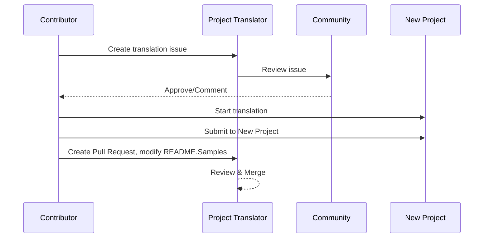

# Traducteur de Projet

Une extension VSCode : Un outil facile à utiliser pour la localisation multilingue de projets.

<!--
## Traductions Disponibles

L'extension prend en charge la traduction vers ces langues :

- [简体中文 (zh-cn)](./README.zh-cn.md)
- [繁體中文 (zh-tw)](./README.zh-tw.md)
- [日本語 (ja-jp)](./README.ja-jp.md)
- [한국어 (ko-kr)](./README.ko-kr.md)
- [Français (fr-fr)](./README.fr-fr.md)
- [Deutsch (de-de)](./README.de-de.md)
- [Español (es-es)](./README.es-es.md)
- [Português (pt-br)](./README.pt-br.md)
- [Русский (ru-ru)](./README.ru-ru.md)
- [العربية (ar-sa)](./README.ar-sa.md)
- [العربية (ar-ae)](./README.ar-ae.md)
- [العربية (ar-eg)](./README.ar-eg.md) -->

## Exemples

| Projet                                                                             | Dépôt Original                                                                                       | Description                                                                                                                                                               | Étoiles | Mots-clés                                                                                                                                                                                                                                                                                                                                                                                                                                                                                                                                                                                                                                                                 |
| ----------------------------------------------------------------------------------- | ----------------------------------------------------------------------------------------------------- | ------------------------------------------------------------------------------------------------------------------------------------------------------------------------- | ------- | -------------------------------------------------------------------------------------------------------------------------------------------------------------------------------------------------------------------------------------------------------------------------------------------------------------------------------------------------------------------------------------------------------------------------------------------------------------------------------------------------------------------------------------------------------------------------------------------------------------------------------------------------------------------------- |
| [algorithm-visualizer](https://github.com/Project-Translation/algorithm-visualizer) | [algorithm-visualizer/algorithm-visualizer](https://github.com/algorithm-visualizer/algorithm-visualizer) | :fireworks:Plateforme en ligne interactive qui visualise les algorithmes à partir du code                                                                                 | 47301  | [`algorithm`](https://github.com/topics/algorithm), [`animation`](https://github.com/topics/animation), [`data-structure`](https://github.com/topics/data-structure), [`visualization`](https://github.com/topics/visualization)                                                                                                                                                                                                                                                                                                                                                                                                                                       |
| [algorithms](https://github.com/Project-Translation/algorithms)                     | [algorithm-visualizer/algorithms](https://github.com/algorithm-visualizer/algorithms)                 | :crystal_ball:Visualisations d'algorithmes                                                                                                                                 | 401    | N/A                                                                                                                                                                                                                                                                                                                                                                                                                                                                                                                                                                                                                                                                      |
| [cline-docs](https://github.com/Project-Translation/cline-docs)                     | [cline/cline](https://github.com/cline/cline)                                                         | Agent de codage autonome directement dans votre IDE, capable de créer/modifier des fichiers, d'exécuter des commandes, d'utiliser le navigateur, et plus encore avec votre permission à chaque étape.                           | 39572  | N/A                                                                                                                                                                                                                                                                                                                                                                                                                                                                                                                                                                                                                                                                      |
| [cursor-docs](https://github.com/Project-Translation/cursor-docs)                   | [getcursor/docs](https://github.com/getcursor/docs)                                                   | Documentation open source de Cursor                                                                                                                                      | 309    | N/A                                                                                                                                                                                                                                                                                                                                                                                                                                                                                                                                                                                                                                                                      |
| [gobyexample](https://github.com/Project-Translation/gobyexample)                   | [mmcgrana/gobyexample](https://github.com/mmcgrana/gobyexample)                                       | Go by Example                                                                                                                                                             | 7523   | N/A                                                                                                                                                                                                                                                                                                                                                                                                                                                                                                                                                                                                                                                                      |
| [golang-website](https://github.com/Project-Translation/golang-website)             | [golang/website](https://github.com/golang/website)                                                   | [miroir] Site web officiel de go.dev et golang.org                                                                                                                       | 402    | N/A                                                                                                                                                                                                                                                                                                                                                                                                                                                                                                                                                                                                                                                                      |
| [reference-en-us](https://github.com/Project-Translation/reference-en-us)           | [Fechin/reference](https://github.com/Fechin/reference)                                               | ⭕ Partage de fiches de référence rapides pour les développeurs.                                                                                                          | 7808   | [`awk`](https://github.com/topics/awk), [`bash`](https://github.com/topics/bash), [`chatgpt`](https://github.com/topics/chatgpt), [`cheatsheet`](https://github.com/topics/cheatsheet), [`cheatsheets`](https://github.com/topics/cheatsheets), [`css`](https://github.com/topics/css), [`golang`](https://github.com/topics/golang), [`grep`](https://github.com/topics/grep), [`markdown`](https://github.com/topics/markdown), [`python`](https://github.com/topics/python), [`reference`](https://github.com/topics/reference), [`sed`](https://github.com/topics/sed), [`snippets`](https://github.com/topics/snippets), [`vim`](https://github.com/topics/vim) |
| [styleguide](https://github.com/Project-Translation/styleguide)                     | [google/styleguide](https://github.com/google/styleguide)                                             | Guides de style pour les projets open source originaires de Google                                                                                                       | 38055  | [`cpplint`](https://github.com/topics/cpplint), [`style-guide`](https://github.com/topics/style-guide), [`styleguide`](https://github.com/topics/styleguide)                                                                                                                                                                                                                                                                                                                                                                                                                                                                                                           |
| [vscode-docs](https://github.com/Project-Translation/vscode-docs)                   | [microsoft/vscode-docs](https://github.com/microsoft/vscode-docs)                                     | Documentation publique pour Visual Studio Code                                                                                                                           | 5914   | [`vscode`](https://github.com/topics/vscode)                                                                                                                                                                                                                                                                                                                                                                                                                                                                                                                                                                                                                           |

## Demande de Traduction de Projet

Si vous souhaitez contribuer à une traduction ou avez besoin qu'un projet soit traduit :

1. Créez un ticket en utilisant le modèle suivant :

```md
**Project**: [project_url]
**Target Language**: [target_lang]
**Description**: Brief description of why this translation would be valuable
```

2. Flux de travail :



3. Une fois la PR fusionnée, la traduction sera ajoutée à la section Exemples.

Traductions en cours : [Voir les Tickets](https://github.com/Project-Translation/project_translator/issues)

## Fonctionnalités

- 📁 Prise en charge de la traduction au niveau du dossier
  - Traduisez des dossiers de projet entiers vers plusieurs langues
  - Maintenez la structure et la hiérarchie des dossiers d'origine
  - Prise en charge de la traduction récursive des sous-dossiers
  - Détection automatique du contenu traduisible
  - Traitement par lots pour des traductions à grande échelle efficaces
- 📄 Prise en charge de la traduction au niveau du fichier
  - Traduisez des fichiers individuels vers plusieurs langues
  - Préservez la structure et le formatage des fichiers d'origine
  - Prise en charge des modes de traduction de dossiers et de fichiers
- 💡 Traduction intelligente avec IA
  - Maintient automatiquement l'intégrité de la structure du code
  - Ne traduit que les commentaires de code, préserve la logique du code
  - Maintient les formats JSON/XML et autres structures de données
  - Qualité de traduction professionnelle pour la documentation technique
- ⚙️ Configuration flexible
  - Configurez le dossier source et plusieurs dossiers cibles
  - Prise en charge d'intervalles de traduction de fichiers personnalisés
  - Définissez des types de fichiers spécifiques à ignorer
  - Prise en charge de plusieurs options de modèles d'IA
- 🚀 Opérations conviviales
  - Affichage en temps réel de la progression de la traduction
  - Prise en charge de la pause/reprise/arrêt de la traduction
  - Maintenance automatique de la structure du dossier cible
  - Traduction incrémentielle pour éviter les travaux en double

## Installation

1. Recherchez "[Traducteur de Projet](https://marketplace.visualstudio.com/items?itemName=techfetch-dev.project-translator)" dans la marketplace des extensions VS Code
2. Cliquez sur installer

## Configuration

L'extension prend en charge les options de configuration suivantes :

```json
{
  "projectTranslator.specifiedFolders": [
    {
      "sourceFolder": {
        "path": "Source folder path",
        "lang": "Source language code"
      },
      "destFolders": [
        {
          "path": "Target folder path",
          "lang": "Target language code"
        }
      ]
    }
  ],
  "projectTranslator.specifiedFiles": [
    {
      "sourceFile": {
        "path": "Source file path",
        "lang": "Source language code"
      },
      "destFiles": [
        {
          "path": "Target file path",
          "lang": "Target language code"
        }
      ]
    }
  ],
  "projectTranslator.currentVendor": "openai",
  "projectTranslator.vendors": [
    {
      "name": "openai",
      "apiEndpoint": "API endpoint URL",
      "apiKey": "API authentication key",
      "model": "Model name to use",
      "rpm": "Maximum requests per minute",
      "maxTokensPerSegment": 4096,
      "timeout": 30,
      "temperature": 0.0
    }
  ]
}
```

Détails clés de configuration :

| Option de Configuration                            | Description                                                                                    |
| -------------------------------------------------- | ---------------------------------------------------------------------------------------------- |
| `projectTranslator.specifiedFolders`               | Plusieurs dossiers sources avec leurs dossiers de destination correspondants pour la traduction |
| `projectTranslator.specifiedFiles`                 | Plusieurs fichiers sources avec leurs fichiers de destination correspondants pour la traduction |
| `projectTranslator.translationIntervalDays`        | Intervalle de traduction en jours (par défaut 7 jours)                                         |
| `projectTranslator.ignoreTranslationExtensions`    | Liste des extensions de fichiers texte qui n'ont pas besoin d'être traduites, ces fichiers seront copiés directement |
| `projectTranslator.ignorePaths`                    | Liste des motifs de chemins ignorés en utilisant la syntaxe glob, ces fichiers ne seront pas copiés |
| `projectTranslator.currentVendor`                  | Fournisseur d'API actuel en cours d'utilisation                                                |
| `projectTranslator.vendors`                        | Liste de configuration des fournisseurs d'API                                                  |
| `projectTranslator.systemPrompts`                  | Tableau de invites système pour guider le processus de traduction                              |
| `projectTranslator.userPrompts`                    | Tableau d'invites définies par l'utilisateur, ces invites seront ajoutées après les invites système lors de la traduction |
| `projectTranslator.segmentationMarkers`            | Marqueurs de segmentation configurés par type de fichier, prend en charge les expressions régulières |

## Utilisation

1. Ouvrez la palette de commandes (Ctrl+Shift+P / Cmd+Shift+P)
2. Tapez "Traduire le Projet" et sélectionnez la commande
3. Si le dossier source n'est pas configuré, une boîte de dialogue de sélection de dossier apparaîtra
4. Attendez la fin de la traduction

Pendant la traduction :

- Vous pouvez mettre en pause/reprendre la traduction via les boutons de la barre d'état
- Vous pouvez arrêter le processus de traduction à tout moment
- La progression de la traduction est affichée dans la zone de notification
- Les journaux détaillés sont affichés dans le panneau de sortie

## Remarques

- Assurez-vous d'avoir un quota d'utilisation d'API suffisant
- Il est recommandé de tester avec de petits projets d'abord
- Utilisez des clés API dédiées et supprimez-les après la fin

## Licence

[Licence](LICENSE)