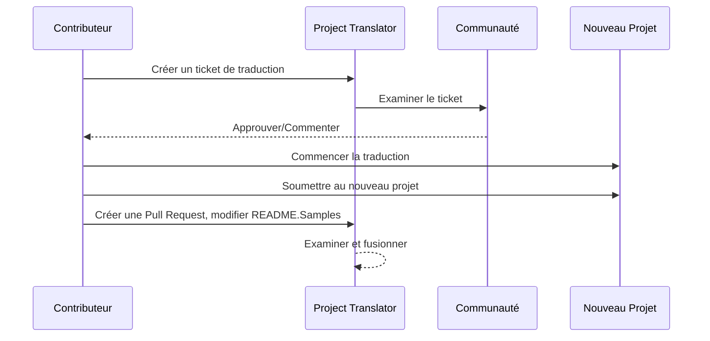

# Project Translator

Une extension VSCode : Un outil facile à utiliser pour la localisation multilingue des projets.

## Exemples

| Projet                                                                              | Dépôt Original                                                                                          | Description                                                                                                                                                               | Étoiles | Tags                                                                                                                                                                                                                                                                                                                                                                                                                                                                                                                                                                                                                                                                 |
| ----------------------------------------------------------------------------------- | -------------------------------------------------------------------------------------------------------- | ------------------------------------------------------------------------------------------------------------------------------------------------------------------------ | ------- | --------------------------------------------------------------------------------------------------------------------------------------------------------------------------------------------------------------------------------------------------------------------------------------------------------------------------------------------------------------------------------------------------------------------------------------------------------------------------------------------------------------------------------------------------------------------------------------------------------------------------------------------------------------------- |
| [algorithm-visualizer](https://github.com/Project-Translation/algorithm-visualizer) | [algorithm-visualizer/algorithm-visualizer](https://github.com/algorithm-visualizer/algorithm-visualizer) | :fireworks:Plateforme en ligne interactive qui visualise les algorithmes à partir de code                                                                               | 47301   | [`algorithm`](https://github.com/topics/algorithm), [`animation`](https://github.com/topics/animation), [`data-structure`](https://github.com/topics/data-structure), [`visualization`](https://github.com/topics/visualization)                                                                                                                                                                                                                                                                                                                                                                                                                                      |
| [algorithms](https://github.com/Project-Translation/algorithms)                     | [algorithm-visualizer/algorithms](https://github.com/algorithm-visualizer/algorithms)                    | :crystal_ball:Visualisations d'algorithmes                                                                                                                              | 401     | N/A                                                                                                                                                                                                                                                                                                                                                                                                                                                                                                                                                                                                                                                                   |
| [cline-docs](https://github.com/Project-Translation/cline-docs)                     | [cline/cline](https://github.com/cline/cline)                                                              | Agent de codage autonome directement intégré à votre IDE, capable de créer/modifier des fichiers, exécuter des commandes, utiliser le navigateur, etc. avec votre permission à chaque étape. | 39572   | N/A                                                                                                                                                                                                                                                                                                                                                                                                                                                                                                                                                                                                                                                                   |
| [cursor-docs](https://github.com/Project-Translation/cursor-docs)                   | [getcursor/docs](https://github.com/getcursor/docs)                                                        | Documentation Open Source de Cursor                                                                                                                                     | 309     | N/A                                                                                                                                                                                                                                                                                                                                                                                                                                                                                                                                                                                                                                                                   |
| [gobyexample](https://github.com/Project-Translation/gobyexample)                   | [mmcgrana/gobyexample](https://github.com/mmcgrana/gobyexample)                                            | Go par l'exemple                                                                                                                                                        | 7523    | N/A                                                                                                                                                                                                                                                                                                                                                                                                                                                                                                                                                                                                                                                                   |
| [golang-website](https://github.com/Project-Translation/golang-website)             | [golang/website](https://github.com/golang/website)                                                        | [mirror] Site officiel de go.dev et golang.org                                                                                                                          | 402     | N/A                                                                                                                                                                                                                                                                                                                                                                                                                                                                                                                                                                                                                                                                   |
| [reference-en-us](https://github.com/Project-Translation/reference-en-us)           | [Fechin/reference](https://github.com/Fechin/reference)                                                    | ⭕ Partagez une fiche mémoire rapide pour développeurs.                                                                                                                  | 7808    | [`awk`](https://github.com/topics/awk), [`bash`](https://github.com/topics/bash), [`chatgpt`](https://github.com/topics/chatgpt), [`cheatsheet`](https://github.com/topics/cheatsheet), [`cheatsheets`](https://github.com/topics/cheatsheets), [`css`](https://github.com/topics/css), [`golang`](https://github.com/topics/golang), [`grep`](https://github.com/topics/grep), [`markdown`](https://github.com/topics/markdown), [`python`](https://github.com/topics/python), [`reference`](https://github.com/topics/reference), [`sed`](https://github.com/topics/sed), [`snippets`](https://github.com/topics/snippets), [`vim`](https://github.com/topics/vim) |
| [styleguide](https://github.com/Project-Translation/styleguide)                     | [google/styleguide](https://github.com/google/styleguide)                                                  | Guides de style pour les projets open-source issus de Google                                                   | 38055   | [`cpplint`](https://github.com/topics/cpplint), [`style-guide`](https://github.com/topics/style-guide), [`styleguide`](https://github.com/topics/styleguide)                                                                                                                                                                                                                                                                                                                                                                                                                                                                                                        |
| [vscode-docs](https://github.com/Project-Translation/vscode-docs)                   | [microsoft/vscode-docs](https://github.com/microsoft/vscode-docs)                                          | Documentation publique pour Visual Studio Code                                                                | 5914    | [`vscode`](https://github.com/topics/vscode)                                                                                                                                                                                                                                                                                                                                                                                                                                                                                                                                                                                                                          |

## Demande de traduction de projet

Si vous souhaitez contribuer à une traduction ou avez besoin qu'un projet soit traduit :

1. Créez un ticket en utilisant le modèle suivant :

```md
**Projet**: [url_du_projet]
**Langue cible**: [code_langue]
**Description**: Description brève expliquant pourquoi cette traduction serait utile
```

2. Flux de travail :



3. Une fois la PR fusionnée, la traduction sera ajoutée à la section Exemples.

Traductions en cours : [Voir les tickets](https://github.com/Project-Translation/project_translator/issues)

## Fonctionnalités

- 📁 Prise en charge de traduction au niveau des dossiers
  - Traduire des dossiers complets dans plusieurs langues
  - Maintenir la structure hiérarchique d'origine
  - Prise en charge de la traduction récursive des sous-dossiers
  - Détection automatique du contenu traduisible
  - Traitement par lots pour traductions efficaces à grande échelle
- 📄 Prise en charge de traduction au niveau des fichiers
  - Traduire des fichiers individuels dans plusieurs langues
  - Préserver la structure et mise en forme originales
  - Prise en charge des modes traduction dossier et fichier
- 💡 Traduction intelligente avec IA
  - Maintient automatiquement l'intégrité de la structure du code
  - Ne traduit que les commentaires de code, préserve la logique
  - Maintient les formats JSON/XML et autres structures de données
  - Qualité professionnelle pour la documentation technique
- ⚙️ Configuration flexible
  - Configurer des dossiers sources et multiples cibles
  - Prise en charge des intervalles de traduction personnalisés
  - Possibilité d'ignorer certains types de fichiers
  - Prise en charge de plusieurs options de modèles IA
- 🚀 Opérations conviviales
  - Affichage en temps réel de l'avancement de la traduction
  - Prise en charge de la pause/reprise/arrêt
  - Maintenance automatique de la structure des dossiers cibles
  - Traduction incrémentielle pour éviter les doublons
- 🔄 Traduction avancée par différences
  - **Mises à jour précises** : Ne traduit que le contenu réellement modifié
  - **Contrôle ligne par ligne** : Maintient exactement la mise en forme et la structure
  - **Traduction incrémentielle** : Idéale pour maintenir la documentation traduite
  - **Compatibilité avec le contrôle de version** : Génère des changements minimaux et ciblés
  - **Efficace économiquement** : Réduit les appels API en ne traduisant que les différences
  - **Sauvegarde automatique** : Crée automatiquement des fichiers de sauvegarde avant d'appliquer les changements

## Installation

1. Rechercher "[Project Translator](https://marketplace.visualstudio.com/items?itemName=techfetch-dev.project-translator)" dans le marketplace des extensions VS Code
2. Cliquer sur installer

## Configuration

L'extension supporte les options de configuration suivantes :

```json
{
  "projectTranslator.specifiedFolders": [
    {
      "sourceFolder": {
        "path": "Chemin du dossier source",
        "lang": "Code langue source"
      },
      "targetFolders": [
        {
          "path": "Chemin du dossier cible",
          "lang": "Code langue cible"
        }
      ]
    }
  ],
  "projectTranslator.diffApply": {
    "enabled": true,
    "validationLevel": "normal",
    "autoBackup": true,
    "maxOperationsPerFile": 100
  },
  "projectTranslator.specifiedFiles": [
    {
      "sourceFile": {
        "path": "Chemin du fichier source",
        "lang": "Code langue source"
      },
      "targetFiles": [
        {
          "path": "Chemin du fichier cible",
          "lang": "Code langue cible"
        }
      ]
    }
  ],
  "projectTranslator.currentVendor": "openai",
  "projectTranslator.vendors": [
    {
      "name": "openai",
      "apiEndpoint": "URL du point d'entrée API",
      "apiKey": "Clé d'authentification API",
      "model": "Nom du modèle à utiliser",
      "rpm": "Nombre maximum de requêtes par minute",
      "maxTokensPerSegment": 4096,
      "timeout": 30,
      "temperature": 0.0
    }
  ]
}
```

Détails des configurations clés :

| Option de configuration                         | Description                                                                                             |
| ----------------------------------------------- | -------------------------------------------------------------------------------------------------------- |
| `projectTranslator.specifiedFolders`            | Plusieurs dossiers sources avec leurs dossiers de destination correspondants pour la traduction         |
| `projectTranslator.specifiedFiles`              | Plusieurs fichiers sources avec leurs fichiers de destination correspondants pour la traduction         |
| `projectTranslator.translationIntervalDays`     | Intervalle de traduction en jours (7 jours par défaut)                                                  |
| `projectTranslator.copyOnly`                    | Fichiers à copier mais non à traduire (avec tableaux `paths` et `extensions`)                           |
| `projectTranslator.ignore`                      | Fichiers à ignorer complètement (avec tableaux `paths` et `extensions`)                                  |
| `projectTranslator.currentVendor`               | Fournisseur API actuellement utilisé                                                                    |
| `projectTranslator.vendors`                     | Liste des configurations des fournisseurs API                                                           |
| `projectTranslator.systemPrompts`               | Tableau de prompts système pour guider le processus de traduction                                       |
| `projectTranslator.userPrompts`                 | Tableau de prompts défini par l'utilisateur, ces prompts seront ajoutés après les systèmes durant la traduction |
| `projectTranslator.segmentationMarkers`         | Marqueurs de segmentation configurés par type de fichier, supports les expressions régulières          |
| `projectTranslator.debug`                       | Activer le mode debug pour enregistrer toutes les requêtes/réponses API dans le canal de sortie (défaut : false) |
| `projectTranslator.logFile`                     | Configuration des fichiers de log (voir [Fonctionnalité des logs](./docs/log-file-feature.md))         |

## Utilisation

1. Ouvrir la palette de commandes (Ctrl+Shift+P / Cmd+Shift+P)
2. Taper "Traduire le projet" et sélectionner la commande
3. Si le dossier source n'est pas configuré, une boîte de sélection apparaîtra
4. Attendre la fin de la traduction

Durant la traduction :

- Possibilité de la mettre en pause/reprendre via les boutons de la barre d'état
- Possibilité d'arrêter le processus à tout moment
- L'avancement s'affiche dans la zone de notification
- Des logs détaillés sont affichés dans le panneau de sortie

## Développement

### Système de build

Cette extension utilise esbuild pour un empaquetage rapide et le développement :

#### Scripts disponibles

- `npm run build` - Version de production avec minification
- `npm run compile` - Version de développement
- `npm run watch` - Mode développement avec recompilation automatique
- `npm test` - Exécuter les tests

#### Tâches VS Code

- **Build** (Ctrl+Shift+P → "Tâches: Exécuter une tâche" → "build") - Empaquette l'extension pour la production
- **Watch** (Ctrl+Shift+P → "Tâches: Exécuter une tâche" → "watch") - Mode développement avec recompilation automatique

### Configuration du développement

1. Cloner le dépôt
2. Exécuter `npm install` pour installer les dépendances
3. Appuyer sur `F5` pour démarrer le débogage ou exécuter la tâche "watch" pour le développement

La configuration esbuild :

- Empaquette tous les fichiers TypeScript en un seul `out/extension.js`
- Exclut l'API VS Code (marquée comme externe)

## Fonctionnalités avancées

### Traduction par différences

Pour plus d'informations sur le mode de traduction avancé par différences, voir le [Guide d'utilisation Diff Apply](./docs/diff-apply-usage.md).

Cette fonctionnalité permet :
- Des mises à jour précises ligne par ligne
- Réduction des coûts API pour les grands fichiers
- Meilleure intégration avec le contrôle de version
- Préservation de la mise en forme du document

### Documentation technique

Pour les détails techniques sur l'implémentation Diff Apply, voir le [Design de traduction Diff Apply](./docs/diff-apply-translation-design.md).
- Génère des maps sources pour les versions de développement
- Minifie le code pour les versions de production
- Fournit une intégration de matchers de problèmes pour VS Code

## Notes

- Vérifier la disponibilité suffisante de quota API
- Recommandé de tester avec de petits projets en premier
- Utiliser des clés API dédiées et les supprimer après usage

## Licence

[Licence](LICENSE)