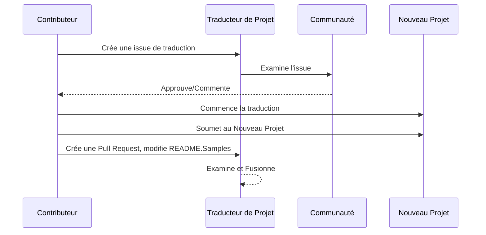

# Traducteur de Projet

Une extension VS Code facile à utiliser pour la localisation multilingue de projets.

Dépôt du projet : `https://github.com/Project-Translation/project_translator`

## Installation

1. Marketplace :
   - VS Code Extensions Marketplace : [https://marketplace.visualstudio.com/items?itemName=techfetch-dev.project-translator](https://marketplace.visualstudio.com/items?itemName=techfetch-dev.project-translator)
   - Open VSX Registry : [https://open-vsx.org/extension/techfetch-dev/project-translator](https://open-vsx.org/extension/techfetch-dev/project-translator)
2. Recherchez `techfetch-dev.project-translator` dans la vue Extensions de VS Code et cliquez sur installer

<!--  -->


## Traductions disponibles

L'extension prend en charge la traduction vers ces langues :

- [简体中文 (zh-cn)](./README.zh-cn.md)
- [繁體中文 (zh-tw)](./README.zh-tw.md)
- [日本語 (ja-jp)](./README.ja-jp.md)
- [한국어 (ko-kr)](./README.ko-kr.md)
- [Français (fr-fr)](./README.fr-fr.md)
- [Deutsch (de-de)](./README.de-de.md)
- [Español (es-es)](./README.es-es.md)
- [Português (pt-br)](./README.pt-br.md)
- [Русский (ru-ru)](./README.ru-ru.md)
- [العربية (ar-sa)](./README.ar-sa.md)
- [العربية (ar-ae)](./README.ar-ae.md)
- [العربية (ar-eg)](./README.ar-eg.md)

## Exemples

| Projet                                                                             | Dépôt original                                                                                       | Description                                                                                                                                                               | Étoiles | Étiquettes                                                                                                                                                                                                                                                                                                                                                                                                                                                                                                                                                                                                                                                           |
| ----------------------------------------------------------------------------------- | --------------------------------------------------------------------------------------------------------- | ------------------------------------------------------------------------------------------------------------------------------------------------------------------------- | ----- | -------------------------------------------------------------------------------------------------------------------------------------------------------------------------------------------------------------------------------------------------------------------------------------------------------------------------------------------------------------------------------------------------------------------------------------------------------------------------------------------------------------------------------------------------------------------------------------------------------------------------------------------------------------------- |
| [algorithm-visualizer](https://github.com/Project-Translation/algorithm-visualizer) | [algorithm-visualizer/algorithm-visualizer](https://github.com/algorithm-visualizer/algorithm-visualizer) | :fireworks:Plateforme interactive en ligne qui visualise les algorithmes à partir du code                                                                                 | 47301 | [`algorithm`](https://github.com/topics/algorithm), [`animation`](https://github.com/topics/animation), [`data-structure`](https://github.com/topics/data-structure), [`visualization`](https://github.com/topics/visualization)                                                                                                                                                                                                                                                                                                                                                                                                                                     |
| [algorithms](https://github.com/Project-Translation/algorithms)                     | [algorithm-visualizer/algorithms](https://github.com/algorithm-visualizer/algorithms)                     | :crystal_ball:Visualisations d'algorithmes                                                                                                                                | 401   | N/A                                                                                                                                                                                                                                                                                                                                                                                                                                                                                                                                                                                                                                                                  |
| [cline-docs](https://github.com/Project-Translation/cline-docs)                     | [cline/cline](https://github.com/cline/cline)                                                             | Agent de codage autonome directement dans votre IDE, capable de créer/modifier des fichiers, exécuter des commandes, utiliser le navigateur, et plus encore avec votre autorisation à chaque étape. | 39572 | N/A                                                                                                                                                                                                                                                                                                                                                                                                                                                                                                                                                                                                                                                                  |
| [cursor-docs](https://github.com/Project-Translation/cursor-docs)                   | [getcursor/docs](https://github.com/getcursor/docs)                                                       | Documentation open source de Cursor                                                                                                                                       | 309   | N/A                                                                                                                                                                                                                                                                                                                                                                                                                                                                                                                                                                                                                                                                  |
| [gobyexample](https://github.com/Project-Translation/gobyexample)                   | [mmcgrana/gobyexample](https://github.com/mmcgrana/gobyexample)                                           | Go par l'exemple                                                                                                                                                          | 7523  | N/A                                                                                                                                                                                                                                                                                                                                                                                                                                                                                                                                                                                                                                                                  |
| [golang-website](https://github.com/Project-Translation/golang-website)             | [golang/website](https://github.com/golang/website)                                                       | [miroir] Accueil des sites go.dev et golang.org                                                                                                                           | 402   | N/A                                                                                                                                                                                                                                                                                                                                                                                                                                                                                                                                                                                                                                                                  |
| [reference-en-us](https://github.com/Project-Translation/reference-en-us)           | [Fechin/reference](https://github.com/Fechin/reference)                                                   | ⭕ Partagez des fiches de référence rapides pour les développeurs.                                                                                                         | 7808  | [`awk`](https://github.com/topics/awk), [`bash`](https://github.com/topics/bash), [`chatgpt`](https://github.com/topics/chatgpt), [`cheatsheet`](https://github.com/topics/cheatsheet), [`cheatsheets`](https://github.com/topics/cheatsheets), [`css`](https://github.com/topics/css), [`golang`](https://github.com/topics/golang), [`grep`](https://github.com/topics/grep), [`markdown`](https://github.com/topics/markdown), [`python`](https://github.com/topics/python), [`reference`](https://github.com/topics/reference), [`sed`](https://github.com/topics/sed), [`snippets`](https://github.com/topics/snippets), [`vim`](https://github.com/topics/vim) |
| [styleguide](https://github.com/Project-Translation/styleguide)                     | [google/styleguide](https://github.com/google/styleguide)                                                 | Guides de style pour les projets open source originaires de Google                                                                                                        | 38055 | [`cpplint`](https://github.com/topics/cpplint), [`style-guide`](https://github.com/topics/style-guide), [`styleguide`](https://github.com/topics/styleguide)                                                                                                                                                                                                                                                                                                                                                                                                                                                                                                         |
| [vscode-docs](https://github.com/Project-Translation/vscode-docs)                   | [microsoft/vscode-docs](https://github.com/microsoft/vscode-docs)                                         | Documentation publique pour Visual Studio Code                                                                                                                            | 5914  | [`vscode`](https://github.com/topics/vscode)                                                                                                                                                                                                                                                                                                                                                                                                                                                                                                                                                                                                                         |

## Demande de traduction de projet

Si vous souhaitez contribuer à une traduction ou avez besoin qu'un projet soit traduit :

1. Créez une issue en utilisant le modèle suivant :

```md
**Projet** : [project_url]
**Langue cible** : [target_lang]
**Description** : Brève description de la valeur ajoutée de cette traduction
```

2. Workflow :



3. Après la fusion de la PR, la traduction sera ajoutée à la section Exemples.

Traductions en cours : [Voir les Issues](https://github.com/Project-Translation/project_translator/issues)

## Fonctionnalités

- 📁 Prise en charge de la traduction au niveau des dossiers
  - Traduire des dossiers entiers de projets en plusieurs langues
  - Maintenir la structure et la hiérarchie originales des dossiers
  - Prise en charge de la traduction récursive des sous-dossiers
  - Détection automatique du contenu traduisible
  - Traitement par lots pour des traductions à grande échelle efficaces
- 📄 Prise en charge de la traduction au niveau des fichiers
  - Traduire des fichiers individuels en plusieurs langues
  - Préserver la structure et le formatage originaux des fichiers
  - Prise en charge des modes de traduction par dossier et par fichier
- 💡 Traduction intelligente avec IA
  - Maintient automatiquement l'intégrité de la structure du code
  - Traduit uniquement les commentaires de code, préserve la logique du code
  - Maintient les formats de données JSON/XML et autres
  - Qualité professionnelle de traduction de documentation technique
- ⚙️ Configuration flexible
  - Configurer le dossier source et plusieurs dossiers cibles
  - Prise en charge des intervalles de traduction personnalisés
  - Définir des types de fichiers spécifiques à ignorer
  - Prise en charge de plusieurs options de modèles d'IA
- 🚀 Opérations conviviales
  - Affichage en temps réel de la progression de la traduction
  - Prise en charge de la pause/reprise/arrêt de la traduction
  - Maintenance automatique de la structure des dossiers cibles
  - Traduction incrémentielle pour éviter les travaux en double
- 🔄 Traduction différentielle (Expérimental)
  - Mode Diff-Apply pour des mises à jour efficaces des traductions existantes
  - Réduit l'utilisation de l'API en ne traduisant que le contenu modifié
  - Préserve l'historique des versions avec des modifications minimales
  - ⚠️ Fonctionnalité expérimentale - voir [Fonctionnalités avancées](#differential-translation-diff-apply-mode) pour plus de détails

## Configuration

L'extension prend en charge les options de configuration suivantes :

```json
{
  "projectTranslator.specifiedFolders": [
    {
      "sourceFolder": {
        "path": "Chemin du dossier source",
        "lang": "Code de la langue source"
      },
      "targetFolders": [
        {
          "path": "Chemin du dossier cible",
          "lang": "Code de la langue cible"
        }
      ]
    }
  ],
  "projectTranslator.specifiedFiles": [
    {
      "sourceFile": {
        "path": "Chemin du fichier source",
        "lang": "Code de la langue source"
      },
      "targetFiles": [
        {
          "path": "Chemin du fichier cible",
          "lang": "Code de la langue cible"
        }
      ]
    }
  ],
  "projectTranslator.currentVendor": "openai",
  "projectTranslator.vendors": [
    {
      "name": "openai",
      "apiEndpoint": "URL du point de terminaison de l'API",
      "apiKeyEnvVarName": "MY_OPENAI_API_KEY",
      "model": "gpt-4o",
      "rpm": "10",
      "maxTokensPerSegment": 4096,
      "timeout": 180,
      "temperature": 0.1
    }
  ],
  "projectTranslator.userPrompts": [
      "1. Ne doit pas traduire si le fichier Markdown a 'draft' défini à 'true' dans le front matter.",
      "2. Remplacer './readmes/' dans les phrases par './'",
  ],
  "projectTranslator.ignore": {
    "paths": [
      "**/node_modules/**"
    ],
    "extensions": [
      ".log"
    ]
  },
}
```

Détails clés de la configuration :

| Option de configuration                        | Description                                                                                    |
| ------------------------------------------- | ---------------------------------------------------------------------------------------------- |
| `projectTranslator.specifiedFolders`        | Plusieurs dossiers sources avec leurs dossiers de destination correspondants pour la traduction |
| `projectTranslator.specifiedFiles`          | Plusieurs fichiers sources avec leurs fichiers de destination correspondants pour la traduction |
| `projectTranslator.translationIntervalDays` | Intervalle de traduction en jours (par défaut 7 jours)                                         |
| `projectTranslator.copyOnly`                | Fichiers à copier mais pas à traduire (avec tableaux `paths` et `extensions`)                  |
| `projectTranslator.ignore`                  | Fichiers à ignorer complètement (avec tableaux `paths` et `extensions`)                        |
| `projectTranslator.skipFrontMatterMarkers`  | Ignorer les fichiers basés sur les marqueurs de front matter (avec `enabled` et `markers`)     |
| `projectTranslator.currentVendor`           | Fournisseur d'API actuellement utilisé                                                        |
| `projectTranslator.vendors`                 | Liste de configuration des fournisseurs d'API (peut utiliser apiKey directement ou apiKeyEnvVarName pour les variables d'environnement) |
| `projectTranslator.systemPromptLanguage`    | Langue utilisée pour les invites système intégrées (par défaut : en). Affecte la façon dont le modèle est instruit, pas la langue de l'interface utilisateur |
| `projectTranslator.systemPrompts`           | Tableau d'invites système pour guider le processus de traduction                               |
| `projectTranslator.userPrompts`             | Tableau d'invites définies par l'utilisateur, ces invites seront ajoutées après les invites système pendant la traduction |
| `projectTranslator.segmentationMarkers`     | Marqueurs de segmentation configurés par type de fichier, prend en charge les expressions régulières |
| `projectTranslator.debug`                   | Activer le mode debug pour enregistrer toutes les requêtes et réponses de l'API dans le canal de sortie (par défaut : false) |
| `projectTranslator.logFile`                 | Configuration des fichiers de log de debug (voir [Fonctionnalité des fichiers de log](./docs/log-file-feature.md)) |
| `projectTranslator.diffApply.enabled`       | Activer le mode de traduction différentielle expérimental (par défaut : false)                 |

## Utilisation

1. Ouvrez la palette de commandes (Ctrl+Shift+P / Cmd+Shift+P)
2. Tapez "Translate Project" et sélectionnez la commande
3. Si le dossier source n'est pas configuré, une boîte de dialogue de sélection de dossier apparaîtra
4. Attendez que la traduction se termine

Pendant la traduction :

- Peut mettre en pause/reprendre la traduction via les boutons de la barre d'état
- Peut arrêter le processus de traduction à tout moment
- La progression de la traduction est affichée dans la zone de notification
- Les logs détaillés sont affichés dans le panneau de sortie

## Développement

### Système de build

Cette extension utilise esbuild pour un bundling et un développement rapides :

#### Scripts disponibles

- `npm run build` - Build de production avec minification
- `npm run compile` - Build de développement
- `npm run watch` - Mode watch pour le développement
- `npm test` - Exécuter les tests

#### Tâches VS Code

- **Build** (Ctrl+Shift+P → "Tasks: Run Task" → "build") - Bundle l'extension pour la production
- **Watch** (Ctrl+Shift+P → "Tasks: Run Task" → "watch") - Mode développement avec reconstruction automatique

### Configuration du développement

1. Clonez le dépôt
2. Exécutez `npm install` pour installer les dépendances
3. Appuyez sur `F5` pour démarrer le débogage ou exécutez la tâche "watch" pour le développement

La configuration esbuild :

- Bundle tous les fichiers TypeScript en un seul `out/extension.js`
- Exclut l'API VS Code (marquée comme externe)

## Fonctionnalités avancées

### Utilisation des variables d'environnement pour les clés API

Project Translator prend en charge l'utilisation de variables d'environnement pour les clés API, ce qui est une approche plus sécurisée que de stocker les clés API directement dans les fichiers de configuration :

1. Configurez votre fournisseur avec une propriété `apiKeyEnvVarName` :

```json
{
  "projectTranslator.vendors": [
    {
      "name": "openai",
      "apiEndpoint": "https://api.openai.com/v1",
      "apiKeyEnvVarName": "OPENAI_API_KEY",
      "model": "gpt-4"
    },
    {
      "name": "openrouter",
      "apiEndpoint": "https://openrouter.ai/api/v1",
      "apiKeyEnvVarName": "OPENROUTER_API_KEY",
      "model": "anthropic/claude-3-opus"
    }
  ]
}
```

2. Définissez la variable d'environnement dans votre système :
   - Sur Windows : `set OPENAI_API_KEY=votre_clé_api`
   - Sur macOS/Linux : `export OPENAI_API_KEY=votre_clé_api`

3. Lorsque l'extension s'exécute, elle :
   - Vérifie d'abord si `apiKey` est fourni directement dans la configuration
   - Sinon, elle recherche la variable d'environnement spécifiée par `apiKeyEnvVarName`

Cette approche garde vos clés API hors des fichiers de configuration et des systèmes de contrôle de version.

### Ignorer la traduction basée sur le front matter

Project Translator peut ignorer la traduction des fichiers Markdown basée sur leurs métadonnées de front matter. Ceci est utile pour les documents brouillons ou les fichiers marqués comme ne nécessitant pas de traduction.

Pour activer cette fonctionnalité, configurez l'option `projectTranslator.skipFrontMatterMarkers` :

```json
{
  "projectTranslator.skipFrontMatterMarkers": {
    "enabled": true,
    "markers": [
      {
        "key": "draft",
        "value": "true"
      },
      {
        "key": "translate",
        "value": "false"
      }
    ]
  }
}
```

Avec cette configuration, tout fichier Markdown avec un front matter contenant `draft: true` ou `translate: false` sera ignoré pendant la traduction et copié directement à l'emplacement cible.

Exemple de fichier Markdown qui serait ignoré :
```
---
draft: true
title: "Document brouillon"
---

Ce document est un brouillon et ne doit pas être traduit.
```

### Mode de traduction différentielle (Diff-Apply)

> **⚠️ Avertissement Fonctionnalité Expérimentale** : Le mode de traduction différentielle est actuellement une fonctionnalité expérimentale et peut présenter des problèmes de stabilité et de compatibilité. Il est recommandé de l'utiliser avec prudence dans les environnements de production et de toujours sauvegarder les fichiers importants.

L'extension prend en charge un mode de traduction différentielle optionnel (diff-apply). Lorsqu'il est activé, l'extension envoie à la fois le contenu source et le fichier cible traduit existant au modèle. Le modèle doit renvoyer un ou plusieurs blocs SEARCH/REPLACE (texte brut, sans code fences). L'extension applique ces blocs localement pour minimiser les changements, réduire l'utilisation de l'API et mieux préserver l'historique des versions.

- **Activation** : Configurez `projectTranslator.diffApply.enabled` dans les paramètres de VS Code ou `project.translation.json` (par défaut : `false`).
- **Options** :
  - `validationLevel` : `normal` ou `strict` (par défaut : `normal`). En mode `strict`, les marqueurs invalides ou les échecs de correspondance provoqueront une erreur et l'extension reviendra au flux de traduction standard.
  - `autoBackup` : Si vrai, crée une sauvegarde `.bak` du fichier cible avant d'appliquer les modifications (par défaut : `true`).
  - `maxOperationsPerFile` : (conservé pour compatibilité) non utilisé par la nouvelle stratégie.

Workflow :
1. Si `diffApply.enabled` est `true` et que le fichier cible existe, l'extension lit les contenus source et cible.
2. Elle appelle le modèle avec une invite différentielle et demande de renvoyer des blocs SEARCH/REPLACE en texte brut.
3. Localement, l'extension analyse et applique les blocs SEARCH/REPLACE. Si l'application échoue, elle revient à la traduction complète normale et écrase le fichier cible.

Exemple SEARCH/REPLACE (plusieurs blocs autorisés) :

```
<<<<<<< SEARCH
:start_line: 10
-------
const label = "Old"
=======
const label = "New"
>>>>>>> REPLACE

<<<<<<< SEARCH
:start_line: 25
-------
function foo() {
  return 1
}
=======
function foo() {
  return 2
}
>>>>>>> REPLACE
```

Notes :
- Utilisez le contenu exact, y compris l'indentation et les espaces dans les sections SEARCH. Si vous n'êtes pas sûr, utilisez le dernier contenu du fichier.
- Gardez une seule ligne de `=======` entre SEARCH et REPLACE.
- Si aucun changement n'est nécessaire, le modèle doit renvoyer une chaîne vide.

Pourquoi la traduction différentielle fonctionne mal actuellement (explication)

- **Défis d'alignement et de comparaison interlangues** : La traduction différentielle nécessite d'envoyer à la fois le document source original et le document traduit existant au modèle, et le modèle doit les comparer à travers les langues pour décider quelles parties de la traduction doivent être modifiées. C'est une tâche fondamentalement plus difficile que de modifier un seul document en place car le modèle doit aligner avec précision les segments dans différentes langues et juger les différences sémantiques.

- **Complexité de la préservation du format et des limites** : De nombreux documents contiennent des blocs de code, des tableaux, des marqueurs frontaux ou des espaces réservés spéciaux. Un workflow diff fiable doit préserver ces structures tout en effectuant des modifications textuelles. Si le modèle ne peut pas produire de résultats qui suivent strictement le format SEARCH/REPLACE, l'application automatique des modifications peut introduire des régressions de formatage ou des erreurs structurelles.

- **Problèmes de contexte et de cohérence terminologique** : Les petites modifications localisées dépendent souvent d'un contexte plus large et d'un glossaire de terminologie/style existant. Lorsqu'on lui demande de produire des modifications minimales, le modèle peut négliger la cohérence globale (terminologie, style, commentaires, noms de variables), entraînant des traductions incohérentes ou sémantiquement décalées.

- **Stabilité des modèles et compromis de coût** : Atteindre une traduction différentielle fiable nécessite des modèles avec un raisonnement comparatif solide et des formats de sortie stables et prévisibles. Les modèles grand public actuels ne fournissent pas de manière fiable à la fois un alignement interlangues robuste et des sorties strictement formatées à un coût raisonnable, donc les systèmes reviennent souvent à une retraduction complète pour garantir la justesse.

Par conséquent, bien que la traduction différentielle puisse théoriquement réduire les jetons de sortie coûteux et mieux préserver l'historique des versions, elle est actuellement limitée par les capacités de comparaison interlangues des modèles et leur stabilité de sortie. Cette fonctionnalité reste expérimentale ; les atténuations recommandées incluent la conservation de sauvegardes automatiques (`autoBackup: true`), l'utilisation d'un niveau de validation tolérant (`validationLevel: "normal"`) et le retour à une retraduction complète en cas d'échec de correspondance ou de formatage. À l'avenir, des post-processeurs d'alignement bilingues spécialisés ou des modèles personnalisés plus petits pourraient améliorer la stabilité de l'approche diff.

Économies de coûts et pourquoi cela aide

- **Coût des jetons d'entrée vs de sortie** : Les API de grands modèles facturent généralement différemment les jetons d'entrée (prompt) et de sortie (completion). Souvent, les jetons de sortie sont nettement plus chers car le modèle génère un texte plus long. Diff-apply aide car nous envoyons la **source mise à jour (entrée)** et le **fichier traduit existant (entrée)** au modèle et demandons un JSON compact des modifications. La réponse du modèle est un petit JSON (peu de jetons de sortie) plutôt qu'un fichier retraduit complet (beaucoup de jetons de sortie), donc vous payez beaucoup moins pour la partie coûteuse de la sortie.

- **Envoyer uniquement ce qui a changé** : Au lieu de retraduire tout le fichier à chaque petit changement, diff-apply demande au modèle de calculer les opérations de modification minimales pour mettre à jour la traduction existante. Ceci est particulièrement efficace pour les fichiers précédemment traduits qui ne reçoivent que des modifications incrémentielles.

- **Meilleur pour les fichiers formatés** : Les fichiers avec un formatage strict (JSON, XML, Markdown avec blocs de code) bénéficient grandement car diff-apply préserve la structure et ne modifie que les parties textuelles nécessitant une traduction. Cela réduit le risque de régressions liées au format et de jetons de sortie supplémentaires causés par le reformatage du modèle.

- **Unité de base orientée ligne, agrégation plus intelligente** : L'outil traite l'unité de traduction de base comme une "ligne", et la stratégie SEARCH/REPLACE applique une correspondance exacte ou approximative près de `:start_line:`. Utilisez `validationLevel: "normal"` pour un comportement tolérant et `"strict"` lorsque vous avez besoin de modifications conservatrices et exactes.

Quand utiliser diff-apply :

- Utilisez lorsque le fichier cible existe déjà et a été précédemment traduit.
- Utilisez pour les grands documents formatés où la retraduction complète du fichier serait coûteuse.
- Évitez pour les fichiers entièrement nouveaux sans traduction précédente, ou lorsque vous voulez une retraduction fraîche.

### Documentation de conception

- Génère des source maps pour les builds de développement
- Minifie le code pour les builds de production
- Fournit une intégration de matcher de problèmes pour VS Code

## Notes

- Assurez-vous d'avoir un quota d'utilisation d'API suffisant
- Il est recommandé de tester d'abord avec de petits projets
- Utilisez des clés API dédiées et supprimez-les après utilisation

## Licence

[Licence](LICENSE)