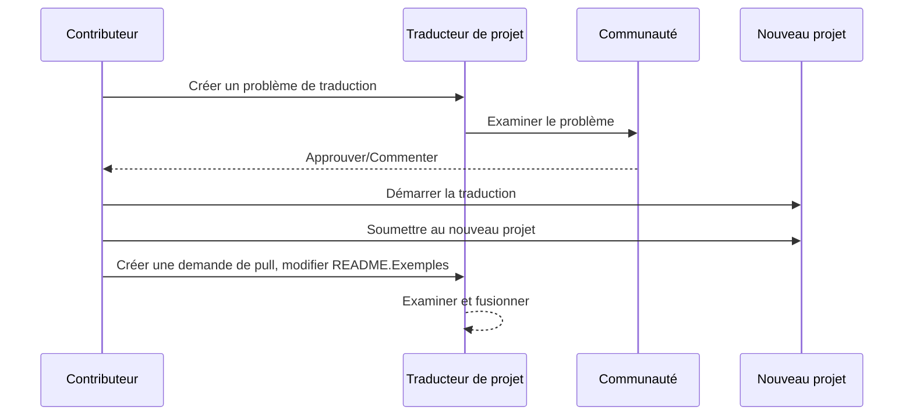

# Traducteur de projet

Une extension VSCode : Un outil facile à utiliser pour la localisation multilingue des projets.

## Traductions disponibles

L'extension prend en charge la traduction vers ces langues :

- [简体中文 (zh-cn)](./readmes/README.zh-cn.md)
- [繁體中文 (zh-tw)](./readmes/README.zh-tw.md)
- [日本語 (ja-jp)](./readmes/README.ja-jp.md)
- [한국어 (ko-kr)](./readmes/README.ko-kr.md)
- [Français (fr-fr)](./readmes/README.fr-fr.md)
- [Deutsch (de-de)](./readmes/README.de-de.md)
- [Español (es-es)](./readmes/README.es-es.md)
- [Português (pt-br)](./readmes/README.pt-br.md)
- [Русский (ru-ru)](./readmes/README.ru-ru.md)
- [العربية (ar-sa)](./readmes/README.ar-sa.md)
- [العربية (ar-ae)](./readmes/README.ar-ae.md)
- [العربية (ar-eg)](./readmes/README.ar-eg.md)

## Exemples

| Projet                                                   | Langues                                                                                                                                                 |
| --------------------------------------------------------- | --------------------------------------------------------------------------------------------------------------------------------------------------------- |
| [google/styleguide](https://github.com/google/styleguide) | [en-us](https://github.com/google/styleguide) original par @google<br>[zh-cn](https://github.com/Project-Translation/styleguide-zh-cn) traduit par @jqknono |

## Demande de traduction de projet

Si vous souhaitez contribuer à une traduction ou avez besoin qu'un projet soit traduit :

1. Créez un problème en utilisant le modèle suivant :

```md
**Projet** : [project_url]
**Langue cible** : [target_lang]
**Description** : Brève description de la raison pour laquelle cette traduction serait précieuse
```

2. Flux de travail :



3. Après la fusion de la PR, la traduction sera ajoutée à la section Exemples.

Traductions en cours : [Voir les problèmes](https://github.com/Project-Translation/project_translator/issues)

## Fonctionnalités
- 📁 Support de traduction au niveau des dossiers
  - Traduisez des dossiers de projet entiers en plusieurs langues
  - Maintenez la structure et la hiérarchie originales des dossiers
  - Support pour la traduction récursive des sous-dossiers
  - Détection automatique du contenu traduisible
  - Traitement par lots pour des traductions à grande échelle efficaces
- 📄 Support de traduction au niveau des fichiers
  - Traduisez des fichiers individuels en plusieurs langues
  - Préservez la structure et la mise en forme originales des fichiers
  - Support pour les modes de traduction de dossiers et de fichiers
- 💡 Traduction intelligente avec IA
  - Maintains automatiquement l'intégrité de la structure du code
  - Traduit uniquement les commentaires du code, préserve la logique du code
  - Maintains les formats de structures de données JSON/XML et autres
  - Qualité de traduction de documentation technique professionnelle
- ⚙️ Configuration flexible
  - Configurez le dossier source et plusieurs dossiers cibles
  - Support pour des intervalles de traduction de fichiers personnalisés
  - Définissez des types de fichiers spécifiques à ignorer
  - Support pour plusieurs options de modèles d'IA
- 🚀 Opérations conviviales
  - Affichage en temps réel de la progression de la traduction
  - Support pour la pause/reprise/arrêt de la traduction
  - Maintenance automatique de la structure des dossiers cibles
  - Traduction incrémentale pour éviter le travail en double

## Installation

1. Recherchez "[Project Translator](https://marketplace.visualstudio.com/items?itemName=techfetch-dev.project-translator)" dans le marketplace des extensions de VS Code
2. Cliquez sur installer

## Configuration

L'extension prend en charge les options de configuration suivantes :

```json
{
  "projectTranslator.specifiedFolders": [
    {
      "sourceFolder": {
        "path": "Chemin du dossier source",
        "lang": "Code de langue source"
      },
      "destFolders": [
        {
          "path": "Chemin du dossier cible",
          "lang": "Code de langue cible"
        }
      ]
    }
  ],
  "projectTranslator.specifiedFiles": [
    {
      "sourceFile": {
        "path": "Chemin du fichier source",
        "lang": "Code de langue source"
      },
      "destFiles": [
        {
          "path": "Chemin du fichier cible",
          "lang": "Code de langue cible"
        }
      ]
    }
  ],
  "projectTranslator.currentVendor": "openai",
  "projectTranslator.vendors": [
    {
      "name": "openai",
      "apiEndpoint": "URL du point de terminaison de l'API",
      "apiKey": "Clé d'authentification de l'API",
      "model": "Nom du modèle à utiliser",
      "rpm": "Nombre maximum de requêtes par minute",
      "maxTokensPerSegment": 4096,
      "timeout": 30,
      "temperature": 0.0
    }
  ]
}
```

Détails clés de la configuration :
| Option de configuration                        | Description                                                                                    |
| ---------------------------------------------- | ---------------------------------------------------------------------------------------------- |
| `projectTranslator.specifiedFolders`           | Plusieurs dossiers sources avec leurs dossiers de destination correspondants pour la traduction |
| `projectTranslator.specifiedFiles`             | Plusieurs fichiers sources avec leurs fichiers de destination correspondants pour la traduction |
| `projectTranslator.translationIntervalDays`    | Intervalle de traduction en jours (par défaut 7 jours)                                         |
| `projectTranslator.ignoreTranslationExtensions`| Liste des extensions de fichiers texte qui n'ont pas besoin de traduction, ces fichiers seront copiés directement |
| `projectTranslator.ignorePaths`                | Liste des motifs de chemins ignorés utilisant des jokers, ces fichiers ne seront pas copiés    |
| `projectTranslator.currentVendor`              | Fournisseur d'API actuel en utilisation                                                        |
| `projectTranslator.vendors`                    | Liste de configuration des fournisseurs d'API                                                  |
| `projectTranslator.systemPrompts`              | Tableau de prompts système pour guider le processus de traduction                               |
| `projectTranslator.userPrompts`                | Tableau de prompts définis par l'utilisateur, ces prompts seront ajoutés après les prompts système pendant la traduction |
| `projectTranslator.segmentationMarkers`        | Marqueurs de segmentation configurés par type de fichier, prend en charge les expressions régulières |

## Utilisation

1. Ouvrez la palette de commandes (Ctrl+Shift+P / Cmd+Shift+P)
2. Tapez "Traduire le projet" et sélectionnez la commande
3. Si le dossier source n'est pas configuré, une boîte de dialogue de sélection de dossier apparaîtra
4. Attendez que la traduction soit terminée

Pendant la traduction :

- Vous pouvez mettre en pause/reprendre la traduction via les boutons de la barre d'état
- Vous pouvez arrêter le processus de traduction à tout moment
- La progression de la traduction est affichée dans la zone de notification
- Les journaux détaillés sont affichés dans le panneau de sortie

## Notes

- Assurez-vous d'avoir un quota d'utilisation de l'API suffisant
- Il est recommandé de tester d'abord avec de petits projets
- Utilisez des clés API dédiées et retirez-les après la complétion

## Licence

[Licence](LICENSE)