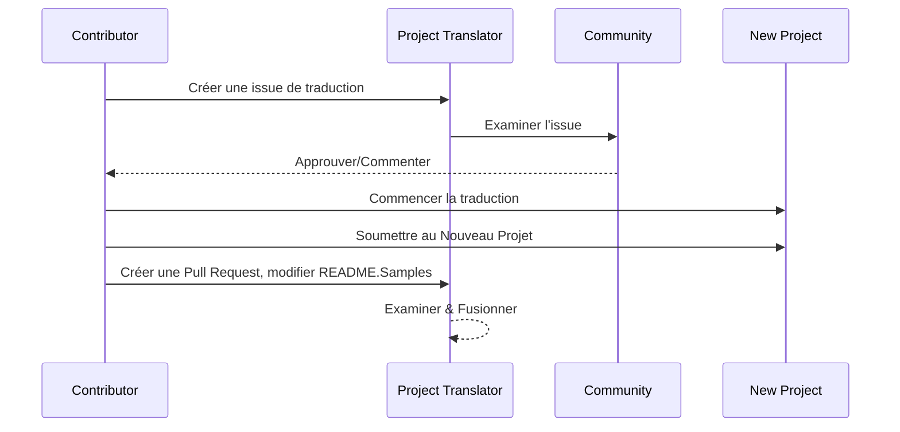

# Traducteur de Projet

Une extension vscode facile à utiliser pour la localisation multi-langue de projets.

Dépôt du projet : `https://github.com/Project-Translation/project_translator`

<!--  -->


## Traductions Disponibles

L'extension prend en charge la traduction vers ces langues :

- [简体中文 (zh-cn)](./readmes/README.zh-cn.md)
- [繁體中文 (zh-tw)](./readmes/README.zh-tw.md)
- [日本語 (ja-jp)](./readmes/README.ja-jp.md)
- [한국어 (ko-kr)](./readmes/README.ko-kr.md)
- [Français (fr-fr)](./readmes/README.fr-fr.md)
- [Deutsch (de-de)](./readmes/README.de-de.md)
- [Español (es-es)](./readmes/README.es-es.md)
- [Português (pt-br)](./readmes/README.pt-br.md)
- [Русский (ru-ru)](./readmes/README.ru-ru.md)
- [العربية (ar-sa)](./readmes/README.ar-sa.md)
- [العربية (ar-ae)](./readmes/README.ar-ae.md)
- [العربية (ar-eg)](./readmes/README.ar-eg.md)

## Exemples

| Projet                                                                              | Dépôt Original                                                                                             | Description                                                                                                                                                                 | Étoiles | Tags                                                                                                                                                                                                                                                                                                                                                                                                                                                                                                                                                                                                                                                                 |
| ----------------------------------------------------------------------------------- | --------------------------------------------------------------------------------------------------------- | --------------------------------------------------------------------------------------------------------------------------------------------------------------------------- | ------- | -------------------------------------------------------------------------------------------------------------------------------------------------------------------------------------------------------------------------------------------------------------------------------------------------------------------------------------------------------------------------------------------------------------------------------------------------------------------------------------------------------------------------------------------------------------------------------------------------------------------------------------------------------------------- |
| [algorithm-visualizer](https://github.com/Project-Translation/algorithm-visualizer) | [algorithm-visualizer/algorithm-visualizer](https://github.com/algorithm-visualizer/algorithm-visualizer) | :fireworks:Plateforme En Ligne Interactive qui Visualise les Algorithmes à Partir du Code                                                                                   | 47301   | [`algorithm`](https://github.com/topics/algorithm), [`animation`](https://github.com/topics/animation), [`data-structure`](https://github.com/topics/data-structure), [`visualization`](https://github.com/topics/visualization)                                                                                                                                                                                                                                                                                                                                                                                                                                     |
| [algorithms](https://github.com/Project-Translation/algorithms)                     | [algorithm-visualizer/algorithms](https://github.com/algorithm-visualizer/algorithms)                     | :crystal_ball:Visualisations d'Algorithmes                                                                                                                                  | 401     | N/A                                                                                                                                                                                                                                                                                                                                                                                                                                                                                                                                                                                                                                                                  |
| [cline-docs](https://github.com/Project-Translation/cline-docs)                     | [cline/cline](https://github.com/cline/cline)                                                             | Agent de codage autonome directement dans votre IDE, capable de créer/modifier des fichiers, d'exécuter des commandes, d'utiliser le navigateur, et plus, avec votre permission à chaque étape. | 39572   | N/A                                                                                                                                                                                                                                                                                                                                                                                                                                                                                                                                                                                                                                                                  |
| [cursor-docs](https://github.com/Project-Translation/cursor-docs)                   | [getcursor/docs](https://github.com/getcursor/docs)                                                       | Documentation Open Source de Cursor                                                                                                                                         | 309     | N/A                                                                                                                                                                                                                                                                                                                                                                                                                                                                                                                                                                                                                                                                  |
| [gobyexample](https://github.com/Project-Translation/gobyexample)                   | [mmcgrana/gobyexample](https://github.com/mmcgrana/gobyexample)                                           | Go par Exemple                                                                                                                                                              | 7523    | N/A                                                                                                                                                                                                                                                                                                                                                                                                                                                                                                                                                                                                                                                                  |
| [golang-website](https://github.com/Project-Translation/golang-website)             | [golang/website](https://github.com/golang/website)                                                       | [miroir] Accueil des sites go.dev et golang.org                                                                                                                             | 402     | N/A                                                                                                                                                                                                                                                                                                                                                                                                                                                                                                                                                                                                                                                                  |
| [reference-en-us](https://github.com/Project-Translation/reference-en-us)           | [Fechin/reference](https://github.com/Fechin/reference)                                                   | ⭕ Partagez des aides-mémoire de référence rapide pour les développeurs.                                                                                                    | 7808    | [`awk`](https://github.com/topics/awk), [`bash`](https://github.com/topics/bash), [`chatgpt`](https://github.com/topics/chatgpt), [`cheatsheet`](https://github.com/topics/cheatsheet), [`cheatsheets`](https://github.com/topics/cheatsheets), [`css`](https://github.com/topics/css), [`golang`](https://github.com/topics/golang), [`grep`](https://github.com/topics/grep), [`markdown`](https://github.com/topics/markdown), [`python`](https://github.com/topics/python), [`reference`](https://github.com/topics/reference), [`sed`](https://github.com/topics/sed), [`snippets`](https://github.com/topics/snippets), [`vim`](https://github.com/topics/vim) |
| [styleguide](https://github.com/Project-Translation/styleguide)                     | [google/styleguide](https://github.com/google/styleguide)                                                 | Guides de style pour les projets open source d'origine Google                                                                                                               | 38055   | [`cpplint`](https://github.com/topics/cpplint), [`style-guide`](https://github.com/topics/style-guide), [`styleguide`](https://github.com/topics/styleguide)                                                                                                                                                                                                                                                                                                                                                                                                                                                                                                         |
| [vscode-docs](https://github.com/Project-Translation/vscode-docs)                   | [microsoft/vscode-docs](https://github.com/microsoft/vscode-docs)                                         | Documentation publique pour Visual Studio Code                                                                                                                              | 5914    | [`vscode`](https://github.com/topics/vscode)                                                                                                                                                                                                                                                                                                                                                                                                                                                                                                                                                                                                                         |

## Demander une Traduction de Projet

Si vous souhaitez contribuer à une traduction ou avez besoin qu'un projet soit traduit :

1. Créez une issue en utilisant le modèle suivant :

```md
**Projet** : [project_url]
**Langue Cible** : [target_lang]
**Description** : Brève description de la valeur de cette traduction
```

2. Flux de travail :



3. Après la fusion de la PR, la traduction sera ajoutée à la section Exemples.

Traductions en cours : [Voir les Issues](https://github.com/Project-Translation/project_translator/issues)

## Fonctionnalités

- 📁 Support de Traduction au Niveau des Dossiers
  - Traduire des dossiers de projets entiers vers plusieurs langues
  - Maintenir la structure et la hiérarchie des dossiers d'origine
  - Support de la traduction récursive des sous-dossiers
  - Détection automatique du contenu traduisible
  - Traitement par lot pour des traductions à grande échelle efficaces
- 📄 Support de Traduction au Niveau des Fichiers
  - Traduire des fichiers individuels vers plusieurs langues
  - Préserver la structure et le formatage des fichiers d'origine
  - Support des modes de traduction de dossier et de fichier
- 💡 Traduction Intelligente avec l'IA
  - Maintient automatiquement l'intégrité de la structure du code
  - Traduit uniquement les commentaires de code, préserve la logique du code
  - Maintient les formats des structures de données JSON/XML et autres
  - Qualité de traduction professionnelle pour la documentation technique
- ⚙️ Configuration Flexible
  - Configurer le dossier source et plusieurs dossiers cibles
  - Support des intervalles de traduction de fichiers personnalisés
  - Définir des types de fichiers spécifiques à ignorer
  - Support de plusieurs options de modèles d'IA
- 🚀 Opérations Conviviales
  - Affichage de la progression de la traduction en temps réel
  - Support de la pause/reprise/arrêt de la traduction
  - Maintenance automatique de la structure du dossier cible
  - Traduction incrémentielle pour éviter les travaux en double
- 🔄 Traduction Différentielle (Expérimental)
  - Mode diff-apply pour des mises à jour efficaces des traductions existantes
  - Réduit l'utilisation de l'API en ne traduisant que le contenu modifié
  - Préserve l'historique des versions avec des modifications minimales
  - ⚠️ Fonctionnalité expérimentale - voir [Fonctionnalités Avancées](#differential-translation-diff-apply-mode) pour plus de détails

## Installation

1. Recherchez "[Project Translator](https://marketplace.visualstudio.com/items?itemName=techfetch-dev.project-translator)" dans la marketplace d'extensions VS Code
2. Cliquez sur installer
   
Alternativement, installez depuis Visual Studio Marketplace : `https://marketplace.visualstudio.com/items?itemName=techfetch-dev.project-translator` ou recherchez `techfetch-dev.project-translator` dans la vue Extensions de VS Code.

## Configuration

L'extension prend en charge les options de configuration suivantes :

```json
{
  "projectTranslator.specifiedFolders": [
    {
      "sourceFolder": {
        "path": "Chemin du dossier source",
        "lang": "Code de la langue source"
      },
      "targetFolders": [
        {
          "path": "Chemin du dossier cible",
          "lang": "Code de la langue cible"
        }
      ]
    }
  ],
  "projectTranslator.specifiedFiles": [
    {
      "sourceFile": {
        "path": "Chemin du fichier source",
        "lang": "Code de la langue source"
      },
      "targetFiles": [
        {
          "path": "Chemin du fichier cible",
          "lang": "Code de la langue cible"
        }
      ]
    }
  ],
  "projectTranslator.currentVendor": "openai",
  "projectTranslator.vendors": [
    {
      "name": "openai",
      "apiEndpoint": "URL de l'endpoint de l'API",
      "apiKeyEnvVarName": "MY_OPENAI_API_KEY",
      "model": "gpt-4o",
      "rpm": "10",
      "maxTokensPerSegment": 4096,
      "timeout": 180,
      "temperature": 0.1
    }
  ],
  "projectTranslator.userPrompts": [
      "1. Should return no need translate if the markdown file has 'draft' set to 'true' in the front matter.",
      "2. './readmes/' in the sentences should replace with './'",
  ],
  "projectTranslator.ignore": {
    "paths": [
      "**/node_modules/**"
    ],
    "extensions": [
      ".log"
    ]
  },
}
```

Détails de la configuration clé :

| Option de Configuration                     | Description                                                                                                   |
| ------------------------------------------- | ------------------------------------------------------------------------------------------------------------- |
| `projectTranslator.specifiedFolders`        | Plusieurs dossiers source avec leurs dossiers de destination correspondants pour la traduction                |
| `projectTranslator.specifiedFiles`          | Plusieurs fichiers source avec leurs fichiers de destination correspondants pour la traduction                |
| `projectTranslator.translationIntervalDays` | Intervalle de traduction en jours (par défaut 7 jours)                                                       |
| `projectTranslator.copyOnly`                | Fichiers à copier mais ne pas traduire (avec des tableaux `paths` et `extensions`)                             |
| `projectTranslator.ignore`                  | Fichiers à ignorer complètement (avec des tableaux `paths` et `extensions`)                                    |
| `projectTranslator.skipFrontMatterMarkers`  | Ignorer les fichiers en fonction des marqueurs de front matter (avec des tableaux `enabled` et `markers`)      |
| `projectTranslator.currentVendor`           | Fournisseur d'API actuellement utilisé                                                                        |
| `projectTranslator.vendors`                 | Liste de configuration des fournisseurs d'API (peut utiliser apiKey directement ou apiKeyEnvVarName pour les variables d'environnement) |
| `projectTranslator.systemPrompts`           | Tableau de prompts système pour guider le processus de traduction                                              |
| `projectTranslator.userPrompts`             | Tableau de prompts définis par l'utilisateur, ces prompts seront ajoutés après les prompts système lors de la traduction |
| `projectTranslator.segmentationMarkers`     | Marqueurs de segmentation configurés par type de fichier, prend en charge les expressions régulières          |
| `projectTranslator.debug`                   | Activer le mode de débogage pour enregistrer toutes les requêtes et réponses de l'API dans le canal de sortie (par défaut : false) |
| `projectTranslator.logFile`                 | Configuration des fichiers de log de débogage (voir [Fonctionnalité de Fichier de Log](./docs/log-file-feature.md)) |
| `projectTranslator.diffApply.enabled`       | Activer le mode de traduction différentielle expérimental (par défaut : false)                                 |

## Utilisation

1. Ouvrez la palette de commandes (Ctrl+Shift+P / Cmd+Shift+P)
2. Tapez "Translate Project" et sélectionnez la commande
3. Si le dossier source n'est pas configuré, une boîte de dialogue de sélection de dossier apparaîtra
4. Attendez la fin de la traduction

Pendant la traduction :

- Peut mettre en pause/reprendre la traduction via les boutons de la barre d'état
- Peut arrêter le processus de traduction à tout moment
- La progression de la traduction est affichée dans la zone de notification
- Des journaux détaillés sont affichés dans le panneau de sortie

## Développement

### Système de Build

Cette extension utilise esbuild pour le bundling rapide et le développement :

#### Scripts Disponibles

- `npm run build` - Build de production avec minification
- `npm run compile` - Build de développement
- `npm run watch` - Mode watch pour le développement
- `npm test` - Lancer les tests

#### Tâches VS Code

- **Build** (Ctrl+Shift+P → "Tasks: Run Task" → "build") - Bundle l'extension pour la production
- **Watch** (Ctrl+Shift+P → "Tasks: Run Task" → "watch") - Mode de développement avec auto-rebuild

### Configuration de Développement

1. Clonez le dépôt
2. Exécutez `npm install` pour installer les dépendances
3. Appuyez sur `F5` pour démarrer le débogage ou exécutez la tâche "watch" pour le développement

La configuration esbuild :

- Bundle tous les fichiers TypeScript en un seul `out/extension.js`
- Exclut l'API VS Code (marquée comme externe)

## Fonctionnalités Avancées

### Utiliser des Variables d'Environnement pour les Clés d'API

Project Translator prend en charge l'utilisation de variables d'environnement pour les clés d'API, ce qui est une approche plus sécurisée que de stocker les clés d'API directement dans les fichiers de configuration :

1. Configurez votre fournisseur avec une propriété `apiKeyEnvVarName` :

```json
{
  "projectTranslator.vendors": [
    {
      "name": "openai",
      "apiEndpoint": "https://api.openai.com/v1",
      "apiKeyEnvVarName": "OPENAI_API_KEY",
      "model": "gpt-4"
    },
    {
      "name": "openrouter",
      "apiEndpoint": "https://openrouter.ai/api/v1",
      "apiKeyEnvVarName": "OPENROUTER_API_KEY",
      "model": "anthropic/claude-3-opus"
    }
  ]
}
```

2. Définissez la variable d'environnement dans votre système :
   - Sur Windows : `set OPENAI_API_KEY=votre_clé_api`
   - Sur macOS/Linux : `export OPENAI_API_KEY=votre_clé_api`

3. Lorsque l'extension s'exécute, elle va :
   - D'abord vérifier si `apiKey` est fourni directement dans la configuration
   - Sinon, elle cherchera la variable d'environnement spécifiée par `apiKeyEnvVarName`

Cette approche maintient vos clés d'API en dehors des fichiers de configuration et des systèmes de contrôle de version.

### Ignorer la Traduction en Fonction du Front Matter

Project Translator peut ignorer la traduction des fichiers Markdown en fonction de leurs métadonnées de front matter. C'est utile pour les documents brouillons ou les fichiers marqués comme ne nécessitant pas de traduction.

Pour activer cette fonctionnalité, configurez l'option `projectTranslator.skipFrontMatterMarkers` :

```json
{
  "projectTranslator.skipFrontMatterMarkers": {
    "enabled": true,
    "markers": [
      {
        "key": "draft",
        "value": "true"
      },
      {
        "key": "translate",
        "value": "false"
      }
    ]
  }
}
```

Avec cette configuration, tout fichier Markdown avec un front matter contenant `draft: true` ou `translate: false` sera ignoré pendant la traduction et directement copié vers l'emplacement cible.

Exemple de fichier Markdown qui serait ignoré :
```
---
draft: true
title: "Document Brouillon"
---

Ce document est un brouillon et ne devrait pas être traduit.
```

### Mode de Traduction Différentielle (Diff-Apply)

> **⚠️ Avertissement de Fonctionnalité Expérimentale** : Le mode de traduction différentielle est actuellement une fonctionnalité expérimentale et peut présenter des problèmes de stabilité et de compatibilité. Il est recommandé de l'utiliser avec prudence dans les environnements de production et de toujours sauvegarder les fichiers importants.

L'extension prend en charge un mode de traduction différentielle optionnel (diff-apply). Lorsqu'il est activé, l'extension envoie à la fois le contenu source et le fichier cible traduit existant au modèle. Le modèle doit renvoyer un ou plusieurs blocs SEARCH/REPLACE (texte brut, sans clôture de code). L'extension applique ces blocs localement pour minimiser les modifications, réduire l'utilisation de l'API et mieux préserver l'historique des versions.

- **Activation** : Configurez `projectTranslator.diffApply.enabled` dans les paramètres VS Code ou `project.translation.json` (par défaut : `false`).
- **Options** :
  - `validationLevel` : `normal` ou `strict` (par défaut : `normal`). En mode `strict`, les marqueurs invalides ou les échecs de correspondance provoqueront une erreur et l'extension reviendra au flux de traduction standard.
  - `autoBackup` : Si vrai, crée une sauvegarde `.bak` du fichier cible avant d'appliquer les modifications (par défaut : `true`).
  - `maxOperationsPerFile` : (conservé pour compatibilité) non utilisé par la nouvelle stratégie.

Flux de travail :
1. Si `diffApply.enabled` est `true` et que le fichier cible existe, l'extension lit les contenus source et cible.
2. Elle appelle le modèle avec un prompt différentiel et exige de retourner des blocs SEARCH/REPLACE en texte brut.
3. Localement, l'extension analyse et applique les blocs SEARCH/REPLACE. Si l'application échoue, elle revient à la traduction complète normale et écrase le fichier cible.

Exemple SEARCH/REPLACE (plusieurs blocs autorisés) :

```
<<<<<<< SEARCH
:start_line: 10
-------
const label = "Old"
=======
const label = "New"
>>>>>>> REPLACE

<<<<<<< SEARCH
:start_line: 25
-------
function foo() {
  return 1
}
=======
function foo() {
  return 2
}
>>>>>>> REPLACE
```

Notes :
- Utilisez le contenu exact, y compris l'indentation et les espaces blancs dans les sections SEARCH. En cas de doute, utilisez le contenu du dernier fichier.
- Gardez une seule ligne de `=======` entre SEARCH et REPLACE.
- Si aucune modification n'est nécessaire, le modèle doit retourner une chaîne vide.

Pourquoi la traduction différentielle fonctionne actuellement mal (explication)

- **Défis d'alignement et de comparaison inter-langues** : La traduction différentielle nécessite d'envoyer à la fois le document source original et le document traduit existant au modèle, et le modèle doit les comparer entre langues pour décider quelles parties de la traduction doivent être modifiées. C'est une tâche fondamentalement plus difficile que de modifier un seul document sur place, car le modèle doit aligner avec précision des segments dans différentes langues et juger les différences sémantiques.

- **Complexité de la préservation du format et des limites** : De nombreux documents contiennent des blocs de code, des tableaux, des marqueurs frontaux ou des espaces réservés spéciaux. Un flux de travail diff fiable doit préserver ces structures tout en apportant des modifications textuelles. Si le modèle ne peut pas produire de manière cohérente des résultats qui suivent strictement le format SEARCH/REPLACE, l'application automatique des modifications peut introduire des régressions de formatage ou des erreurs structurelles.

- **Problèmes de cohérence du contexte et de la terminologie** : Les petites modifications localisées dépendent souvent d'un contexte plus large et d'un glossaire de terminologie/style existant. Lorsqu'on lui demande de produire des modifications minimales, le modèle peut négliger la cohérence globale (terminologie, style, commentaires, noms de variables), resulting in des traductions incohérentes ou sémantiquement décalées.

- **Stabilité du modèle et compromis de coût** : Atteindre une traduction différentielle fiable nécessite des modèles avec un raisonnement comparatif fort et des formats de sortie stables et prévisibles. Les modèles grand public actuels ne fournissent pas de manière fiable à la fois un alignement inter-langues robuste et des sorties strictement formatées à un coût raisonnable, donc les systèmes reviennent souvent à une retraduction complète pour garantir la correction.

Par conséquent, bien que la traduction différentielle puisse théoriquement réduire les tokens de sortie coûteux et mieux préserver l'historique des versions, elle est actuellement limitée par les capacités de comparaison inter-langues des modèles et la stabilité des sorties. Cette fonctionnalité reste expérimentale ; les atténuations recommandées incluent le maintien de sauvegardes automatiques (`autoBackup: true`), l'utilisation d'un niveau de validation tolérant (`validationLevel: "normal"`), et le retour à une retraduction complète en cas d'échec de correspondance ou de formatage. À l'avenir, des post-processeurs d'alignement bilingue spécialisés ou des modèles plus petits personnalisés pourraient améliorer la stabilité de l'approche diff.

Économies de coût et pourquoi cela aide

- **Coût des tokens d'entrée vs de sortie** : Les APIs de grands modèles facturent souvent différemment les tokens d'entrée (prompt) et de sortie (completion). Souvent, les tokens de sortie sont considérablement plus chers car le modèle génère un texte plus long. Diff-apply aide car nous envoyons la **source mise à jour (entrée)** et le **fichier traduit existant (entrée)** au modèle et demandons un JSON compact des modifications. La réponse du modèle est un petit JSON (peu de tokens de sortie) plutôt qu'un fichier entièrement retraduit (beaucoup de tokens de sortie), donc vous payez beaucoup moins pour la partie sortie coûteuse.

- **Envoyer uniquement ce qui a changé** : Au lieu de retraduire le fichier entier chaque fois que des modifications mineures se produisent, diff-apply instruit le modèle de calculer les opérations d'édition minimales pour mettre à jour la traduction existante. C'est particulièrement efficace pour les fichiers qui ont déjà été traduits et ne reçoivent que des modifications incrémentielles.

- **Idéal pour les fichiers formatés** : Les fichiers avec un formatage strict (JSON, XML, Markdown avec des blocs de code) bénéficient grandement car diff-apply préserve la structure et ne modifie que les parties textuelles qui nécessitent une traduction. Cela réduit le risque de régressions de formatage et de tokens de sortie supplémentaires causés par le reformatage du modèle.

- **Unité de base orientée ligne, agrégation plus intelligente** : L'outil traite l'unité de traduction de base comme une "ligne", et la stratégie SEARCH/REPLACE applique une correspondance exacte ou approximative près de `:start_line:`. Utilisez `validationLevel: "normal"` pour un comportement tolérant et `"strict"` lorsque vous avez besoin de modifications prudentes et exactes.

Quand utiliser diff-apply :

- Utilisez lorsque le fichier cible existe déjà et a été précédemment traduit.
- Utilisez pour des documents volumineux et formatés où la retraduction du fichier entier serait coûteuse.
- Évitez pour les fichiers entièrement nouveaux sans traduction précédente, ou lorsque vous souhaitez une retraduction fraîche.


### Documentation de Conception

- Génère des source maps pour les builds de développement
- Minifie le code pour les builds de production
- Fournit une intégration de matcher de problèmes pour VS Code

## Notes

- Assurez-vous d'avoir un quota d'utilisation d'API suffisant
- Il est recommandé de tester d'abord avec de petits projets
- Utilisez des clés d'API dédiées et supprimez-les après achèvement

## Licence

[Licence](LICENSE)
