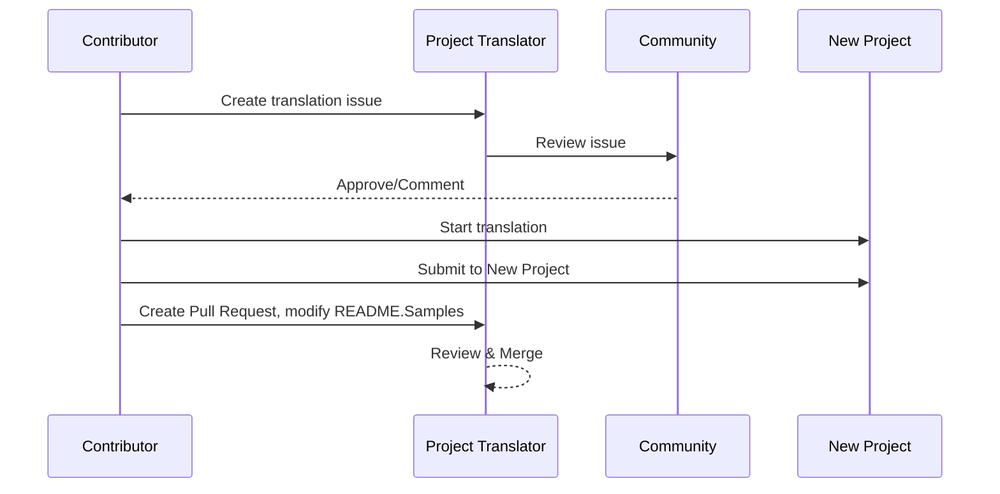

# Traducteur de Projet

Une extension VSCode facile à utiliser pour la localisation multilingue de projets.

Dépôt du projet : `https://github.com/Project-Translation/project_translator`


## Installation

1. Marketplace :
   - VS Code Extensions Marketplace : [https://marketplace.visualstudio.com/items?itemName=techfetch-dev.project-translator](https://marketplace.visualstudio.com/items?itemName=techfetch-dev.project-translator)
   - Open VSX Registry : [https://open-vsx.org/extension/techfetch-dev/project-translator](https://open-vsx.org/extension/techfetch-dev/project-translator)
2. Recherchez `techfetch-dev.project-translator` dans la vue Extensions de VS Code et cliquez sur installer


<!--  -->


## Traductions Disponibles

L'extension prend en charge la traduction vers les langues suivantes :

- [简体中文 (zh-cn)](./readmes/README.zh-cn.md)
- [繁體中文 (zh-tw)](./readmes/README.zh-tw.md)
- [日本語 (ja-jp)](./readmes/README.ja-jp.md)
- [한국어 (ko-kr)](./readmes/README.ko-kr.md)
- [Français (fr-fr)](./readmes/README.fr-fr.md)
- [Deutsch (de-de)](./readmes/README.de-de.md)
- [Español (es-es)](./readmes/README.es-es.md)
- [Português (pt-br)](./readmes/README.pt-br.md)
- [Русский (ru-ru)](./readmes/README.ru-ru.md)
- [العربية (ar-sa)](./readmes/README.ar-sa.md)
- [العربية (ar-ae)](./readmes/README.ar-ae.md)
- [العربية (ar-eg)](./readmes/README.ar-eg.md)

## Exemples

| Projet                                                                             | Dépôt Original                                                                                       | Description                                                                                                                                                               | Étoiles | Tags                                                                                                                                                                                                                                                                                                                                                                                                                                                                                                                                                                                                                                                                 |
| ----------------------------------------------------------------------------------- | ----------------------------------------------------------------------------------------------------- | ------------------------------------------------------------------------------------------------------------------------------------------------------------------------- | ------- | -------------------------------------------------------------------------------------------------------------------------------------------------------------------------------------------------------------------------------------------------------------------------------------------------------------------------------------------------------------------------------------------------------------------------------------------------------------------------------------------------------------------------------------------------------------------------------------------------------------------------------------------------------------------- |
| [algorithm-visualizer](https://github.com/Project-Translation/algorithm-visualizer) | [algorithm-visualizer/algorithm-visualizer](https://github.com/algorithm-visualizer/algorithm-visualizer) | :fireworks:Plateforme Interactive en Ligne qui Visualise les Algorithmes à partir du Code                                                                                               | 47301 | [`algorithm`](https://github.com/topics/algorithm), [`animation`](https://github.com/topics/animation), [`data-structure`](https://github.com/topics/data-structure), [`visualization`](https://github.com/topics/visualization)                                                                                                                                                                                                                                                                                                                                                                                                                                     |
| [algorithms](https://github.com/Project-Translation/algorithms)                     | [algorithm-visualizer/algorithms](https://github.com/algorithm-visualizer/algorithms)                     | :crystal_ball:Visualisations d'Algorithmes                                                                                                                                    | 401   | N/A                                                                                                                                                                                                                                                                                                                                                                                                                                                                                                                                                                                                                                                                  |
| [cline-docs](https://github.com/Project-Translation/cline-docs)                     | [cline/cline](https://github.com/cline/cline)                                                             | Agent de codage autonome directement dans votre IDE, capable de créer/modifier des fichiers, d'exécuter des commandes, d'utiliser le navigateur, et plus encore avec votre permission à chaque étape. | 39572 | N/A                                                                                                                                                                                                                                                                                                                                                                                                                                                                                                                                                                                                                                                                  |
| [cursor-docs](https://github.com/Project-Translation/cursor-docs)                   | [getcursor/docs](https://github.com/getcursor/docs)                                                       | Documentation Open Source de Cursor                                                                                                                                        | 309   | N/A                                                                                                                                                                                                                                                                                                                                                                                                                                                                                                                                                                                                                                                                  |
| [gobyexample](https://github.com/Project-Translation/gobyexample)                   | [mmcgrana/gobyexample](https://github.com/mmcgrana/gobyexample)                                           | Go by Example                                                                                                                                                             | 7523  | N/A                                                                                                                                                                                                                                                                                                                                                                                                                                                                                                                                                                                                                                                                  |
| [golang-website](https://github.com/Project-Translation/golang-website)             | [golang/website](https://github.com/golang/website)                                                       | [mirror] Accueil des sites go.dev et golang.org                                                                                                                       | 402   | N/A                                                                                                                                                                                                                                                                                                                                                                                                                                                                                                                                                                                                                                                                  |
| [reference-en-us](https://github.com/Project-Translation/reference-en-us)           | [Fechin/reference](https://github.com/Fechin/reference)                                                   | ⭕ Partagez une feuille de triche de référence rapide pour les développeurs.                                                                                                                      | 7808  | [`awk`](https://github.com/topics/awk), [`bash`](https://github.com/topics/bash), [`chatgpt`](https://github.com/topics/chatgpt), [`cheatsheet`](https://github.com/topics/cheatsheet), [`cheatsheets`](https://github.com/topics/cheatsheets), [`css`](https://github.com/topics/css), [`golang`](https://github.com/topics/golang), [`grep`](https://github.com/topics/grep), [`markdown`](https://github.com/topics/markdown), [`python`](https://github.com/topics/python), [`reference`](https://github.com/topics/reference), [`sed`](https://github.com/topics/sed), [`snippets`](https://github.com/topics/snippets), [`vim`](https://github.com/topics/vim) |
| [styleguide](https://github.com/Project-Translation/styleguide)                     | [google/styleguide](https://github.com/google/styleguide)                                                 | Guides de style pour les projets open-source d'origine Google                                                                                                                   | 38055 | [`cpplint`](https://github.com/topics/cpplint), [`style-guide`](https://github.com/topics/style-guide), [`styleguide`](https://github.com/topics/styleguide)                                                                                                                                                                                                                                                                                                                                                                                                                                                                                                         |
| [vscode-docs](https://github.com/Project-Translation/vscode-docs)                   | [microsoft/vscode-docs](https://github.com/microsoft/vscode-docs)                                         | Documentation publique pour Visual Studio Code                                                                                                                               | 5914  | [`vscode`](https://github.com/topics/vscode)                                                                                                                                                                                                                                                                                                                                                                                                                                                                                                                                                                                                                         |

## Demander une Traduction de Projet

Si vous souhaitez contribuer à une traduction ou avez besoin qu'un projet soit traduit :

1. Créez un problème en utilisant le modèle suivant :

```md
**Projet** : [project_url]
**Langue Cible** : [target_lang]
**Description** : Brève description de pourquoi cette traduction serait précieuse
```

2. Workflow :


```mermaid
sequenceDiagram
  Contributor->>Project Translator: Create translation issue
  Project Translator->>Community: Review issue
  Community-->>Contributor: Approve/Comment
  Contributor->>New Project: Start translation
  Contributor->>New Project: Submit to New Project
  Contributor->>Project Translator: Create Pull Request, modify README.Samples
  Project Translator-->>Project Translator: Review & Merge
```

3. Après la fusion de la PR, la traduction sera ajoutée à la section Exemples.

Traductions en cours : [Voir les problèmes](https://github.com/Project-Translation/project_translator/issues)

## Fonctionnalités

- 📁 Support de Traduction au Niveau des Dossiers
  - Traduire des dossiers de projet entiers vers plusieurs langues
  - Maintenir la structure et la hiérarchie des dossiers d'origine
  - Prise en charge de la traduction récursive des sous-dossiers
  - Détection automatique du contenu traduisible
  - Traitement par lots pour des traductions à grande échelle efficaces
- 📄 Support de Traduction au Niveau des Fichiers
  - Traduire des fichiers individuels vers plusieurs langues
  - Préserver la structure et le formatage des fichiers d'origine
  - Prise en charge des modes de traduction par dossier et par fichier
- 💡 Traduction Intelligente avec l'IA
  - Maintient automatiquement l'intégrité de la structure du code
  - Ne traduit que les commentaires du code, préserve la logique du code
  - Maintient les formats JSON/XML et autres structures de données
  - Qualité de traduction professionnelle pour la documentation technique
- ⚙️ Configuration Flexible
  - Configurer le dossier source et plusieurs dossiers cibles
  - Prise en charge des intervalles de traduction de fichiers personnalisés
  - Définir les types de fichiers spécifiques à ignorer
  - Prise en charge de plusieurs options de modèles d'IA
- 🚀 Opérations Conviviales
  - Affichage en temps réel de la progression de la traduction
  - Prise en charge de la pause/reprise/arrêt de la traduction
  - Maintenance automatique de la structure du dossier cible
  - Traduction incrémentielle pour éviter le travail en double
- 🔄 Traduction Différentielle (Expérimentale)
  - Mode diff-apply pour des mises à jour efficaces des traductions existantes
  - Réduit l'utilisation de l'API en ne traduisant que le contenu modifié
  - Préserve l'historique des versions avec des modifications minimales
  - ⚠️ Fonctionnalité expérimentale - voir [Fonctionnalités Avancées](#differential-translation-diff-apply-mode) pour plus de détails

## Configuration

L'extension prend en charge les options de configuration suivantes :

```json
{
  "projectTranslator.specifiedFolders": [
    {
      "sourceFolder": {
        "path": "Source folder path",
        "lang": "Source language code"
      },
      "targetFolders": [
        {
          "path": "Target folder path",
          "lang": "Target language code"
        }
      ]
    }
  ],
  "projectTranslator.specifiedFiles": [
    {
      "sourceFile": {
        "path": "Source file path",
        "lang": "Source language code"
      },
      "targetFiles": [
        {
          "path": "Target file path",
          "lang": "Target language code"
        }
      ]
    }
  ],
  "projectTranslator.currentVendor": "openai",
  "projectTranslator.vendors": [
    {
      "name": "openai",
      "apiEndpoint": "API endpoint URL",
      "apiKeyEnvVarName": "MY_OPENAI_API_KEY",
      "model": "gpt-4o",
      "rpm": "10",
      "maxTokensPerSegment": 4096,
      "timeout": 180,
      "temperature": 0.1
    }
  ],
  "projectTranslator.userPrompts": [
      "1. Should return no need translate if the markdown file has 'draft' set to 'true' in the front matter.",
      "2. './readmes/' in the sentences should replace with './'",
  ],
  "projectTranslator.ignore": {
    "paths": [
      "**/node_modules/**"
    ],
    "extensions": [
      ".log"
    ]
  },
}
```

Détails de configuration clés :

| Option de Configuration                        | Description                                                                                    |
| --------------------------------------------- | ---------------------------------------------------------------------------------------------- |
| `projectTranslator.specifiedFolders`          | Dossiers sources multiples avec leurs dossiers de destination correspondants pour la traduction |
| `projectTranslator.specifiedFiles`            | Fichiers sources multiples avec leurs fichiers de destination correspondants pour la traduction |
| `projectTranslator.translationIntervalDays`   | Intervalle de traduction en jours (défaut 7 jours)                                             |
| `projectTranslator.copyOnly`                  | Fichiers à copier mais ne pas traduire (avec les tableaux `paths` et `extensions`)             |
| `projectTranslator.ignore`                    | Fichiers à ignorer complètement (avec les tableaux `paths` et `extensions`)                    |
| `projectTranslator.skipFrontMatterMarkers`    | Ignorer les fichiers basés sur les marqueurs de front matter (avec les tableaux `enabled` et `markers`) |
| `projectTranslator.currentVendor`             | Vendeur d'API actuellement utilisé                                                             |
| `projectTranslator.vendors`                   | Liste de configuration des vendeurs d'API (peut utiliser apiKey directement ou apiKeyEnvVarName pour les variables d'environnement) |
| `projectTranslator.systemPromptLanguage`      | Langue utilisée pour les prompts système intégrés (défaut : en). Affecte la façon dont le modèle est instruite, pas la langue de l'interface utilisateur |
| `projectTranslator.systemPrompts`             | Tableau de prompts système pour guider le processus de traduction                              |
| `projectTranslator.userPrompts`               | Tableau de prompts définis par l'utilisateur, ces prompts seront ajoutés après les prompts système pendant la traduction |
| `projectTranslator.segmentationMarkers`       | Marqueurs de segmentation configurés par type de fichier, prend en charge les expressions régulières |
| `projectTranslator.debug`                     | Activer le mode débogage pour journaliser toutes les requêtes et réponses API dans le canal de sortie (défaut : false) |
| `projectTranslator.logFile`                   | Configuration pour les fichiers de journal de débogage (voir [Fonctionnalité des Fichiers de Journal](./docs/log-file-feature.md)) |
| `projectTranslator.diffApply.enabled`         | Activer le mode de traduction différentielle expérimental (défaut : false)                     |

## Utilisation

1. Ouvrez la palette de commandes (Ctrl+Shift+P / Cmd+Shift+P)
2. Tapez "Translate Project" et sélectionnez la commande
3. Si le dossier source n'est pas configuré, une boîte de dialogue de sélection de dossier apparaîtra
4. Attendez que la traduction soit terminée

Pendant la traduction :

- Vous pouvez mettre en pause/reprendre la traduction via les boutons de la barre d'état
- Vous pouvez arrêter le processus de traduction à tout moment
- La progression de la traduction est affichée dans la zone de notification
- Les journaux détaillés sont affichés dans le panneau de sortie

## Utilisation en Ligne de Commande

Le projet prend désormais en charge l'exécution en ligne de commande en plus de l'extension VS Code.

Générer la sortie du CLI :

```bash
npm run compile
```

Exécuter la traduction :

```bash
# Langue cible par défaut : en-us
npx project-translator translate project --workspace . --config project.translation.json

# Spécifier la langue cible
npx project-translator translate project --workspace . --config project.translation.json --lang ja-jp
```

Gérer la configuration :

```bash
npx project-translator config list --workspace . --config project.translation.json --json
npx project-translator config set currentVendor deepseek --workspace . --config project.translation.json
npx project-translator config schema --workspace .
npx project-translator config validate --workspace . --config project.translation.json
```

`config schema` exportera `project.translation.schema.json` par défaut.  
`config validate` effectue une validation JSON Schema sur le fichier de configuration et renvoie un code de sortie non nul en cas d'invalidité.

## Développement

### Système de Build

Cette extension utilise esbuild pour un bundling rapide et le développement :

#### Scripts Disponibles

- `npm run build` - Build de production avec minification
- `npm run compile` - Build de développement
- `npm run watch` - Mode watch pour le développement
- `npm test` - Exécuter les tests

#### Tâches VS Code

- **Build** (Ctrl+Shift+P → "Tasks: Run Task" → "build") - Bundle l'extension pour la production
- **Watch** (Ctrl+Shift+P → "Tasks: Run Task" → "watch") - Mode développement avec reconstruction automatique

### Configuration de Développement

1. Clonez le dépôt
2. Exécutez `npm install` pour installer les dépendances
3. Appuyez sur `F5` pour commencer le débogage ou exécutez la tâche "watch" pour le développement

La configuration esbuild :

- Bundle tous les fichiers TypeScript en un seul `out/extension.js`
- Exclut l'API VS Code (marquée comme externe)

## Fonctionnalités Avancées

### Utilisation des Variables d'Environnement pour les Clés API

Project Translator prend en charge l'utilisation de variables d'environnement pour les clés API, ce qui est une approche plus sécurisée que le stockage des clés API directement dans les fichiers de configuration :

1. Configurez votre vendeur avec une propriété `apiKeyEnvVarName` :

```json
{
  "projectTranslator.vendors": [
    {
      "name": "openai",
      "apiEndpoint": "https://api.openai.com/v1",
      "apiKeyEnvVarName": "OPENAI_API_KEY",
      "model": "gpt-4"
    },
    {
      "name": "openrouter",
      "apiEndpoint": "https://openrouter.ai/api/v1",
      "apiKeyEnvVarName": "OPENROUTER_API_KEY",
      "model": "anthropic/claude-3-opus"
    }
  ]
}
```

2. Définissez la variable d'environnement dans votre système :
   - Sur Windows : `set OPENAI_API_KEY=your_api_key`
   - Sur macOS/Linux : `export OPENAI_API_KEY=your_api_key`

3. Lorsque l'extension s'exécute, elle :
   - Vérifie d'abord si `apiKey` est fourni directement dans la configuration
   - Sinon, elle recherche la variable d'environnement spécifiée par `apiKeyEnvVarName`

Cette approche garde vos clés API hors des fichiers de configuration et des systèmes de contrôle de version.

### Ignorer la Traduction Basée sur le Front Matter

Project Translator peut ignorer la traduction des fichiers Markdown en fonction de leurs métadonnées de front matter. Cela est utile pour les documents de brouillon ou les fichiers marqués comme ne nécessitant pas de traduction.

Pour activer cette fonctionnalité, configurez l'option `projectTranslator.skipFrontMatterMarkers` :

```json
{
  "projectTranslator.skipFrontMatterMarkers": {
    "enabled": true,
    "markers": [
      {
        "key": "draft",
        "value": "true"
      },
      {
        "key": "translate",
        "value": "false"
      }
    ]
  }
}
```

Avec cette configuration, tout fichier Markdown avec un front matter contenant `draft: true` ou `translate: false` sera ignoré pendant la traduction et directement copié à l'emplacement cible.

Exemple de fichier Markdown qui serait ignoré :
```
---
draft: true
title: "Draft Document"
---

This document is a draft and should not be translated.
```

### Mode de Traduction Différentielle (Diff-Apply)

> **⚠️ Avertissement sur la Fonctionnalité Expérimentale** : Le mode de traduction différentielle est actuellement une fonctionnalité expérimentale et peut présenter des problèmes de stabilité et de compatibilité. Il est recommandé de l'utiliser avec prudence dans les environnements de production et de toujours sauvegarder les fichiers importants.

L'extension prend en charge un mode de traduction différentielle (diff-apply) facultatif. Lorsqu'il est activé, l'extension envoie à la fois le contenu source et le fichier cible traduit existant au modèle. Le modèle doit renvoyer un ou plusieurs blocs SEARCH/REPLACE (texte brut, sans blocs de code). L'extension applique ces blocs localement pour minimiser les changements, réduire l'utilisation de l'API et mieux préserver l'historique des versions.

- **Basculer** : Configurez `projectTranslator.diffApply.enabled` dans les paramètres VS Code ou `project.translation.json` (défaut : `false`).
- **Options** :
  - `validationLevel` : `normal` ou `strict` (défaut : `normal`). En mode `strict`, les marqueurs invalides ou les échecs de correspondance provoqueront une erreur et l'extension reviendra au flux de traduction standard.
  - `autoBackup` : Si vrai, créer une sauvegarde `.bak` du fichier cible avant d'appliquer les modifications (défaut : `true`).
  - `maxOperationsPerFile` : (conservé pour la compatibilité) non utilisé par la nouvelle stratégie.

Workflow :
1. Si `diffApply.enabled` est `true` et que le fichier cible existe, l'extension lit les deux contenus source et cible.
2. Elle appelle le modèle avec un prompt différentiel et exige le renvoi de blocs SEARCH/REPLACE en texte brut.
3. Localement, l'extension analyse et applique les blocs SEARCH/REPLACE. Si l'application échoue, elle revient à la traduction complète normale et écrase le fichier cible.

Exemple SEARCH/REPLACE (plusieurs blocs autorisés) :

```
<<<<<<< SEARCH
:start_line: 10
-------
const label = "Old"
=======
const label = "New"
>>>>>>> REPLACE

<<<<<<< SEARCH
:start_line: 25
-------
function foo() {
  return 1
}
=======
function foo() {
  return 2
}
>>>>>>> REPLACE
```

Notes :
- Utilisez le contenu exact incluant l'indentation et les espaces blancs dans les sections SEARCH. Si vous n'êtes pas sûr, utilisez le contenu du fichier le plus récent.
- Gardez une seule ligne de `=======` entre SEARCH et REPLACE.
- Si aucune modification n'est nécessaire, le modèle doit renvoyer une chaîne vide.

Pourquoi la traduction différentielle fonctionne actuellement mal (explication)

- **Défis d'alignement et de comparaison inter-langues** : La traduction différentielle nécessite d'envoyer à la fois le document source original et le document traduit existant au modèle, et le modèle doit les comparer à travers les langues pour décider quelles parties de la traduction doivent être modifiées. C'est une tâche fondamentalement plus difficile que la modification d'un document unique en place car le modèle doit aligner avec précision les segments dans différentes langues et juger des différences sémantiques.

- **Complexité de la préservation des formats et des limites** : De nombreux documents contiennent des blocs de code, des tableaux, des marqueurs frontend ou des espaces réservés spéciaux. Un workflow diff fiable doit préserver ces structures tout en effectuant des modifications textuelles. Si le modèle ne peut pas produire de résultats qui suivent strictement le format SEARCH/REPLACE, l'application automatique des modifications peut introduire des régressions de formatage ou des erreurs structurelles.

- **Problèmes de cohérence du contexte et de la terminologie** : Les petites modifications localisées dépendent souvent d'un contexte plus large et d'un glossaire de terminologie/style existant. Lorsqu'on lui demande de produire des modifications minimales, le modèle peut négliger la cohérence globale (terminologie, style, commentaires, noms de variables), ce qui entraîne des traductions incohérentes ou sémantiquement décalées.

- **Stabilité du modèle et compromis coût** : Atteindre une traduction différentielle fiable nécessite des modèles avec un raisonnement comparatif fort et des formats de sortie stables et prévisibles. Les modèles grand public actuels ne fournissent pas de manière fiable à la fois un alignement inter-langues robuste et des formats de sortie stricts à un coût raisonnable, donc les systèmes reviennent souvent à une retraduction complète pour garantir l'exactitude.

Par conséquent, bien que la traduction différentielle puisse théoriquement réduire les tokens de sortie coûteux et mieux préserver l'historique des versions, elle est actuellement limitée par les capacités de comparaison inter-langues des modèles et la stabilité de la sortie. Cette fonctionnalité reste expérimentale ; les atténuations recommandées incluent le maintien des sauvegardes automatiques (`autoBackup: true`), l'utilisation d'un niveau de validation tolérant (`validationLevel: "normal"`), et le retour à une retraduction complète en cas d'échec de correspondance ou de formatage. À l'avenir, des processeurs d'alignement bilingue spécialisés ou des modèles personnalisés plus petits pourraient améliorer la stabilité de l'approche diff.

Économies de coûts et pourquoi cela aide

- **Coût des tokens d'entrée vs sortie** : Les API de grands modèles facturent généralement différemment les tokens d'entrée (prompt) et de sortie (complétion). Souvent, les tokens de sortie sont significativement plus chers parce que le modèle génère un texte plus long. Diff-apply aide car nous envoyons la **source mise à jour (entrée)** et le **fichier traduit existant (entrée)** au modèle et demandons un JSON compact des modifications. La réponse du modèle est un petit JSON (peu de tokens de sortie) plutôt qu'un fichier retraduit complet (beaucoup de tokens de sortie), donc vous payez beaucoup moins pour la partie sortie coûteuse.

- **N'envoyer que ce qui a changé** : Au lieu de retraduire le fichier entier à chaque petite modification, diff-apply demande au modèle de calculer les opérations de modification minimales pour mettre à jour la traduction existante. C'est particulièrement efficace pour les fichiers déjà traduits et qui ne reçoivent que des modifications incrémentielles.

- **Idéal pour les fichiers formatés** : Les fichiers avec un formatage strict (JSON, XML, Markdown avec blocs de code) bénéficient grandement car diff-apply préserve la structure et ne modifie que les parties textuelles qui nécessitent une traduction. Cela réduit le risque de régressions de formatage et de tokens de sortie supplémentaires causés par le reformatage par le modèle.

- **Unité de base orientée ligne, agrégation plus intelligente** : L'outil traite l'unité de traduction de base comme une "ligne", et la stratégie SEARCH/REPLACE applique une correspondance exacte ou floue près de `:start_line:`. Utilisez `validationLevel: "normal"` pour un comportement tolérant et `"strict"` lorsque vous avez besoin de modifications conservatrices et exactes.

Quand utiliser diff-apply :

- Utilisez lorsque le fichier cible existe déjà et a été précédemment traduit.
- Utilisez pour les grands documents formatés où retraduire tout le fichier serait coûteux.
- Évitez pour les fichiers entièrement nouveaux sans traduction précédente, ou lorsque vous voulez une retraduction fraîche.

### Documentation de Conception

- Génère des source maps pour les builds de développement
- Minifie le code pour les builds de production
- Fournit l'intégration du problem matcher pour VS Code

## Notes

- Assurez-vous d'avoir un quota d'utilisation d'API suffisant
- Il est recommandé de tester d'abord avec de petits projets
- Utilisez des clés API dédiées et supprimez-les après l'achèvement

## Licence

[Licence](LICENSE)