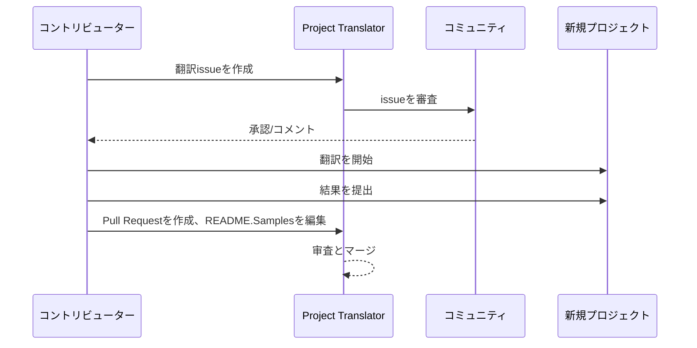

# Project Translator

VSCode拡張機能：プロジェクトの多言語ローカライゼーションを簡単に行うためのツール。

## 用意されている翻訳

この拡張機能では以下の言語への翻訳をサポートしています：

- [简体中文 (zh-cn)](./README.zh-cn.md)
- [繁體中文 (zh-tw)](./README.zh-tw.md)
- [日本語 (ja-jp)](./README.ja-jp.md)
- [한국어 (ko-kr)](./README.ko-kr.md)
- [Français (fr-fr)](./README.fr-fr.md)
- [Deutsch (de-de)](./README.de-de.md)
- [Español (es-es)](./README.es-es.md)
- [Português (pt-br)](./README.pt-br.md)
- [Русский (ru-ru)](./README.ru-ru.md)
- [العربية (ar-sa)](./README.ar-sa.md)
- [العربية (ar-ae)](./README.ar-ae.md)
- [العربية (ar-eg)](./README.ar-eg.md)

## サンプル

| プロジェクト                                                   | 言語                                                                                                                                                 |
| --------------------------------------------------------- | --------------------------------------------------------------------------------------------------------------------------------------------------------- |
| [google/styleguide](https://github.com/google/styleguide) | [en-us](https://github.com/google/styleguide) 提供元 @google<br>[zh-cn](https://github.com/Project-Translation/styleguide-zh-cn) 翻訳者 @jqknono |

## プロジェクト翻訳のリクエスト方法

翻訳の寄与またはプロジェクト翻訳が必要な場合：

1. 次のテンプレートを使用してissueを作成：

```md
**Project**: [プロジェクトURL]
**Target Language**: [対象言語]
**Description**: この翻訳が有益な理由の簡潔な説明
```

2. ワークフロー：



3. PRがマージされると、翻訳がサンプルセクションに追加されます。

現在進行中の翻訳：[Issue一覧](https://github.com/Project-Translation/project_translator/issues)

## 機能

- 📁 フォルダレベル翻訳対応
  - 全プロジェクトフォルダを複数言語へ翻訳
  - 元のフォルダ構造と階層を維持
  - サブフォルダの再帰的翻訳対応
  - 翻訳対象コンテンツの自動検出
  - 大規模翻訳を効率化するバッチ処理
- 📄 ファイルレベル翻訳対応
  - 個別のファイルを複数言語へ翻訳
  - 元ファイル構造とフォーマットを保持
  - フォルダ/ファイル両方の翻訳モード対応
- 💡 AIによるスマート翻訳
  - コード構造の整合性を自動維持
  - コードコメントのみを翻訳、ロジックを保持
  - JSON/XML等のデータ構造フォーマットを維持
  - 専門的な技術文書品質の翻訳
- ⚙️ 柔軟な設定
  - ソースフォルダと複数のターゲットフォルダの設定
  - カスタムファイル翻訳区間の指定
  - 無視するファイル種類の設定
  - 複数AIモデル選択対応
- 🚀 利用者フレンドリーな操作
  - 翻訳進行状況のリアルタイム表示
  - 一時停止/再開/停止のサポート
  - ターゲットフォルダ構造の自動維持
  - 重複作業を回避するインクリメンタル翻訳

## インストール

1. VS Code拡張機能マーケットプレイスで「[Project Translator](https://marketplace.visualstudio.com/items?itemName=techfetch-dev.project-translator)」を検索
2. インストールをクリック

## 設定

拡張機能では以下の設定オプションをサポート：

```json
{
  "projectTranslator.specifiedFolders": [
    {
      "sourceFolder": {
        "path": "ソースフォルダパス",
        "lang": "ソース言語コード"
      },
      "destFolders": [
        {
          "path": "ターゲットフォルダパス",
          "lang": "ターゲット言語コード"
        }
      ]
    }
  ],
  "projectTranslator.specifiedFiles": [
    {
      "sourceFile": {
        "path": "ソースファイルパス",
        "lang": "ソース言語コード"
      },
      "destFiles": [
        {
          "path": "ターゲットファイルパス",
          "lang": "ターゲット言語コード"
        }
      ]
    }
  ],
  "projectTranslator.currentVendor": "openai",
  "projectTranslator.vendors": [
    {
      "name": "openai",
      "apiEndpoint": "APIエンドポイントURL",
      "apiKey": "API認証キー",
      "model": "使用するモデル名",
      "rpm": "分間最大リクエスト数",
      "maxTokensPerSegment": 4096,
      "timeout": 30,
      "temperature": 0.0
    }
  ]
}
```

主要設定オプション：

| 設定オプション                            | 説明                                                                                    |
| ----------------------------------------------- | ---------------------------------------------------------------------------------------------- |
| `projectTranslator.specifiedFolders`            | 翻訳対象の複数ソースフォルダと対応するターゲットフォルダ                                  |
| `projectTranslator.specifiedFiles`              | 翻訳対象の複数ソースファイルと対応するターゲットファイル                                  |
| `projectTranslator.translationIntervalDays`     | 翻訳間隔（日単位、デフォルト7日）                                                  |
| `projectTranslator.ignoreTranslationExtensions` | 翻訳不要なテキスト拡張子リスト、これらのファイルは直接コピーされる                      |
| `projectTranslator.ignorePaths`                 |ワイルドカードで指定した無視パスパターン、これらのファイルはコピーされない              |
| `projectTranslator.currentVendor`               | 現在使用中のAPIベンダー名                                                                      |
| `projectTranslator.vendors`                     | APIベンダーの設定リスト                                                                  |
| `projectTranslator.systemPrompts`               | 翻訳プロセスをガイドするシステムプロンプト配列                                        |
| `projectTranslator.userPrompts`                 | ユーザ定義プロンプト配列、翻訳時にシステムプロンプトの後に追加される                 |
| `projectTranslator.segmentationMarkers`         | ファイルタイプに応じた区切りマークの設定、正規表現対応                                |

## 利用方法

1. コマンドパレットを開く（Ctrl+Shift+P / Cmd+Shift+P）
2. "Translate Project"と入力しコマンドを選択
3. ソースフォルダが設定されていない場合、フォルダ選択ダイアログが表示されます
4. 翻訳完了まで待ちます

翻訳中：

- ステータスバーのボタンで翻訳の一時停止/再開が可能
- 任意のタイミングで翻訳プロセスを停止可能
- 通知領域に進行状況が表示
- 出力パネルに詳細ログが表示

## 注意事項

- API使用クォータを確保してください
- 小規模プロジェクトでテストを推奨
- 専用APIキーを使用し、使用後は削除してください

## ライセンス

[LICENSE](LICENSE)