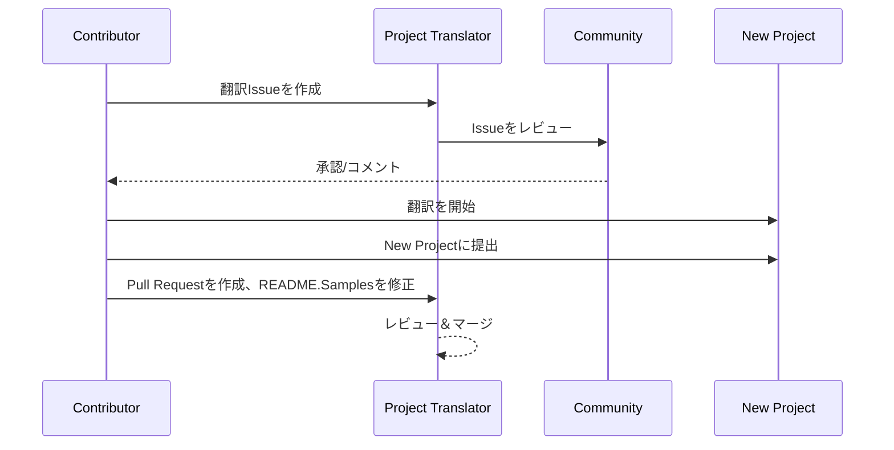

# プロジェクト翻訳ツール

プロジェクトの多言語ローカライズを容易にするVS Code拡張機能。

プロジェクトリポジトリ: `https://github.com/Project-Translation/project_translator`

## インストール

1. マーケットプレイス:
   - VS Code Extensions Marketplace: [https://marketplace.visualstudio.com/items?itemName=techfetch-dev.project-translator](https://marketplace.visualstudio.com/items?itemName=techfetch-dev.project-translator)
   - Open VSX Registry: [https://open-vsx.org/extension/techfetch-dev/project-translator](https://open-vsx.org/extension/techfetch-dev/project-translator)
2. VS Codeの拡張機能ビューで`techfetch-dev.project-translator`を検索し、インストールをクリック

<!--  -->


## 利用可能な翻訳

拡張機能は以下の言語への翻訳をサポートしています:

- [简体中文 (zh-cn)](./README.zh-cn.md)
- [繁體中文 (zh-tw)](./README.zh-tw.md)
- [日本語 (ja-jp)](./README.ja-jp.md)
- [한국어 (ko-kr)](./README.ko-kr.md)
- [Français (fr-fr)](./README.fr-fr.md)
- [Deutsch (de-de)](./README.de-de.md)
- [Español (es-es)](./README.es-es.md)
- [Português (pt-br)](./README.pt-br.md)
- [Русский (ru-ru)](./README.ru-ru.md)
- [العربية (ar-sa)](./README.ar-sa.md)
- [العربية (ar-ae)](./README.ar-ae.md)
- [العربية (ar-eg)](./README.ar-eg.md)

## サンプル

| プロジェクト                                                                             | オリジナルリポジトリ                                                                                       | 説明                                                                                                                                                               | スター数 | タグ                                                                                                                                                                                                                                                                                                                                                                                                                                                                                                                                                                                                                                                                 |
| ----------------------------------------------------------------------------------- | --------------------------------------------------------------------------------------------------------- | ------------------------------------------------------------------------------------------------------------------------------------------------------------------------- | ----- | -------------------------------------------------------------------------------------------------------------------------------------------------------------------------------------------------------------------------------------------------------------------------------------------------------------------------------------------------------------------------------------------------------------------------------------------------------------------------------------------------------------------------------------------------------------------------------------------------------------------------------------------------------------------- |
| [algorithm-visualizer](https://github.com/Project-Translation/algorithm-visualizer) | [algorithm-visualizer/algorithm-visualizer](https://github.com/algorithm-visualizer/algorithm-visualizer) | :fireworks:コードからアルゴリズムを可視化するインタラクティブなオンラインプラットフォーム                                                                                               | 47301 | [`algorithm`](https://github.com/topics/algorithm), [`animation`](https://github.com/topics/animation), [`data-structure`](https://github.com/topics/data-structure), [`visualization`](https://github.com/topics/visualization)                                                                                                                                                                                                                                                                                                                                                                                                                                     |
| [algorithms](https://github.com/Project-Translation/algorithms)                     | [algorithm-visualizer/algorithms](https://github.com/algorithm-visualizer/algorithms)                     | :crystal_ball:アルゴリズムの可視化                                                                                                                                    | 401   | N/A                                                                                                                                                                                                                                                                                                                                                                                                                                                                                                                                                                                                                                                                  |
| [cline-docs](https://github.com/Project-Translation/cline-docs)                     | [cline/cline](https://github.com/cline/cline)                                                             | IDE内で動作する自律的なコーディングエージェント。ファイルの作成/編集、コマンド実行、ブラウザ使用などが可能で、各ステップでユーザーの許可を得ます。 | 39572 | N/A                                                                                                                                                                                                                                                                                                                                                                                                                                                                                                                                                                                                                                                                  |
| [cursor-docs](https://github.com/Project-Translation/cursor-docs)                   | [getcursor/docs](https://github.com/getcursor/docs)                                                       | Cursorのオープンソースドキュメント                                                                                                                                        | 309   | N/A                                                                                                                                                                                                                                                                                                                                                                                                                                                                                                                                                                                                                                                                  |
| [gobyexample](https://github.com/Project-Translation/gobyexample)                   | [mmcgrana/gobyexample](https://github.com/mmcgrana/gobyexample)                                           | Go by Example                                                                                                                                                             | 7523  | N/A                                                                                                                                                                                                                                                                                                                                                                                                                                                                                                                                                                                                                                                                  |
| [golang-website](https://github.com/Project-Translation/golang-website)             | [golang/website](https://github.com/golang/website)                                                       | [ミラー] go.devおよびgolang.orgウェブサイトのホーム                                                                                                                       | 402   | N/A                                                                                                                                                                                                                                                                                                                                                                                                                                                                                                                                                                                                                                                                  |
| [reference-en-us](https://github.com/Project-Translation/reference-en-us)           | [Fechin/reference](https://github.com/Fechin/reference)                                                   | ⭕ 開発者のためのクイックリファレンスチートシート                                                                                                                      | 7808  | [`awk`](https://github.com/topics/awk), [`bash`](https://github.com/topics/bash), [`chatgpt`](https://github.com/topics/chatgpt), [`cheatsheet`](https://github.com/topics/cheatsheet), [`cheatsheets`](https://github.com/topics/cheatsheets), [`css`](https://github.com/topics/css), [`golang`](https://github.com/topics/golang), [`grep`](https://github.com/topics/grep), [`markdown`](https://github.com/topics/markdown), [`python`](https://github.com/topics/python), [`reference`](https://github.com/topics/reference), [`sed`](https://github.com/topics/sed), [`snippets`](https://github.com/topics/snippets), [`vim`](https://github.com/topics/vim) |
| [styleguide](https://github.com/Project-Translation/styleguide)                     | [google/styleguide](https://github.com/google/styleguide)                                                 | Google発祥のオープンソースプロジェクト向けスタイルガイド                                                                                                                   | 38055 | [`cpplint`](https://github.com/topics/cpplint), [`style-guide`](https://github.com/topics/style-guide), [`styleguide`](https://github.com/topics/styleguide)                                                                                                                                                                                                                                                                                                                                                                                                                                                                                                         |
| [vscode-docs](https://github.com/Project-Translation/vscode-docs)                   | [microsoft/vscode-docs](https://github.com/microsoft/vscode-docs)                                         | Visual Studio Codeの公式ドキュメント                                                                                                                               | 5914  | [`vscode`](https://github.com/topics/vscode)                                                                                                                                                                                                                                                                                                                                                                                                                                                                                                                                                                                                                         |

## プロジェクト翻訳のリクエスト

翻訳を貢献したい場合やプロジェクトの翻訳が必要な場合:

1. 以下のテンプレートを使用してIssueを作成:

```md
**プロジェクト**: [project_url]
**対象言語**: [target_lang]
**説明**: この翻訳が価値ある理由の簡単な説明
```

2. ワークフロー:



3. PRがマージされた後、翻訳がサンプルセクションに追加されます。

進行中の翻訳: [Issueを表示](https://github.com/Project-Translation/project_translator/issues)

## 機能

- 📁 フォルダレベルの翻訳サポート
  - プロジェクトフォルダ全体を複数言語に翻訳
  - 元のフォルダ構造と階層を維持
  - サブフォルダの再帰的翻訳をサポート
  - 翻訳可能なコンテンツの自動検出
  - 大規模翻訳のためのバッチ処理
- 📄 ファイルレベルの翻訳サポート
  - 個別ファイルを複数言語に翻訳
  - 元のファイル構造とフォーマットを維持
  - フォルダとファイル両方の翻訳モードをサポート
- 💡 AIによるスマート翻訳
  - コード構造の整合性を自動的に維持
  - コードコメントのみ翻訳、コードロジックは保持
  - JSON/XMLなどのデータ構造フォーマットを維持
  - プロフェッショナルな技術文書翻訳品質
- ⚙️ 柔軟な設定
  - ソースフォルダと複数ターゲットフォルダの設定
  - カスタムファイル翻訳間隔のサポート
  - 無視する特定ファイルタイプの設定
  - 複数AIモデルオプションのサポート
- 🚀 ユーザーフレンドリーな操作
  - リアルタイム翻訳進捗表示
  - 翻訳の一時停止/再開/停止をサポート
  - ターゲットフォルダ構造の自動維持
  - 重複作業を避ける増分翻訳
- 🔄 差分翻訳（実験的）
  - 既存翻訳の効率的な更新のためのDiff-applyモード
  - 変更されたコンテンツのみ翻訳でAPI使用量を削減
  - 最小限の編集でバージョン履歴を維持
  - ⚠️ 実験的機能 - 詳細は[高度な機能](#differential-translation-diff-apply-mode)を参照

## 設定

拡張機能は以下の設定オプションをサポート:

```json
{
  "projectTranslator.specifiedFolders": [
    {
      "sourceFolder": {
        "path": "ソースフォルダパス",
        "lang": "ソース言語コード"
      },
      "targetFolders": [
        {
          "path": "ターゲットフォルダパス",
          "lang": "ターゲット言語コード"
        }
      ]
    }
  ],
  "projectTranslator.specifiedFiles": [
    {
      "sourceFile": {
        "path": "ソースファイルパス",
        "lang": "ソース言語コード"
      },
      "targetFiles": [
        {
          "path": "ターゲットファイルパス",
          "lang": "ターゲット言語コード"
        }
      ]
    }
  ],
  "projectTranslator.currentVendor": "openai",
  "projectTranslator.vendors": [
    {
      "name": "openai",
      "apiEndpoint": "APIエンドポイントURL",
      "apiKeyEnvVarName": "MY_OPENAI_API_KEY",
      "model": "gpt-4o",
      "rpm": "10",
      "maxTokensPerSegment": 4096,
      "timeout": 180,
      "temperature": 0.1
    }
  ],
  "projectTranslator.userPrompts": [
      "1. Markdownファイルのフロントマターに'draft'が'true'に設定されている場合、翻訳不要を返すべき",
      "2. 文中の'./readmes/'は'./'に置換する",
  ],
  "projectTranslator.ignore": {
    "paths": [
      "**/node_modules/**"
    ],
    "extensions": [
      ".log"
    ]
  },
}
```

主な設定詳細:

| 設定オプション                        | 説明                                                                                    |
| ------------------------------------------- | ---------------------------------------------------------------------------------------------- |
| `projectTranslator.specifiedFolders`        | 翻訳用の複数ソースフォルダと対応するターゲットフォルダ           |
| `projectTranslator.specifiedFiles`          | 翻訳用の複数ソースファイルと対応するターゲットファイル               |
| `projectTranslator.translationIntervalDays` | 翻訳間隔（日数、デフォルト7日）                                                  |
| `projectTranslator.copyOnly`                | 翻訳せずコピーのみ行うファイル（`paths`と`extensions`配列）                         |
| `projectTranslator.ignore`                  | 完全に無視するファイル（`paths`と`extensions`配列）                              |
| `projectTranslator.skipFrontMatterMarkers`  | フロントマターマーカーに基づくファイルスキップ（`enabled`と`markers`配列）                 |
| `projectTranslator.currentVendor`           | 使用中のAPIベンダー                                                                      |
| `projectTranslator.vendors`                 | APIベンダー設定リスト（apiKey直接使用または環境変数のapiKeyEnvVarNameを使用可能） |
| `projectTranslator.systemPromptLanguage`    | 組み込みシステムプロンプトの言語（デフォルト: en）。UI言語ではなく、モデルへの指示方法に影響 |
| `projectTranslator.systemPrompts`           | 翻訳プロセスをガイドするシステムプロンプト配列                                        |
| `projectTranslator.userPrompts`             | ユーザー定義プロンプト配列。翻訳時にシステムプロンプトの後に追加されます |
| `projectTranslator.segmentationMarkers`     | ファイルタイプ別に設定されたセグメンテーションマーカー、正規表現をサポート                     |
| `projectTranslator.debug`                   | デバッグモードを有効化し、すべてのAPIリクエストとレスポンスを出力チャネルに記録（デフォルト: false）     |
| `projectTranslator.logFile`                 | デバッグログファイルの設定（[ログファイル機能](./docs/log-file-feature.md)参照）         |
| `projectTranslator.diffApply.enabled`       | 実験的差分翻訳モードを有効化（デフォルト: false）                             |

## 使用方法

1. コマンドパレットを開く（Ctrl+Shift+P / Cmd+Shift+P）
2. "Translate Project"と入力し、コマンドを選択
3. ソースフォルダが設定されていない場合、フォルダ選択ダイアログが表示
4. 翻訳完了まで待機

翻訳中:

- ステータスバーボタンで翻訳を一時停止/再開可能
- いつでも翻訳プロセスを停止可能
- 通知領域に翻訳進捗が表示
- 詳細ログが出力パネルに表示

## 開発

### ビルドシステム

この拡張機能は高速バンドルと開発のためにesbuildを使用:

#### 利用可能なスクリプト

- `npm run build` - 最小化されたプロダクションビルド
- `npm run compile` - 開発ビルド
- `npm run watch` - 開発用ウォッチモード
- `npm test` - テスト実行

#### VS Codeタスク

- **ビルド** (Ctrl+Shift+P → "Tasks: Run Task" → "build") - プロダクション用拡張機能バンドル
- **ウォッチ** (Ctrl+Shift+P → "Tasks: Run Task" → "watch") - 自動リビルド付き開発モード

### 開発セットアップ

1. リポジトリをクローン
2. `npm install`を実行して依存関係をインストール
3. `F5`を押してデバッグ開始、または開発用に"watch"タスクを実行

esbuild設定:

- すべてのTypeScriptファイルを単一の`out/extension.js`にバンドル
- VS Code APIを除外（外部としてマーク）

## 高度な機能

### APIキーに環境変数を使用

Project TranslatorはAPIキーに環境変数を使用することをサポートしており、設定ファイルに直接APIキーを保存するよりも安全なアプローチです:

1. ベンダー設定に`apiKeyEnvVarName`プロパティを設定:

```json
{
  "projectTranslator.vendors": [
    {
      "name": "openai",
      "apiEndpoint": "https://api.openai.com/v1",
      "apiKeyEnvVarName": "OPENAI_API_KEY",
      "model": "gpt-4"
    },
    {
      "name": "openrouter",
      "apiEndpoint": "https://openrouter.ai/api/v1",
      "apiKeyEnvVarName": "OPENROUTER_API_KEY",
      "model": "anthropic/claude-3-opus"
    }
  ]
}
```

2. システムに環境変数を設定:
   - Windows: `set OPENAI_API_KEY=your_api_key`
   - macOS/Linux: `export OPENAI_API_KEY=your_api_key`

3. 拡張機能実行時:
   - まず設定で`apiKey`が直接提供されているか確認
   - ない場合、`apiKeyEnvVarName`で指定された環境変数を探す

このアプローチにより、APIキーが設定ファイルやバージョン管理システムから除外されます。

### フロントマターに基づく翻訳スキップ

Project TranslatorはMarkdownファイルのフロントマターメタデータに基づいて翻訳をスキップできます。これはドラフト文書や翻訳不要とマークされたファイルに有用です。

この機能を有効にするには、`projectTranslator.skipFrontMatterMarkers`オプションを設定:

```json
{
  "projectTranslator.skipFrontMatterMarkers": {
    "enabled": true,
    "markers": [
      {
        "key": "draft",
        "value": "true"
      },
      {
        "key": "translate",
        "value": "false"
      }
    ]
  }
}
```

この設定により、`draft: true`または`translate: false`を含むフロントマターを持つMarkdownファイルは翻訳をスキップされ、ターゲットロケーションに直接コピーされます。

翻訳をスキップするMarkdownファイルの例:
```
---
draft: true
title: "ドラフト文書"
---

この文書はドラフトであり、翻訳すべきではありません。
```

### 差分翻訳（Diff-Apply）モード

> **⚠️ 実験的機能警告**: 差分翻訳モードは現在実験的機能であり、安定性や互換性の問題がある可能性があります。本番環境での使用は注意して行い、重要なファイルは常にバックアップしてください。

拡張機能はオプションの差分翻訳モード（diff-apply）をサポートします。有効にすると、拡張機能はソースコンテンツと既存の翻訳済みターゲットファイルの両方をモデルに送信します。モデルは1つ以上のSEARCH/REPLACEブロック（プレーンテキスト、コードフェンスなし）を返すべきです。拡張機能はこれらのブロックをローカルで適用し、変更を最小限に抑え、API使用量を削減し、バージョン履歴をより良く保持します。

- **切り替え**: VS Code設定または`project.translation.json`で`projectTranslator.diffApply.enabled`を設定（デフォルト: `false`）。
- **オプション**:
  - `validationLevel`: `normal`または`strict`（デフォルト: `normal`）。`strict`モードでは、無効なマーカーやマッチング失敗はエラーを引き起こし、拡張機能は標準の翻訳フローにフォールバックします。
  - `autoBackup`: trueの場合、編集適用前にターゲットファイルの`.bak`バックアップを作成（デフォルト: `true`）。
  - `maxOperationsPerFile`: （互換性のため保持）新しい戦略では使用されません。

ワークフロー:
1. `diffApply.enabled`が`true`でターゲットファイルが存在する場合、拡張機能はソースとターゲットのコンテンツを読み込みます。
2. 差分プロンプトでモデルを呼び出し、プレーンテキストのSEARCH/REPLACEブロックを返すよう要求します。
3. ローカルで拡張機能はSEARCH/REPLACEブロックを解析・適用します。適用に失敗した場合、通常の完全翻訳にフォールバックし、ターゲットファイルを上書きします。

SEARCH/REPLACEの例（複数ブロック可）:

```
<<<<<<< SEARCH
:start_line: 10
-------
const label = "Old"
=======
const label = "New"
>>>>>>> REPLACE

<<<<<<< SEARCH
:start_line: 25
-------
function foo() {
  return 1
}
=======
function foo() {
  return 2
}
>>>>>>> REPLACE
```

注意:
- SEARCHセクションにはインデントや空白を含む正確なコンテンツを使用してください。不明な場合は最新のファイルコンテンツを使用してください。
- SEARCHとREPLACEの間に`=======`の単一行を保持してください。
- 変更不要の場合は、モデルは空文字列を返すべきです。

なぜ差分翻訳が現在うまく機能しないか（説明）

- **言語間のアラインメントと比較の課題**: 差分翻訳には、元のソース文書と既存の翻訳文書の両方をモデルに送信する必要があり、モデルは異なる言語間でセグメントを正確に整列させ、どの部分の翻訳を変更する必要があるかを判断しなければなりません。これは単一の文書をその場で変更するよりも根本的に難しいタスクです。

- **フォーマットと境界保存の複雑さ**: 多くの文書にはコードブロック、テーブル、フロントエンドマーカー、特別なプレースホルダーが含まれます。信頼性のあるdiffワークフローは、これらの構造を維持しながらテキスト部分を編集する必要があります。モデルがSEARCH/REPLACEフォーマットを厳密に守る結果を一貫して生成できない場合、編集の自動適用はフォーマットの退行や構造エラーを引き起こす可能性があります。

- **コンテキストと用語の一貫性問題**: 小さな局所的な編集は、多くの場合、より広範なコンテキストと既存の用語/スタイルの用語集に依存します。最小限の編集を求められた場合、モデルはグローバルな一貫性（用語、スタイル、コメント、変数名）を無視する可能性があり、一貫性のないまたは意味的にシフトした翻訳が生じる可能性があります。

- **モデルの安定性とコストのトレードオフ**: 信頼できる差分翻訳を実現するには、強力な比較推論能力と安定した予測可能な出力フォーマットを備えたモデルが必要です。現在の主流のモデルは、合理的なコストで堅牢な言語間アラインメントと厳密なフォーマット出力の両方を確実に提供しないため、システムは正確性を確保するために完全な再翻訳にフォールバックすることがよくあります。

したがって、差分翻訳は理論的には高価な出力トークンを削減し、バージョン履歴をより良く保持できますが、現在はモデルの言語間比較能力と出力安定性によって制限されています。この機能は実験的なままです。推奨される緩和策には、自動バックアップの保持（`autoBackup: true`）、寛容な検証レベル（`validationLevel: "normal"`）の使用、マッチングやフォーマットの失敗時の完全再翻訳へのフォールバックが含まれます。将来的には、専門的なバイリンガルアライメント後処理やカスタム小型モデルがdiffアプローチの安定性を向上させる可能性があります。

コスト削減とその利点

- **入力と出力のトークンコスト**: 大規模モデルAPIは一般的に入力（プロンプト）と出力（補完）のトークンに対して異なる課金をします。多くの場合、出力トークンはモデルが長いテキストを生成するため、大幅に高価です。Diff-applyは、**更新されたソース（入力）**と**既存の翻訳ファイル（入力）**をモデルに送信し、コンパクトな編集JSONを要求することで役立ちます。モデルの応答は小さなJSON（出力トークンが少ない）であり、完全な再翻訳ファイル（出力トークンが多い）ではないため、高価な出力部分に対して支払う金額が大幅に削減されます。

- **変更された部分のみ送信**: 小さな変更が発生するたびにファイル全体を再翻訳する代わりに、diff-applyはモデルに既存の翻訳を更新するための最小限の編集操作を計算するよう指示します。これは以前に翻訳され、増分編集のみを受信するファイルに特に効果的です。

- **フォーマットされたファイルに最適**: 厳密なフォーマット（JSON、XML、コードブロック付きMarkdown）のファイルは、diff-applyが構造を維持し、翻訳が必要なテキスト部分のみを変更するため、フォーマット関連の退行やモデルの再フォーマットによる余分な出力トークンの可能性を減らすことで大きく恩恵を受けます。

- **行指向の基本単位、スマートな集約**: ツールは基本的な翻訳単位を「行」として扱い、SEARCH/REPLACE戦略は`:start_line:`付近で正確またはあいまいなマッチングを適用します。寛容な動作には`validationLevel: "normal"`を、保守的で正確な編集が必要な場合は`"strict"`を使用します。

diff-applyを使用するタイミング:

- ターゲットファイルが既に存在し、以前に翻訳されている場合に使用
- ファイル全体を再翻訳すると高価になる大規模なフォーマット文書に使用
- 以前の翻訳がない新しいファイルや、新鮮な再翻訳が必要な場合は避ける


### 設計ドキュメント

- 開発ビルド用にソースマップを生成
- プロダクションビルド用にコードを最小化
- VS Codeとの問題マッチャー統合を提供

## 注意事項

- 十分なAPI使用クォータを確保
- 最初に小さなプロジェクトでテストすることを推奨
- 専用のAPIキーを使用し、完了後に削除

## ライセンス

[ライセンス](LICENSE)