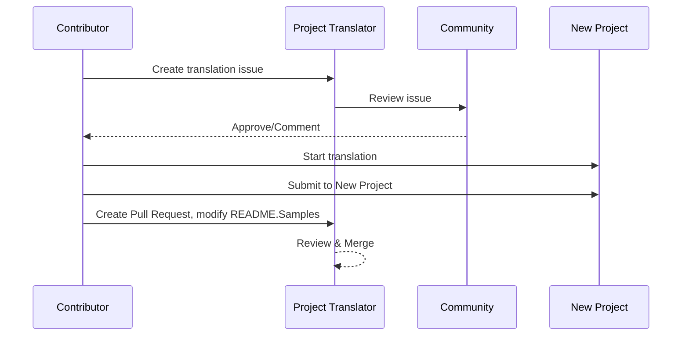

# プロジェクト トランスレーター

VSCode 拡張機能: プロジェクトの多言語ローカライズのための使いやすいツールです。

<!--
## 利用可能な翻訳

この拡張機能はこれらの言語への翻訳をサポートします:

- [簡体中文 (zh-cn)](./README.zh-cn.md)
- [繁體中文 (zh-tw)](./README.zh-tw.md)
- [日本語 (ja-jp)](./README.ja-jp.md)
- [한국어 (ko-kr)](./README.ko-kr.md)
- [Français (fr-fr)](./README.fr-fr.md)
- [Deutsch (de-de)](./README.de-de.md)
- [Español (es-es)](./README.es-es.md)
- [Português (pt-br)](./README.pt-br.md)
- [Русский (ru-ru)](./README.ru-ru.md)
- [العربية (ar-sa)](./README.ar-sa.md)
- [العربية (ar-ae)](./README.ar-ae.md)
- [العربية (ar-eg)](./README.ar-eg.md) -->

## サンプル
| Project                                                                             | Original Repository                                                                                       | Description                                                                                                                                                               | Stars | Tags                                                                                                                                                                                                                                                                                                                                                                                                                                                                                                                                                                                                                                                                 |
| ----------------------------------------------------------------------------------- | --------------------------------------------------------------------------------------------------------- | ------------------------------------------------------------------------------------------------------------------------------------------------------------------------- | ----- | -------------------------------------------------------------------------------------------------------------------------------------------------------------------------------------------------------------------------------------------------------------------------------------------------------------------------------------------------------------------------------------------------------------------------------------------------------------------------------------------------------------------------------------------------------------------------------------------------------------------------------------------------------------------- |
| [algorithm-visualizer](https://github.com/Project-Translation/algorithm-visualizer) | [algorithm-visualizer/algorithm-visualizer](https://github.com/algorithm-visualizer/algorithm-visualizer) | :fireworks:コードからアルゴリズムを視覚化するインタラクティブなオンラインプラットフォーム                                                                                               | 47301 | [`algorithm`](https://github.com/topics/algorithm), [`animation`](https://github.com/topics/animation), [`data-structure`](https://github.com/topics/data-structure), [`visualization`](https://github.com/topics/visualization)                                                                                                                                                                                                                                                                                                                                                                                                                                     |
| [algorithms](https://github.com/Project-Translation/algorithms)                     | [algorithm-visualizer/algorithms](https://github.com/algorithm-visualizer/algorithms)                     | :crystal_ball:アルゴリズムの視覚化                                                                                                                                    | 401   | N/A                                                                                                                                                                                                                                                                                                                                                                                                                                                                                                                                                                                                                                                                  |
| [cline-docs](https://github.com/Project-Translation/cline-docs)                     | [cline/cline](https://github.com/cline/cline)                                                             | IDE内で動作する自律型コーディングエージェントで、ファイルの作成/編集、コマンドの実行、ブラウザの使用などが可能で、各ステップで許可を求めます。 | 39572 | N/A                                                                                                                                                                                                                                                                                                                                                                                                                                                                                                                                                                                                                                                                  |
| [cursor-docs](https://github.com/Project-Translation/cursor-docs)                   | [getcursor/docs](https://github.com/getcursor/docs)                                                       | Cursorのオープンソースドキュメント                                                                                                                                        | 309   | N/A                                                                                                                                                                                                                                                                                                                                                                                                                                                                                                                                                                                                                                                                  |
| [gobyexample](https://github.com/Project-Translation/gobyexample)                   | [mmcgrana/gobyexample](https://github.com/mmcgrana/gobyexample)                                           | Go by Example                                                                                                                                                             | 7523  | N/A                                                                                                                                                                                                                                                                                                                                                                                                                                                                                                                                                                                                                                                                  |
| [golang-website](https://github.com/Project-Translation/golang-website)             | [golang/website](https://github.com/golang/website)                                                       | [mirror] go.dev および golang.org ウェブサイトのホーム                                                                                                                       | 402   | N/A                                                                                                                                                                                                                                                                                                                                                                                                                                                                                                                                                                                                                                                                  |
| [reference-en-us](https://github.com/Project-Translation/reference-en-us)           | [Fechin/reference](https://github.com/Fechin/reference)                                                   | ⭕ 開発者のためのクイックリファレンスチートシートを共有                                                                                                                      | 7808  | [`awk`](https://github.com/topics/awk), [`bash`](https://github.com/topics/bash), [`chatgpt`](https://github.com/topics/chatgpt), [`cheatsheet`](https://github.com/topics/cheatsheet), [`cheatsheets`](https://github.com/topics/cheatsheets), [`css`](https://github.com/topics/css), [`golang`](https://github.com/topics/golang), [`grep`](https://github.com/topics/grep), [`markdown`](https://github.com/topics/markdown), [`python`](https://github.com/topics/python), [`reference`](https://github.com/topics/reference), [`sed`](https://github.com/topics/sed), [`snippets`](https://github.com/topics/snippets), [`vim`](https://github.com/topics/vim) |
| [styleguide](https://github.com/Project-Translation/styleguide)                     | [google/styleguide](https://github.com/google/styleguide)                                                 | Google発のオープンソースプロジェクトのためのスタイルガイド                                                                                                                   | 38055 | [`cpplint`](https://github.com/topics/cpplint), [`style-guide`](https://github.com/topics/style-guide), [`styleguide`](https://github.com/topics/styleguide)                                                                                                                                                                                                                                                                                                                                                                                                                                                                                                         |
| [vscode-docs](https://github.com/Project-Translation/vscode-docs)                   | [microsoft/vscode-docs](https://github.com/microsoft/vscode-docs)                                         | Visual Studio Codeの公開ドキュメント                                                                                                                               | 5914  | [`vscode`](https://github.com/topics/vscode)                                                                                                                                                                                                                                                                                                                                                                                                                                                                                                                                                                                                                         |

## プロジェクト翻訳のリクエスト

翻訳に貢献したい場合、またはプロジェクトを翻訳する必要がある場合:

1. 以下のテンプレートを使ってイシューを作成してください:

```md
**Project**: [project_url]
**Target Language**: [target_lang]
**Description**: この翻訳が価値がある理由の簡単な説明
```

2. ワークフロー:


3. PR がマージされた後、翻訳が Samples セクションに追加されます。

進行中の翻訳: [問題を見る](https://github.com/Project-Translation/project_translator/issues)

## 機能

- 📁 フォルダーレベル翻訳サポート
  - プロジェクトのフォルダー全体を複数の言語に翻訳
  - 元のフォルダー構造と階層を維持
  - サブフォルダーの再帰翻訳をサポート
  - 翻訳可能なコンテンツの自動検出
  - 大規模翻訳のためのバッチ処理
- 📄 ファイルレベル翻訳サポート
  - 個別のファイルを複数の言語に翻訳
  - 元のファイル構造とフォーマットを保持
  - フォルダーとファイルの両方の翻訳モードをサポート
- 💡 AI を活用したスマート翻訳
  - コード構造の完全性を自動的に維持
  - コードコメントのみを翻訳し、コードロジックを保持
  - JSON/XML などのデータ構造フォーマットを維持
  - 専門的な技術ドキュメント翻訳の品質
- ⚙️ 柔軟な設定
  - ソースフォルダーと複数のターゲットフォルダーを設定
  - カスタムファイル翻訳間隔をサポート
  - 特定のファイルタイプを無視する設定
  - 複数の AI モデルオプションをサポート
- 🚀 ユーザー-friendly 操作
  - リアルタイム翻訳進捗表示
  - 翻訳の一時停止/再開/停止をサポート
  - ターゲットフォルダー構造の自動維持
  - 重複作業を避けるためのインクリメンタル翻訳

## インストール

1. VS Code 拡張機能マーケットプレイスで "[Project Translator](https://marketplace.visualstudio.com/items?itemName=techfetch-dev.project-translator)" を検索
2. インストールをクリック

## 設定

拡張機能は以下の設定オプションをサポートします:

```json
{
  "projectTranslator.specifiedFolders": [
    {
      "sourceFolder": {
        "path": "Source folder path",
        "lang": "Source language code"
      },
      "targetFolders": [
        {
          "path": "Target folder path",
          "lang": "Target language code"
        }
      ]
    }
  ],
  "projectTranslator.specifiedFiles": [
    {
      "sourceFile": {
        "path": "Source file path",
        "lang": "Source language code"
      },
      "targetFiles": [
        {
          "path": "Target file path",
          "lang": "Target language code"
        }
      ]
    }
  ],
  "projectTranslator.currentVendor": "openai",
  "projectTranslator.vendors": [
    {
      "name": "openai",
      "apiEndpoint": "API endpoint URL",
      "apiKey": "API authentication key",
      "model": "Model name to use",
      "rpm": "Maximum requests per minute",
      "maxTokensPerSegment": 4096,
      "timeout": 30,
      "temperature": 0.0
    }
  ]
}
```

主な設定の詳細:

| 設定オプション                        | 説明                                                                                    |
| ----------------------------------- | ------------------------------------------------------------------------------------ |
| `projectTranslator.specifiedFolders`        | 翻訳のための複数のソースフォルダーと対応する宛先フォルダー                             |
| `projectTranslator.specifiedFiles`          | 翻訳のための複数のソースファイルと対応する宛先ファイル                                 |
| `projectTranslator.translationIntervalDays` | 翻訳間隔（日単位、デフォルト 7 日）                                                    |
| `projectTranslator.copyOnly`                | 翻訳せずコピーするファイル（`paths` と `extensions` の配列を含む）                     |
| `projectTranslator.ignore`                  | 完全に無視するファイル（`paths` と `extensions` の配列を含む）                        |
| `projectTranslator.currentVendor`           | 現在使用中の API ベンダー                                                              |
| `projectTranslator.vendors`                 | API ベンダー設定リスト                                                                  |
| `projectTranslator.systemPrompts`           | 翻訳プロセスをガイドするためのシステムプロンプト配列                                    |
| `projectTranslator.userPrompts`             | ユーザー定義のプロンプト配列で、翻訳時にシステムプロンプトの後に追加                   |
| `projectTranslator.segmentationMarkers`     | ファイルタイプごとのセグメンテーションマーカーで、正規表現をサポート                   |

## 使い方

1. コマンドパレットを開く (Ctrl+Shift+P / Cmd+Shift+P)
2. "Translate Project" と入力し、コマンドを選択
3. ソースフォルダーが設定されていない場合、フォルダー選択ダイアログが表示されます
4. 翻訳が完了するまで待つ

翻訳中:

- ステータスバーのボタンで翻訳を一時停止/再開可能
- いつでも翻訳プロセスを停止可能
- 通知エリアに翻訳進捗を表示
- 出力パネルに詳細なログを表示

## 開発
### ビルドシステム

この拡張機能は、esbuild を使用して高速バンドリングと開発を行います:

#### 利用可能なスクリプト

- `npm run build` - 最小化されたプロダクション構築
- `npm run compile` - 開発用構築
- `npm run watch` - 開発用のウォッチモード
- `npm test` - テストの実行

#### レガシー TypeScript スクリプト (フォールバック)

- `npm run compile-tsc` - TypeScript のコンパイルのみ
- `npm run watch-tsc` - TypeScript のウォッチモード

#### VS Code タスク

- **Build** (Ctrl+Shift+P → "Tasks: Run Task" → "build") - プロダクション用の拡張機能のバンドル
- **Watch** (Ctrl+Shift+P → "Tasks: Run Task" → "watch") - 自動再構築付きの開発モード

### 開発セットアップ

1. リポジトリをクローン
2. `npm install` を実行して依存関係をインストール
3. `F5` を押してデバッグを開始するか、"watch" タスクを実行して開発を行う

esbuild の構成:
- すべての TypeScript ファイルを単一の `out/extension.js` にバンドル
- VS Code API (外部としてマーク) を除外
- 開発用構築にソースマップを生成
- プロダクション構築でコードを最小化
- VS Code 用の問題マッチャー統合を提供

## メモ

- 十分な API 使用クォータを確保
- まず小規模プロジェクトでテストすることを推奨
- 専用の API キーを使用し、完了後に削除

## ライセンス

[License](LICENSE)