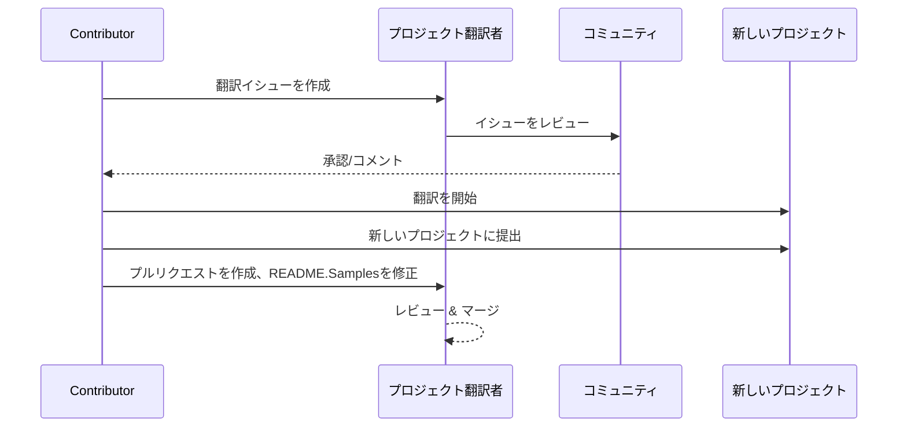

# プロジェクト翻訳者

VSCodeの拡張機能：プロジェクトの多言語ローカライゼーションのための使いやすいツール。

## 利用可能な翻訳

この拡張機能は以下の言語への翻訳をサポートしています：

- [简体中文 (zh-cn)](./readmes/README.zh-cn.md)
- [繁體中文 (zh-tw)](./readmes/README.zh-tw.md)
- [日本語 (ja-jp)](./readmes/README.ja-jp.md)
- [한국어 (ko-kr)](./readmes/README.ko-kr.md)
- [Français (fr-fr)](./readmes/README.fr-fr.md)
- [Deutsch (de-de)](./readmes/README.de-de.md)
- [Español (es-es)](./readmes/README.es-es.md)
- [Português (pt-br)](./readmes/README.pt-br.md)
- [Русский (ru-ru)](./readmes/README.ru-ru.md)
- [العربية (ar-sa)](./readmes/README.ar-sa.md)
- [العربية (ar-ae)](./readmes/README.ar-ae.md)
- [العربية (ar-eg)](./readmes/README.ar-eg.md)

## サンプル

| プロジェクト                                                   | 言語                                                                                                                                                 |
| --------------------------------------------------------- | --------------------------------------------------------------------------------------------------------------------------------------------------------- |
| [google/styleguide](https://github.com/google/styleguide) | [en-us](https://github.com/google/styleguide) オリジナル by @google<br>[zh-cn](https://github.com/Project-Translation/styleguide-zh-cn) 翻訳 by @jqknono |

## プロジェクト翻訳のリクエスト

翻訳に貢献したい場合や、プロジェクトの翻訳が必要な場合：

1. 以下のテンプレートを使用してイシューを作成してください：

```md
**プロジェクト**: [project_url]
**対象言語**: [target_lang]
**説明**: この翻訳がなぜ価値があるのかの簡単な説明
```

2. ワークフロー：



3. PRがマージされた後、翻訳はサンプルセクションに追加されます。

進行中の翻訳：[イシューを表示](https://github.com/Project-Translation/project_translator/issues)

## 機能
- 📁 フォルダーレベルの翻訳サポート
  - 複数の言語にプロジェクト全体のフォルダーを翻訳
  - オリジナルのフォルダー構造と階層を維持
  - サブフォルダーの再帰的な翻訳をサポート
  - 翻訳可能なコンテンツの自動検出
  - 大規模な翻訳のためのバッチ処理
- 📄 ファイルレベルの翻訳サポート
  - 個々のファイルを複数の言語に翻訳
  - オリジナルのファイル構造とフォーマットを保持
  - フォルダーとファイルの両方の翻訳モードをサポート
- 💡 AIによるスマート翻訳
  - コード構造の整合性を自動的に維持
  - コードのコメントのみを翻訳し、コードのロジックを保持
  - JSON/XMLなどのデータ構造フォーマットを維持
  - プロフェッショナルな技術文書の翻訳品質
- ⚙️ 柔軟な設定
  - ソースフォルダーと複数のターゲットフォルダーを設定
  - カスタムファイル翻訳間隔のサポート
  - 無視する特定のファイルタイプを設定
  - 複数のAIモデルオプションのサポート
- 🚀 ユーザーフレンドリーな操作
  - リアルタイムの翻訳進行状況表示
  - 翻訳の一時停止/再開/停止のサポート
  - ターゲットフォルダー構造の自動維持
  - 重複作業を避けるためのインクリメンタル翻訳

## インストール

1. VS Code拡張機能マーケットプレイスで"[Project Translator](https://marketplace.visualstudio.com/items?itemName=techfetch-dev.project-translator)"を検索
2. インストールをクリック

## 設定

この拡張機能は以下の設定オプションをサポートしています：

```json
{
  "projectTranslator.specifiedFolders": [
    {
      "sourceFolder": {
        "path": "ソースフォルダーのパス",
        "lang": "ソース言語コード"
      },
      "destFolders": [
        {
          "path": "ターゲットフォルダーのパス",
          "lang": "ターゲット言語コード"
        }
      ]
    }
  ],
  "projectTranslator.specifiedFiles": [
    {
      "sourceFile": {
        "path": "ソースファイルのパス",
        "lang": "ソース言語コード"
      },
      "destFiles": [
        {
          "path": "ターゲットファイルのパス",
          "lang": "ターゲット言語コード"
        }
      ]
    }
  ],
  "projectTranslator.currentVendor": "openai",
  "projectTranslator.vendors": [
    {
      "name": "openai",
      "apiEndpoint": "APIエンドポイントURL",
      "apiKey": "API認証キー",
      "model": "使用するモデル名",
      "rpm": "1分あたりの最大リクエスト数",
      "maxTokensPerSegment": 4096,
      "timeout": 30,
      "temperature": 0.0
    }
  ]
}
```

主要な設定の詳細：
| 設定オプション                                    | 説明                                                                                          |
| ------------------------------------------------- | ---------------------------------------------------------------------------------------------- |
| `projectTranslator.specifiedFolders`              | 翻訳のための複数のソースフォルダと対応するデスティネーションフォルダ                             |
| `projectTranslator.specifiedFiles`                | 翻訳のための複数のソースファイルと対応するデスティネーションファイル                             |
| `projectTranslator.translationIntervalDays`       | 翻訳の間隔（日単位）、デフォルトは7日                                                          |
| `projectTranslator.ignoreTranslationExtensions`   | 翻訳不要のテキストファイル拡張子のリスト、これらのファイルは直接コピーされます                  |
| `projectTranslator.ignorePaths`                   | ワイルドカードを使用した無視するパスパターンのリスト、これらのファイルはコピーされません        |
| `projectTranslator.currentVendor`                 | 現在使用中のAPIベンダー                                                                        |
| `projectTranslator.vendors`                       | APIベンダーの設定リスト                                                                        |
| `projectTranslator.systemPrompts`                 | 翻訳プロセスをガイドするためのシステムプロンプトの配列                                          |
| `projectTranslator.userPrompts`                   | ユーザー定義のプロンプトの配列、翻訳中にシステムプロンプトの後に追加されます                     |
| `projectTranslator.segmentationMarkers`           | ファイルタイプごとに設定されたセグメンテーションマーカー、正規表現をサポート                     |

## 使用方法

1. コマンドパレットを開く（Ctrl+Shift+P / Cmd+Shift+P）
2. "Translate Project" と入力し、コマンドを選択
3. ソースフォルダが設定されていない場合、フォルダ選択ダイアログが表示されます
4. 翻訳が完了するまで待つ

翻訳中:

- ステータスバーのボタンで翻訳を一時停止/再開できます
- いつでも翻訳プロセスを停止できます
- 翻訳の進行状況は通知エリアに表示されます
- 詳細なログは出力パネルに表示されます

## 注意事項

- 十分なAPI使用クオータを確保してください
- まずは小規模なプロジェクトでテストすることをお勧めします
- 専用のAPIキーを使用し、完了後に削除してください

## ライセンス

[ライセンス](LICENSE)