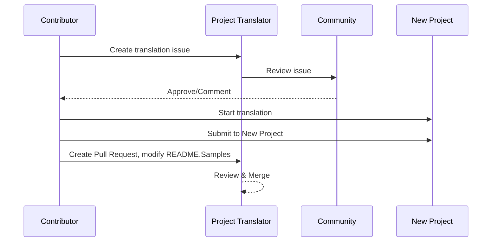

# Project Translator

A VSCode extension: An easy-to-use tool for multi-language localization of projects.

## Available Translations

The extension supports translation to these languages:

- [简体中文 (zh-cn)](./README.zh-cn.md)
- [繁體中文 (zh-tw)](./README.zh-tw.md)
- [日本語 (ja-jp)](./README.ja-jp.md)
- [한국어 (ko-kr)](./README.ko-kr.md)
- [Français (fr-fr)](./README.fr-fr.md)
- [Deutsch (de-de)](./README.de-de.md)
- [Español (es-es)](./README.es-es.md)
- [Português (pt-br)](./README.pt-br.md)
- [Русский (ru-ru)](./README.ru-ru.md)
- [العربية (ar-sa)](./README.ar-sa.md)
- [العربية (ar-ae)](./README.ar-ae.md)
- [العربية (ar-eg)](./README.ar-eg.md)

## Samples

| Project                                                                             | Original Repository                                                                                       | Description                                                                                                                                                               | Stars | Tags                                                                                                                                                                                                                                                                                                                                                                                                                                                                                                                                                                                                                                                                 |
| ----------------------------------------------------------------------------------- | --------------------------------------------------------------------------------------------------------- | ------------------------------------------------------------------------------------------------------------------------------------------------------------------------- | ----- | -------------------------------------------------------------------------------------------------------------------------------------------------------------------------------------------------------------------------------------------------------------------------------------------------------------------------------------------------------------------------------------------------------------------------------------------------------------------------------------------------------------------------------------------------------------------------------------------------------------------------------------------------------------------- |
| [algorithm-visualizer](https://github.com/Project-Translation/algorithm-visualizer) | [algorithm-visualizer/algorithm-visualizer](https://github.com/algorithm-visualizer/algorithm-visualizer) | :fireworks:Interactive Online Platform that Visualizes Algorithms from Code                                                                                               | 47301 | [`algorithm`](https://github.com/topics/algorithm), [`animation`](https://github.com/topics/animation), [`data-structure`](https://github.com/topics/data-structure), [`visualization`](https://github.com/topics/visualization)                                                                                                                                                                                                                                                                                                                                                                                                                                     |
| [algorithms](https://github.com/Project-Translation/algorithms)                     | [algorithm-visualizer/algorithms](https://github.com/algorithm-visualizer/algorithms)                     | :crystal_ball:Algorithm Visualizations                                                                                                                                    | 401   | N/A                                                                                                                                                                                                                                                                                                                                                                                                                                                                                                                                                                                                                                                                  |
| [cline-docs](https://github.com/Project-Translation/cline-docs)                     | [cline/cline](https://github.com/cline/cline)                                                             | Autonomous coding agent right in your IDE, capable of creating/editing files, executing commands, using the browser, and more with your permission every step of the way. | 39572 | N/A                                                                                                                                                                                                                                                                                                                                                                                                                                                                                                                                                                                                                                                                  |
| [cursor-docs](https://github.com/Project-Translation/cursor-docs)                   | [getcursor/docs](https://github.com/getcursor/docs)                                                       | Cursor's Open Source Documentation                                                                                                                                        | 309   | N/A                                                                                                                                                                                                                                                                                                                                                                                                                                                                                                                                                                                                                                                                  |
| [gobyexample](https://github.com/Project-Translation/gobyexample)                   | [mmcgrana/gobyexample](https://github.com/mmcgrana/gobyexample)                                           | Go by Example                                                                                                                                                             | 7523  | N/A                                                                                                                                                                                                                                                                                                                                                                                                                                                                                                                                                                                                                                                                  |
| [golang-website](https://github.com/Project-Translation/golang-website)             | [golang/website](https://github.com/golang/website)                                                       | [mirror] Home of the go.dev and golang.org websites                                                                                                                       | 402   | N/A                                                                                                                                                                                                                                                                                                                                                                                                                                                                                                                                                                                                                                                                  |
| [reference-en-us](https://github.com/Project-Translation/reference-en-us)           | [Fechin/reference](https://github.com/Fechin/reference)                                                   | ⭕ Share quick reference cheat sheet for developers.                                                                                                                      | 7808  | [`awk`](https://github.com/topics/awk), [`bash`](https://github.com/topics/bash), [`chatgpt`](https://github.com/topics/chatgpt), [`cheatsheet`](https://github.com/topics/cheatsheet), [`cheatsheets`](https://github.com/topics/cheatsheets), [`css`](https://github.com/topics/css), [`golang`](https://github.com/topics/golang), [`grep`](https://github.com/topics/grep), [`markdown`](https://github.com/topics/markdown), [`python`](https://github.com/topics/python), [`reference`](https://github.com/topics/reference), [`sed`](https://github.com/topics/sed), [`snippets`](https://github.com/topics/snippets), [`vim`](https://github.com/topics/vim) |
| [styleguide](https://github.com/Project-Translation/styleguide)                     | [google/styleguide](https://github.com/google/styleguide)                                                 | Style guides for Google-originated open-source projects                                                                                                                   | 38055 | [`cpplint`](https://github.com/topics/cpplint), [`style-guide`](https://github.com/topics/style-guide), [`styleguide`](https://github.com/topics/styleguide)                                                                                                                                                                                                                                                                                                                                                                                                                                                                                                         |
| [vscode-docs](https://github.com/Project-Translation/vscode-docs)                   | [microsoft/vscode-docs](https://github.com/microsoft/vscode-docs)                                         | Public documentation for Visual Studio Code                                                                                                                               | 5914  | [`vscode`](https://github.com/topics/vscode)                                                                                                                                                                                                                                                                                                                                                                                                                                                                                                                                                                                                                         |

## Requesting Project Translation

If you want to contribute a translation or need a project to be translated:

1. Create an issue using the following template:

```md
**Project**: [project_url]
**Target Language**: [target_lang]
**Description**: Brief description of why this translation would be valuable
```

2. Workflow:



3. After the PR is merged, the translation will be added to the Samples section.

Current translations in progress: [View Issues](https://github.com/Project-Translation/project_translator/issues)

## Features

- 📁 Folder-level Translation Support
  - Translate entire project folders to multiple languages
  - Maintain original folder structure and hierarchy
  - Support for recursive translation of subfolders
  - Automatic detection of translatable content
  - Batch processing for efficient large-scale translations
- 📄 File-level Translation Support
  - Translate individual files to multiple languages
  - Preserve original file structure and formatting
  - Support for both folder and file translation modes
- 💡 Smart Translation with AI
  - Automatically maintains code structure integrity
  - Only translates code comments, preserves code logic
  - Maintains JSON/XML and other data structure formats
  - Professional technical documentation translation quality
- ⚙️ Flexible Configuration
  - Configure source folder and multiple target folders
  - Support for custom file translation intervals
  - Set specific file types to ignore
  - Support for multiple AI model options
- 🚀 User-Friendly Operations
  - Real-time translation progress display
  - Support for pause/resume/stop translation
  - Automatic maintenance of target folder structure
  - Incremental translation to avoid duplicate work

## Installation

1. Search for "[Project Translator](https://marketplace.visualstudio.com/items?itemName=techfetch-dev.project-translator)" in VS Code extension marketplace
2. Click install

## Configuration

The extension supports the following configuration options:

```json
{
  "projectTranslator.specifiedFolders": [
    {
      "sourceFolder": {
        "path": "Source folder path",
        "lang": "Source language code"
      },
      "targetFolders": [
        {
          "path": "Target folder path",
          "lang": "Target language code"
        }
      ]
    }
  ],
  "projectTranslator.specifiedFiles": [
    {
      "sourceFile": {
        "path": "Source file path",
        "lang": "Source language code"
      },
      "targetFiles": [
        {
          "path": "Target file path",
          "lang": "Target language code"
        }
      ]
    }
  ],
  "projectTranslator.currentVendor": "openai",
  "projectTranslator.vendors": [
    {
      "name": "openai",
      "apiEndpoint": "API endpoint URL",
      "apiKey": "API authentication key",
      "apiKeyEnvVarName": "Environment variable name for API key",
      "model": "Model name to use",
      "rpm": "Maximum requests per minute",
      "maxTokensPerSegment": 4096,
      "timeout": 30,
      "temperature": 0.0
    }
  ]
}
```

Key configuration details:

| 構成オプション                                | 説明                                                                                      |
| --------------------------------------------- | ----------------------------------------------------------------------------------------- |
| `projectTranslator.specifiedFolders`          | 翻訳用の複数のソースフォルダーと対応する宛先フォルダー                                      |
| `projectTranslator.specifiedFiles`            | 翻訳用の複数のソースファイルと対応する宛先ファイル                                          |
| `projectTranslator.translationIntervalDays`   | 翻訳間隔（日数）（デフォルト7日）                                                         |
| `projectTranslator.copyOnly`                  | コピー対象だが翻訳対象外のファイル（`paths`および`extensions`配列付き）                    |
| `projectTranslator.ignore`                    | 完全に無視するファイル（`paths`および`extensions`配列付き）                                |
| `projectTranslator.skipFrontMatterMarkers`    | フロントマターのマーカーに基づいてファイルをスキップ（`enabled`および`markers`配列付き） |
| `projectTranslator.currentVendor`             | 使用中の現在のAPIベンダー                                                                 |
| `projectTranslator.vendors`                   | APIベンダーの構成リスト（apiKeyを直接使用、または環境変数用にapiKeyEnvVarNameを使用可能） |
| `projectTranslator.systemPrompts`             | 翻訳プロセスをガイドするシステムプロンプト配列                                            |
| `projectTranslator.userPrompts`               | ユーザー定義プロンプト配列。翻訳中にシステムプロンプトの後に追加される                    |
| `projectTranslator.segmentationMarkers`       | ファイルタイプごとに構成されたセグメンテーションマーカー。正規表現をサポート              |
| `projectTranslator.debug`                     | デバッグモードを有効化し、すべてのAPIリクエストと応答を出力チャンネルにログ出力（デフォルト：false） |
| `projectTranslator.logFile`                   | デバッグログファイルの構成（[ログファイル機能](./docs/log-file-feature.md)を参照）       |

## 使用方法

1. コマンドパレットを開く（Ctrl+Shift+P / Cmd+Shift+P）
2. 「Translate Project」と入力し、コマンドを選択
3. ソースフォルダーが構成されていない場合、フォルダー選択ダイアログが表示される
4. 翻訳が完了するまで待つ

翻訳中：

- ステータスバーのボタンから翻訳の一時停止／再開が可能
- いつでも翻訳プロセスを停止できる
- 翻訳の進捗状況は通知エリアに表示される
- 詳細なログは出力パネルに表示される

## 開発

### ビルドシステム

この拡張機能は高速なバンドルと開発のためにesbuildを使用しています：

#### 使用可能なスクリプト

- `npm run build` - ミニファイ付きの本番ビルド
- `npm run compile` - 開発用ビルド
- `npm run watch` - 開発用のウォッチモード
- `npm test` - テストの実行

#### VS Codeタスク

- **Build**（Ctrl+Shift+P → 「タスク：タスクの実行」→ 「build」） - 本番用に拡張機能をバンドル
- **Watch**（Ctrl+Shift+P → 「タスク：タスクの実行」→ 「watch」） - 自動再構築付きの開発モード

### 開発セットアップ

1. リポジトリをクローン
2. `npm install` を実行して依存関係をインストール
3. デバッグを開始するには `F5` を押すか、開発用に「watch」タスクを実行

esbuildの構成：

- すべてのTypeScriptファイルを単一の `out/extension.js` にバンドル
- VS Code APIを除外（externalとしてマーク）

## 高度な機能

### APIキーに環境変数を使用

Project Translatorは、APIキーに環境変数を使用することをサポートしています。これは、APIキーを構成ファイルに直接保存するよりも安全な方法です：

1. `apiKeyEnvVarName` プロパティでベンダーを構成：

```json
{
  "projectTranslator.vendors": [
    {
      "name": "openai",
      "apiEndpoint": "https://api.openai.com/v1",
      "apiKeyEnvVarName": "OPENAI_API_KEY",
      "model": "gpt-4"
    },
    {
      "name": "openrouter",
      "apiEndpoint": "https://openrouter.ai/api/v1",
      "apiKeyEnvVarName": "OPENROUTER_API_KEY",
      "model": "anthropic/claude-3-opus"
    }
  ]
}
```

2. システムに環境変数を設定：
   - Windowsの場合：`set OPENAI_API_KEY=your_api_key`
   - macOS/Linuxの場合：`export OPENAI_API_KEY=your_api_key`

3. 拡張機能が実行されると：
   - まず構成内に `apiKey` が直接指定されているか確認
   - 指定されていない場合、`apiKeyEnvVarName` で指定された環境変数を探す

この方法により、APIキーを構成ファイルやバージョン管理システムから外すことができます。

### フロントマターに基づいて翻訳をスキップ

Project Translatorは、Markdownファイルのフロントマターメタデータに基づいて翻訳をスキップできます。これは下書きドキュメントや翻訳不要とマークされたファイルに便利です。

この機能を有効にするには、`projectTranslator.skipFrontMatterMarkers` オプションを構成します：

```json
{
  "projectTranslator.skipFrontMatterMarkers": {
    "enabled": true,
    "markers": [
      {
        "key": "draft",
        "value": "true"
      },
      {
        "key": "translate",
        "value": "false"
      }
    ]
  }
}
```

この構成により、フロントマターに `draft: true` または `translate: false` を含むMarkdownファイルは翻訳からスキップされ、ターゲット先に直接コピーされます。

スキップされるMarkdownファイルの例：
```
---
draft: true
title: "下書きドキュメント"
---

このドキュメントは下書きであり、翻訳すべきではありません。
```


### 設計ドキュメント

- 開発用ビルドにソースマップを生成
- 本番用ビルドにコードをミニファイ
- VS Code用の問題マッチャー統合を提供

## 注意事項

- 十分なAPI使用クォータを確保してください
- 小規模なプロジェクトでテストすることを推奨
- 専用のAPIキーを使用し、完了後に削除してください

## ライセンス

[ライセンス](LICENSE)