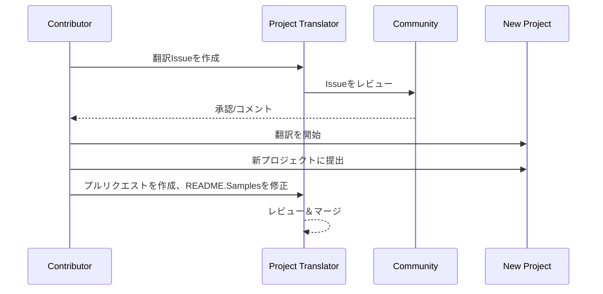

# プロジェクト翻訳ツール

VSCode拡張機能：プロジェクトの多言語ローカライズを簡単に行うツール。

<!--
## 利用可能な翻訳

この拡張機能は以下の言語への翻訳をサポートしています：

- [简体中文 (zh-cn)](./readmes/README.zh-cn.md)
- [繁體中文 (zh-tw)](./readmes/README.zh-tw.md)
- [日本語 (ja-jp)](./readmes/README.ja-jp.md)
- [한국어 (ko-kr)](./readmes/README.ko-kr.md)
- [Français (fr-fr)](./readmes/README.fr-fr.md)
- [Deutsch (de-de)](./readmes/README.de-de.md)
- [Español (es-es)](./readmes/README.es-es.md)
- [Português (pt-br)](./readmes/README.pt-br.md)
- [Русский (ru-ru)](./readmes/README.ru-ru.md)
- [العربية (ar-sa)](./readmes/README.ar-sa.md)
- [العربية (ar-ae)](./readmes/README.ar-ae.md)
- [العربية (ar-eg)](./readmes/README.ar-eg.md) -->

## サンプル

| プロジェクト                                                                             | オリジナルリポジトリ                                                                                       | 説明                                                                                                                                                               | スター数 | タグ                                                                                                                                                                                                                                                                                                                                                                                                                                                                                                                                                                                                                                                                 |
| ----------------------------------------------------------------------------------- | --------------------------------------------------------------------------------------------------------- | ------------------------------------------------------------------------------------------------------------------------------------------------------------------------- | ----- | -------------------------------------------------------------------------------------------------------------------------------------------------------------------------------------------------------------------------------------------------------------------------------------------------------------------------------------------------------------------------------------------------------------------------------------------------------------------------------------------------------------------------------------------------------------------------------------------------------------------------------------------------------------------- |
| [algorithm-visualizer](https://github.com/Project-Translation/algorithm-visualizer) | [algorithm-visualizer/algorithm-visualizer](https://github.com/algorithm-visualizer/algorithm-visualizer) | :fireworks:コードからアルゴリズムを視覚化するインタラクティブなオンラインプラットフォーム                                                                                               | 47301 | [`algorithm`](https://github.com/topics/algorithm), [`animation`](https://github.com/topics/animation), [`data-structure`](https://github.com/topics/data-structure), [`visualization`](https://github.com/topics/visualization)                                                                                                                                                                                                                                                                                                                                                                                                                                     |
| [algorithms](https://github.com/Project-Translation/algorithms)                     | [algorithm-visualizer/algorithms](https://github.com/algorithm-visualizer/algorithms)                     | :crystal_ball:アルゴリズムの視覚化                                                                                                                                    | 401   | N/A                                                                                                                                                                                                                                                                                                                                                                                                                                                                                                                                                                                                                                                                  |
| [cline-docs](https://github.com/Project-Translation/cline-docs)                     | [cline/cline](https://github.com/cline/cline)                                                             | IDE内で動作する自律的なコーディングエージェント。ファイルの作成/編集、コマンドの実行、ブラウザの使用などを許可されたステップごとに実行できます。 | 39572 | N/A                                                                                                                                                                                                                                                                                                                                                                                                                                                                                                                                                                                                                                                                  |
| [cursor-docs](https://github.com/Project-Translation/cursor-docs)                   | [getcursor/docs](https://github.com/getcursor/docs)                                                       | Cursorのオープンソースドキュメント                                                                                                                                        | 309   | N/A                                                                                                                                                                                                                                                                                                                                                                                                                                                                                                                                                                                                                                                                  |
| [gobyexample](https://github.com/Project-Translation/gobyexample)                   | [mmcgrana/gobyexample](https://github.com/mmcgrana/gobyexample)                                           | Go by Example                                                                                                                                                             | 7523  | N/A                                                                                                                                                                                                                                                                                                                                                                                                                                                                                                                                                                                                                                                                  |
| [golang-website](https://github.com/Project-Translation/golang-website)             | [golang/website](https://github.com/golang/website)                                                       | [ミラー] go.devとgolang.orgウェブサイトのホーム                                                                                                                       | 402   | N/A                                                                                                                                                                                                                                                                                                                                                                                                                                                                                                                                                                                                                                                                  |
| [reference-en-us](https://github.com/Project-Translation/reference-en-us)           | [Fechin/reference](https://github.com/Fechin/reference)                                                   | ⭕ 開発者向けのクイックリファレンスチートシートを共有します。                                                                                                                      | 7808  | [`awk`](https://github.com/topics/awk), [`bash`](https://github.com/topics/bash), [`chatgpt`](https://github.com/topics/chatgpt), [`cheatsheet`](https://github.com/topics/cheatsheet), [`cheatsheets`](https://github.com/topics/cheatsheets), [`css`](https://github.com/topics/css), [`golang`](https://github.com/topics/golang), [`grep`](https://github.com/topics/grep), [`markdown`](https://github.com/topics/markdown), [`python`](https://github.com/topics/python), [`reference`](https://github.com/topics/reference), [`sed`](https://github.com/topics/sed), [`snippets`](https://github.com/topics/snippets), [`vim`](https://github.com/topics/vim) |
| [styleguide](https://github.com/Project-Translation/styleguide)                     | [google/styleguide](https://github.com/google/styleguide)                                                 | Google発祥のオープンソースプロジェクトのスタイルガイド                                                                                                                   | 38055 | [`cpplint`](https://github.com/topics/cpplint), [`style-guide`](https://github.com/topics/style-guide), [`styleguide`](https://github.com/topics/styleguide)                                                                                                                                                                                                                                                                                                                                                                                                                                                                                                         |
| [vscode-docs](https://github.com/Project-Translation/vscode-docs)                   | [microsoft/vscode-docs](https://github.com/microsoft/vscode-docs)                                         | Visual Studio Codeの公開ドキュメント                                                                                                                               | 5914  | [`vscode`](https://github.com/topics/vscode)                                                                                                                                                                                                                                                                                                                                                                                                                                                                                                                                                                                                                         |

## プロジェクト翻訳のリクエスト

翻訳を提供したい、またはプロジェクトを翻訳してほしい場合は：

1. 以下のテンプレートを使用してIssueを作成してください：

```md
**プロジェクト**: [project_url]
**ターゲット言語**: [target_lang]
**説明**: この翻訳が価値ある理由の簡単な説明
```

2. ワークフロー：



3. PRがマージされた後、翻訳はサンプルセクションに追加されます。

進行中の翻訳: [Issueを表示](https://github.com/Project-Translation/project_translator/issues)

## 機能

- 📁 フォルダレベル翻訳サポート
  - プロジェクトフォルダ全体を複数言語に翻訳
  - 元のフォルダ構造と階層を維持
  - サブフォルダの再帰的翻訳をサポート
  - 翻訳可能なコンテンツの自動検出
  - 大規模翻訳のためのバッチ処理
- 📄 ファイルレベル翻訳サポート
  - 個々のファイルを複数言語に翻訳
  - 元のファイル構造とフォーマットを維持
  - フォルダとファイルの翻訳モードをサポート
- 💡 AIによるスマート翻訳
  - コード構造の整合性を自動的に維持
  - コードコメントのみ翻訳、コードロジックは保持
  - JSON/XMLなどのデータ構造フォーマットを維持
  - プロフェッショナルな技術文書翻訳品質
- ⚙️ 柔軟な設定
  - ソースフォルダと複数のターゲットフォルダを設定
  - カスタムファイル翻訳間隔をサポート
  - 無視する特定のファイルタイプを設定
  - 複数のAIモデルオプションをサポート
- 🚀 ユーザーフレンドリーな操作
  - リアルタイムの翻訳進捗表示
  - 翻訳の一時停止/再開/停止をサポート
  - ターゲットフォルダ構造を自動的に維持
  - 重複作業を避けるための増分翻訳
- 🔄 高度な差分適用翻訳
  - **正確な更新**: 実際に変更されたコンテンツのみ翻訳
  - **行単位の制御**: 正確なフォーマットと構造を維持
  - **増分翻訳**: 翻訳されたドキュメントの維持に最適
  - **バージョンコントロールに優しい**: 最小限のターゲット変更を生成
  - **コスト効率**: 差分のみを翻訳することでAPIコールを削減
  - **自動バックアップ**: 変更を適用する前に自動的にバックアップファイルを作成

## インストール

1. VS Code拡張機能マーケットプレイスで"[Project Translator](https://marketplace.visualstudio.com/items?itemName=techfetch-dev.project-translator)"を検索
2. インストールをクリック

## 設定

この拡張機能は以下の設定オプションをサポートしています：

```json
{
  "projectTranslator.specifiedFolders": [
    {
      "sourceFolder": {
        "path": "ソースフォルダのパス",
        "lang": "ソース言語コード"
      },
      "targetFolders": [
        {
          "path": "ターゲットフォルダのパス",
          "lang": "ターゲット言語コード"
        }
      ]
    }
  ],
  "projectTranslator.diffApply": {
    "enabled": true,
    "validationLevel": "normal",
    "autoBackup": true,
    "maxOperationsPerFile": 100
  },
  "projectTranslator.specifiedFiles": [
    {
      "sourceFile": {
        "path": "ソースファイルのパス",
        "lang": "ソース言語コード"
      },
      "targetFiles": [
        {
          "path": "ターゲットファイルのパス",
          "lang": "ターゲット言語コード"
        }
      ]
    }
  ],
  "projectTranslator.currentVendor": "openai",
  "projectTranslator.vendors": [
    {
      "name": "openai",
      "apiEndpoint": "APIエンドポイントURL",
      "apiKey": "API認証キー",
      "model": "使用するモデル名",
      "rpm": "1分あたりの最大リクエスト数",
      "maxTokensPerSegment": 4096,
      "timeout": 30,
      "temperature": 0.0
    }
  ]
}
```

主な設定の詳細：

| 設定オプション                        | 説明                                                                                    |
| ------------------------------------------- | ---------------------------------------------------------------------------------------------- |
| `projectTranslator.specifiedFolders`        | 翻訳用の複数のソースフォルダとそれに対応する宛先フォルダ           |
| `projectTranslator.specifiedFiles`          | 翻訳用の複数のソースファイルとそれに対応する宛先ファイル               |
| `projectTranslator.translationIntervalDays` | 翻訳間隔（デフォルト7日）                                                  |
| `projectTranslator.copyOnly`                | 翻訳せずにコピーするファイル（`paths`と`extensions`配列）                         |
| `projectTranslator.ignore`                  | 完全に無視するファイル（`paths`と`extensions`配列）                              |
| `projectTranslator.currentVendor`           | 現在使用中のAPIベンダー                                                                      |
| `projectTranslator.vendors`                 | APIベンダーの設定リスト                                                                  |
| `projectTranslator.systemPrompts`           | 翻訳プロセスをガイドするシステムプロンプトの配列                                        |
| `projectTranslator.userPrompts`             | ユーザー定義のプロンプト配列。これらのプロンプトは翻訳中にシステムプロンプトの後に追加されます |
| `projectTranslator.segmentationMarkers`     | ファイルタイプごとに設定されたセグメンテーションマーカー。正規表現をサポート                     |
| `projectTranslator.debug`                   | デバッグモードを有効にして、すべてのAPIリクエストとレスポンスを出力チャネルにログします（デフォルト: false）    |
| `projectTranslator.logFile`                 | デバッグログファイルの設定（[ログファイル機能](./docs/log-file-feature.md)を参照）        |

## 使用方法

1. コマンドパレットを開く（Ctrl+Shift+P / Cmd+Shift+P）
2. "Translate Project"と入力してコマンドを選択
3. ソースフォルダが設定されていない場合、フォルダ選択ダイアログが表示されます
4. 翻訳が完了するのを待つ

翻訳中：

- ステータスバーのボタンで翻訳を一時停止/再開できます
- いつでも翻訳プロセスを停止できます
- 翻訳の進捗状況が通知領域に表示されます
- 詳細なログが出力パネルに表示されます

## 開発

### ビルドシステム

この拡張機能はesbuildを使用して高速なバンドルと開発を行います：

#### 利用可能なスクリプト

- `npm run build` - ミニファイされたプロダクションビルド
- `npm run compile` - 開発ビルド
- `npm run watch` - 開発用のウォッチモード
- `npm test` - テストを実行

#### VS Codeタスク

- **ビルド** (Ctrl+Shift+P → "Tasks: Run Task" → "build") - プロダクション用に拡張機能をバンドル
- **ウォッチ** (Ctrl+Shift+P → "Tasks: Run Task" → "watch") - 自動リビルド付きの開発モード

### 開発セットアップ

1. リポジトリをクローン
2. `npm install`を実行して依存関係をインストール
3. `F5`を押してデバッグを開始するか、"watch"タスクを実行して開発を開始

esbuildの設定：

- すべてのTypeScriptファイルを単一の`out/extension.js`にバンドル
- VS Code APIを除外（外部としてマーク）

## 高度な機能

### 差分適用翻訳

高度な差分適用翻訳モードの詳細については、[差分適用使用ガイド](./docs/diff-apply-usage.md)を参照してください。

この機能により以下が可能になります：
- 正確な行単位の翻訳更新
- 大規模ファイルのAPIコスト削減
- バージョンコントロールとのより良い統合
- ドキュメントフォーマットの維持

### 設計ドキュメント

差分適用の実装に関する技術的な詳細については、[差分適用翻訳設計](./docs/diff-apply-translation-design.md)を参照してください。
- 開発ビルド用のソースマップを生成
- プロダクションビルド用にコードをミニファイ
- VS Codeの問題マッチャー統合を提供

## 注意事項

- 十分なAPI使用クォータを確保してください
- 最初に小さなプロジェクトでテストすることをお勧めします
- 専用のAPIキーを使用し、完了後に削除してください

## ライセンス

[ライセンス](LICENSE)