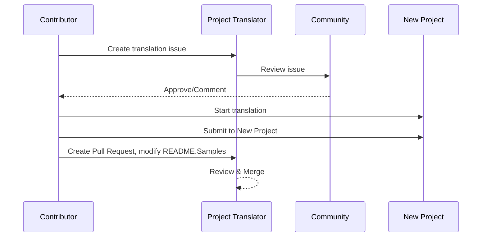

# プロジェクト トランスレーター

VSCode 拡張機能: プロジェクトの多言語ローカライズのための使いやすいツールです。

<!--
## 利用可能な翻訳

この拡張機能は、以下の言語への翻訳をサポートしています:

- [簡体中文 (zh-cn)](./README.zh-cn.md)
- [繁體中文 (zh-tw)](./README.zh-tw.md)
- [日本語 (ja-jp)](./README.ja-jp.md)
- [한국어 (ko-kr)](./README.ko-kr.md)
- [Français (fr-fr)](./README.fr-fr.md)
- [Deutsch (de-de)](./README.de-de.md)
- [Español (es-es)](./README.es-es.md)
- [Português (pt-br)](./README.pt-br.md)
- [Русский (ru-ru)](./README.ru-ru.md)
- [العربية (ar-sa)](./README.ar-sa.md)
- [العربية (ar-ae)](./README.ar-ae.md)
- [العربية (ar-eg)](./README.ar-eg.md) -->

## サンプル

| プロジェクト                                                                             | 元のレポジトリ                                                                                       | 説明                                                                                                                                                               | Stars | タグ                                                                                                                                                                                                                                                                                                                                                                                                                                                                                                                                                                                                                                                                 |
| ----------------------------------------------------------------------------------- | --------------------------------------------------------------------------------------------------------- | ------------------------------------------------------------------------------------------------------------------------------------------------------------------------- | ----- | -------------------------------------------------------------------------------------------------------------------------------------------------------------------------------------------------------------------------------------------------------------------------------------------------------------------------------------------------------------------------------------------------------------------------------------------------------------------------------------------------------------------------------------------------------------------------------------------------------------------------------------------------------------------- |
| [algorithm-visualizer](https://github.com/Project-Translation/algorithm-visualizer) | [algorithm-visualizer/algorithm-visualizer](https://github.com/algorithm-visualizer/algorithm-visualizer) | :fireworks:コードからアルゴリズムを視覚化するインタラクティブなオンライン プラットフォーム                                                                                               | 47301 | [`algorithm`](https://github.com/topics/algorithm), [`animation`](https://github.com/topics/animation), [`data-structure`](https://github.com/topics/data-structure), [`visualization`](https://github.com/topics/visualization)                                                                                                                                                                                                                                                                                                                                                                                                                                     |
| [algorithms](https://github.com/Project-Translation/algorithms)                     | [algorithm-visualizer/algorithms](https://github.com/algorithm-visualizer/algorithms)                     | :crystal_ball:アルゴリズムの視覚化                                                                                                                                    | 401   | N/A                                                                                                                                                                                                                                                                                                                                                                                                                                                                                                                                                                                                                                                                  |
| [cline-docs](https://github.com/Project-Translation/cline-docs)                     | [cline/cline](https://github.com/cline/cline)                                                             | IDE内で自律的なコーディング エージェントで、ファイルの作成/編集、コマンドの実行、ブラウザの使用などが可能で、すべてのステップで許可を求めます。 | 39572 | N/A                                                                                                                                                                                                                                                                                                                                                                                                                                                                                                                                                                                                                                                                  |
| [cursor-docs](https://github.com/Project-Translation/cursor-docs)                   | [getcursor/docs](https://github.com/getcursor/docs)                                                       | Cursorのオープンソース ドキュメント                                                                                                                                        | 309   | N/A                                                                                                                                                                                                                                                                                                                                                                                                                                                                                                                                                                                                                                                                  |
| [gobyexample](https://github.com/Project-Translation/gobyexample)                   | [mmcgrana/gobyexample](https://github.com/mmcgrana/gobyexample)                                           | Go by Example                                                                                                                                                             | 7523  | N/A                                                                                                                                                                                                                                                                                                                                                                                                                                                                                                                                                                                                                                                                  |
| [golang-website](https://github.com/Project-Translation/golang-website)             | [golang/website](https://github.com/golang/website)                                                       | [mirror] go.dev と golang.org のウェブサイトのホーム                                                                                                                       | 402   | N/A                                                                                                                                                                                                                                                                                                                                                                                                                                                                                                                                                                                                                                                                  |
| [reference-en-us](https://github.com/Project-Translation/reference-en-us)           | [Fechin/reference](https://github.com/Fechin/reference)                                                   | ⭕ 開発者のためのクイック リファレンス チートシートを共有します。                                                                                                                      | 7808  | [`awk`](https://github.com/topics/awk), [`bash`](https://github.com/topics/bash), [`chatgpt`](https://github.com/topics/chatgpt), [`cheatsheet`](https://github.com/topics/cheatsheet), [`cheatsheets`](https://github.com/topics/cheatsheets), [`css`](https://github.com/topics/css), [`golang`](https://github.com/topics/golang), [`grep`](https://github.com/topics/grep), [`markdown`](https://github.com/topics/markdown), [`python`](https://github.com/topics/python), [`reference`](https://github.com/topics/reference), [`sed`](https://github.com/topics/sed), [`snippets`](https://github.com/topics/snippets), [`vim`](https://github.com/topics/vim) |
| [styleguide](https://github.com/Project-Translation/styleguide)                     | [google/styleguide](https://github.com/google/styleguide)                                                 | Google発のオープンソース プロジェクトのためのスタイル ガイド                                                                                                                   | 38055 | [`cpplint`](https://github.com/topics/cpplint), [`style-guide`](https://github.com/topics/style-guide), [`styleguide`](https://github.com/topics/styleguide)                                                                                                                                                                                                                                                                                                                                                                                                                                                                                                         |
| [vscode-docs](https://github.com/Project-Translation/vscode-docs)                   | [microsoft/vscode-docs](https://github.com/microsoft/vscode-docs)                                         | Visual Studio Code の公開ドキュメント                                                                                                                               | 5914  | [`vscode`](https://github.com/topics/vscode)                                                                                                                                                                                                                                                                                                                                                                                                                                                                                                                                                                                                                         |

## プロジェクト翻訳のリクエスト

翻訳に貢献したい場合や、プロジェクトを翻訳する必要がある場合:

1. 以下のテンプレートを使用してイシューを作成してください:

```md
**Project**: [project_url]
**Target Language**: [target_lang]
**Description**: 翻訳の価値についての簡単な説明
```

2. ワークフロー:



3. PR がマージされた後、翻訳がサンプル セクションに追加されます。

進行中の翻訳: [イシューを見る](https://github.com/Project-Translation/project_translator/issues)

## 機能

- 📁 フォルダー レベルの翻訳サポート
  - プロジェクトのフォルダーを複数の言語に翻訳
  - 元のフォルダー構造と階層を維持
  - サブフォルダーの再帰的な翻訳をサポート
  - 翻訳可能なコンテンツの自動検出
  - 大規模翻訳のためのバッチ処理
- 📄 ファイル レベルの翻訳サポート
  - 個々のファイルを複数の言語に翻訳
  - 元のファイル構造とフォーマットを保存
  - フォルダーとファイルの翻訳モードの両方をサポート
- 💡 AI を使用したスマート翻訳
  - コード構造の完全性を自動的に維持
  - コード コメントのみを翻訳し、コード ロジックを保存
  - JSON/XML などのデータ構造形式を維持
  - プロフェッショナルな技術ドキュメント翻訳の品質
- ⚙️ 柔軟な構成
  - ソース フォルダーと複数のターゲット フォルダーを構成
  - カスタム ファイル翻訳間隔をサポート
  - 無視する特定のファイル タイプを設定
  - 複数の AI モデル オプションをサポート
- 🚀 ユーザー フレンドリーな操作
  - 翻訳進捗をリアルタイムで表示
  - 翻訳の一時停止/再開/停止をサポート
  - ターゲット フォルダー構造を自動的に維持
  - 重複作業を避けるためのインクリメンタル翻訳

## インストール

1. VS Code 拡張機能マーケットプレイスで "[Project Translator](https://marketplace.visualstudio.com/items?itemName=techfetch-dev.project-translator)" を検索
2. インストールをクリック

## 構成

拡張機能は、以下の構成オプションをサポートしています:

```json
{
  "projectTranslator.specifiedFolders": [
    {
      "sourceFolder": {
        "path": "Source folder path",
        "lang": "Source language code"
      },
      "destFolders": [
        {
          "path": "Target folder path",
          "lang": "Target language code"
        }
      ]
    }
  ],
  "projectTranslator.specifiedFiles": [
    {
      "sourceFile": {
        "path": "Source file path",
        "lang": "Source language code"
      },
      "destFiles": [
        {
          "path": "Target file path",
          "lang": "Target language code"
        }
      ]
    }
  ],
  "projectTranslator.currentVendor": "openai",
  "projectTranslator.vendors": [
    {
      "name": "openai",
      "apiEndpoint": "API endpoint URL",
      "apiKey": "API authentication key",
      "model": "Model name to use",
      "rpm": "Maximum requests per minute",
      "maxTokensPerSegment": 4096,
      "timeout": 30,
      "temperature": 0.0
    }
  ]
}
```

主な構成の詳細:

| 構成オプション                            | 説明                                                                                    |
| ----------------------------------------------- | ---------------------------------------------------------------------------------------------- |
| `projectTranslator.specifiedFolders`            | 翻訳のための複数のソース フォルダーと対応する宛先フォルダー                           |
| `projectTranslator.specifiedFiles`              | 翻訳のための複数のソース ファイルと対応する宛先ファイル               |
| `projectTranslator.translationIntervalDays`     | 翻訳間隔（デフォルト 7 日）                                                  |
| `projectTranslator.ignoreTranslationExtensions` | 翻訳不要なテキスト ファイル拡張子のリスト。これらのファイルは直接コピーされます  |
| `projectTranslator.ignorePaths`                 | glob 構文を使用した無視パス パターンのリスト。これらのファイルはコピーされません   |
| `projectTranslator.currentVendor`               | 現在使用中の API ベンダー                                                                      |
| `projectTranslator.vendors`                     | API ベンダーの構成リスト                                                                  |
| `projectTranslator.systemPrompts`               | 翻訳プロセスをガイドするためのシステム プロンプト配列                                |
| `projectTranslator.userPrompts`                 | ユーザー定義のプロンプト配列。翻訳時にシステム プロンプトの後に追加されます |
| `projectTranslator.segmentationMarkers`         | ファイル タイプごとのセグメンテーション マーカー。正規表現をサポート                     |

## 使い方

1. コマンド パレットを開く (Ctrl+Shift+P / Cmd+Shift+P)
2. "Translate Project" と入力してコマンドを選択
3. ソース フォルダーが構成されていない場合、フォルダー選択ダイアログが表示されます
4. 翻訳が完了するまで待つ

翻訳中:

- ステータス バーのボタンで翻訳を一時停止/再開可能
- いつでも翻訳プロセスを停止可能
- 通知領域に翻訳進捗を表示
- 出力パネルに詳細なログを表示

## 注意

- 十分な API 使用クォータを確保してください
- まず小規模なプロジェクトでテストすることを推奨
- 専用の API キーを使用し、完了後に削除してください

## ライセンス

[ライセンス](LICENSE)