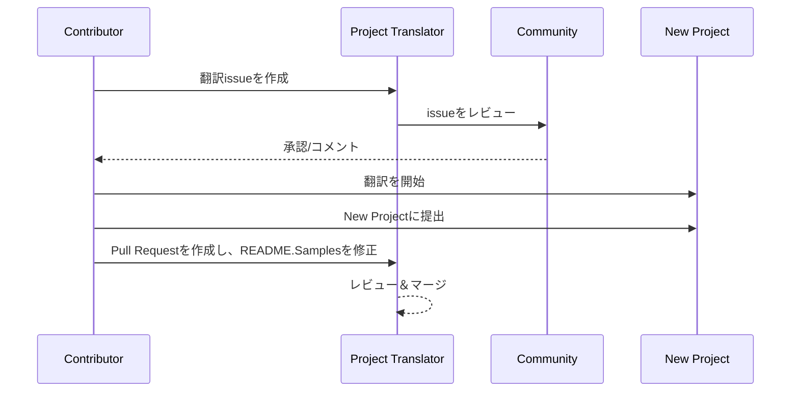

# プロジェクト翻訳者

プロジェクトの多言語ローカライズのための使いやすいvscode拡張機能。

プロジェクトリポジトリ: `https://github.com/Project-Translation/project_translator`

<!--  -->


## 利用可能な翻訳

この拡張機能は、これらの言語への翻訳をサポートしています：

- [简体中文 (zh-cn)](./readmes/README.zh-cn.md)
- [繁體中文 (zh-tw)](./readmes/README.zh-tw.md)
- [日本語 (ja-jp)](./readmes/README.ja-jp.md)
- [한국어 (ko-kr)](./readmes/README.ko-kr.md)
- [Français (fr-fr)](./readmes/README.fr-fr.md)
- [Deutsch (de-de)](./readmes/README.de-de.md)
- [Español (es-es)](./readmes/README.es-es.md)
- [Português (pt-br)](./readmes/README.pt-br.md)
- [Русский (ru-ru)](./readmes/README.ru-ru.md)
- [العربية (ar-sa)](./readmes/README.ar-sa.md)
- [العربية (ar-ae)](./readmes/README.ar-ae.md)
- [العربية (ar-eg)](./readmes/README.ar-eg.md)

## サンプル

| プロジェクト                                                                          | 元のリポジトリ                                                                                           | 説明                                                                                                                                                                      | スター | タグ                                                                                                                                                                                                                                                                                                                                                                                                                                                                                                                                                                                                                                                                 |
| ----------------------------------------------------------------------------------- | --------------------------------------------------------------------------------------------------------- | ------------------------------------------------------------------------------------------------------------------------------------------------------------------------- | ----- | -------------------------------------------------------------------------------------------------------------------------------------------------------------------------------------------------------------------------------------------------------------------------------------------------------------------------------------------------------------------------------------------------------------------------------------------------------------------------------------------------------------------------------------------------------------------------------------------------------------------------------------------------------------------- |
| [algorithm-visualizer](https://github.com/Project-Translation/algorithm-visualizer) | [algorithm-visualizer/algorithm-visualizer](https://github.com/algorithm-visualizer/algorithm-visualizer) | :fireworks:コードからアルゴリズムを可視化する対話型オンラインプラットフォーム                                                                                              | 47301 | [`algorithm`](https://github.com/topics/algorithm), [`animation`](https://github.com/topics/animation), [`data-structure`](https://github.com/topics/data-structure), [`visualization`](https://github.com/topics/visualization)                                                                                                                                                                                                                                                                                                                                                                                                                                     |
| [algorithms](https://github.com/Project-Translation/algorithms)                     | [algorithm-visualizer/algorithms](https://github.com/algorithm-visualizer/algorithms)                     | :crystal_ball:アルゴリズムの可視化                                                                                                                                        | 401   | N/A                                                                                                                                                                                                                                                                                                                                                                                                                                                                                                                                                                                                                                                                  |
| [cline-docs](https://github.com/Project-Translation/cline-docs)                     | [cline/cline](https://github.com/cline/cline)                                                             | あなたのIDE内で自律的なコーディングエージェント。ファイルの作成/編集、コマンドの実行、ブラウザの使用など、各ステップであなたの許可を得て実行できます。                     | 39572 | N/A                                                                                                                                                                                                                                                                                                                                                                                                                                                                                                                                                                                                                                                                  |
| [cursor-docs](https://github.com/Project-Translation/cursor-docs)                   | [getcursor/docs](https://github.com/getcursor/docs)                                                       | Cursorのオープンソースドキュメント                                                                                                                                       | 309   | N/A                                                                                                                                                                                                                                                                                                                                                                                                                                                                                                                                                                                                                                                                  |
| [gobyexample](https://github.com/Project-Translation/gobyexample)                   | [mmcgrana/gobyexample](https://github.com/mmcgrana/gobyexample)                                           | Go by Example                                                                                                                                                             | 7523  | N/A                                                                                                                                                                                                                                                                                                                                                                                                                                                                                                                                                                                                                                                                  |
| [golang-website](https://github.com/Project-Translation/golang-website)             | [golang/website](https://github.com/golang/website)                                                       | [mirror] go.devとgolang.orgウェブサイトのホーム                                                                                                                          | 402   | N/A                                                                                                                                                                                                                                                                                                                                                                                                                                                                                                                                                                                                                                                                  |
| [reference-en-us](https://github.com/Project-Translation/reference-en-us)           | [Fechin/reference](https://github.com/Fechin/reference)                                                   | ⭕ 開発者向けのクイックリファレンスチートシートを共有。                                                                                                                  | 7808  | [`awk`](https://github.com/topics/awk), [`bash`](https://github.com/topics/bash), [`chatgpt`](https://github.com/topics/chatgpt), [`cheatsheet`](https://github.com/topics/cheatsheet), [`cheatsheets`](https://github.com/topics/cheatsheets), [`css`](https://github.com/topics/css), [`golang`](https://github.com/topics/golang), [`grep`](https://github.com/topics/grep), [`markdown`](https://github.com/topics/markdown), [`python`](https://github.com/topics/python), [`reference`](https://github.com/topics/reference), [`sed`](https://github.com/topics/sed), [`snippets`](https://github.com/topics/snippets), [`vim`](https://github.com/topics/vim) |
| [styleguide](https://github.com/Project-Translation/styleguide)                     | [google/styleguide](https://github.com/google/styleguide)                                                 | Google由来のオープンソースプロジェクトのスタイルガイド                                                                                                                   | 38055 | [`cpplint`](https://github.com/topics/cpplint), [`style-guide`](https://github.com/topics/style-guide), [`styleguide`](https://github.com/topics/styleguide)                                                                                                                                                                                                                                                                                                                                                                                                                                                                                                         |
| [vscode-docs](https://github.com/Project-Translation/vscode-docs)                   | [microsoft/vscode-docs](https://github.com/microsoft/vscode-docs)                                         | Visual Studio Codeの公開ドキュメント                                                                                                                                     | 5914  | [`vscode`](https://github.com/topics/vscode)                                                                                                                                                                                                                                                                                                                                                                                                                                                                                                                                                                                                                         |

## プロジェクト翻訳のリクエスト

翻訳に貢献したい場合や、プロジェクトを翻訳する必要がある場合：

1. 次のテンプレートを使用してissueを作成します：

```md
**Project**: [project_url]
**Target Language**: [target_lang]
**Description**: この翻訳がなぜ価値があるかの簡単な説明
```

2. ワークフロー：



3. PRがマージされた後、翻訳はサンプルセクションに追加されます。

現在進行中の翻訳: [Issuesを表示](https://github.com/Project-Translation/project_translator/issues)

## 機能

- 📁 フォルダレベルの翻訳サポート
  - プロジェクトフォルダ全体を複数の言語に翻訳
  - 元のフォルダ構造と階層を維持
  - サブフォルダの再帰的翻訳をサポート
  - 翻訳可能なコンテンツの自動検出
  - 大規模翻訳のための効率的なバッチ処理
- 📄 ファイルレベルの翻訳サポート
  - 個別ファイルを複数の言語に翻訳
  - 元のファイル構造とフォーマットを維持
  - フォルダとファイルの両方の翻訳モードをサポート
- 💡 AIによるスマート翻訳
  - コード構造の完全性を自動的に維持
  - コードコメントのみを翻訳し、コードロジックを保持
  - JSON/XMLなどのデータ構造フォーマットを維持
  - プロフェッショナルな技術ドキュメント翻訳品質
- ⚙️ 柔軟な設定
  - ソースフォルダと複数のターゲットフォルダを設定
  - カスタムファイル翻訳間隔をサポート
  - 無視する特定のファイルタイプを設定
  - 複数のAIモデルオプションをサポート
- 🚀 ユーザーフレンドリーな操作
  - リアルタイム翻訳進捗表示
  - 翻訳の一時停止/再開/停止をサポート
  - ターゲットフォルダ構造の自動維持
  - 重複作業を避けるための増分翻訳
- 🔄 差分翻訳（実験的）
  - 既存の翻訳を効率的に更新するためのDiff-applyモード
  - 変更されたコンテンツのみを翻訳することでAPI使用量を削減
  - 最小限の編集でバージョン履歴を保持
  - ⚠️ 実験的機能 - 詳細は[高度な機能](#differential-translation-diff-apply-mode)を参照

## インストール

1. VS Code拡張機能マーケットプレイスで"[Project Translator](https://marketplace.visualstudio.com/items?itemName=techfetch-dev.project-translator)"を検索
2. インストールをクリック
   
または、Visual Studio Marketplaceからインストール: `https://marketplace.visualstudio.com/items?itemName=techfetch-dev.project-translator` またはVS Code拡張機能ビューで`techfetch-dev.project-translator`を検索。

## 設定

この拡張機能は、以下の設定オプションをサポートしています：

```json
{
  "projectTranslator.specifiedFolders": [
    {
      "sourceFolder": {
        "path": "ソースフォルダパス",
        "lang": "ソース言語コード"
      },
      "targetFolders": [
        {
          "path": "ターゲットフォルダパス",
          "lang": "ターゲット言語コード"
        }
      ]
    }
  ],
  "projectTranslator.specifiedFiles": [
    {
      "sourceFile": {
        "path": "ソースファイルパス",
        "lang": "ソース言語コード"
      },
      "targetFiles": [
        {
          "path": "ターゲットファイルパス",
          "lang": "ターゲット言語コード"
        }
      ]
    }
  ],
  "projectTranslator.currentVendor": "openai",
  "projectTranslator.vendors": [
    {
      "name": "openai",
      "apiEndpoint": "APIエンドポイントURL",
      "apiKeyEnvVarName": "MY_OPENAI_API_KEY",
      "model": "gpt-4o",
      "rpm": "10",
      "maxTokensPerSegment": 4096,
      "timeout": 30,
      "temperature": 0.0
    }
  ],
  "projectTranslator.userPrompts": [
      "1. Should return no need translate if the markdown file has 'draft' set to 'true' in the front matter.",
      "2. './readmes/' in the sentences should replace with './'",
  ],
  "projectTranslator.ignore": {
    "paths": [
      "**/node_modules/**"
    ],
    "extensions": [
      ".log"
    ]
  },
}
```

主要な設定詳細：

| 設定オプション                              | 説明                                                                                                 |
| ------------------------------------------- | --------------------------------------------------------------------------------------------------- |
| `projectTranslator.specifiedFolders`        | 翻訳用の複数のソースフォルダと、それに対応する宛先フォルダ                                          |
| `projectTranslator.specifiedFiles`          | 翻訳用の複数のソースファイルと、それに対応する宛先ファイル                                          |
| `projectTranslator.translationIntervalDays` | 翻訳間隔（日）（デフォルト7日）                                                                     |
| `projectTranslator.copyOnly`                | コピーのみで翻訳しないファイル（`paths`と`extensions`配列を使用）                                   |
| `projectTranslator.ignore`                  | 完全に無視するファイル（`paths`と`extensions`配列を使用）                                            |
| `projectTranslator.skipFrontMatterMarkers`  | Front matterマーカーに基づいてファイルをスキップ（`enabled`と`markers`配列を使用）                 |
| `projectTranslator.currentVendor`           | 現在使用中のAPIベンダー                                                                             |
| `projectTranslator.vendors`                 | APIベンダー設定リスト（apiKeyを直接使用するか、apiKeyEnvVarNameで環境変数を使用できます）          |
| `projectTranslator.systemPrompts`           | 翻訳プロセスをガイドするためのシステムプロンプト配列                                                |
| `projectTranslator.userPrompts`             | ユーザー定義のプロンプト配列。これらのプロンプトは翻訳時にシステムプロンプトの後に追加されます     |
| `projectTranslator.segmentationMarkers`     | ファイルタイプごとに設定されたセグメンテーションマーカー。正規表現をサポート                        |
| `projectTranslator.debug`                   | デバッグモードを有効にして、すべてのAPIリクエストとレスポンスを出力チャネルにログ（デフォルト: false） |
| `projectTranslator.logFile`                 | デバッグログファイルの設定（[ログファイル機能](./docs/log-file-feature.md)を参照）                  |
| `projectTranslator.diffApply.enabled`       | 実験的な差分翻訳モードを有効にする（デフォルト: false）                                             |

## 使用方法

1. コマンドパレットを開く（Ctrl+Shift+P / Cmd+Shift+P）
2. "Translate Project"と入力してコマンドを選択
3. ソースフォルダが設定されていない場合、フォルダ選択ダイアログが表示されます
4. 翻訳が完了するまで待機

翻訳中：

- ステータスバーボタンで翻訳を一時停止/再開できます
- いつでも翻訳プロセスを停止できます
- 翻訳進捗が通知領域に表示されます
- 詳細なログが出力パネルに表示されます

## 開発

### ビルドシステム

この拡張機能は、高速なバンドルと開発のためにesbuildを使用しています：

#### 利用可能なスクリプト

- `npm run build` - 本番用ビルド（圧縮付き）
- `npm run compile` - 開発用ビルド
- `npm run watch` - 開発用ウォッチモード
- `npm test` - テストを実行

#### VS Codeタスク

- **Build**（Ctrl+Shift+P → "Tasks: Run Task" → "build"）- 本番用に拡張機能をバンドル
- **Watch**（Ctrl+Shift+P → "Tasks: Run Task" → "watch"）- 自動リビルド付き開発モード

### 開発セットアップ

1. リポジトリをクローン
2. `npm install`を実行して依存関係をインストール
3. `F5`を押してデバッグを開始するか、"watch"タスクを実行して開発

esbuild設定：

- すべてのTypeScriptファイルを単一の`out/extension.js`にバンドル
- VS Code APIを除外（外部としてマーク）

## 高度な機能

### APIキーに環境変数を使用する

Project Translatorは、APIキーに環境変数を使用することをサポートしています。これは、設定ファイルにAPIキーを直接保存するよりも安全なアプローチです：

1. `apiKeyEnvVarName`プロパティを使用してベンダーを設定：

```json
{
  "projectTranslator.vendors": [
    {
      "name": "openai",
      "apiEndpoint": "https://api.openai.com/v1",
      "apiKeyEnvVarName": "OPENAI_API_KEY",
      "model": "gpt-4"
    },
    {
      "name": "openrouter",
      "apiEndpoint": "https://openrouter.ai/api/v1",
      "apiKeyEnvVarName": "OPENROUTER_API_KEY",
      "model": "anthropic/claude-3-opus"
    }
  ]
}
```

2. システムで環境変数を設定：
   - Windowsの場合: `set OPENAI_API_KEY=your_api_key`
   - macOS/Linuxの場合: `export OPENAI_API_KEY=your_api_key`

3. 拡張機能が実行されると、以下のように処理します：
   - まず設定で`apiKey`が直接提供されているかチェック
   - 提供されていない場合、`apiKeyEnvVarName`で指定された環境変数を探す

このアプローチにより、APIキーを設定ファイルやバージョン管理システムから除外できます。

### Front Matterに基づいて翻訳をスキップ

Project Translatorは、Front Matterメタデータに基づいてMarkdownファイルの翻訳をスキップできます。これは、ドラフトドキュメントや翻訳不要とマークされたファイルに便利です。

この機能を有効にするには、`projectTranslator.skipFrontMatterMarkers`オプションを設定：

```json
{
  "projectTranslator.skipFrontMatterMarkers": {
    "enabled": true,
    "markers": [
      {
        "key": "draft",
        "value": "true"
      },
      {
        "key": "translate",
        "value": "false"
      }
    ]
  }
}
```

この設定により、Front Matterに`draft: true`または`translate: false`を含むMarkdownファイルは翻訳中にスキップされ、ターゲット場所に直接コピーされます。

スキップされるMarkdownファイルの例：
```
---
draft: true
title: "Draft Document"
---

This document is a draft and should not be translated.
```

### 差分翻訳（Diff-Apply）モード

> **⚠️ 実験的機能の警告**: 差分翻訳モードは現在実験的機能であり、安定性と互換性の問題がある可能性があります。本番環境での使用は慎重に行い、重要なファイルは必ずバックアップすることをお勧めします。

この拡張機能はオプションの差分翻訳モード（diff-apply）をサポートしています。有効にすると、拡張機能はソースコンテンツと既存の翻訳済みターゲットファイルの両方をモデルに送信します。モデルは1つ以上のSEARCH/REPLACEブロック（プレーンテキスト、コードフェンスなし）を返す必要があります。拡張機能はこれらのブロックをローカルで適用して変更を最小限に抑え、API使用量を削減し、バージョン履歴をより適切に保持します。

- **トグル**: VS Code設定または`project.translation.json`で`projectTranslator.diffApply.enabled`を設定（デフォルト: `false`）
- **オプション**:
  - `validationLevel`: `normal`または`strict`（デフォルト: `normal`）。`strict`モードでは、無効なマーカーや一致失敗はエラーを引き起こし、拡張機能は標準翻訳フローにフォールバックします。
  - `autoBackup`: trueの場合、編集を適用する前にターゲットファイルの`.bak`バックアップを作成（デフォルト: `true`）。
  - `maxOperationsPerFile`: （互換性のため保持）新しい戦略では使用されません。

ワークフロー：
1. `diffApply.enabled`が`true`でターゲットファイルが存在する場合、拡張機能はソースとターゲットの両方のコンテンツを読み取ります。
2. 差分プロンプトでモデルを呼び出し、プレーンテキストのSEARCH/REPLACEブロックを返すように要求します。
3. ローカルで、拡張機能はSEARCH/REPLACEブロックを解析して適用します。適用に失敗した場合、通常の完全翻訳にフォールバックし、ターゲットファイルを上書きします。

SEARCH/REPLACEの例（複数ブロック可）：

```
<<<<<<< SEARCH
:start_line: 10
-------
const label = "Old"
=======
const label = "New"
>>>>>>> REPLACE

<<<<<<< SEARCH
:start_line: 25
-------
function foo() {
  return 1
}
=======
function foo() {
  return 2
}
>>>>>>> REPLACE
```

注意：
- SEARCHセクションではインデントや空白を含む正確なコンテンツを使用してください。不明な場合は最新のファイルコンテンツを使用してください。
- SEARCHとREPLACEの間に`=======`の単一行を保持してください。
- 変更が必要ない場合、モデルは空の文字列を返す必要があります。

なぜ差分翻訳が現在パフォーマンスが低いのか（説明）

- **クロス言語のアライメントと比較の課題**: 差分翻訳では、元のソースドキュメントと既存の翻訳済みドキュメントの両方をモデルに送信する必要があり、モデルはそれらを異なる言語間で比較して翻訳のどの部分を変更する必要があるかを判断する必要があります。これは、単一のドキュメントをその場で修正するよりも根本的に困難なタスクです。なぜなら、モデルは異なる言語のセグメントを正確にアライメントし、意味の差異を判断する必要があるからです。

- **フォーマットと境界の保持の複雑さ**: 多くのドキュメントにはコードブロック、テーブル、フロントマーカー、または特別なプレースホルダーが含まれています。信頼できるdiffワークフローは、テキスト編集を行いながらこれらの構造を保持する必要があります。モデルがSEARCH/REPLACEフォーマットを厳密に守る結果を一貫して生成できない場合、編集を自動的に適用するとフォーマットの回帰や構造エラーが導入される可能性があります。

- **コンテキストと用語の一貫性の問題**: 小さな局所的な編集は、より広いコンテキストと既存の用語/スタイル用語集に依存することがよくあります。最小限の編集を求められた場合、モデルはグローバルな一貫性（用語、スタイル、コメント、変数名）を無視する可能性があり、一貫性のないまたは意味的にシフトした翻訳につながる可能性があります。

- **モデルの安定性とコストのトレードオフ**: 信頼できる差分翻訳を達成するには、強力な比較的推論と安定した予測可能な出力フォーマットを持つモデルが必要です。現在の主流モデルは、合理的なコストで強力なクロス言語アライメントと厳密なフォーマットの出力の両方を信頼性高く提供しないため、システムは正確性を確保するために完全な再翻訳にフォールバックすることがよくあります。

したがって、差分翻訳は理論的には高価な出力トークンを削減し、バージョン履歴をより適切に保持できますが、現在はモデルのクロス言語比較能力と出力の安定性によって制限されています。この機能は実験的のままです。推奨される軽減策には、自動バックアップを保持し（`autoBackup: true`）、寛容な検証レベルを使用し（`validationLevel: "normal"`）、一致またはフォーマットが失敗した場合に完全な再翻訳にフォールバックすることが含まれます。将来的には、専門のバイリンガルアライメント後処理またはカスタム小規模モデルがdiffアプローチの安定性を向上させる可能性があります。

コスト削減とその理由

- **入力vs出力トークンコスト**: 大規模モデルAPIは一般的に入力（プロンプト）と出力（完了）トークンで異なる料金を請求します。多くの場合、出力トークンはモデルがより長いテキストを生成するため著しく高価です。Diff-applyは**更新されたソース（入力）**と**既存の翻訳済みファイル（入力）**をモデルに送信し、編集のコンパクトなJSONを要求するため役立ちます。モデルの応答は完全に再翻訳されたファイル（多くの出力トークン）ではなく小さなJSON（少数の出力トークン）であるため、高価な出力部分の支払いが少なくなります。

- **変更されたもののみを送信**: 小さな変更が発生するたびにファイル全体を再翻訳するのではなく、diff-applyはモデルに既存の翻訳を更新するための最小限の編集操作を計算するよう指示します。これは、以前に翻訳され、増分編集のみを受けるファイルに特に効果的です。

- **フォーマットされたファイルに最適**: 厳密なフォーマット（JSON、XML、コードブロック付きMarkdown）を持つファイルは、diff-applyが構造を保持し、翻訳が必要なテキスト部分のみを変更するため、大きな利益を得ます。これにより、フォーマット関連の回帰やモデルの再フォーマットによる余分な出力トークンの可能性が削減されます。

- **行指向の基本単位、よりスマートな集約**: ツールは基本翻訳単位を「行」として扱い、SEARCH/REPLACE戦略は`:start_line:`の近くで正確またはファジー一致を適用します。寛容な動作には`validationLevel: "normal"`を使用し、保守的な正確な編集が必要な場合は`"strict"`を使用します。

diff-applyを使用する場合：

- ターゲットファイルが既に存在し、以前に翻訳されている場合に使用。
- ファイル全体を再翻訳すると高価になる大型のフォーマットされたドキュメントに使用。
- 以前の翻訳がない全新しいファイルや、新規の完全な再翻訳が必要な場合は避ける。


### 設計ドキュメント

- 開発ビルド用のソースマップを生成
- 本番ビルド用にコードを圧縮
- VS Code用の問題マッチャー統合を提供

## 注意事項

- 十分なAPI使用クォータがあることを確認
- 小さなプロジェクトで最初にテストすることを推奨
- 専用のAPIキーを使用し、完了後に削除

## ライセンス

[ライセンス](LICENSE)