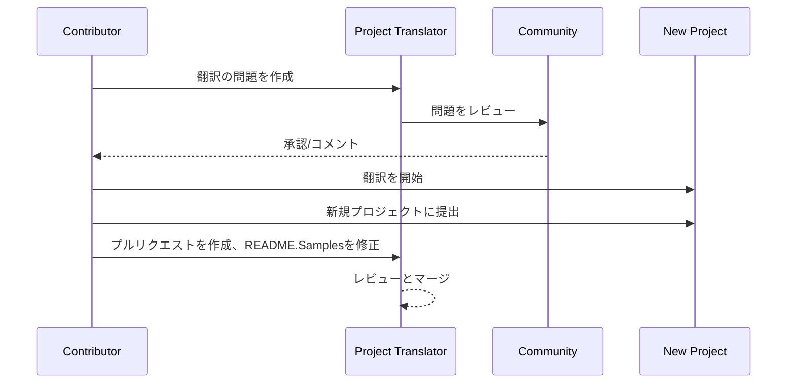

# Project Translator

多言語プロジェクトのローカライゼーションのための使いやすいVS Code拡張機能です。

プロジェクトリポジトリ: `https://github.com/Project-Translation/project_translator`


## インストール

1. Marketplace:
   - VS Code Extensions Marketplace: [https://marketplace.visualstudio.com/items?itemName=techfetch-dev.project-translator](https://marketplace.visualstudio.com/items?itemName=techfetch-dev.project-translator)
   - Open VSX Registry: [https://open-vsx.org/extension/techfetch-dev/project-translator](https://open-vsx.org/extension/techfetch-dev/project-translator)
2. VS Code拡ensionsビューで `techfetch-dev.project-translator` を検索し、インストールをクリックしてください。


<!--  -->


## 利用可能な翻訳

この拡張機能は以下の言語への翻訳をサポートしています：

- [简体中文 (zh-cn)](./README.zh-cn.md)
- [繁體中文 (zh-tw)](./README.zh-tw.md)
- [日本語 (ja-jp)](./README.ja-jp.md)
- [한국어 (ko-kr)](./README.ko-kr.md)
- [Français (fr-fr)](./README.fr-fr.md)
- [Deutsch (de-de)](./README.de-de.md)
- [Español (es-es)](./README.es-es.md)
- [Português (pt-br)](./README.pt-br.md)
- [Русский (ru-ru)](./README.ru-ru.md)
- [العربية (ar-sa)](./README.ar-sa.md)
- [العربية (ar-ae)](./README.ar-ae.md)
- [العربية (ar-eg)](./README.ar-eg.md)

## サンプル

| プロジェクト | 元のリポジトリ | 説明 | スター数 | タグ |
| --- | --- | --- | --- | --- |
| [algorithm-visualizer](https://github.com/Project-Translation/algorithm-visualizer) | [algorithm-visualizer/algorithm-visualizer](https://github.com/algorithm-visualizer/algorithm-visualizer) | :fireworks:コードからアルゴリズムを可視化する対話型オンラインプラットフォーム | 47301 | [`algorithm`](https://github.com/topics/algorithm), [`animation`](https://github.com/topics/animation), [`data-structure`](https://github.com/topics/data-structure), [`visualization`](https://github.com/topics/visualization) |
| [algorithms](https://github.com/Project-Translation/algorithms) | [algorithm-visualizer/algorithms](https://github.com/algorithm-visualizer/algorithms) | :crystal_ball:アルゴリズムの可視化 | 401 | N/A |
| [cline-docs](https://github.com/Project-Translation/cline-docs) | [cline/cline](https://github.com/cline/cline) | IDE内で自律的なコーディングエージェント。ファイルの作成/編集、コマンドの実行、ブラウザの使用など、各ステップであなたの許可を得て実行できます。 | 39572 | N/A |
| [cursor-docs](https://github.com/Project-Translation/cursor-docs) | [getcursor/docs](https://github.com/getcursor/docs) | Cursorのオープンソースドキュメント | 309 | N/A |
| [gobyexample](https://github.com/Project-Translation/gobyexample) | [mmcgrana/gobyexample](https://github.com/mmcgrana/gobyexample) | Go by Example | 7523 | N/A |
| [golang-website](https://github.com/Project-Translation/golang-website) | [golang/website](https://github.com/golang/website) | [mirror] go.devおよびgolang.orgウェブサイトのホーム | 402 | N/A |
| [reference-en-us](https://github.com/Project-Translation/reference-en-us) | [Fechin/reference](https://github.com/Fechin/reference) | ⭕ 開発者向けのクイックリファレンスチートシートを共有。 | 7808 | [`awk`](https://github.com/topics/awk), [`bash`](https://github.com/topics/bash), [`chatgpt`](https://github.com/topics/chatgpt), [`cheatsheet`](https://github.com/topics/cheatsheet), [`cheatsheets`](https://github.com/topics/cheatsheets), [`css`](https://github.com/topics/css), [`golang`](https://github.com/topics/golang), [`grep`](https://github.com/topics/grep), [`markdown`](https://github.com/topics/markdown), [`python`](https://github.com/topics/python), [`reference`](https://github.com/topics/reference), [`sed`](https://github.com/topics/sed), [`snippets`](https://github.com/topics/snippets), [`vim`](https://github.com/topics/vim) |
| [styleguide](https://github.com/Project-Translation/styleguide) | [google/styleguide](https://github.com/google/styleguide) | Google発のオープンソースプロジェクトのスタイルガイド | 38055 | [`cpplint`](https://github.com/topics/cpplint), [`style-guide`](https://github.com/topics/style-guide), [`styleguide`](https://github.com/topics/styleguide) |
| [vscode-docs](https://github.com/Project-Translation/vscode-docs) | [microsoft/vscode-docs](https://github.com/microsoft/vscode-docs) | Visual Studio Codeの公開ドキュメント | 5914 | [`vscode`](https://github.com/topics/vscode) |

## プロジェクト翻訳のリクエスト

翻訳を貢献したい、またはプロジェクトの翻訳を必要とする場合：

1. 以下のテンプレートを使用して問題を作成してください：

```md
**プロジェクト**: [project_url]
**対象言語**: [target_lang]
**説明**: この翻訳が価値がある理由の簡単な説明
```

2. ワークフロー：


```mermaid
sequenceDiagram
  Contributor->>Project Translator: 翻訳の問題を作成
  Project Translator->>Community: 問題をレビュー
  Community-->>Contributor: 承認/コメント
  Contributor->>New Project: 翻訳を開始
  Contributor->>New Project: 新規プロジェクトに提出
  Contributor->>Project Translator: プルリクエストを作成、README.Samplesを修正
  Project Translator-->>Project Translator: レビューとマージ
```

3. PRがマージされると、翻訳がサンプルセクションに追加されます。

現在進行中の翻訳: [問題を表示](https://github.com/Project-Translation/project_translator/issues)

## 機能

- 📁 フォルダレベル翻訳サポート
  - プロジェクト全体のフォルダを複数言語に翻訳
  - 元のフォルダ構造と階層を維持
  - サブフォルダの再帰的翻訳をサポート
  - 翻訳可能なコンテンツの自動検出
  - 大規模翻訳のためのバッチ処理
- 📄 ファイルレベル翻訳サポート
  - 個々のファイルを複数言語に翻訳
  - 元のファイル構造とフォーマットを保持
  - フォルダとファイルの両方の翻訳モードをサポート
- 💡 AIによるスマート翻訳
  - コード構造の整合性を自動的に維持
  - コードコメントのみを翻訳し、コードロジックを保持
  - JSON/XMLおよびその他のデータ構造フォーマットを維持
  - プロフェッショナルな技術文書翻訳品質
- ⚙️ 柔軟な設定
  - ソースフォルダと複数のターゲットフォルダを設定
  - カスタムファイル翻訳間隔のサポート
  - 無視する特定のファイルタイプを設定
  - 複数のAIモデルオプションをサポート
- 🚀 ユーザーフレンドリーな操作
  - リアルタイム翻訳進捗表示
  - 翻訳の一時停止/再開/停止のサポート
  - ターゲットフォルダ構造の自動メンテナンス
  - 重複作業を避けるための増分翻訳
- 🔄 差分翻訳（実験的）
  - 既存の翻訳を効率的に更新するためのDiff-applyモード
  - 変更されたコンテンツのみを翻訳することでAPI使用量を削減
  - 最小限の編集でバージョン履歴を保持
  - ⚠️ 実験的機能 - 詳細は[高度な機能](#differential-translation-diff-apply-mode)を参照

## 設定

この拡張機能は以下の設定オプションをサポートしています：

```json
{
  "projectTranslator.specifiedFolders": [
    {
      "sourceFolder": {
        "path": "ソースフォルダのパス",
        "lang": "ソース言語コード"
      },
      "targetFolders": [
        {
          "path": "ターゲットフォルダのパス",
          "lang": "ターゲット言語コード"
        }
      ]
    }
  ],
  "projectTranslator.specifiedFiles": [
    {
      "sourceFile": {
        "path": "ソースファイルのパス",
        "lang": "ソース言語コード"
      },
      "targetFiles": [
        {
          "path": "ターゲットファイルのパス",
          "lang": "ターゲット言語コード"
        }
      ]
    }
  ],
  "projectTranslator.currentVendor": "openai",
  "projectTranslator.vendors": [
    {
      "name": "openai",
      "apiEndpoint": "APIエンドポイントURL",
      "apiKeyEnvVarName": "MY_OPENAI_API_KEY",
      "model": "gpt-4o",
      "rpm": "10",
      "maxTokensPerSegment": 4096,
      "timeout": 180,
      "temperature": 0.1
    }
  ],
  "projectTranslator.userPrompts": [
      "1. マークダウンファイルのフロントマターに 'draft' が 'true' に設定されている場合、翻訳不要を返す必要があります。",
      "2. 文内の './readmes/' は './' に置き換える必要があります。",
  ],
  "projectTranslator.ignore": {
    "paths": [
      "**/node_modules/**"
    ],
    "extensions": [
      ".log"
    ]
  },
}
```

主要な設定の詳細：

| 設定オプション | 説明 |
| --- | --- |
| `projectTranslator.specifiedFolders` | 翻訳用の複数のソースフォルダとそれに対応する宛先フォルダ |
| `projectTranslator.specifiedFiles` | 翻訳用の複数のソースファイルとそれに対応する宛先ファイル |
| `projectTranslator.translationIntervalDays` | 翻訳間隔（日数）（デフォルト7日） |
| `projectTranslator.copyOnly` | コピーするが翻訳しないファイル（`paths`および`extensions`配列を使用） |
| `projectTranslator.ignore` | 完全に無視するファイル（`paths`および`extensions`配列を使用） |
| `projectTranslator.skipFrontMatterMarkers` | フロントマーターマーカーに基づいてファイルをスキップ（`enabled`および`markers`配列を使用） |
| `projectTranslator.currentVendor` | 現在使用中のAPIベンダー |
| `projectTranslator.vendors` | APIベンダー設定リスト（apiKeyを直接使用するか、環境変数にapiKeyEnvVarNameを使用可能） |
| `projectTranslator.systemPromptLanguage` | 組み込みシステムプロンプトに使用される言語（デフォルト：en）。モデルへの指示方法に影響し、UI言語には影響しない |
| `projectTranslator.systemPrompts` | 翻訳プロセスをガイドするシステムプロンプト配列 |
| `projectTranslator.userPrompts` | ユーザー定義プロンプト配列。これらのプロンプトは翻訳中にシステムプロンプトの後に追加されます |
| `projectTranslator.segmentationMarkers` | ファイルタイプごとに設定されたセグメンテーションマーカー。正規表現をサポート |
| `projectTranslator.debug` | デバッグモードを有効にして、すべてのAPIリクエストとレスポンスを出力チャネルにログ記録（デフォルト：false） |
| `projectTranslator.logFile` | デバッグログファイルの設定（[ログファイル機能](./docs/log-file-feature.md)を参照） |
| `projectTranslator.diffApply.enabled` | 実験的差分翻訳モードを有効にする（デフォルト：false） |

## 使用方法

1. コマンドパレットを開く（Ctrl+Shift+P / Cmd+Shift+P）
2. "Translate Project"と入力し、コマンドを選択
3. ソースフォルダが設定されていない場合、フォルダ選択ダイアログが表示されます。
4. 翻訳が完了するまで待機

翻訳中：

- ステータスバーのボタンで翻訳を一時停止/再開できます
- いつでも翻訳プロセスを停止できます
- 翻訳進捗が通知領域に表示されます
- 詳細ログが出力パネルに表示されます

## CLI 使用方法

このプロジェクトは、VS Code拡張機能に加えて、CLI実行もサポートしています。

CLI出力をビルド：

```bash
npm run compile
```

翻訳を実行：

```bash
npx project-translator translate project --workspace . --config project.translation.json
```

設定を管理：

```bash
npx project-translator config list --workspace . --config project.translation.json --json
npx project-translator config set currentVendor deepseek --workspace . --config project.translation.json
npx project-translator config schema --workspace .
npx project-translator config validate --workspace . --config project.translation.json
```

`config schema`はデフォルトで`project.translation.schema.json`をエクスポートします。  
`config validate`は設定ファイルのJSONスキーマ検証を実行し、無効な場合は非ゼロの終了コードを返します。

## 開発

### ビルドシステム

この拡張機能は、高速なバンドルと開発のためにesbuildを使用しています：

#### 利用可能なスクリプト

- `npm run build` - ミニファイication付きプロダクションビルド
- `npm run compile` - 開発ビルド
- `npm run watch` - 開発用ウォッチモード
- `npm test` - テストを実行

#### VS Codeタスク

- **Build** (Ctrl+Shift+P → "Tasks: Run Task" → "build") - プロダクション用拡張機能をバンドル
- **Watch** (Ctrl+Shift+P → "Tasks: Run Task" → "watch") - 自動再ビルド付き開発モード

### 開発セットアップ

1. リポジトリをクローン
2. `npm install`を実行して依存関係をインストール
3. `F5`を押してデバッグを開始するか、開発用に"watch"タスクを実行

esbuild設定：

- すべてのTypeScriptファイルを単一の`out/extension.js`にバンドル
- VS Code APIを除外（外部としてマーク）

## 高度な機能

### APIキーに環境変数を使用

Project Translatorは、APIキーを設定ファイルに直接保存するよりも安全なアプローチとして、環境変数の使用をサポートしています：

1. ベンダーに`apiKeyEnvVarName`プロパティを設定：

```json
{
  "projectTranslator.vendors": [
    {
      "name": "openai",
      "apiEndpoint": "https://api.openai.com/v1",
      "apiKeyEnvVarName": "OPENAI_API_KEY",
      "model": "gpt-4"
    },
    {
      "name": "openrouter",
      "apiEndpoint": "https://openrouter.ai/api/v1",
      "apiKeyEnvVarName": "OPENROUTER_API_KEY",
      "model": "anthropic/claude-3-opus"
    }
  ]
}
```

2. システムで環境変数を設定：
   - Windowsの場合: `set OPENAI_API_KEY=your_api_key`
   - macOS/Linuxの場合: `export OPENAI_API_KEY=your_api_key`

3. 拡張機能が実行されると、以下を行います：
   - 最初に、設定で`apiKey`が直接提供されているか確認
   - 提供されていない場合、`apiKeyEnvVarName`で指定された環境変数を探します

このアプローチにより、APIキーが設定ファイルやバージョン管理システムから除外されます。

### フロントマターに基づく翻訳スキップ

Project Translatorは、フロントマターメタデータに基づいてMarkdownファイルの翻訳をスキップできます。これは、下書きドキュメントや翻訳が不要とマークされたファイルに役立ちます。

この機能を有効にするには、`projectTranslator.skipFrontMatterMarkers`オプションを設定：

```json
{
  "projectTranslator.skipFrontMatterMarkers": {
    "enabled": true,
    "markers": [
      {
        "key": "draft",
        "value": "true"
      },
      {
        "key": "translate",
        "value": "false"
      }
    ]
  }
}
```

この設定により、フロントマターに`draft: true`または`translate: false`を含むMarkdownファイルは、翻訳中にスキップされ、ターゲット場所に直接コピーされます。

スキップされるMarkdownファイルの例：
```
---
draft: true
title: "下書きドキュメント"
---

このドキュメントは下書きであり、翻訳しないでください。
```

### 差分翻訳（Diff-Apply）モード

> **⚠️ 実験的機能の警告**: 差分翻訳モードは現在実験的な機能であり、安定性と互換性の問題がある可能性があります。本番環境で使用する場合は注意し、重要なファイルは常にバックアップすることをお勧めします。

この拡張機能は、オプションの差分翻訳モード（diff-apply）をサポートしています。有効にすると、拡張機能はソースコンテンツと既存の翻訳済みターゲットファイルの両方をモデルに送信します。モデルは1つ以上のSEARCH/REPLACEブロック（プレーンテキスト、コードフェンスなし）を返す必要があります。拡張機能はこれらのブロックをローカルで適用し、変更を最小限に抑え、API使用量を削減し、バージョン履歴をより良く保持します。

- **切り替え**: VS Code設定または`project.translation.json`で`projectTranslator.diffApply.enabled`を設定（デフォルト: `false`）。
- **オプション**:
  - `validationLevel`: `normal`または`strict`（デフォルト: `normal`）。`strict`モードでは、無効なマーカーまたは一致失敗がエラーを引き起こし、拡張機能は標準の翻訳フローにフォールバックします。
  - `autoBackup`: trueの場合、編集を適用する前にターゲットファイルの`.bak`バックアップを作成（デフォルト: `true`）。
  - `maxOperationsPerFile`: （互換性のために保持）新しい戦略では使用されません。

ワークフロー：
1. `diffApply.enabled`が`true`でターゲットファイルが存在する場合、拡張機能はソースとターゲットのコンテンツの両方を読み取ります。
2. 差分プロンプトでモデルを呼び出し、プレーンテキストのSEARCH/REPLACEブロックの返却を要求します。
3. ローカルで、拡張機能はSEARCH/REPLACEブロックを解析して適用します。適用に失敗した場合、通常の完全翻訳にフォールバックし、ターゲットファイルを上書きします。

SEARCH/REPLACEの例（複数のブロックが許可されています）：

```
<<<<<<< SEARCH
:start_line: 10
-------
const label = "Old"
=======
const label = "New"
>>>>>>> REPLACE

<<<<<<< SEARCH
:start_line: 25
-------
function foo() {
  return 1
}
=======
function foo() {
  return 2
}
>>>>>>> REPLACE
```

注意：
- SEARCHセクションでは、インデントと空白を含む正確なコンテンツを使用してください。不確かな場合は、最新のファイルコンテンツを使用してください。
- SEARCHとREPLACEの間に単一の`=======`行を保持してください。
- 変更が不要な場合、モデルは空の文字列を返す必要があります。

差分翻訳が現在貧弱に実行される理由（説明）

- **言語間のアラインメントと比較の課題**: 差分翻訳では、元のソースドキュメントと既存の翻訳済みドキュメントの両方をモデルに送信し、モデルは言語間で比較して翻訳のどの部分を変更する必要があるかを判断する必要があります。これは、モデルが異なる言語間でセグメントを正確にアラインメントし、意味の違いを判断する必要があるため、単一のドキュメントをインプレースで変更するよりも本質的に困難なタスクです。

- **フォーマットと境界保持の複雑さ**: 多くのドキュメントには、コードブロック、テーブル、フロントエンドマーカー、または特別なプレースホルダーが含まれています。信頼性の高いdiffワークフローは、これらの構造を維持しながらテキスト編集を行う必要があります。モデルがSEARCH/REPLACE形式を厳密に遵守する結果を一貫して生成できない場合、編集を自動的に適用するとフォーマットの後退や構造エラーが発生する可能性があります。

- **コンテキストと用語の一貫性の問題**: 小さな局所的な編集は、多くの場合、より広範なコンテキストと既存の用語/スタイル用語集に依存します。最小限の編集の生成を求められると、モデルはグローバルな一貫性（用語、スタイル、コメント、変数名）を無視し、一貫性のないまたは意味がずれた翻訳を生成する可能性があります。

- **モデルの安定性とコストのトレードオフ**: 信頼性の高い差分翻訳を実現するには、強力な比較推論能力と安定した予測可能な出力形式を持つモデルが必要です。現在の主流モデルは、堅牢な言語間アラインメントと厳密にフォーマットされた出力を合理的なコストで両方とも信頼性を持って提供していないため、システムは正しさを保証するために完全な再翻訳にフォールバックすることがよくあります。

したがって、差分翻訳は理論的には高価な出力トークンを削減し、バージョン履歴をより良く保持できますが、現在はモデルの言語間比較能力と出力安定性によって制限されています。この機能は実験的なままです。推奨される緩和策には、自動バックアップの保持（`autoBackup: true`）、寛容な検証レベルの使用（`validationLevel: "normal"`）、および一致またはフォーマット失敗時の完全再翻訳へのフォールバックが含まれます。将来的には、専門的なバイリンガルアラインメント後処理器またはカスタム小規模モデルにより、diffアプローチの安定性が向上する可能性があります。

コスト削減とその理由

- **入力と出力トークンのコスト**: 大規模モデルAPIは通常、入力（プロンプト）と出力（補完）トークンに対して異なる料金を請求します。多くの場合、出力トークンはモデルがより長いテキストを生成するため、はるかに高価です。diff-applyは、**更新されたソース（入力）**と**既存の翻訳済みファイル（入力）**をモデルに送信し、編集のコンパクトなJSONを要求するため役立ちます。モデルの応答は小さなJSON（少数の出力トークン）であり、完全に再翻訳されたファイル（多数の出力トークン）ではないため、高価な出力部分の支払いははるかに少なくなります。

- **変更された部分のみを送信**: 小さな変更が発生するたびにファイル全体を再翻訳する代わりに、diff-applyはモデルに既存の翻訳を更新するための最小限の編集操作を計算するよう指示します。これは、以前に翻訳され、増分編集のみを受けたファイルに特に効果的です。

- **フォーマットされたファイルに最適**: 厳密なフォーマット（JSON、XML、コードブロックを含むMarkdown）を持つファイルは、diff-applyが構造を保持し、翻訳が必要なテキスト部分のみを変更するため大きく恩恵を受けます。これにより、モデルの再フォーマットによるフォーマット関連の後退や追加の出力トークンの可能性を減らします。

- **行指向の基本単位、よりスマートな集約**: このツールは基本的な翻訳単位を「行」として扱い、SEARCH/REPLACE戦略は`:start_line:`の近くで正確またはファジーマッチングを適用します。寛容な動作には`validationLevel: "normal"`を使用し、保守的で正確な編集が必要な場合は`"strict"`を使用してください。

diff-applyを使用するタイミング：

- ターゲットファイルが既に存在し、以前に翻訳されている場合に使用します。
- ファイル全体を再翻訳すると高価になる、大規模でフォーマットされたドキュメントに使用します。
- 以前の翻訳がない brand-new ファイル、または新鮮な再翻訳が必要な場合は避けてください。


### 設計ドキュメント

- 開発ビルドのソースマップを生成
- プロダクションビルドのコードをミニファイ
- VS Codeの問題マッチャー統合を提供

## 注意事項

- 十分なAPI使用クォータを確保してください
- 最初に小規模プロジェクトでテストすることをお勧めします
- 専用のAPIキーを使用し、完了後に削除してください

## ライセンス

[ライセンス](LICENSE)