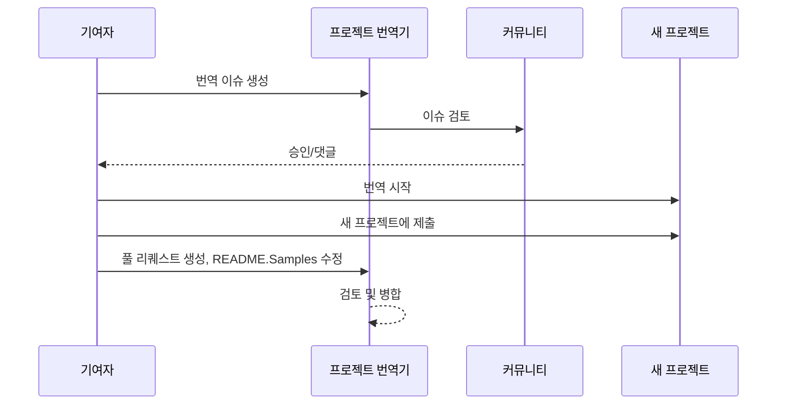

# 프로젝트 번역기

VSCode 확장 프로그램: 프로젝트의 다국어 현지화를 위한 사용하기 쉬운 도구입니다.

<!--
## 지원되는 번역

이 확장 프로그램은 다음 언어로의 번역을 지원합니다:

- [简体中文 (zh-cn)](./readmes/README.zh-cn.md)
- [繁體中文 (zh-tw)](./readmes/README.zh-tw.md)
- [日本語 (ja-jp)](./readmes/README.ja-jp.md)
- [한국어 (ko-kr)](./readmes/README.ko-kr.md)
- [Français (fr-fr)](./readmes/README.fr-fr.md)
- [Deutsch (de-de)](./readmes/README.de-de.md)
- [Español (es-es)](./readmes/README.es-es.md)
- [Português (pt-br)](./readmes/README.pt-br.md)
- [Русский (ru-ru)](./readmes/README.ru-ru.md)
- [العربية (ar-sa)](./readmes/README.ar-sa.md)
- [العربية (ar-ae)](./readmes/README.ar-ae.md)
- [العربية (ar-eg)](./readmes/README.ar-eg.md) -->

## 샘플

| 프로젝트                                                                             | 원본 저장소                                                                                       | 설명                                                                                                                                                               | 별표 | 태그                                                                                                                                                                                                                                                                                                                                                                                                                                                                                                                                                                                                                                                                 |
| ----------------------------------------------------------------------------------- | --------------------------------------------------------------------------------------------------------- | ------------------------------------------------------------------------------------------------------------------------------------------------------------------------- | ----- | -------------------------------------------------------------------------------------------------------------------------------------------------------------------------------------------------------------------------------------------------------------------------------------------------------------------------------------------------------------------------------------------------------------------------------------------------------------------------------------------------------------------------------------------------------------------------------------------------------------------------------------------------------------------- |
| [algorithm-visualizer](https://github.com/Project-Translation/algorithm-visualizer) | [algorithm-visualizer/algorithm-visualizer](https://github.com/algorithm-visualizer/algorithm-visualizer) | :fireworks:코드에서 알고리즘을 시각화하는 인터랙티브 온라인 플랫폼                                                                                               | 47301 | [`algorithm`](https://github.com/topics/algorithm), [`animation`](https://github.com/topics/animation), [`data-structure`](https://github.com/topics/data-structure), [`visualization`](https://github.com/topics/visualization)                                                                                                                                                                                                                                                                                                                                                                                                                                     |
| [algorithms](https://github.com/Project-Translation/algorithms)                     | [algorithm-visualizer/algorithms](https://github.com/algorithm-visualizer/algorithms)                     | :crystal_ball:알고리즘 시각화                                                                                                                                    | 401   | N/A                                                                                                                                                                                                                                                                                                                                                                                                                                                                                                                                                                                                                                                                  |
| [cline-docs](https://github.com/Project-Translation/cline-docs)                     | [cline/cline](https://github.com/cline/cline)                                                             | IDE 내부의 자율 코딩 에이전트, 파일 생성/편집, 명령 실행, 브라우저 사용 등을 사용자의 허가 하에 수행할 수 있습니다. | 39572 | N/A                                                                                                                                                                                                                                                                                                                                                                                                                                                                                                                                                                                                                                                                  |
| [cursor-docs](https://github.com/Project-Translation/cursor-docs)                   | [getcursor/docs](https://github.com/getcursor/docs)                                                       | Cursor의 오픈 소스 문서                                                                                                                                        | 309   | N/A                                                                                                                                                                                                                                                                                                                                                                                                                                                                                                                                                                                                                                                                  |
| [gobyexample](https://github.com/Project-Translation/gobyexample)                   | [mmcgrana/gobyexample](https://github.com/mmcgrana/gobyexample)                                           | Go by Example                                                                                                                                                             | 7523  | N/A                                                                                                                                                                                                                                                                                                                                                                                                                                                                                                                                                                                                                                                                  |
| [golang-website](https://github.com/Project-Translation/golang-website)             | [golang/website](https://github.com/golang/website)                                                       | [미러] go.dev 및 golang.org 웹사이트의 홈                                                                                                                       | 402   | N/A                                                                                                                                                                                                                                                                                                                                                                                                                                                                                                                                                                                                                                                                  |
| [reference-en-us](https://github.com/Project-Translation/reference-en-us)           | [Fechin/reference](https://github.com/Fechin/reference)                                                   | ⭕ 개발자를 위한 빠른 참조 치트 시트 공유                                                                                                                      | 7808  | [`awk`](https://github.com/topics/awk), [`bash`](https://github.com/topics/bash), [`chatgpt`](https://github.com/topics/chatgpt), [`cheatsheet`](https://github.com/topics/cheatsheet), [`cheatsheets`](https://github.com/topics/cheatsheets), [`css`](https://github.com/topics/css), [`golang`](https://github.com/topics/golang), [`grep`](https://github.com/topics/grep), [`markdown`](https://github.com/topics/markdown), [`python`](https://github.com/topics/python), [`reference`](https://github.com/topics/reference), [`sed`](https://github.com/topics/sed), [`snippets`](https://github.com/topics/snippets), [`vim`](https://github.com/topics/vim) |
| [styleguide](https://github.com/Project-Translation/styleguide)                     | [google/styleguide](https://github.com/google/styleguide)                                                 | Google에서 시작된 오픈 소스 프로젝트를 위한 스타일 가이드                                                                                                                   | 38055 | [`cpplint`](https://github.com/topics/cpplint), [`style-guide`](https://github.com/topics/style-guide), [`styleguide`](https://github.com/topics/styleguide)                                                                                                                                                                                                                                                                                                                                                                                                                                                                                                         |
| [vscode-docs](https://github.com/Project-Translation/vscode-docs)                   | [microsoft/vscode-docs](https://github.com/microsoft/vscode-docs)                                         | Visual Studio Code의 공식 문서                                                                                                                               | 5914  | [`vscode`](https://github.com/topics/vscode)                                                                                                                                                                                                                                                                                                                                                                                                                                                                                                                                                                                                                         |

## 프로젝트 번역 요청

번역을 기여하거나 프로젝트를 번역하고 싶다면:

1. 다음 템플릿을 사용하여 이슈를 생성하세요:

```md
**프로젝트**: [project_url]
**대상 언어**: [target_lang]
**설명**: 이 번역이 왜 가치 있는지 간단히 설명
```

2. 워크플로우:



3. PR이 병합된 후, 번역은 샘플 섹션에 추가됩니다.

진행 중인 번역: [이슈 보기](https://github.com/Project-Translation/project_translator/issues)

## 기능

- 📁 폴더 수준 번역 지원
  - 전체 프로젝트 폴더를 여러 언어로 번역
  - 원본 폴더 구조 및 계층 유지
  - 하위 폴더의 재귀적 번역 지원
  - 번역 가능한 콘텐츠 자동 감지
  - 대규모 번역을 위한 배치 처리
- 📄 파일 수준 번역 지원
  - 개별 파일을 여러 언어로 번역
  - 원본 파일 구조 및 형식 유지
  - 폴더 및 파일 번역 모드 모두 지원
- 💡 AI를 통한 스마트 번역
  - 코드 구조 무결성 자동 유지
  - 코드 주석만 번역, 코드 로직 보존
  - JSON/XML 및 기타 데이터 구조 형식 유지
  - 전문적인 기술 문서 번역 품질
- ⚙️ 유연한 구성
  - 소스 폴더 및 여러 대상 폴더 구성
  - 사용자 정의 파일 번역 간격 지원
  - 특정 파일 유형 무시 설정
  - 여러 AI 모델 옵션 지원
- 🚀 사용자 친화적인 작업
  - 실시간 번역 진행 상황 표시
  - 일시 중지/재개/중지 번역 지원
  - 대상 폴더 구조 자동 유지
  - 중복 작업을 피하기 위한 증분 번역
- 🔄 고급 Diff Apply 번역
  - **정밀 업데이트**: 실제로 변경된 콘텐츠만 번역
  - **줄 단위 제어**: 정확한 형식 및 구조 유지
  - **증분 번역**: 번역된 문서 유지에 적합
  - **버전 제어 친화적**: 최소한의 대상 변경 생성
  - **비용 효율적**: 차이점만 번역하여 API 호출 감소
  - **자동 백업**: 변경 적용 전 자동 백업 파일 생성

## 설치

1. VS Code 확장 마켓플레이스에서 "[Project Translator](https://marketplace.visualstudio.com/items?itemName=techfetch-dev.project-translator)" 검색
2. 설치 클릭

## 구성

이 확장 프로그램은 다음 구성 옵션을 지원합니다:

```json
{
  "projectTranslator.specifiedFolders": [
    {
      "sourceFolder": {
        "path": "소스 폴더 경로",
        "lang": "소스 언어 코드"
      },
      "targetFolders": [
        {
          "path": "대상 폴더 경로",
          "lang": "대상 언어 코드"
        }
      ]
    }
  ],
  "projectTranslator.diffApply": {
    "enabled": true,
    "validationLevel": "normal",
    "autoBackup": true,
    "maxOperationsPerFile": 100
  },
  "projectTranslator.specifiedFiles": [
    {
      "sourceFile": {
        "path": "소스 파일 경로",
        "lang": "소스 언어 코드"
      },
      "targetFiles": [
        {
          "path": "대상 파일 경로",
          "lang": "대상 언어 코드"
        }
      ]
    }
  ],
  "projectTranslator.currentVendor": "openai",
  "projectTranslator.vendors": [
    {
      "name": "openai",
      "apiEndpoint": "API 엔드포인트 URL",
      "apiKey": "API 인증 키",
      "model": "사용할 모델 이름",
      "rpm": "분당 최대 요청 수",
      "maxTokensPerSegment": 4096,
      "timeout": 30,
      "temperature": 0.0
    }
  ]
}
```

주요 구성 세부 사항:

| 구성 옵션                        | 설명                                                                                    |
| ------------------------------------------- | ---------------------------------------------------------------------------------------------- |
| `projectTranslator.specifiedFolders`        | 번역을 위한 여러 소스 폴더와 해당 대상 폴더           |
| `projectTranslator.specifiedFiles`          | 번역을 위한 여러 소스 파일과 해당 대상 파일               |
| `projectTranslator.translationIntervalDays` | 번역 간격(일 단위, 기본값 7일)                                                  |
| `projectTranslator.copyOnly`                | 복사만 하고 번역하지 않을 파일(`paths` 및 `extensions` 배열)                         |
| `projectTranslator.ignore`                  | 완전히 무시할 파일(`paths` 및 `extensions` 배열)                              |
| `projectTranslator.currentVendor`           | 현재 사용 중인 API 벤더                                                                      |
| `projectTranslator.vendors`                 | API 벤더 구성 목록                                                                  |
| `projectTranslator.systemPrompts`           | 번역 프로세스를 안내하는 시스템 프롬프트 배열                                        |
| `projectTranslator.userPrompts`             | 사용자 정의 프롬프트 배열, 이 프롬프트는 번역 중 시스템 프롬프트 뒤에 추가됩니다 |
| `projectTranslator.segmentationMarkers`     | 파일 유형별로 구성된 세그먼트 마커, 정규 표현식 지원                     |
| `projectTranslator.debug`                   | 모든 API 요청 및 응답을 출력 채널에 로깅하는 디버그 모드 활성화(기본값: false)    |
| `projectTranslator.logFile`                 | 디버그 로그 파일 구성(자세한 내용은 [로그 파일 기능](./docs/log-file-feature.md) 참조)        |

## 사용법

1. 명령 팔레트 열기(Ctrl+Shift+P / Cmd+Shift+P)
2. "Translate Project"를 입력하고 명령 선택
3. 소스 폴더가 구성되지 않은 경우 폴더 선택 대화상자가 나타남
4. 번역이 완료될 때까지 기다림

번역 중:

- 상태 표시줄 버튼을 통해 번역 일시 중지/재개 가능
- 언제든지 번역 프로세스 중지 가능
- 번역 진행 상황은 알림 영역에 표시
- 상세 로그는 출력 패널에 표시

## 개발

### 빌드 시스템

이 확장 프로그램은 빠른 번들링 및 개발을 위해 esbuild를 사용합니다:

#### 사용 가능한 스크립트

- `npm run build` - 최소화된 프로덕션 빌드
- `npm run compile` - 개발 빌드
- `npm run watch` - 개발 모드
- `npm test` - 테스트 실행

#### VS Code 작업

- **빌드** (Ctrl+Shift+P → "Tasks: Run Task" → "build") - 프로덕션용 확장 프로그램 번들
- **Watch** (Ctrl+Shift+P → "Tasks: Run Task" → "watch") - 자동 재빌드가 있는 개발 모드

### 개발 설정

1. 저장소 복제
2. `npm install` 실행하여 종속성 설치
3. `F5`를 눌러 디버깅 시작 또는 개발을 위해 "watch" 작업 실행

esbuild 구성:

- 모든 TypeScript 파일을 단일 `out/extension.js`로 번들
- VS Code API 제외(외부로 표시)

## 고급 기능

### Diff Apply 번역

고급 Diff Apply 번역 모드에 대한 자세한 내용은 [Diff Apply 사용 가이드](./docs/diff-apply-usage.md)를 참조하세요.

이 기능은 다음을 가능하게 합니다:
- 정밀한 줄 단위 번역 업데이트
- 대용량 파일에 대한 API 비용 절감
- 더 나은 버전 제어 통합
- 문서 형식 보존

### 설계 문서

diff apply 구현에 대한 기술적 세부 사항은 [Diff Apply 번역 설계](./docs/diff-apply-translation-design.md)를 참조하세요.
- 개발 빌드를 위한 소스 맵 생성
- 프로덕션 빌드를 위한 코드 최소화
- VS Code용 문제 매처 통합 제공

## 참고 사항

- 충분한 API 사용 할당량 확인
- 작은 프로젝트로 먼저 테스트 권장
- 전용 API 키 사용 및 완료 후 제거

## 라이선스

[라이선스](LICENSE)