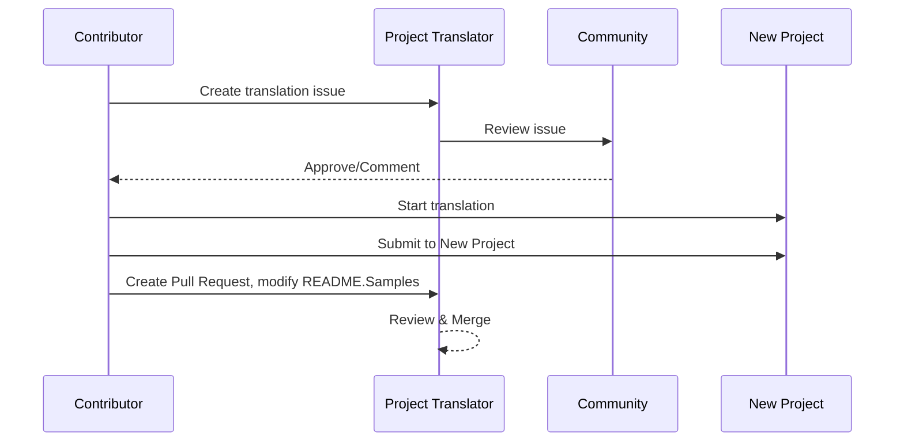

# Project Translator

A VSCode extension: An easy-to-use tool for multi-language localization of projects.

## Available Translations

The extension supports translation to these languages:

- [简体中文 (zh-cn)](./readmes/README.zh-cn.md)
- [繁體中文 (zh-tw)](./readmes/README.zh-tw.md)
- [日本語 (ja-jp)](./readmes/README.ja-jp.md)
- [한국어 (ko-kr)](./readmes/README.ko-kr.md)
- [Français (fr-fr)](./readmes/README.fr-fr.md)
- [Deutsch (de-de)](./readmes/README.de-de.md)
- [Español (es-es)](./readmes/README.es-es.md)
- [Português (pt-br)](./readmes/README.pt-br.md)
- [Русский (ru-ru)](./readmes/README.ru-ru.md)
- [العربية (ar-sa)](./readmes/README.ar-sa.md)
- [العربية (ar-ae)](./readmes/README.ar-ae.md)
- [العربية (ar-eg)](./readmes/README.ar-eg.md)

## Samples

| Project                                                                             | Original Repository                                                                                       | Description                                                                                                                                                               | Stars | Tags                                                                                                                                                                                                                                                                                                                                                                                                                                                                                                                                                                                                                                                                 |
| ----------------------------------------------------------------------------------- | --------------------------------------------------------------------------------------------------------- | ------------------------------------------------------------------------------------------------------------------------------------------------------------------------- | ----- | -------------------------------------------------------------------------------------------------------------------------------------------------------------------------------------------------------------------------------------------------------------------------------------------------------------------------------------------------------------------------------------------------------------------------------------------------------------------------------------------------------------------------------------------------------------------------------------------------------------------------------------------------------------------- |
| [algorithm-visualizer](https://github.com/Project-Translation/algorithm-visualizer) | [algorithm-visualizer/algorithm-visualizer](https://github.com/algorithm-visualizer/algorithm-visualizer) | :fireworks:Interactive Online Platform that Visualizes Algorithms from Code                                                                                               | 47301 | [`algorithm`](https://github.com/topics/algorithm), [`animation`](https://github.com/topics/animation), [`data-structure`](https://github.com/topics/data-structure), [`visualization`](https://github.com/topics/visualization)                                                                                                                                                                                                                                                                                                                                                                                                                                     |
| [algorithms](https://github.com/Project-Translation/algorithms)                     | [algorithm-visualizer/algorithms](https://github.com/algorithm-visualizer/algorithms)                     | :crystal_ball:Algorithm Visualizations                                                                                                                                    | 401   | N/A                                                                                                                                                                                                                                                                                                                                                                                                                                                                                                                                                                                                                                                                  |
| [cline-docs](https://github.com/Project-Translation/cline-docs)                     | [cline/cline](https://github.com/cline/cline)                                                             | Autonomous coding agent right in your IDE, capable of creating/editing files, executing commands, using the browser, and more with your permission every step of the way. | 39572 | N/A                                                                                                                                                                                                                                                                                                                                                                                                                                                                                                                                                                                                                                                                  |
| [cursor-docs](https://github.com/Project-Translation/cursor-docs)                   | [getcursor/docs](https://github.com/getcursor/docs)                                                       | Cursor's Open Source Documentation                                                                                                                                        | 309   | N/A                                                                                                                                                                                                                                                                                                                                                                                                                                                                                                                                                                                                                                                                  |
| [gobyexample](https://github.com/Project-Translation/gobyexample)                   | [mmcgrana/gobyexample](https://github.com/mmcgrana/gobyexample)                                           | Go by Example                                                                                                                                                             | 7523  | N/A                                                                                                                                                                                                                                                                                                                                                                                                                                                                                                                                                                                                                                                                  |
| [golang-website](https://github.com/Project-Translation/golang-website)             | [golang/website](https://github.com/golang/website)                                                       | [mirror] Home of the go.dev and golang.org websites                                                                                                                       | 402   | N/A                                                                                                                                                                                                                                                                                                                                                                                                                                                                                                                                                                                                                                                                  |
| [reference-en-us](https://github.com/Project-Translation/reference-en-us)           | [Fechin/reference](https://github.com/Fechin/reference)                                                   | ⭕ Share quick reference cheat sheet for developers.                                                                                                                      | 7808  | [`awk`](https://github.com/topics/awk), [`bash`](https://github.com/topics/bash), [`chatgpt`](https://github.com/topics/chatgpt), [`cheatsheet`](https://github.com/topics/cheatsheet), [`cheatsheets`](https://github.com/topics/cheatsheets), [`css`](https://github.com/topics/css), [`golang`](https://github.com/topics/golang), [`grep`](https://github.com/topics/grep), [`markdown`](https://github.com/topics/markdown), [`python`](https://github.com/topics/python), [`reference`](https://github.com/topics/reference), [`sed`](https://github.com/topics/sed), [`snippets`](https://github.com/topics/snippets), [`vim`](https://github.com/topics/vim) |
| [styleguide](https://github.com/Project-Translation/styleguide)                     | [google/styleguide](https://github.com/google/styleguide)                                                 | Style guides for Google-originated open-source projects                                                                                                                   | 38055 | [`cpplint`](https://github.com/topics/cpplint), [`style-guide`](https://github.com/topics/style-guide), [`styleguide`](https://github.com/topics/styleguide)                                                                                                                                                                                                                                                                                                                                                                                                                                                                                                         |
| [vscode-docs](https://github.com/Project-Translation/vscode-docs)                   | [microsoft/vscode-docs](https://github.com/microsoft/vscode-docs)                                         | Public documentation for Visual Studio Code                                                                                                                               | 5914  | [`vscode`](https://github.com/topics/vscode)                                                                                                                                                                                                                                                                                                                                                                                                                                                                                                                                                                                                                         |

## Requesting Project Translation

If you want to contribute a translation or need a project to be translated:

1. Create an issue using the following template:

```md
**Project**: [project_url]
**Target Language**: [target_lang]
**Description**: Brief description of why this translation would be valuable
```

2. Workflow:



3. After the PR is merged, the translation will be added to the Samples section.

Current translations in progress: [View Issues](https://github.com/Project-Translation/project_translator/issues)

## Features

- 📁 Folder-level Translation Support
  - Translate entire project folders to multiple languages
  - Maintain original folder structure and hierarchy
  - Support for recursive translation of subfolders
  - Automatic detection of translatable content
  - Batch processing for efficient large-scale translations
- 📄 File-level Translation Support
  - Translate individual files to multiple languages
  - Preserve original file structure and formatting
  - Support for both folder and file translation modes
- 💡 Smart Translation with AI
  - Automatically maintains code structure integrity
  - Only translates code comments, preserves code logic
  - Maintains JSON/XML and other data structure formats
  - Professional technical documentation translation quality
- ⚙️ Flexible Configuration
  - Configure source folder and multiple target folders
  - Support for custom file translation intervals
  - Set specific file types to ignore
  - Support for multiple AI model options
- 🚀 User-Friendly Operations
  - Real-time translation progress display
  - Support for pause/resume/stop translation
  - Automatic maintenance of target folder structure
  - Incremental translation to avoid duplicate work

## Installation

1. Search for "[Project Translator](https://marketplace.visualstudio.com/items?itemName=techfetch-dev.project-translator)" in VS Code extension marketplace
2. Click install

## Configuration

The extension supports the following configuration options:

```json
{
  "projectTranslator.specifiedFolders": [
    {
      "sourceFolder": {
        "path": "Source folder path",
        "lang": "Source language code"
      },
      "targetFolders": [
        {
          "path": "Target folder path",
          "lang": "Target language code"
        }
      ]
    }
  ],
  "projectTranslator.specifiedFiles": [
    {
      "sourceFile": {
        "path": "Source file path",
        "lang": "Source language code"
      },
      "targetFiles": [
        {
          "path": "Target file path",
          "lang": "Target language code"
        }
      ]
    }
  ],
  "projectTranslator.currentVendor": "openai",
  "projectTranslator.vendors": [
    {
      "name": "openai",
      "apiEndpoint": "API endpoint URL",
      "apiKey": "API authentication key",
      "apiKeyEnvVarName": "Environment variable name for API key",
      "model": "Model name to use",
      "rpm": "Maximum requests per minute",
      "maxTokensPerSegment": 4096,
      "timeout": 30,
      "temperature": 0.0
    }
  ]
}
```

Key configuration details:

| 구성 옵션                                   | 설명                                                                                     |
| ------------------------------------------- | ---------------------------------------------------------------------------------------- |
| `projectTranslator.specifiedFolders`        | 번역을 위한 다중 소스 폴더와 이에 대응하는 대상 폴더                                      |
| `projectTranslator.specifiedFiles`          | 번역을 위한 다중 소스 파일과 이에 대응하는 대상 파일                                      |
| `projectTranslator.translationIntervalDays` | 번역 간격(일 단위, 기본값 7일)                                                           |
| `projectTranslator.copyOnly`                | 복사만 하고 번역하지 않을 파일(`paths` 및 `extensions` 배열 사용)                         |
| `projectTranslator.ignore`                  | 완전히 무시할 파일(`paths` 및 `extensions` 배열 사용)                                     |
| `projectTranslator.skipFrontMatterMarkers`  | front matter 마커에 따라 파일 건너뛰기(`enabled` 및 `markers` 배열 사용)                  |
| `projectTranslator.currentVendor`           | 현재 사용 중인 API 공급자                                                               |
| `projectTranslator.vendors`                 | API 공급자 설정 목록(apiKey 직접 사용 또는 환경 변수를 위한 apiKeyEnvVarName 사용 가능) |
| `projectTranslator.systemPrompts`           | 번역 프로세스를 안내하기 위한 시스템 프롬프트 배열                                        |
| `projectTranslator.userPrompts`             | 사용자 정의 프롬프트 배열. 번역 중 시스템 프롬프트 이후에 추가됨                         |
| `projectTranslator.segmentationMarkers`     | 파일 유형별로 구성된 분할 마커, 정규 표현식 지원                                          |
| `projectTranslator.debug`                   | 디버그 모드 활성화하여 모든 API 요청과 응답을 출력 채널에 기록(기본값: false)             |
| `projectTranslator.logFile`                 | 디버그 로그 파일 설정([로그 파일 기능](./docs/log-file-feature.md) 참조)                  |

## 사용법

1. 명령 팔레트 열기 (Ctrl+Shift+P / Cmd+Shift+P)
2. "Translate Project" 입력 후 명령 선택
3. 소스 폴더가 구성되지 않은 경우 폴더 선택 대화상자가 나타남
4. 번역 완료까지 기다림

번역 중:

- 상태 표시줄 버튼을 통해 일시 중지/재개 가능
- 언제든지 번역 프로세스 중단 가능
- 알림 영역에 번역 진행 상황 표시
- 출력 패널에 자세한 로그 표시

## 개발

### 빌드 시스템

이 확장 프로그램은 빠른 번들링과 개발을 위해 esbuild를 사용합니다:

#### 사용 가능한 스크립트

- `npm run build` - 난독화 포함된 프로덕션 빌드
- `npm run compile` - 개발 빌드
- `npm run watch` - 개발을 위한 감시 모드
- `npm test` - 테스트 실행

#### VS Code 작업

- **Build** (Ctrl+Shift+P → "Tasks: Run Task" → "build") - 프로덕션용 확장 프로그램 번들링
- **Watch** (Ctrl+Shift+P → "Tasks: Run Task" → "watch") - 자동 재빌드 기능이 있는 개발 모드

### 개발 설정

1. 저장소 복제
2. `npm install` 실행하여 종속성 설치
3. `F5` 눌러 디버깅 시작 또는 개발용 "watch" 작업 실행

esbuild 구성:

- 모든 TypeScript 파일을 단일 `out/extension.js`로 번들링
- VS Code API 제외(외부로 표시됨)

## 고급 기능

### API 키에 환경 변수 사용

Project Translator는 구성 파일에 직접 API 키를 저장하는 것보다 더 안전한 방법인 환경 변수를 통한 API 키 사용을 지원합니다:

1. `apiKeyEnvVarName` 속성으로 공급자 구성:

```json
{
  "projectTranslator.vendors": [
    {
      "name": "openai",
      "apiEndpoint": "https://api.openai.com/v1",
      "apiKeyEnvVarName": "OPENAI_API_KEY",
      "model": "gpt-4"
    },
    {
      "name": "openrouter",
      "apiEndpoint": "https://openrouter.ai/api/v1",
      "apiKeyEnvVarName": "OPENROUTER_API_KEY",
      "model": "anthropic/claude-3-opus"
    }
  ]
}
```

2. 시스템에 환경 변수 설정:
   - Windows: `set OPENAI_API_KEY=your_api_key`
   - macOS/Linux: `export OPENAI_API_KEY=your_api_key`

3. 확장 프로그램 실행 시 다음을 수행:
   - 먼저 구성에서 `apiKey`가 직접 제공되었는지 확인
   - 그렇지 않으면 `apiKeyEnvVarName`에 지정된 환경 변수를 찾음

이 방법을 통해 API 키를 구성 파일 및 버전 관리 시스템 외부에 유지할 수 있습니다.

### Front Matter 기반 번역 건너뛰기

Project Translator는 front matter 메타데이터에 따라 Markdown 파일의 번역을 건너뛸 수 있습니다. 초안 문서나 번역이 필요하지 않은 파일에 유용합니다.

이 기능을 활성화하려면 `projectTranslator.skipFrontMatterMarkers` 옵션을 구성하세요:

```json
{
  "projectTranslator.skipFrontMatterMarkers": {
    "enabled": true,
    "markers": [
      {
        "key": "draft",
        "value": "true"
      },
      {
        "key": "translate",
        "value": "false"
      }
    ]
  }
}
```

이 설정으로 front matter에 `draft: true` 또는 `translate: false`가 포함된 모든 Markdown 파일은 번역 중에 건너뛰고 대상 위치로 직접 복사됩니다.

건너뛰어질 예제 Markdown 파일:
```
---
draft: true
title: "초안 문서"
---

이 문서는 초안이며 번역되어서는 안 됩니다.
```


### 설계 문서

- 개발 빌드에 대해 소스 맵 생성
- 프로덕션 빌드에 대해 코드 최소화
- VS Code용 문제 매처 통합 제공

## 참고 사항

- 충분한 API 사용 할당량 확보
- 처음에는 작은 프로젝트로 테스트하는 것이 좋음
- 전용 API 키 사용 후 완료 시 제거

## 라이선스

[라이선스](LICENSE)