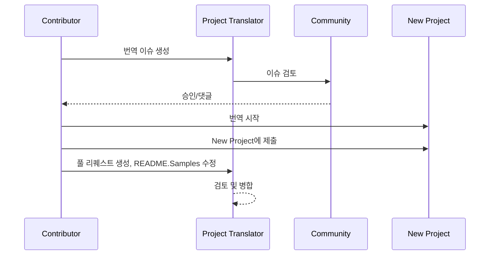

# 프로젝트 번역기

VSCode 확장 프로그램: 프로젝트의 다국어 현지화에 사용하기 쉬운 도구입니다.

## 사용 가능한 번역

확장 프로그램은 다음 언어로의 번역을 지원합니다:

- [简体中文 (zh-cn)](./readmes/README.zh-cn.md)
- [繁體中文 (zh-tw)](./readmes/README.zh-tw.md)
- [日本語 (ja-jp)](./readmes/README.ja-jp.md)
- [한국어 (ko-kr)](./readmes/README.ko-kr.md)
- [Français (fr-fr)](./readmes/README.fr-fr.md)
- [Deutsch (de-de)](./readmes/README.de-de.md)
- [Español (es-es)](./readmes/README.es-es.md)
- [Português (pt-br)](./readmes/README.pt-br.md)
- [Русский (ru-ru)](./readmes/README.ru-ru.md)
- [العربية (ar-sa)](./readmes/README.ar-sa.md)
- [العربية (ar-ae)](./readmes/README.ar-ae.md)
- [العربية (ar-eg)](./readmes/README.ar-eg.md)

## 샘플

| 프로젝트                                                   | 언어                                                                                                                                                 |
| --------------------------------------------------------- | --------------------------------------------------------------------------------------------------------------------------------------------------------- |
| [google/styleguide](https://github.com/google/styleguide) | [en-us](https://github.com/google/styleguide) 원본 by @google<br>[zh-cn](https://github.com/Project-Translation/styleguide-zh-cn) 번역 by @jqknono |

## 프로젝트 번역 요청

번역에 기여하거나 프로젝트 번역이 필요한 경우:

1. 다음 템플릿을 사용하여 이슈를 생성하세요:

```md
**프로젝트**: [project_url]
**대상 언어**: [target_lang]
**설명**: 이 번역이 왜 가치 있는지에 대한 간략한 설명
```

2. 워크플로우:



3. PR이 병합된 후, 번역은 샘플 섹션에 추가됩니다.

현재 진행 중인 번역: [이슈 보기](https://github.com/Project-Translation/project_translator/issues)

## 기능
- 📁 폴더 수준 번역 지원
  - 전체 프로젝트 폴더를 여러 언어로 번역
  - 원래 폴더 구조 및 계층 유지
  - 하위 폴더의 재귀적 번역 지원
  - 번역 가능한 콘텐츠 자동 감지
  - 대규모 번역을 위한 일괄 처리
- 📄 파일 수준 번역 지원
  - 개별 파일을 여러 언어로 번역
  - 원래 파일 구조 및 서식 유지
  - 폴더 및 파일 번역 모드 모두 지원
- 💡 AI를 활용한 스마트 번역
  - 코드 구조 무결성 자동 유지
  - 코드 주석만 번역, 코드 로직 보존
  - JSON/XML 및 기타 데이터 구조 형식 유지
  - 전문 기술 문서 번역 품질
- ⚙️ 유연한 설정
  - 소스 폴더 및 여러 대상 폴더 설정
  - 사용자 정의 파일 번역 간격 지원
  - 무시할 특정 파일 유형 설정
  - 여러 AI 모델 옵션 지원
- 🚀 사용자 친화적인 운영
  - 실시간 번역 진행 상황 표시
  - 번역 일시 중지/재개/중지 지원
  - 대상 폴더 구조 자동 유지
  - 중복 작업 방지를 위한 증분 번역

## 설치

1. VS Code 확장 마켓플레이스에서 "[Project Translator](https://marketplace.visualstudio.com/items?itemName=techfetch-dev.project-translator)" 검색
2. 설치 클릭

## 설정

확장 프로그램은 다음과 같은 설정 옵션을 지원합니다:

```json
{
  "projectTranslator.specifiedFolders": [
    {
      "sourceFolder": {
        "path": "소스 폴더 경로",
        "lang": "소스 언어 코드"
      },
      "destFolders": [
        {
          "path": "대상 폴더 경로",
          "lang": "대상 언어 코드"
        }
      ]
    }
  ],
  "projectTranslator.specifiedFiles": [
    {
      "sourceFile": {
        "path": "소스 파일 경로",
        "lang": "소스 언어 코드"
      },
      "destFiles": [
        {
          "path": "대상 파일 경로",
          "lang": "대상 언어 코드"
        }
      ]
    }
  ],
  "projectTranslator.currentVendor": "openai",
  "projectTranslator.vendors": [
    {
      "name": "openai",
      "apiEndpoint": "API 엔드포인트 URL",
      "apiKey": "API 인증 키",
      "model": "사용할 모델 이름",
      "rpm": "분당 최대 요청 수",
      "maxTokensPerSegment": 4096,
      "timeout": 30,
      "temperature": 0.0
    }
  ]
}
```

주요 설정 세부 사항:
| 설정 옵션                                      | 설명                                                                                          |
| ----------------------------------------------- | ---------------------------------------------------------------------------------------------- |
| `projectTranslator.specifiedFolders`            | 번역을 위한 여러 소스 폴더와 해당 대상 폴더                                                  |
| `projectTranslator.specifiedFiles`              | 번역을 위한 여러 소스 파일과 해당 대상 파일                                                    |
| `projectTranslator.translationIntervalDays`     | 번역 간격 (기본값 7일)                                                                        |
| `projectTranslator.ignoreTranslationExtensions` | 번역이 필요 없는 텍스트 파일 확장자 목록, 이 파일들은 직접 복사됨                              |
| `projectTranslator.ignorePaths`                 | 와일드카드를 사용한 무시할 경로 패턴 목록, 이 파일들은 복사되지 않음                           |
| `projectTranslator.currentVendor`               | 현재 사용 중인 API 공급업체                                                                   |
| `projectTranslator.vendors`                     | API 공급업체 설정 목록                                                                        |
| `projectTranslator.systemPrompts`               | 번역 과정을 안내하는 시스템 프롬프트 배열                                                      |
| `projectTranslator.userPrompts`                 | 사용자 정의 프롬프트 배열, 번역 중 시스템 프롬프트 이후에 추가됨                                |
| `projectTranslator.segmentationMarkers`         | 파일 유형별로 구성된 분할 마커, 정규 표현식을 지원                                             |

## 사용 방법

1. 명령 팔레트 열기 (Ctrl+Shift+P / Cmd+Shift+P)
2. "프로젝트 번역" 입력 후 명령 선택
3. 소스 폴더가 설정되지 않은 경우 폴더 선택 대화 상자가 나타남
4. 번역이 완료될 때까지 기다리기

번역 중:

- 상태 표시줄 버튼을 통해 번역 일시 중지/재개 가능
- 언제든지 번역 프로세스 중지 가능
- 번역 진행 상황은 알림 영역에 표시됨
- 상세 로그는 출력 패널에 표시됨

## 참고 사항

- 충분한 API 사용 할당량 확보
- 작은 프로젝트로 먼저 테스트 권장
- 전용 API 키 사용 후 완료 후 제거

## 라이선스

[라이선스](LICENSE)