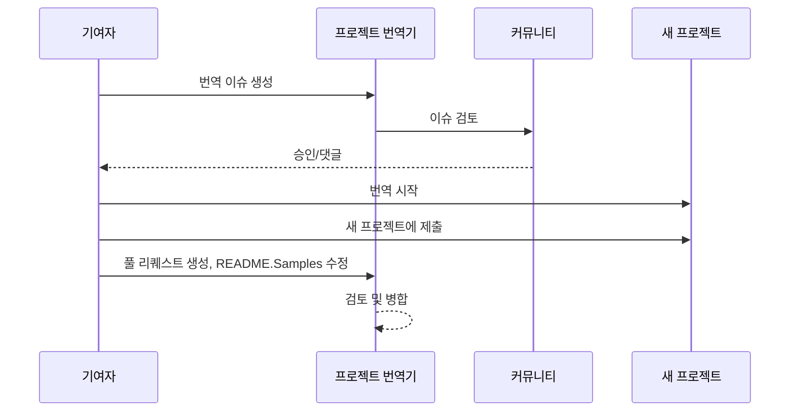

# 프로젝트 번역기

프로젝트의 다국어 현지화를 위한 사용하기 쉬운 VS Code 확장 프로그램입니다.

프로젝트 저장소: `https://github.com/Project-Translation/project_translator`

## 설치 방법

1. 마켓플레이스:
   - VS Code 확장 마켓플레이스: [https://marketplace.visualstudio.com/items?itemName=techfetch-dev.project-translator](https://marketplace.visualstudio.com/items?itemName=techfetch-dev.project-translator)
   - Open VSX 레지스트리: [https://open-vsx.org/extension/techfetch-dev/project-translator](https://open-vsx.org/extension/techfetch-dev/project-translator)
2. VS Code 확장 뷰에서 `techfetch-dev.project-translator`를 검색하고 설치를 클릭하세요.

<!--  -->


## 지원 언어

이 확장 프로그램은 다음 언어로의 번역을 지원합니다:

- [简体中文 (zh-cn)](./README.zh-cn.md)
- [繁體中文 (zh-tw)](./README.zh-tw.md)
- [日本語 (ja-jp)](./README.ja-jp.md)
- [한국어 (ko-kr)](./README.ko-kr.md)
- [Français (fr-fr)](./README.fr-fr.md)
- [Deutsch (de-de)](./README.de-de.md)
- [Español (es-es)](./README.es-es.md)
- [Português (pt-br)](./README.pt-br.md)
- [Русский (ru-ru)](./README.ru-ru.md)
- [العربية (ar-sa)](./README.ar-sa.md)
- [العربية (ar-ae)](./README.ar-ae.md)
- [العربية (ar-eg)](./README.ar-eg.md)

## 샘플 프로젝트

| 프로젝트                                                                             | 원본 저장소                                                                                       | 설명                                                                                                                                                               | 별표 | 태그                                                                                                                                                                                                                                                                                                                                                                                                                                                                                                                                                                                                                                                                 |
| ----------------------------------------------------------------------------------- | --------------------------------------------------------------------------------------------------------- | ------------------------------------------------------------------------------------------------------------------------------------------------------------------------- | ----- | -------------------------------------------------------------------------------------------------------------------------------------------------------------------------------------------------------------------------------------------------------------------------------------------------------------------------------------------------------------------------------------------------------------------------------------------------------------------------------------------------------------------------------------------------------------------------------------------------------------------------------------------------------------------- |
| [algorithm-visualizer](https://github.com/Project-Translation/algorithm-visualizer) | [algorithm-visualizer/algorithm-visualizer](https://github.com/algorithm-visualizer/algorithm-visualizer) | :fireworks:코드에서 알고리즘을 시각화하는 대화형 온라인 플랫폼                                                                                               | 47301 | [`algorithm`](https://github.com/topics/algorithm), [`animation`](https://github.com/topics/animation), [`data-structure`](https://github.com/topics/data-structure), [`visualization`](https://github.com/topics/visualization)                                                                                                                                                                                                                                                                                                                                                                                                                                     |
| [algorithms](https://github.com/Project-Translation/algorithms)                     | [algorithm-visualizer/algorithms](https://github.com/algorithm-visualizer/algorithms)                     | :crystal_ball:알고리즘 시각화                                                                                                                                    | 401   | N/A                                                                                                                                                                                                                                                                                                                                                                                                                                                                                                                                                                                                                                                                  |
| [cline-docs](https://github.com/Project-Translation/cline-docs)                     | [cline/cline](https://github.com/cline/cline)                                                             | IDE 내 자율 코딩 에이전트로, 파일 생성/편집, 명령 실행, 브라우저 사용 등을 사용자의 단계별 허가 하에 수행할 수 있습니다. | 39572 | N/A                                                                                                                                                                                                                                                                                                                                                                                                                                                                                                                                                                                                                                                                  |
| [cursor-docs](https://github.com/Project-Translation/cursor-docs)                   | [getcursor/docs](https://github.com/getcursor/docs)                                                       | Cursor의 오픈 소스 문서                                                                                                                                        | 309   | N/A                                                                                                                                                                                                                                                                                                                                                                                                                                                                                                                                                                                                                                                                  |
| [gobyexample](https://github.com/Project-Translation/gobyexample)                   | [mmcgrana/gobyexample](https://github.com/mmcgrana/gobyexample)                                           | Go by Example                                                                                                                                                             | 7523  | N/A                                                                                                                                                                                                                                                                                                                                                                                                                                                                                                                                                                                                                                                                  |
| [golang-website](https://github.com/Project-Translation/golang-website)             | [golang/website](https://github.com/golang/website)                                                       | [미러] go.dev 및 golang.org 웹사이트 홈페이지                                                                                                                       | 402   | N/A                                                                                                                                                                                                                                                                                                                                                                                                                                                                                                                                                                                                                                                                  |
| [reference-en-us](https://github.com/Project-Translation/reference-en-us)           | [Fechin/reference](https://github.com/Fechin/reference)                                                   | ⭕ 개발자를 위한 빠른 레퍼런치 치트 시트 공유                                                                                                                      | 7808  | [`awk`](https://github.com/topics/awk), [`bash`](https://github.com/topics/bash), [`chatgpt`](https://github.com/topics/chatgpt), [`cheatsheet`](https://github.com/topics/cheatsheet), [`cheatsheets`](https://github.com/topics/cheatsheets), [`css`](https://github.com/topics/css), [`golang`](https://github.com/topics/golang), [`grep`](https://github.com/topics/grep), [`markdown`](https://github.com/topics/markdown), [`python`](https://github.com/topics/python), [`reference`](https://github.com/topics/reference), [`sed`](https://github.com/topics/sed), [`snippets`](https://github.com/topics/snippets), [`vim`](https://github.com/topics/vim) |
| [styleguide](https://github.com/Project-Translation/styleguide)                     | [google/styleguide](https://github.com/google/styleguide)                                                 | Google에서 시작된 오픈 소스 프로젝트를 위한 스타일 가이드                                                                                                                   | 38055 | [`cpplint`](https://github.com/topics/cpplint), [`style-guide`](https://github.com/topics/style-guide), [`styleguide`](https://github.com/topics/styleguide)                                                                                                                                                                                                                                                                                                                                                                                                                                                                                                         |
| [vscode-docs](https://github.com/Project-Translation/vscode-docs)                   | [microsoft/vscode-docs](https://github.com/microsoft/vscode-docs)                                         | Visual Studio Code 공식 문서                                                                                                                               | 5914  | [`vscode`](https://github.com/topics/vscode)                                                                                                                                                                                                                                                                                                                                                                                                                                                                                                                                                                                                                         |

## 프로젝트 번역 요청

번역을 기여하거나 프로젝트 번역이 필요한 경우:

1. 다음 템플릿을 사용하여 이슈를 생성하세요:

```md
**프로젝트**: [project_url]
**대상 언어**: [target_lang]
**설명**: 이 번역이 가치 있는 이유에 대한 간단한 설명
```

2. 작업 흐름:



3. PR이 병합된 후 번역이 샘플 섹션에 추가됩니다.

진행 중인 번역: [이슈 보기](https://github.com/Project-Translation/project_translator/issues)

## 기능

- 📁 폴더 단위 번역 지원
  - 전체 프로젝트 폴더를 여러 언어로 번역
  - 원본 폴더 구조 및 계층 유지
  - 하위 폴더 재귀적 번역 지원
  - 번역 가능한 콘텐츠 자동 감지
  - 대규모 번역을 위한 배치 처리
- 📄 파일 단위 번역 지원
  - 개별 파일을 여러 언어로 번역
  - 원본 파일 구조 및 형식 유지
  - 폴더 및 파일 번역 모드 모두 지원
- 💡 AI를 통한 스마트 번역
  - 코드 구조 무결성 자동 유지
  - 코드 주석만 번역하고 코드 로직은 보존
  - JSON/XML 및 기타 데이터 구조 형식 유지
  - 전문적인 기술 문서 번역 품질
- ⚙️ 유연한 구성
  - 소스 폴더 및 여러 대상 폴더 구성
  - 사용자 정의 파일 번역 간격 지원
  - 무시할 특정 파일 유형 설정
  - 여러 AI 모델 옵션 지원
- 🚀 사용자 친화적 작업
  - 실시간 번역 진행 상황 표시
  - 번역 일시 중지/재개/중지 지원
  - 대상 폴더 구조 자동 유지
  - 중복 작업 방지를 위한 증분 번역
- 🔄 차등 번역 (실험적 기능)
  - 기존 번역을 효율적으로 업데이트하기 위한 Diff-apply 모드
  - 변경된 콘텐츠만 번역하여 API 사용량 감소
  - 최소 편집으로 버전 기록 보존
  - ⚠️ 실험적 기능 - 자세한 내용은 [고급 기능](#차등-번역-diff-apply-모드) 참조

## 구성

이 확장 프로그램은 다음 구성 옵션을 지원합니다:

```json
{
  "projectTranslator.specifiedFolders": [
    {
      "sourceFolder": {
        "path": "소스 폴더 경로",
        "lang": "소스 언어 코드"
      },
      "targetFolders": [
        {
          "path": "대상 폴더 경로",
          "lang": "대상 언어 코드"
        }
      ]
    }
  ],
  "projectTranslator.specifiedFiles": [
    {
      "sourceFile": {
        "path": "소스 파일 경로",
        "lang": "소스 언어 코드"
      },
      "targetFiles": [
        {
          "path": "대상 파일 경로",
          "lang": "대상 언어 코드"
        }
      ]
    }
  ],
  "projectTranslator.currentVendor": "openai",
  "projectTranslator.vendors": [
    {
      "name": "openai",
      "apiEndpoint": "API 엔드포인트 URL",
      "apiKeyEnvVarName": "MY_OPENAI_API_KEY",
      "model": "gpt-4o",
      "rpm": "10",
      "maxTokensPerSegment": 4096,
      "timeout": 180,
      "temperature": 0.1
    }
  ],
  "projectTranslator.userPrompts": [
      "1. 마크다운 파일의 프론트 매터에 'draft'가 'true'로 설정된 경우 번역하지 않아야 합니다.",
      "2. 문장 내 './readmes/'는 './'로 대체해야 합니다.",
  ],
  "projectTranslator.ignore": {
    "paths": [
      "**/node_modules/**"
    ],
    "extensions": [
      ".log"
    ]
  },
}
```

주요 구성 세부 사항:

| 구성 옵션                        | 설명                                                                                    |
| ------------------------------------------- | ---------------------------------------------------------------------------------------------- |
| `projectTranslator.specifiedFolders`        | 번역을 위한 소스 폴더와 해당 대상 폴더를 여러 개 지정           |
| `projectTranslator.specifiedFiles`          | 번역을 위한 소스 파일과 해당 대상 파일을 여러 개 지정               |
| `projectTranslator.translationIntervalDays` | 번역 간격(일 단위, 기본값 7일)                                                  |
| `projectTranslator.copyOnly`                | 번역하지 않고 복사만 할 파일(`paths` 및 `extensions` 배열 사용)                         |
| `projectTranslator.ignore`                  | 완전히 무시할 파일(`paths` 및 `extensions` 배열 사용)                              |
| `projectTranslator.skipFrontMatterMarkers`  | 프론트 매터 마커를 기반으로 파일 건너뛰기(`enabled` 및 `markers` 배열 사용)                 |
| `projectTranslator.currentVendor`           | 현재 사용 중인 API 벤더                                                                      |
| `projectTranslator.vendors`                 | API 벤더 구성 목록(환경 변수 대신 apiKey를 직접 사용하거나 apiKeyEnvVarName 사용 가능) |
| `projectTranslator.systemPromptLanguage`    | 내장 시스템 프롬프트에 사용되는 언어(기본값: en). UI 언어가 아닌 모델 지시 방식에 영향을 줍니다. |
| `projectTranslator.systemPrompts`           | 번역 프로세스를 안내하는 시스템 프롬프트 배열                                        |
| `projectTranslator.userPrompts`             | 사용자 정의 프롬프트 배열, 번역 중 시스템 프롬프트 뒤에 추가됩니다. |
| `projectTranslator.segmentationMarkers`     | 파일 유형별로 구성된 분할 마커, 정규 표현식 지원                     |
| `projectTranslator.debug`                   | 모든 API 요청 및 응답을 출력 채널에 기록하는 디버그 모드 활성화(기본값: false)     |
| `projectTranslator.logFile`                 | 디버그 로그 파일 구성([로그 파일 기능](./docs/log-file-feature.md) 참조)         |
| `projectTranslator.diffApply.enabled`       | 실험적 차등 번역 모드 활성화(기본값: false)                             |

## 사용 방법

1. 명령 팔레트 열기(Ctrl+Shift+P / Cmd+Shift+P)
2. "Translate Project" 입력 후 명령 선택
3. 소스 폴더가 구성되지 않은 경우 폴더 선택 대화상자가 나타납니다.
4. 번역 완료까지 기다리기

번역 중:

- 상태 표시줄 버튼을 통해 번역 일시 중지/재개 가능
- 언제든지 번역 프로세스 중지 가능
- 알림 영역에 번역 진행 상황 표시
- 출력 패널에 상세 로그 표시

## 개발

### 빌드 시스템

이 확장 프로그램은 빠른 번들링 및 개발을 위해 esbuild를 사용합니다:

#### 사용 가능한 스크립트

- `npm run build` - 최소화된 프로덕션 빌드
- `npm run compile` - 개발 빌드
- `npm run watch` - 개발 모드 감시
- `npm test` - 테스트 실행

#### VS Code 작업

- **빌드** (Ctrl+Shift+P → "Tasks: Run Task" → "build") - 프로덕션용 확장 번들
- **감시** (Ctrl+Shift+P → "Tasks: Run Task" → "watch") - 자동 재빌드가 포함된 개발 모드

### 개발 설정

1. 저장소 복제
2. `npm install` 실행하여 종속성 설치
3. `F5`를 눌러 디버깅 시작 또는 개발을 위해 "watch" 작업 실행

esbuild 구성:

- 모든 TypeScript 파일을 단일 `out/extension.js`로 번들
- VS Code API 제외(외부로 표시)

## 고급 기능

### API 키에 환경 변수 사용하기

프로젝트 번역기는 구성 파일에 직접 API 키를 저장하는 것보다 더 안전한 방법으로 환경 변수를 사용하는 것을 지원합니다:

1. 벤더를 `apiKeyEnvVarName` 속성으로 구성:

```json
{
  "projectTranslator.vendors": [
    {
      "name": "openai",
      "apiEndpoint": "https://api.openai.com/v1",
      "apiKeyEnvVarName": "OPENAI_API_KEY",
      "model": "gpt-4"
    },
    {
      "name": "openrouter",
      "apiEndpoint": "https://openrouter.ai/api/v1",
      "apiKeyEnvVarName": "OPENROUTER_API_KEY",
      "model": "anthropic/claude-3-opus"
    }
  ]
}
```

2. 시스템에 환경 변수 설정:
   - Windows: `set OPENAI_API_KEY=your_api_key`
   - macOS/Linux: `export OPENAI_API_KEY=your_api_key`

3. 확장 프로그램 실행 시:
   - 먼저 구성에서 `apiKey`가 직접 제공되었는지 확인
   - 없으면 `apiKeyEnvVarName`으로 지정된 환경 변수를 찾음

이 접근 방식은 API 키를 구성 파일 및 버전 관리 시스템에서 제외시킵니다.

### 프론트 매터 기반 번역 건너뛰기

프로젝트 번역기는 마크다운 파일의 프론트 매터 메타데이터를 기반으로 번역을 건너뛸 수 있습니다. 이는 초안 문서나 번역이 필요하지 않은 것으로 표시된 파일에 유용합니다.

이 기능을 활성화하려면 `projectTranslator.skipFrontMatterMarkers` 옵션을 구성하세요:

```json
{
  "projectTranslator.skipFrontMatterMarkers": {
    "enabled": true,
    "markers": [
      {
        "key": "draft",
        "value": "true"
      },
      {
        "key": "translate",
        "value": "false"
      }
    ]
  }
}
```

이 구성으로 `draft: true` 또는 `translate: false`가 포함된 프론트 매터가 있는 모든 마크다운 파일은 번역 중 건너뛰고 대상 위치에 직접 복사됩니다.

건너뛸 마크다운 파일 예시:
```
---
draft: true
title: "초안 문서"
---

이 문서는 초안이며 번역되지 않아야 합니다.
```

### 차등 번역 (Diff-Apply) 모드

> **⚠️ 실험적 기능 경고**: 차등 번역 모드는 현재 실험적 기능이며 안정성 및 호환성 문제가 있을 수 있습니다. 프로덕션 환경에서 주의하여 사용하고 중요한 파일은 항상 백업하는 것이 좋습니다.

확장 프로그램은 선택적 차등 번역 모드(diff-apply)를 지원합니다. 활성화되면 확장 프로그램은 소스 콘텐츠와 기존 번역된 대상 파일을 모두 모델에 전송합니다. 모델은 하나 이상의 SEARCH/REPLACE 블록(일반 텍스트, 코드 펜스 없음)을 반환해야 합니다. 확장 프로그램은 이러한 블록을 로컬에서 적용하여 변경 사항을 최소화하고 API 사용량을 줄이며 버전 기록을 더 잘 보존합니다.

- **토글**: VS Code 설정 또는 `project.translation.json`에서 `projectTranslator.diffApply.enabled` 구성(기본값: `false`).
- **옵션**:
  - `validationLevel`: `normal` 또는 `strict`(기본값: `normal`). `strict` 모드에서는 잘못된 마커나 일치 실패 시 오류가 발생하고 확장 프로그램이 표준 번역 흐름으로 돌아갑니다.
  - `autoBackup`: true인 경우 편집 적용 전 대상 파일의 `.bak` 백업 생성(기본값: `true`).
  - `maxOperationsPerFile`: (호환성을 위해 유지됨) 새로운 전략에서는 사용되지 않습니다.

작업 흐름:
1. `diffApply.enabled`가 `true`이고 대상 파일이 존재하는 경우, 확장 프로그램은 소스 및 대상 콘텐츠를 모두 읽습니다.
2. 차등 프롬프트로 모델을 호출하고 일반 텍스트 SEARCH/REPLACE 블록 반환을 요구합니다.
3. 로컬에서 확장 프로그램은 SEARCH/REPLACE 블록을 구문 분석하고 적용합니다. 적용 실패 시 정상적인 전체 번역으로 돌아가 대상 파일을 덮어씁니다.

SEARCH/REPLACE 예시(여러 블록 허용):

```
<<<<<<< SEARCH
:start_line: 10
-------
const label = "Old"
=======
const label = "New"
>>>>>>> REPLACE

<<<<<<< SEARCH
:start_line: 25
-------
function foo() {
  return 1
}
=======
function foo() {
  return 2
}
>>>>>>> REPLACE
```

참고:
- SEARCH 섹션에는 들여쓰기 및 공백을 포함한 정확한 콘텐츠를 사용하세요. 확실하지 않은 경우 최신 파일 콘텐츠를 사용하세요.
- SEARCH와 REPLACE 사이에 단일 `=======` 줄을 유지하세요.
- 변경이 필요하지 않은 경우 모델은 빈 문자열을 반환해야 합니다.

현재 차등 번역이 제대로 작동하지 않는 이유(설명)

- **다국어 정렬 및 비교 과제**: 차등 번역은 원본 소스 문서와 기존 번역 문서를 모두 모델에 전송해야 하며, 모델은 번역의 어떤 부분을 변경해야 하는지 결정하기 위해 언어 간 비교를 수행해야 합니다. 이는 단일 문서를 제자리에서 수정하는 것보다 근본적으로 더 어려운 작업입니다. 모델은 다른 언어의 세그먼트를 정확하게 정렬하고 의미적 차이를 판단해야 합니다.

- **형식 및 경계 보존의 복잡성**: 많은 문서에는 코드 블록, 테이블, 프론트엔드 마커 또는 특수 자리 표시자가 포함되어 있습니다. 신뢰할 수 있는 diff 워크플로우는 텍스트 편집을 수행하면서 이러한 구조를 보존해야 합니다. 모델이 SEARCH/REPLACE 형식을 엄격히 따르는 결과를 일관되게 생성하지 못하면 자동 편집 적용 시 형식 퇴보 또는 구조적 오류가 발생할 수 있습니다.

- **컨텍스트 및 용어 일관성 문제**: 작은 지역화된 편집은 종종 더 넓은 컨텍스트와 기존 용어/스타일 용어집에 의존합니다. 최소 편집을 요청받으면 모델은 글로벌 일관성(용어, 스타일, 주석, 변수 이름)을 소홀히 할 수 있으며, 이로 인해 일관되지 않거나 의미가 변경된 번역이 발생할 수 있습니다.

- **모델 안정성 및 비용 절충**: 신뢰할 수 있는 차등 번역을 달성하려면 강력한 비교 추론과 안정적이고 예측 가능한 출력 형식을 갖춘 모델이 필요합니다. 현재 주류 모델은 합리적인 비용으로 강력한 다국어 정렬과 엄격한 형식 출력을 모두 안정적으로 제공하지 않으므로 시스템은 정확성을 보장하기 위해 종종 전체 재번역으로 돌아갑니다.

따라서 차등 번역은 이론적으로 비싼 출력 토큰을 줄이고 버전 기록을 더 잘 보존할 수 있지만, 현재는 모델의 다국어 비교 능력과 출력 안정성에 의해 제한됩니다. 이 기능은 실험적으로 유지됩니다. 권장 완화 조치에는 자동 백업 유지(`autoBackup: true`), 관대한 검증 수준 사용(`validationLevel: "normal"`), 일치 또는 형식 지정 실패 시 전체 재번역으로 대체 등이 포함됩니다. 향후 특화된 이중 언어 정렬 후처리기 또는 맞춤형 소형 모델이 diff 접근 방식의 안정성을 개선할 수 있습니다.

비용 절감 및 도움되는 이유

- **입력 대 출력 토큰 비용**: 대형 모델 API는 일반적으로 입력(프롬프트) 및 출력(완성) 토큰에 대해 다르게 청구합니다. 종종 출력 토큰은 모델이 더 긴 텍스트를 생성하기 때문에 훨씬 더 비쌉니다. Diff-apply는 **업데이트된 소스(입력)** 및 **기존 번역 파일(입력)**을 모델에 전송하고 간결한 편집 JSON을 요청하기 때문에 도움이 됩니다. 모델의 응답은 작은 JSON(출력 토큰이 적음)이지 전체 재번역 파일(출력 토큰이 많음)이 아니므로 비싼 출력 부분에 대해 훨씬 적게 지불합니다.

- **변경된 부분만 전송**: 작은 변경이 발생할 때마다 전체 파일을 재번역하는 대신, diff-apply는 기존 번역을 업데이트하기 위한 최소 편집 작업을 계산하도록 모델에 지시합니다. 이는 이전에 번역되었고 증분 편집만 받는 파일에 특히 효과적입니다.

- **형식화된 파일에 최적**: 엄격한 형식(JSON, XML, 코드 블록이 있는 마크다운)의 파일은 diff-apply가 구조를 보존하고 번역이 필요한 텍스트 부분만 변경하기 때문에 크게 이점을 얻습니다. 이는 형식 관련 퇴보 및 모델 재형식화로 인한 추가 출력 토큰 가능성을 줄입니다.

- **줄 단위 기반, 더 스마트한 집계**: 도구는 기본 번역 단위를 "줄"로 취급하며, SEARCH/REPLACE 전략은 `:start_line:` 근처에서 정확하거나 퍼지 일치를 적용합니다. 관대한 동작에는 `validationLevel: "normal"`을, 보수적이고 정확한 편집이 필요할 때는 `"strict"`을 사용하세요.

diff-apply 사용 시기:

- 대상 파일이 이미 존재하고 이전에 번역된 경우 사용
- 전체 파일을 재번역하는 것이 비용이 많이 드는 대형 형식화 문서에 사용
- 이전 번역이 없는 새 파일이나 새 재번역을 원할 때는 피하세요.

### 설계 문서

- 개발 빌드를 위한 소스 맵 생성
- 프로덕션 빌드를 위한 코드 최소화
- VS Code용 문제 매처 통합 제공

## 참고 사항

- 충분한 API 사용 할당량 확인
- 먼저 작은 프로젝트로 테스트 권장
- 전용 API 키 사용 후 완료 후 제거

## 라이선스

[라이선스](LICENSE)
