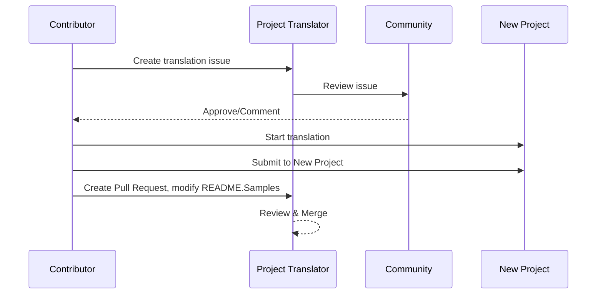

# 프로젝트 번역기

VSCode 확장: 프로젝트의 다국어 현지화에 쉽게 사용할 수 있는 도구.

<!--
## 사용 가능한 번역

이 확장은 이러한 언어로 번역을 지원합니다:

- [简体中文 (zh-cn)](./README.zh-cn.md)
- [繁體中文 (zh-tw)](./README.zh-tw.md)
- [日本語 (ja-jp)](./README.ja-jp.md)
- [한국어 (ko-kr)](./README.ko-kr.md)
- [Français (fr-fr)](./README.fr-fr.md)
- [Deutsch (de-de)](./README.de-de.md)
- [Español (es-es)](./README.es-es.md)
- [Português (pt-br)](./README.pt-br.md)
- [Русский (ru-ru)](./README.ru-ru.md)
- [العربية (ar-sa)](./README.ar-sa.md)
- [العربية (ar-ae)](./README.ar-ae.md) -->

## 샘플들
| 프로젝트                                                                             | 원본 저장소                                                                                       | 설명                                                                                                                                                               | 별   | 태그                                                                                                                                                                                                                                                                                                                                                                                                                                                                                                                                                                                                                                                                 |
| ----------------------------------------------------------------------------------- | ------------------------------------------------------------------------------------------------- | ----------------------------------------------------------------------------------------------------------------------------------------------------------------- | ----- | -------------------------------------------------------------------------------------------------------------------------------------------------------------------------------------------------------------------------------------------------------------------------------------------------------------------------------------------------------------------------------------------------------------------------------------------------------------------------------------------------------------------------------------------------------------------------------------------------------------------------------------------------------------------- |
| [algorithm-visualizer](https://github.com/Project-Translation/algorithm-visualizer) | [algorithm-visualizer/algorithm-visualizer](https://github.com/algorithm-visualizer/algorithm-visualizer) | :fireworks:코드에서 알고리즘을 시각화하는 대화형 온라인 플랫폼                                                                                               | 47301 | [`algorithm`](https://github.com/topics/algorithm), [`animation`](https://github.com/topics/animation), [`data-structure`](https://github.com/topics/data-structure), [`visualization`](https://github.com/topics/visualization)                                                                                                                                                                                                                                                                                                                                                                                                                                     |
| [algorithms](https://github.com/Project-Translation/algorithms)                     | [algorithm-visualizer/algorithms](https://github.com/algorithm-visualizer/algorithms)             | :crystal_ball:알고리즘 시각화                                                                                                                                    | 401   | N/A                                                                                                                                                                                                                                                                                                                                                                                                                                                                                                                                                                                                                                                                  |
| [cline-docs](https://github.com/Project-Translation/cline-docs)                     | [cline/cline](https://github.com/cline/cline)                                                     | IDE에서 바로 사용할 수 있는 자율 코딩 에이전트로, 파일 생성/편집, 명령 실행, 브라우저 사용 등이 가능하며 모든 단계에서 사용자의 허가를 받습니다.                 | 39572 | N/A                                                                                                                                                                                                                                                                                                                                                                                                                                                                                                                                                                                                                                                                  |
| [cursor-docs](https://github.com/Project-Translation/cursor-docs)                   | [getcursor/docs](https://github.com/getcursor/docs)                                               | Cursor의 오픈 소스 문서                                                                                                                                           | 309   | N/A                                                                                                                                                                                                                                                                                                                                                                                                                                                                                                                                                                                                                                                                  |
| [gobyexample](https://github.com/Project-Translation/gobyexample)                   | [mmcgrana/gobyexample](https://github.com/mmcgrana/gobyexample)                                   | Go by Example                                                                                                                                                     | 7523  | N/A                                                                                                                                                                                                                                                                                                                                                                                                                                                                                                                                                                                                                                                                  |
| [golang-website](https://github.com/Project-Translation/golang-website)             | [golang/website](https://github.com/golang/website)                                               | [미러] go.dev 및 golang.org 웹사이트의 홈                                                                                                                       | 402   | N/A                                                                                                                                                                                                                                                                                                                                                                                                                                                                                                                                                                                                                                                                  |
| [reference-en-us](https://github.com/Project-Translation/reference-en-us)           | [Fechin/reference](https://github.com/Fechin/reference)                                           | ⭕ 개발자를 위한 빠른 참조 치트 시트 공유                                                                                                                      | 7808  | [`awk`](https://github.com/topics/awk), [`bash`](https://github.com/topics/bash), [`chatgpt`](https://github.com/topics/chatgpt), [`cheatsheet`](https://github.com/topics/cheatsheet), [`cheatsheets`](https://github.com/topics/cheatsheets), [`css`](https://github.com/topics/css), [`golang`](https://github.com/topics/golang), [`grep`](https://github.com/topics/grep), [`markdown`](https://github.com/topics/markdown), [`python`](https://github.com/topics/python), [`reference`](https://github.com/topics/reference), [`sed`](https://github.com/topics/sed), [`snippets`](https://github.com/topics/snippets), [`vim`](https://github.com/topics/vim) |
| [styleguide](https://github.com/Project-Translation/styleguide)                     | [google/styleguide](https://github.com/google/styleguide)                                         | Google에서 시작된 오픈 소스 프로젝트를 위한 스타일 가이드                                                                                                       | 38055 | [`cpplint`](https://github.com/topics/cpplint), [`style-guide`](https://github.com/topics/style-guide), [`styleguide`](https://github.com/topics/styleguide)                                                                                                                                                                                                                                                                                                                                                                                                                                                                                                         |
| [vscode-docs](https://github.com/Project-Translation/vscode-docs)                   | [microsoft/vscode-docs](https://github.com/microsoft/vscode-docs)                                 | Visual Studio Code의 공개 문서                                                                                                                                     | 5914  | [`vscode`](https://github.com/topics/vscode)                                                                                                                                                                                                                                                                                                                                                                                                                                                                                                                                                                                                                         |

## 프로젝트 번역 요청

프로젝트 번역에 기여하거나 번역이 필요한 프로젝트가 있는 경우:

1. 다음 템플릿을 사용하여 이슈를 생성하세요:

```md
**Project**: [project_url]
**Target Language**: [target_lang]
**Description**: 이 번역이 왜 가치로운지 간략한 설명
```

2. 작업 흐름:


3. PR이 병합된 후, 번역이 Samples 섹션에 추가됩니다.

현재 진행 중인 번역: [이슈 보기](https://github.com/Project-Translation/project_translator/issues)

## 기능

- 📁 폴더 수준 번역 지원
  - 전체 프로젝트 폴더를 여러 언어로 번역
  - 원본 폴더 구조와 계층 유지
  - 하위 폴더의 재귀 번역 지원
  - 번역 가능한 콘텐츠 자동 감지
  - 대규모 번역을 위한 일괄 처리
- 📄 파일 수준 번역 지원
  - 개별 파일을 여러 언어로 번역
  - 원본 파일 구조와 형식을 유지
  - 폴더 및 파일 번역 모드 지원
- 💡 AI 기반 스마트 번역
  - 코드 구조 무결성 자동 유지
  - 코드 주석만 번역, 코드 로직 유지
  - JSON/XML 등 데이터 구조 형식 유지
  - 전문적인 기술 문서 번역 품질
- ⚙️ 유연한 구성
  - 소스 폴더와 여러 대상 폴더 구성
  - 사용자 정의 파일 번역 간격 지원
  - 무시할 특정 파일 유형 설정
  - 여러 AI 모델 옵션 지원
- 🚀 사용자 친화적 운영
  - 실시간 번역 진행 상황 표시
  - 번역 일시 중지/재개/중지 지원
  - 대상 폴더 구조 자동 유지
  - 중복 작업 방지를 위한 증분 번역

## 설치

1. VS Code 확장 마켓플레이스에서 "[Project Translator](https://marketplace.visualstudio.com/items?itemName=techfetch-dev.project-translator)"를 검색
2. 설치 클릭

## 구성

확장 프로그램은 다음 구성 옵션을 지원합니다:

```json
{
  "projectTranslator.specifiedFolders": [
    {
      "sourceFolder": {
        "path": "원본 폴더 경로",
        "lang": "원본 언어 코드"
      },
      "destFolders": [
        {
          "path": "대상 폴더 경로",
          "lang": "대상 언어 코드"
        }
      ]
    }
  ],
  "projectTranslator.specifiedFiles": [
    {
      "sourceFile": {
        "path": "원본 파일 경로",
        "lang": "원본 언어 코드"
      },
      "destFiles": [
        {
          "path": "대상 파일 경로",
          "lang": "대상 언어 코드"
        }
      ]
    }
  ],
  "projectTranslator.currentVendor": "openai",
  "projectTranslator.vendors": [
    {
      "name": "openai",
      "apiEndpoint": "API 엔드포인트 URL",
      "apiKey": "API 인증 키",
      "model": "사용할 모델 이름",
      "rpm": "분당 최대 요청 수",
      "maxTokensPerSegment": 4096,
      "timeout": 30,
      "temperature": 0.0
    }
  ]
}
```

주요 구성 세부 사항:

| 구성 옵션                          | 설명                                                                                  |
| --------------------------------- | ------------------------------------------------------------------------------------ |
| `projectTranslator.specifiedFolders`        | 번역을 위한 여러 소스 폴더와 해당 대상 폴더                                         |
| `projectTranslator.specifiedFiles`          | 번역을 위한 여러 소스 파일과 해당 대상 파일                                         |
| `projectTranslator.translationIntervalDays` | 번역 간격(일 단위, 기본 7일)                                                        |
| `projectTranslator.copyOnly`                | 번역하지 않고 복사할 파일( `paths` 및 `extensions` 배열 포함)                       |
| `projectTranslator.ignore`                  | 완전히 무시할 파일( `paths` 및 `extensions` 배열 포함)                              |
| `projectTranslator.currentVendor`           | 현재 사용 중인 API 공급자                                                            |
| `projectTranslator.vendors`                 | API 공급자 구성 목록                                                                  |
| `projectTranslator.systemPrompts`           | 번역 프로세스 안내를 위한 시스템 프롬프트 배열                                       |
| `projectTranslator.userPrompts`             | 사용자 정의 프롬프트 배열, 번역 중 시스템 프롬프트 후에 추가됨                      |
| `projectTranslator.segmentationMarkers`     | 파일 유형별로 구성된 세그먼테이션 마커, 정규 표현식 지원                            |

## 사용법

1. 명령 팔레트 열기 (Ctrl+Shift+P / Cmd+Shift+P)
2. "Translate Project" 입력 후 명령 선택
3. 소스 폴더가 구성되지 않은 경우 폴더 선택 대화상자가 나타남
4. 번역 완료까지 기다림

번역 중:

- 상태 표시줄 버튼을 통해 번역 일시 중지/재개 가능
- 언제든지 번역 프로세스 중지 가능
- 알림 영역에 번역 진행 상황 표시
- 출력 패널에 상세 로그 표시

## 주의사항
- 충분한 API 사용 쿼터를 확보하세요
- 먼저 작은 프로젝트로 테스트하는 것을 추천합니다
- 전용 API 키를 사용하고 완료 후 제거하세요

## 라이선스

[라이선스](LICENSE)