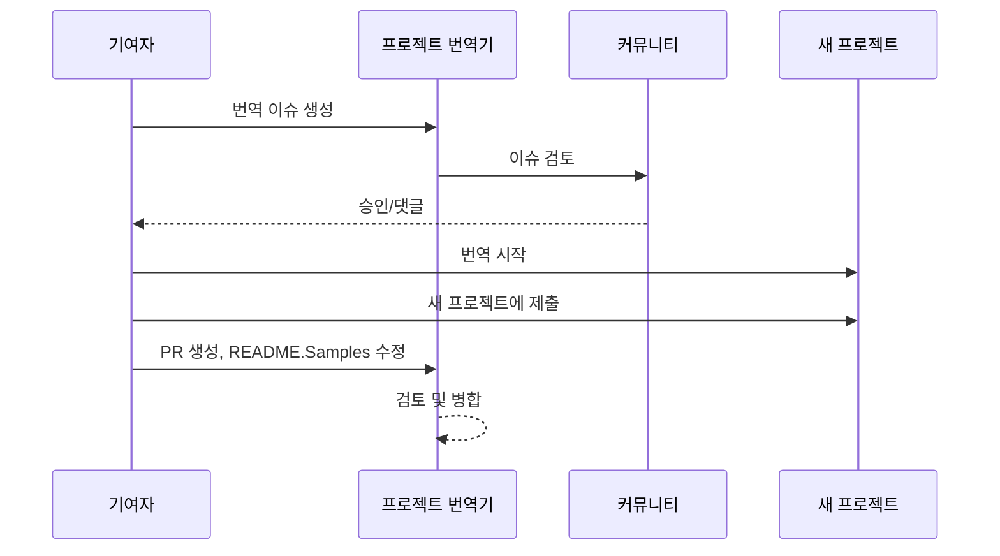

# 프로젝트 번역기

프로젝트의 다국어 현지화를 위한 사용하기 쉬운 VS Code 확장 프로그램입니다.

프로젝트 저장소: `https://github.com/Project-Translation/project_translator`

## 설치

1. 마켓플레이스:
   - VS Code 확장 프로그램 마켓플레이스: [https://marketplace.visualstudio.com/items?itemName=techfetch-dev.project-translator](https://marketplace.visualstudio.com/items?itemName=techfetch-dev.project-translator)
   - Open VSX 레지스트리: [https://open-vsx.org/extension/techfetch-dev/project-translator](https://open-vsx.org/extension/techfetch-dev/project-translator)
2. VS Code 확장 프로그램 보기에서 `techfetch-dev.project-translator`를 검색하고 설치를 클릭하세요.

<!--  -->


## 사용 가능한 번역

이 확장 프로그램은 다음 언어로의 번역을 지원합니다:

- [简体中文 (zh-cn)](./readmes/README.zh-cn.md)
- [繁體中文 (zh-tw)](./readmes/README.zh-tw.md)
- [日本語 (ja-jp)](./readmes/README.ja-jp.md)
- [한국어 (ko-kr)](./readmes/README.ko-kr.md)
- [Français (fr-fr)](./readmes/README.fr-fr.md)
- [Deutsch (de-de)](./readmes/README.de-de.md)
- [Español (es-es)](./readmes/README.es-es.md)
- [Português (pt-br)](./readmes/README.pt-br.md)
- [Русский (ru-ru)](./readmes/README.ru-ru.md)
- [العربية (ar-sa)](./readmes/README.ar-sa.md)
- [العربية (ar-ae)](./readmes/README.ar-ae.md)
- [العربية (ar-eg)](./readmes/README.ar-eg.md)

## 샘플

| 프로젝트                                                                             | 원본 저장소                                                                                       | 설명                                                                                                                                                               | 별 | 태그                                                                                                                                                                                                                                                                                                                                                                                                                                                                                                                                                                                                                                                                 |
| ----------------------------------------------------------------------------------- | --------------------------------------------------------------------------------------------------------- | ------------------------------------------------------------------------------------------------------------------------------------------------------------------------- | ----- | -------------------------------------------------------------------------------------------------------------------------------------------------------------------------------------------------------------------------------------------------------------------------------------------------------------------------------------------------------------------------------------------------------------------------------------------------------------------------------------------------------------------------------------------------------------------------------------------------------------------------------------------------------------------- |
| [algorithm-visualizer](https://github.com/Project-Translation/algorithm-visualizer) | [algorithm-visualizer/algorithm-visualizer](https://github.com/algorithm-visualizer/algorithm-visualizer) | :fireworks:코드에서 알고리즘을 시각화하는 대화형 온라인 플랫폼                                                                                               | 47301 | [`algorithm`](https://github.com/topics/algorithm), [`animation`](https://github.com/topics/animation), [`data-structure`](https://github.com/topics/data-structure), [`visualization`](https://github.com/topics/visualization)                                                                                                                                                                                                                                                                                                                                                                                                                                     |
| [algorithms](https://github.com/Project-Translation/algorithms)                     | [algorithm-visualizer/algorithms](https://github.com/algorithm-visualizer/algorithms)                     | :crystal_ball:알고리즘 시각화                                                                                                                                    | 401   | N/A                                                                                                                                                                                                                                                                                                                                                                                                                                                                                                                                                                                                                                                                  |
| [cline-docs](https://github.com/Project-Translation/cline-docs)                     | [cline/cline](https://github.com/cline/cline)                                                             | IDE 내에서 자율 코딩 에이전트로, 파일 생성/편집, 명령 실행, 브라우저 사용 등 다양한 작업을 사용자의 허가 하에 수행할 수 있습니다. | 39572 | N/A                                                                                                                                                                                                                                                                                                                                                                                                                                                                                                                                                                                                                                                                  |
| [cursor-docs](https://github.com/Project-Translation/cursor-docs)                   | [getcursor/docs](https://github.com/getcursor/docs)                                                       | 커서의 오픈 소스 문서                                                                                                                                        | 309   | N/A                                                                                                                                                                                                                                                                                                                                                                                                                                                                                                                                                                                                                                                                  |
| [gobyexample](https://github.com/Project-Translation/gobyexample)                   | [mmcgrana/gobyexample](https://github.com/mmcgrana/gobyexample)                                           | Go 예제                                                                                                                                                             | 7523  | N/A                                                                                                                                                                                                                                                                                                                                                                                                                                                                                                                                                                                                                                                                  |
| [golang-website](https://github.com/Project-Translation/golang-website)             | [golang/website](https://github.com/golang/website)                                                       | [미러] go.dev 및 golang.org 웹사이트의 홈                                                                                                                       | 402   | N/A                                                                                                                                                                                                                                                                                                                                                                                                                                                                                                                                                                                                                                                                  |
| [reference-en-us](https://github.com/Project-Translation/reference-en-us)           | [Fechin/reference](https://github.com/Fechin/reference)                                                   | ⭕ 개발자를 위한 빠른 참조 치트시트를 공유합니다.                                                                                                                      | 7808  | [`awk`](https://github.com/topics/awk), [`bash`](https://github.com/topics/bash), [`chatgpt`](https://github.com/topics/chatgpt), [`cheatsheet`](https://github.com/topics/cheatsheet), [`cheatsheets`](https://github.com/topics/cheatsheets), [`css`](https://github.com/topics/css), [`golang`](https://github.com/topics/golang), [`grep`](https://github.com/topics/grep), [`markdown`](https://github.com/topics/markdown), [`python`](https://github.com/topics/python), [`reference`](https://github.com/topics/reference), [`sed`](https://github.com/topics/sed), [`snippets`](https://github.com/topics/snippets), [`vim`](https://github.com/topics/vim) |
| [styleguide](https://github.com/Project-Translation/styleguide)                     | [google/styleguide](https://github.com/google/styleguide)                                                 | Google에서 시작된 오픈 소스 프로젝트를 위한 스타일 가이드                                                                                                                   | 38055 | [`cpplint`](https://github.com/topics/cpplint), [`style-guide`](https://github.com/topics/style-guide), [`styleguide`](https://github.com/topics/styleguide)                                                                                                                                                                                                                                                                                                                                                                                                                                                                                                         |
| [vscode-docs](https://github.com/Project-Translation/vscode-docs)                   | [microsoft/vscode-docs](https://github.com/microsoft/vscode-docs)                                         | Visual Studio Code용 공개 문서                                                                                                                               | 5914  | [`vscode`](https://github.com/topics/vscode)                                                                                                                                                                                                                                                                                                                                                                                                                                                                                                                                                                                                                         |

## 프로젝트 번역 요청

번역에 기여하거나 프로젝트 번역이 필요한 경우:

1. 다음 템플릿을 사용하여 이슈를 생성하세요:

```md
**프로젝트**: [project_url]
**대상 언어**: [target_lang]
**설명**: 이 번역이 가치 있는 이유에 대한 간단한 설명
```

2. 워크플로우:


```mermaid
sequenceDiagram
  기여자->>프로젝트 번역기: 번역 이슈 생성
  프로젝트 번역기->>커뮤니티: 이슈 검토
  커뮤니티-->>기여자: 승인/댓글
  기여자->>새 프로젝트: 번역 시작
  기여자->>새 프로젝트: 새 프로젝트에 제출
  기여자->>프로젝트 번역기: PR 생성, README.Samples 수정
  프로젝트 번역기-->>프로젝트 번역기: 검토 및 병합
```

3. PR이 병합되면 번역이 샘플 섹션에 추가됩니다.

현재 진행 중인 번역: [이슈 보기](https://github.com/Project-Translation/project_translator/issues)

## 기능

- 📁 폴더 수준 번역 지원
  - 전체 프로젝트 폴더를 여러 언어로 번역
  - 원본 폴더 구조와 계층 구조 유지
  - 하위 폴더의 재귀적 번역 지원
  - 번역 가능한 콘텐츠 자동 감지
  - 대규모 번역을 위한 효율적인 배치 처리
- 📄 파일 수준 번역 지원
  - 개별 파일을 여러 언어로 번역
  - 원본 파일 구조 및 형식 유지
  - 폴더 및 파일 번역 모드 모두 지원
- 💡 AI를 활용한 스마트 번역
  - 코드 구조 무결성 자동 유지
  - 코드 주석만 번역, 코드 논리 보존
  - JSON/XML 및 기타 데이터 구조 형식 유지
  - 전문 기술 문서 번역 품질
- ⚙️ 유연한 구성
  - 소스 폴더 및 여러 대상 폴더 구성
  - 사용자 정의 파일 번역 간격 지원
  - 무시할 특정 파일 유형 설정
  - 여러 AI 모델 옵션 지원
- 🚀 사용자 친화적 작업
  - 실시간 번역 진행률 표시
  - 번역 일시 중지/재개/중지 지원
  - 대상 폴더 구조 자동 유지
  - 중복 작업 방지를 위한 증분 번역
- 🔄 차등 번역(실험적)
  - 기존 번역의 효율적인 업데이트를 위한 diff-apply 모드
  - 변경된 콘텐츠만 번역하여 API 사용량 감소
  - 최소한의 편집으로 버전 기록 보존
  - ⚠️ 실험적 기능 - 자세한 내용은 [고급 기능](#차등-번역diff-apply-모드) 섹션 참조

## 구성

확장 프로그램은 다음 구성 옵션을 지원합니다:

```json
{
  "projectTranslator.specifiedFolders": [
    {
      "sourceFolder": {
        "path": "소스 폴더 경로",
        "lang": "소스 언어 코드"
      },
      "targetFolders": [
        {
          "path": "대상 폴더 경로",
          "lang": "대상 언어 코드"
        }
      ]
    }
  ],
  "projectTranslator.specifiedFiles": [
    {
      "sourceFile": {
        "path": "소스 파일 경로",
        "lang": "소스 언어 코드"
      },
      "targetFiles": [
        {
          "path": "대상 파일 경로",
          "lang": "대상 언어 코드"
        }
      ]
    }
  ],
  "projectTranslator.currentVendor": "openai",
  "projectTranslator.vendors": [
    {
      "name": "openai",
      "apiEndpoint": "API 엔드포인트 URL",
      "apiKeyEnvVarName": "MY_OPENAI_API_KEY",
      "model": "gpt-4o",
      "rpm": "10",
      "maxTokensPerSegment": 4096,
      "timeout": 180,
      "temperature": 0.1
    }
  ],
  "projectTranslator.userPrompts": [
      "1. 마크다운 파일의 프론트 매터에 'draft'가 'true'로 설정되어 있으면 번역이 필요 없음을 반환해야 합니다.",
      "2. 문장에서 './readmes/'는 './'로 대체되어야 합니다.",
  ],
  "projectTranslator.ignore": {
    "paths": [
      "**/node_modules/**"
    ],
    "extensions": [
      ".log"
    ]
  },
}
```

주 구성 세부 정보:

| 구성 옵션                        | 설명                                                                                    |
| ------------------------------------------- | ---------------------------------------------------------------------------------------------- |
| `projectTranslator.specifiedFolders`        | 번역을 위한 여러 소스 폴더와 해당 대상 폴더           |
| `projectTranslator.specifiedFiles`          | 번역을 위한 여러 소스 파일과 해당 대상 파일               |
| `projectTranslator.translationIntervalDays` | 번역 간격(일)(기본값 7일)                                                  |
| `projectTranslator.copyOnly`                | 번역하지 않고 복사할 파일(`paths` 및 `extensions` 배열 포함)                         |
| `projectTranslator.ignore`                  | 완전히 무시할 파일(`paths` 및 `extensions` 배열 포함)                              |
| `projectTranslator.skipFrontMatterMarkers`  | 프론트 매터 마커를 기반으로 파일 건너뛰기(`enabled` 및 `markers` 배열 포함)                 |
| `projectTranslator.currentVendor`           | 현재 사용 중인 API 공급업체                                                                      |
| `projectTranslator.vendors`                 | API 공급업체 구성 목록(apiKey를 직접 사용하거나 환경 변수를 위해 apiKeyEnvVarName 사용 가능) |
| `projectTranslator.systemPromptLanguage`    | 내장 시스템 프롬프트에 사용되는 언어(기본값: en). 모델에 지시하는 방식에 영향을 미치며 UI 언어에는 영향을 주지 않음 |
| `projectTranslator.systemPrompts`           | 번역 프로세스를 안내하는 시스템 프롬프트 배열                                        |
| `projectTranslator.userPrompts`             | 사용자 정의 프롬프트 배열, 번역 중 시스템 프롬프트 뒤에 추가됨 |
| `projectTranslator.segmentationMarkers`     | 파일 유형별로 구성된 세분화 마커, 정규식 지원                     |
| `projectTranslator.debug`                   | 디버그 모드 활성화하여 모든 API 요청 및 응답을 출력 채널에 기록(기본값: false)     |
| `projectTranslator.logFile`                 | 디버그 로그 파일 구성([Log File Feature](./docs/log-file-feature.md) 참조)         |
| `projectTranslator.diffApply.enabled`       | 실험적 차등 번역 모드 활성화(기본값: false)                             |

## 사용 방법

1. 명령 팔레트 열기(Ctrl+Shift+P / Cmd+Shift+P)
2. "Translate Project" 입력하고 명령 선택
3. 소스 폴더가 구성되지 않은 경우 폴더 선택 대화상자가 나타남
4. 번역이 완료될 때까지 기다림

번역 중:

- 상태 표시줄 버튼을 통해 번역 일시 중지/재개 가능
- 언제든지 번역 프로세스 중지 가능
- 번역 진행률이 알림 영역에 표시됨
- 상세 로그가 출력 패널에 표시됨

## CLI 사용 방법

이제 VS Code 확장 프로그램 외에도 CLI 실행을 지원합니다.

CLI 출력 빌드:

```bash
npm run compile
```

번역 실행:

```bash
npx project-translator translate project --workspace . --config project.translation.json
```

구성 관리:

```bash
npx project-translator config list --workspace . --config project.translation.json --json
npx project-translator config set currentVendor deepseek --workspace . --config project.translation.json
npx project-translator config schema --workspace .
npx project-translator config validate --workspace . --config project.translation.json
```

`config schema`는 기본적으로 `project.translation.schema.json`을 내보냅니다.  
`config validate`는 구성 파일에 대한 JSON 스키마 유효성 검사를 수행하며 유효하지 않은 경우 0이 아닌 종료 코드를 반환합니다.

## 개발

### 빌드 시스템

이 확장 프로그램은 빠른 번들링 및 개발을 위해 esbuild를 사용합니다:

#### 사용 가능한 스크립트

- `npm run build` - 축소된 프로덕션 빌드
- `npm run compile` - 개발 빌드
- `npm run watch` - 개발을 위한 watch 모드
- `npm test` - 테스트 실행

#### VS Code 작업

- **빌드** (Ctrl+Shift+P → "Tasks: Run Task" → "build") - 프로덕션용 확장 프로그램 번들
- **Watch** (Ctrl+Shift+P → "Tasks: Run Task" → "watch") - 자동 재빌드가 포함된 개발 모드

### 개발 설정

1. 저장소 복제
2. `npm install` 실행하여 종속성 설치
3. `F5` 눌러 디버깅 시작 또는 "watch" 작업 실행하여 개발

esbuild 구성:

- 모든 TypeScript 파일을 단일 `out/extension.js`로 번들
- VS Code API 제외(외부로 표시)

## 고급 기능

### API 키에 환경 변수 사용

프로젝트 번역기는 API 키에 환경 변수를 사용하는 것을 지원하며, 이는 구성 파일에 API 키를 직접 저장하는 것보다 더 안전한 접근 방식입니다:

1. `apiKeyEnvVarName` 속성으로 공급업체를 구성하세요:

```json
{
  "projectTranslator.vendors": [
    {
      "name": "openai",
      "apiEndpoint": "https://api.openai.com/v1",
      "apiKeyEnvVarName": "OPENAI_API_KEY",
      "model": "gpt-4"
    },
    {
      "name": "openrouter",
      "apiEndpoint": "https://openrouter.ai/api/v1",
      "apiKeyEnvVarName": "OPENROUTER_API_KEY",
      "model": "anthropic/claude-3-opus"
    }
  ]
}
```

2. 시스템에서 환경 변수를 설정하세요:
   - Windows: `set OPENAI_API_KEY=your_api_key`
   - macOS/Linux: `export OPENAI_API_KEY=your_api_key`

3. 확장 프로그램이 실행되면:
   - 먼저 구성에 `apiKey`가 직접 제공되는지 확인합니다.
   - 그렇지 않으면 `apiKeyEnvVarName`으로 지정된 환경 변수를 찾습니다.

이 접근 방식은 API 키를 구성 파일 및 버전 제어 시스템에서 멀리 떨어뜨립니다.

### 프론트 매터 기반 번역 건너뛰기

프로젝트 번역기는 프론트 매터 메타데이터를 기반으로 마크다운 파일의 번역을 건너뛸 수 있습니다. 이는 초안 문서 또는 번역이 필요하지 않은 것으로 표시된 파일에 유용합니다.

이 기능을 활성화하려면 `projectTranslator.skipFrontMatterMarkers` 옵션을 구성하세요:

```json
{
  "projectTranslator.skipFrontMatterMarkers": {
    "enabled": true,
    "markers": [
      {
        "key": "draft",
        "value": "true"
      },
      {
        "key": "translate",
        "value": "false"
      }
    ]
  }
}
```

이 구성으로 인해 프론트 매터에 `draft: true` 또는 `translate: false`가 포함된 모든 마크다운 파일은 번역 중 건너뛰어지고 대상 위치에 직접 복사됩니다.

건너뛰어질 예제 마크다운 파일:
```
---
draft: true
title: "Draft Document"
---

This document is a draft and should not be translated.
```

### 차등 번역(Diff-Apply) 모드

> **⚠️ 실험적 기능 경고**: 차등 번역 모드는 현재 실험적 기능이며 안정성 및 호환성 문제가 있을 수 있습니다. 프로덕션 환경에서는 주의해서 사용하고 중요한 파일은 항상 백업하는 것이 좋습니다.

확장 프로그램은 선택적 차등 번역 모드(diff-apply)를 지원합니다. 활성화되면, 확장 프로그램은 소스 콘텐츠와 기존 번역된 대상 파일을 모두 모델로 보냅니다. 모델은 하나 이상의 SEARCH/REPLACE 블록(일반 텍스트, 코드 펜스 없음)을 반환해야 합니다. 확장 프로그램은 이러한 블록을 로컬에서 적용하여 변경 사항을 최소화하고 API 사용량을 줄이며 버전 기록을 더 잘 보존합니다.

- **토글**: VS Code 설정 또는 `project.translation.json`에서 `projectTranslator.diffApply.enabled` 구성(기본값: `false`).
- **옵션**:
  - `validationLevel`: `normal` 또는 `strict`(기본값: `normal`). `strict` 모드에서는 잘못된 마커 또는 일치 실패로 인해 오류가 발생하고 확장 프로그램이 표준 번역 흐름으로 대체됩니다.
  - `autoBackup`: true이면 편집 적용 전 대상 파일의 `.bak` 백업 생성(기본값: `true`).
  - `maxOperationsPerFile`: (호환성을 위해 유지됨) 새 전략에서 사용되지 않음.

워크플로우:
1. `diffApply.enabled`가 `true`이고 대상 파일이 존재하면, 확장 프로그램은 소스 및 대상 콘텐츠를 모두 읽습니다.
2. 차등 프롬프트로 모델을 호출하고 일반 텍스트 SEARCH/REPLACE 블록 반환을 요구합니다.
3. 로컬에서 확장 프로그램은 SEARCH/REPLACE 블록을 구문 분석하고 적용합니다. 적용에 실패하면 일반 전체 번역으로 대체하고 대상 파일을 덮어씁니다.

예제 SEARCH/REPLACE(여러 블록 허용):

```
<<<<<<< SEARCH
:start_line: 10
-------
const label = "Old"
=======
const label = "New"
>>>>>>> REPLACE

<<<<<<< SEARCH
:start_line: 25
-------
function foo() {
  return 1
}
=======
function foo() {
  return 2
}
>>>>>>> REPLACE
```

참고:
- SEARCH 섹션에 들여쓰기 및 공백을 포함한 정확한 콘텐츠를 사용하세요. 확실하지 않으면 최신 파일 콘텐츠를 사용하세요.
- SEARCH와 REPLACE 사이에 `=======` 한 줄을 유지하세요.
- 변경이 필요하지 않으면 모델은 빈 문자열을 반환해야 합니다.

### 차등 번역이 현재 성능이 낮은 이유(설명)

- **跨언어 정렬 및 비교 과제**: 차등 번역은 원본 소스 문서와 기존 번역된 문서를 모두 모델로 보내며, 모델은 언어 간 비교를 통해 번역의哪些 부분을 변경해야 하는지 결정해야 합니다. 이는 단일 문서를 제자리에서 수정하는 것보다 근본적으로 더 어려운 작업입니다. 모델은 서로 다른 언어의 세그먼트를 정확히 정렬하고 의미적 차이를 판단해야 하기 때문입니다.

- **형식 및 경계 보존의 복잡성**: 많은 문서에는 코드 블록, 테이블, 프론트엔드 마커 또는 특수 플레이스홀더가 포함됩니다. 안정적인 diff 워크플로우는 이러한 구조를 유지하면서 텍스트 편집을 수행해야 합니다. 모델이 SEARCH/REPLACE 형식을 엄격히 따르는 결과를 일관되게 생성할 수 없는 경우, 자동 편집 적용은 형식 퇴보 또는 구조적 오류를 도입할 수 있습니다.

- **맥락 및 용어 일관성 문제**: 작은 지역적 편집은 종종 더 넓은 맥락과 기존 용어/스타일 용어집에 의존합니다. 최소 편집을 생성하도록 요청받을 때 모델은 전역 일관성(용어, 스타일, 주석, 변수 이름)을 무시할 수 있어 일관성 없거나 의미가 이동된 번역이 발생할 수 있습니다.

- **모델 안정성 및 비용 트레이드오프**: 신뢰할 수 있는 차등 번역을 달성하려면 강력한 비교 추론 능력과 안정적이며 예측 가능한 출력 형식을 갖춘 모델이 필요합니다. 현재 주류 모델은 합리적인 비용으로 강력한 교차 언어 정렬 및 엄격한 형식의 출력을 모두 안정적으로 제공하지 못하므로, 시스템은 정확성을 보장하기 위해 전체 재번역으로 대체되는 경우가 많습니다.

따라서 차등 번역은 이론적으로 비용이 높은 출력 토큰을 줄이고 버전 기록을 더 잘 보존할 수 있지만, 현재는 모델의 교차 언어 비교 기능 및 출력 안정성으로 인해 제한됩니다. 이 기능은 실험적 상태로 유지됩니다; 권장 완화 조치에는 자동 백업 유지(`autoBackup: true`), 관용적인 유효성 검증 수준 사용(`validationLevel: "normal"`), 일치 또는 형식 지정 실패 시 전체 재번역으로 대체가 포함됩니다. 향후 특수화된 이중 언어 정렬 사후 처리기 또는 사용자 정의 소형 모델이 diff 접근 방식의 안정성을 개선할 수 있습니다.

### 비용 절감 및 도움이 되는 이유

- **입력 대 출력 토큰 비용**: 대형 모델 API는 일반적으로 입력(프롬프트) 및 출력(완성) 토큰에 대해 다른 요금을 부과합니다. 종종 출력 토큰은 모델이 더 긴 텍스트를 생성하기 때문에 훨씬 더 비쌉니다. diff-apply는 **업데이트된 소스(입력)**와 **기존 번역 파일(입력)**을 모델로 보내고 편집의 컴팩트한 JSON을 요청하기 때문에 도움이 됩니다. 모델의 응답은 작은 JSON(출력 토큰 몇 개)이 아니라 전체 재번역된 파일(출력 토큰 많음)이므로 비용이 많이 드는 출력 부분에 훨씬 적게 지불합니다.

- **변경된 부분만 전송**: 작은 변경이 발생할 때마다 전체 파일을 다시 번역하는 대신, diff-apply는 모델에 기존 번역을 업데이트하기 위한 최소 편집 작업을 계산하도록 지시합니다. 이는 이전에 번역된 파일만을 받고 증분 편집만을 받는 파일에 특히 효과적입니다.

- **형식이 지정된 파일에 가장 적합**: 엄격한 형식(JSON, XML, 코드 블록이 있는 마크다운)을 가진 파일은 diff-apply가 구조를 보존하고 번역이 필요한 텍스트 부분만 변경하기 때문에 크게 혜택을 봅니다. 이는 모델 재포맷팅으로 인한 형식 관련 퇴행 및 추가 출력 토큰의 가능성을 줄입니다.

- **라인 지향 기본 단위, 더 스마트한 집계**: 도구는 기본 번역 단위를 "라인"으로 취급하며, SEARCH/REPLACE 전략은 `:start_line:` 근처에서 정확 또는 퍼지 일치를 적용합니다. 관용적인 동작에는 `validationLevel: "normal"`을, 보수적이고 정확한 편집이 필요할 때는 `"strict"`을 사용하세요.

차등 번역(diff-apply)을 사용하는 시기:

- 대상 파일이 이미 존재하고 이전에 번역된 경우 사용.
- 전체 파일을 다시 번역하는 것이 비용이 많이 들 수 있는 대형 형식 문서에 사용.
- 이전 번역이 전혀 없는 brand-new 파일이나 신선한 재번역을 원할 때는 피하세요.

### 설계 문서

- 개발 빌드를 위한 소스 맵 생성
- 프로덕션 빌드를 위한 코드 축소
- VS Code용 문제 매처 통합 제공

## 참고 사항

- 충분한 API 사용 할당량을 확보하세요.
- 작은 프로젝트로 먼저 테스트하는 것이 좋습니다.
- 전용 API 키를 사용하고 완료 후 제거하세요.

## 라이선스

[라이선스](LICENSE)