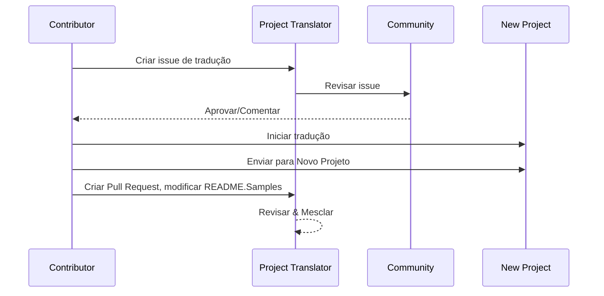

# Tradutor de Projeto

Uma extensão do VSCode: Uma ferramenta fácil de usar para a localização multilíngue de projetos.

## Traduções Disponíveis

A extensão suporta tradução para os seguintes idiomas:

- [简体中文 (zh-cn)](./readmes/README.zh-cn.md)
- [繁體中文 (zh-tw)](./readmes/README.zh-tw.md)
- [日本語 (ja-jp)](./readmes/README.ja-jp.md)
- [한국어 (ko-kr)](./readmes/README.ko-kr.md)
- [Français (fr-fr)](./readmes/README.fr-fr.md)
- [Deutsch (de-de)](./readmes/README.de-de.md)
- [Español (es-es)](./readmes/README.es-es.md)
- [Português (pt-br)](./readmes/README.pt-br.md)
- [Русский (ru-ru)](./readmes/README.ru-ru.md)
- [العربية (ar-sa)](./readmes/README.ar-sa.md)
- [العربية (ar-ae)](./readmes/README.ar-ae.md)
- [العربية (ar-eg)](./readmes/README.ar-eg.md)

## Amostras

| Projeto                                                   | Idiomas                                                                                                                                                 |
| --------------------------------------------------------- | --------------------------------------------------------------------------------------------------------------------------------------------------------- |
| [google/styleguide](https://github.com/google/styleguide) | [en-us](https://github.com/google/styleguide) original por @google<br>[zh-cn](https://github.com/Project-Translation/styleguide-zh-cn) traduzido por @jqknono |

## Solicitando Tradução de Projeto

Se você deseja contribuir com uma tradução ou precisa que um projeto seja traduzido:

1. Crie uma issue usando o seguinte modelo:

```md
**Projeto**: [project_url]
**Idioma Alvo**: [target_lang]
**Descrição**: Breve descrição do porquê essa tradução seria valiosa
```

2. Fluxo de Trabalho:



3. Após a PR ser mesclada, a tradução será adicionada à seção de Amostras.

Traduções em andamento: [Ver Issues](https://github.com/Project-Translation/project_translator/issues)

## Recursos
- 📁 Suporte à Tradução em Nível de Pasta
  - Traduza pastas inteiras do projeto para vários idiomas
  - Mantenha a estrutura e a hierarquia original da pasta
  - Suporte para tradução recursiva de subpastas
  - Detecção automática de conteúdo traduzível
  - Processamento em lote para traduções em grande escala eficientes
- 📄 Suporte à Tradução em Nível de Arquivo
  - Traduza arquivos individuais para vários idiomas
  - Preserve a estrutura e a formatação original do arquivo
  - Suporte para modos de tradução de pasta e arquivo
- 💡 Tradução Inteligente com IA
  - Mantém automaticamente a integridade da estrutura do código
  - Traduz apenas comentários de código, preserva a lógica do código
  - Mantém formatos de estrutura de dados JSON/XML e outros
  - Qualidade de tradução de documentação técnica profissional
- ⚙️ Configuração Flexível
  - Configure a pasta de origem e várias pastas de destino
  - Suporte para intervalos de tradução de arquivos personalizados
  - Defina tipos de arquivos específicos para ignorar
  - Suporte para várias opções de modelo de IA
- 🚀 Operações Amigáveis ao Usuário
  - Exibição em tempo real do progresso da tradução
  - Suporte para pausar/retomar/parar a tradução
  - Manutenção automática da estrutura da pasta de destino
  - Tradução incremental para evitar trabalho duplicado

## Instalação

1. Pesquise por "[Project Translator](https://marketplace.visualstudio.com/items?itemName=techfetch-dev.project-translator)" no marketplace de extensões do VS Code
2. Clique em instalar

## Configuração

A extensão suporta as seguintes opções de configuração:

```json
{
  "projectTranslator.specifiedFolders": [
    {
      "sourceFolder": {
        "path": "Caminho da pasta de origem",
        "lang": "Código do idioma de origem"
      },
      "destFolders": [
        {
          "path": "Caminho da pasta de destino",
          "lang": "Código do idioma de destino"
        }
      ]
    }
  ],
  "projectTranslator.specifiedFiles": [
    {
      "sourceFile": {
        "path": "Caminho do arquivo de origem",
        "lang": "Código do idioma de origem"
      },
      "destFiles": [
        {
          "path": "Caminho do arquivo de destino",
          "lang": "Código do idioma de destino"
        }
      ]
    }
  ],
  "projectTranslator.currentVendor": "openai",
  "projectTranslator.vendors": [
    {
      "name": "openai",
      "apiEndpoint": "URL do endpoint da API",
      "apiKey": "Chave de autenticação da API",
      "model": "Nome do modelo a ser usado",
      "rpm": "Máximo de solicitações por minuto",
      "maxTokensPerSegment": 4096,
      "timeout": 30,
      "temperature": 0.0
    }
  ]
}
```

Detalhes-chave da configuração:
| Opção de Configuração                            | Descrição                                                                                    |
| ------------------------------------------------ | -------------------------------------------------------------------------------------------- |
| `projectTranslator.specifiedFolders`             | Várias pastas de origem com suas pastas de destino correspondentes para tradução             |
| `projectTranslator.specifiedFiles`               | Vários arquivos de origem com seus arquivos de destino correspondentes para tradução         |
| `projectTranslator.translationIntervalDays`      | Intervalo de tradução em dias (padrão 7 dias)                                                |
| `projectTranslator.ignoreTranslationExtensions`  | Lista de extensões de arquivos de texto que não precisam de tradução, esses arquivos serão copiados diretamente  |
| `projectTranslator.ignorePaths`                  | Lista de padrões de caminho ignorados usando curingas, esses arquivos não serão copiados     |
| `projectTranslator.currentVendor`                | Fornecedor de API atual em uso                                                               |
| `projectTranslator.vendors`                      | Lista de configuração de fornecedores de API                                                 |
| `projectTranslator.systemPrompts`                | Array de prompts do sistema para guiar o processo de tradução                                |
| `projectTranslator.userPrompts`                  | Array de prompts definidos pelo usuário, esses prompts serão adicionados após os prompts do sistema durante a tradução |
| `projectTranslator.segmentationMarkers`          | Marcadores de segmentação configurados por tipo de arquivo, suporta expressões regulares     |

## Uso

1. Abra a paleta de comandos (Ctrl+Shift+P / Cmd+Shift+P)
2. Digite "Traduzir Projeto" e selecione o comando
3. Se a pasta de origem não estiver configurada, um diálogo de seleção de pasta aparecerá
4. Aguarde a conclusão da tradução

Durante a tradução:

- Pode pausar/retomar a tradução via botões na barra de status
- Pode parar o processo de tradução a qualquer momento
- O progresso da tradução é mostrado na área de notificação
- Logs detalhados são exibidos no painel de saída

## Notas

- Garanta cota de uso de API suficiente
- Recomendado testar com projetos pequenos primeiro
- Use chaves de API dedicadas e remova-as após a conclusão

## Licença

[Licença](LICENSE)