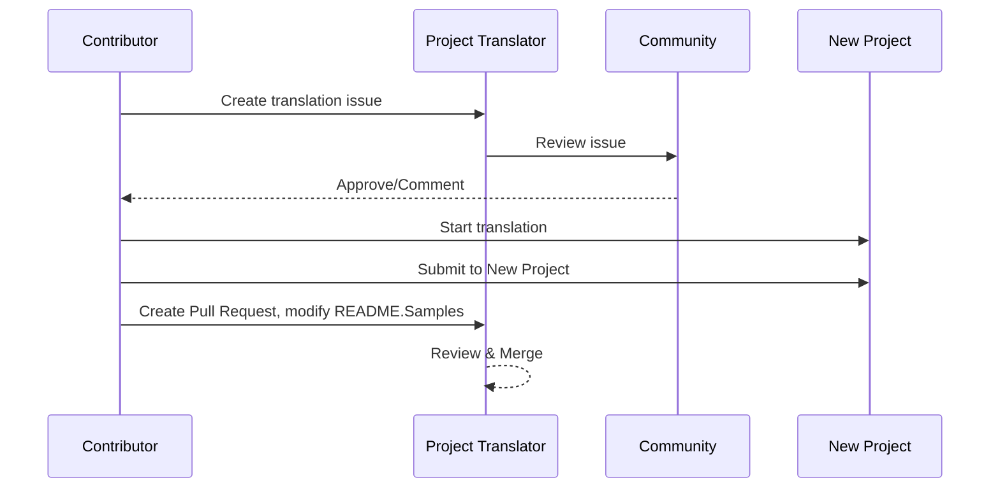

# Tradutor de Projetos

Uma extensão do VSCode: Uma ferramenta fácil de usar para localização multilíngua de projetos.

<!--
## Traduções Disponíveis

A extensão suporta tradução para esses idiomas:

- [简体中文 (zh-cn)](./README.zh-cn.md)
- [繁體中文 (zh-tw)](./README.zh-tw.md)
- [日本語 (ja-jp)](./README.ja-jp.md)
- [한국어 (ko-kr)](./README.ko-kr.md)
- [Français (fr-fr)](./README.fr-fr.md)
- [Deutsch (de-de)](./README.de-de.md)
- [Español (es-es)](./README.es-es.md)
- [Português (pt-br)](./README.pt-br.md)
- [Русский (ru-ru)](./README.ru-ru.md)
- [العربية (ar-sa)](./README.ar-sa.md)
- [العربية (ar-ae)](./README.ar-ae.md)
- [العربية (ar-eg)](./README.ar-eg.md) -->

## Exemplos

| Projeto                                                                             | Repositório Original                                                                                       | Descrição                                                                                                                                                               | Estrelas | Tags                                                                                                                                                                                                                                                                                                                                                                                                                                                                                                                                                                                                                                                                 |
| ----------------------------------------------------------------------------------- | --------------------------------------------------------------------------------------------------------- | ------------------------------------------------------------------------------------------------------------------------------------------------------------------------- | -------- | -------------------------------------------------------------------------------------------------------------------------------------------------------------------------------------------------------------------------------------------------------------------------------------------------------------------------------------------------------------------------------------------------------------------------------------------------------------------------------------------------------------------------------------------------------------------------------------------------------------------------------------------------------------------- |
| [algorithm-visualizer](https://github.com/Project-Translation/algorithm-visualizer) | [algorithm-visualizer/algorithm-visualizer](https://github.com/algorithm-visualizer/algorithm-visualizer) | :fireworks:Plataforma Online Interativa que Visualiza Algoritmos a Partir do Código                                                                                       | 47301   | [`algorithm`](https://github.com/topics/algorithm), [`animation`](https://github.com/topics/animation), [`data-structure`](https://github.com/topics/data-structure), [`visualization`](https://github.com/topics/visualization)                                                                                                                                                                                                                                                                                                                                                                                                                                     |
| [algorithms](https://github.com/Project-Translation/algorithms)                     | [algorithm-visualizer/algorithms](https://github.com/algorithm-visualizer/algorithms)                     | :crystal_ball:Visualizações de Algoritmos                                                                                                                                 | 401     | N/A                                                                                                                                                                                                                                                                                                                                                                                                                                                                                                                                                                                                                                                                  |
| [cline-docs](https://github.com/Project-Translation/cline-docs)                     | [cline/cline](https://github.com/cline/cline)                                                             | Agente de Codificação Autônomo Diretamente no Seu IDE, Capaz de Criar/Editar Arquivos, Executar Comandos, Usar o Navegador e Mais, com Sua Permissão a Cada Passo.         | 39572   | N/A                                                                                                                                                                                                                                                                                                                                                                                                                                                                                                                                                                                                                                                                  |
| [cursor-docs](https://github.com/Project-Translation/cursor-docs)                   | [getcursor/docs](https://github.com/getcursor/docs)                                                       | Documentação de Código Aberto do Cursor                                                                                                                                  | 309     | N/A                                                                                                                                                                                                                                                                                                                                                                                                                                                                                                                                                                                                                                                                  |
| [gobyexample](https://github.com/Project-Translation/gobyexample)                   | [mmcgrana/gobyexample](https://github.com/mmcgrana/gobyexample)                                           | Go by Example                                                                                                                                                             | 7523    | N/A                                                                                                                                                                                                                                                                                                                                                                                                                                                                                                                                                                                                                                                                  |
| [golang-website](https://github.com/Project-Translation/golang-website)             | [golang/website](https://github.com/golang/website)                                                       | [espelho] Página Inicial dos Sites go.dev e golang.org                                                                                                                   | 402     | N/A                                                                                                                                                                                                                                                                                                                                                                                                                                                                                                                                                                                                                                                                  |
| [reference-en-us](https://github.com/Project-Translation/reference-en-us)           | [Fechin/reference](https://github.com/Fechin/reference)                                                   | ⭕ Compartilhar Folha de Consulta Rápida de Referência para Desenvolvedores.                                                                                              | 7808    | [`awk`](https://github.com/topics/awk), [`bash`](https://github.com/topics/bash), [`chatgpt`](https://github.com/topics/chatgpt), [`cheatsheet`](https://github.com/topics/cheatsheet), [`cheatsheets`](https://github.com/topics/cheatsheets), [`css`](https://github.com/topics/css), [`golang`](https://github.com/topics/golang), [`grep`](https://github.com/topics/grep), [`markdown`](https://github.com/topics/markdown), [`python`](https://github.com/topics/python), [`reference`](https://github.com/topics/reference), [`sed`](https://github.com/topics/sed), [`snippets`](https://github.com/topics/snippets), [`vim`](https://github.com/topics/vim) |
| [styleguide](https://github.com/Project-Translation/styleguide)                     | [google/styleguide](https://github.com/google/styleguide)                                                 | Guias de Estilo para Projetos de Código Aberto Originados do Google                                                                                                       | 38055   | [`cpplint`](https://github.com/topics/cpplint), [`style-guide`](https://github.com/topics/style-guide), [`styleguide`](https://github.com/topics/styleguide)                                                                                                                                                                                                                                                                                                                                                                                                                                                                                                         |
| [vscode-docs](https://github.com/Project-Translation/vscode-docs)                   | [microsoft/vscode-docs](https://github.com/microsoft/vscode-docs)                                         | Documentação Pública para Visual Studio Code                                                                                                                             | 5914    | [`vscode`](https://github.com/topics/vscode)                                                                                                                                                                                                                                                                                                                                                                                                                                                                                                                                                                                                                         |

## Solicitando Tradução de Projeto

Se você quiser contribuir com uma tradução ou precisar que um projeto seja traduzido:

1. Crie uma issue usando o seguinte modelo:

```md
**Project**: [project_url]
**Target Language**: [target_lang]
**Description**: Brief description of why this translation would be valuable
```

2. Fluxo de Trabalho:



3. Após o PR ser mesclado, a tradução será adicionada à seção de Exemplos.

Traduções em andamento: [Ver Issues](https://github.com/Project-Translation/project_translator/issues)

## Recursos

- 📁 Suporte a Tradução em Nível de Pasta
  - Traduza pastas inteiras de projetos para vários idiomas
  - Mantenha a estrutura e hierarquia original da pasta
  - Suporte para tradução recursiva de subpastas
  - Detecção automática de conteúdo traduzível
  - Processamento em lote para traduções em grande escala eficientes
- 📄 Suporte a Tradução em Nível de Arquivo
  - Traduza arquivos individuais para vários idiomas
  - Preserve a estrutura e formatação original do arquivo
  - Suporte para modos de tradução de pasta e arquivo
- 💡 Tradução Inteligente com IA
  - Mantém automaticamente a integridade da estrutura do código
  - Traduz apenas comentários de código, preserva a lógica do código
  - Mantém formatos de estruturas de dados como JSON/XML
  - Qualidade profissional de tradução de documentação técnica
- ⚙️ Configuração Flexível
  - Configure pasta de origem e várias pastas de destino
  - Suporte para intervalos de tradução de arquivos personalizados
  - Defina tipos de arquivos específicos para ignorar
  - Suporte para várias opções de modelos de IA
- 🚀 Operações Amigáveis ao Usuário
  - Exibição de progresso de tradução em tempo real
  - Suporte para pausar/retomar/parar a tradução
  - Manutenção automática da estrutura da pasta de destino
  - Tradução incremental para evitar trabalho duplicado

## Instalação

1. Pesquise por "[Tradutor de Projetos](https://marketplace.visualstudio.com/items?itemName=techfetch-dev.project-translator)" no marketplace de extensões do VS Code
2. Clique em instalar

## Configuração

A extensão suporta as seguintes opções de configuração:

```json
{
  "projectTranslator.specifiedFolders": [
    {
      "sourceFolder": {
        "path": "Source folder path",
        "lang": "Source language code"
      },
      "destFolders": [
        {
          "path": "Target folder path",
          "lang": "Target language code"
        }
      ]
    }
  ],
  "projectTranslator.specifiedFiles": [
    {
      "sourceFile": {
        "path": "Source file path",
        "lang": "Source language code"
      },
      "destFiles": [
        {
          "path": "Target file path",
          "lang": "Target language code"
        }
      ]
    }
  ],
  "projectTranslator.currentVendor": "openai",
  "projectTranslator.vendors": [
    {
      "name": "openai",
      "apiEndpoint": "API endpoint URL",
      "apiKey": "API authentication key",
      "model": "Model name to use",
      "rpm": "Maximum requests per minute",
      "maxTokensPerSegment": 4096,
      "timeout": 30,
      "temperature": 0.0
    }
  ]
}
```

Detalhes chave de configuração:

| Opção de Configuração                            | Descrição                                                                                    |
| ----------------------------------------------- | ---------------------------------------------------------------------------------------------- |
| `projectTranslator.specifiedFolders`            | Várias pastas de origem com suas pastas de destino correspondentes para tradução               |
| `projectTranslator.specifiedFiles`              | Vários arquivos de origem com seus arquivos de destino correspondentes para tradução           |
| `projectTranslator.translationIntervalDays`     | Intervalo de tradução em dias (padrão 7 dias)                                                  |
| `projectTranslator.ignoreTranslationExtensions` | Lista de extensões de arquivos de texto que não precisam de tradução, esses arquivos serão copiados diretamente |
| `projectTranslator.ignorePaths`                 | Lista de padrões de caminhos ignorados usando sintaxe glob, esses arquivos não serão copiados  |
| `projectTranslator.currentVendor`               | Fornecedor de API atual em uso                                                                      |
| `projectTranslator.vendors`                     | Lista de configurações de fornecedores de API                                                  |
| `projectTranslator.systemPrompts`               | Array de prompts do sistema para guiar o processo de tradução                                  |
| `projectTranslator.userPrompts`                 | Array de prompts definidos pelo usuário, esses prompts serão adicionados após os prompts do sistema durante a tradução |
| `projectTranslator.segmentationMarkers`         | Marcadores de segmentação configurados por tipo de arquivo, suporta expressões regulares       |

## Uso

1. Abra o palette de comandos (Ctrl+Shift+P / Cmd+Shift+P)
2. Digite "Traduzir Projeto" e selecione o comando
3. Se a pasta de origem não estiver configurada, uma caixa de diálogo de seleção de pasta aparecerá
4. Aguarde a conclusão da tradução

Durante a tradução:

- Pode pausar/retomar a tradução por meio de botões na barra de status
- Pode parar o processo de tradução a qualquer momento
- O progresso da tradução é mostrado na área de notificações
- Logs detalhados são exibidos no painel de saída

## Notas

- Garanta cota de uso de API suficiente
- Recomenda-se testar com projetos pequenos primeiro
- Use chaves de API dedicadas e remova-as após a conclusão

## Licença

[Licença](LICENSE)