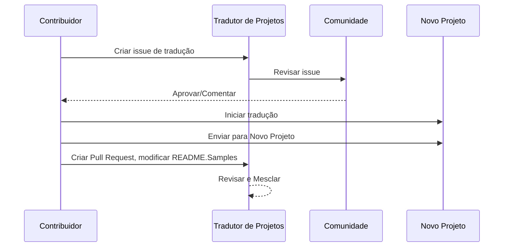

# Tradutor de Projetos

Uma extensão do VSCode: uma ferramenta fácil de usar para localização multilíngue de projetos.

## Traduções Disponíveis

A extensão suporta tradução para os seguintes idiomas:

- [简体中文 (zh-cn)](./README.zh-cn.md)
- [繁體中文 (zh-tw)](./README.zh-tw.md)
- [日本語 (ja-jp)](./README.ja-jp.md)
- [한국어 (ko-kr)](./README.ko-kr.md)
- [Français (fr-fr)](./README.fr-fr.md)
- [Deutsch (de-de)](./README.de-de.md)
- [Español (es-es)](./README.es-es.md)
- [Português (pt-br)](./README.pt-br.md)
- [Русский (ru-ru)](./README.ru-ru.md)
- [العربية (ar-sa)](./README.ar-sa.md)
- [العربية (ar-ae)](./README.ar-ae.md)
- [العربية (ar-eg)](./README.ar-eg.md)

## Exemplos

| Projeto                                                                             | Repositório Original                                                                                       | Descrição                                                                                                                                                               | Estrelas | Tags                                                                                                                                                                                                                                                                                                                                                                                                                                                                                                                                                                                                                                                                 |
| ----------------------------------------------------------------------------------- | --------------------------------------------------------------------------------------------------------- | ------------------------------------------------------------------------------------------------------------------------------------------------------------------------- | ----- | -------------------------------------------------------------------------------------------------------------------------------------------------------------------------------------------------------------------------------------------------------------------------------------------------------------------------------------------------------------------------------------------------------------------------------------------------------------------------------------------------------------------------------------------------------------------------------------------------------------------------------------------------------------------- |
| [algorithm-visualizer](https://github.com/Project-Translation/algorithm-visualizer) | [algorithm-visualizer/algorithm-visualizer](https://github.com/algorithm-visualizer/algorithm-visualizer) | :fireworks:Plataforma Online Interativa que Visualiza Algoritmos a Partir de Código                                                                                               | 47301 | [`algorithm`](https://github.com/topics/algorithm), [`animation`](https://github.com/topics/animation), [`data-structure`](https://github.com/topics/data-structure), [`visualization`](https://github.com/topics/visualization)                                                                                                                                                                                                                                                                                                                                                                                                                                     |
| [algorithms](https://github.com/Project-Translation/algorithms)                     | [algorithm-visualizer/algorithms](https://github.com/algorithm-visualizer/algorithms)                     | :crystal_ball:Visualizações de Algoritmos                                                                                                                                    | 401   | N/A                                                                                                                                                                                                                                                                                                                                                                                                                                                                                                                                                                                                                                                                  |
| [cline-docs](https://github.com/Project-Translation/cline-docs)                     | [cline/cline](https://github.com/cline/cline)                                                             | Agente de codificação autônomo diretamente no seu IDE, capaz de criar/editar arquivos, executar comandos, usar o navegador e muito mais, com sua permissão a cada passo do caminho. | 39572 | N/A                                                                                                                                                                                                                                                                                                                                                                                                                                                                                                                                                                                                                                                                  |
| [cursor-docs](https://github.com/Project-Translation/cursor-docs)                   | [getcursor/docs](https://github.com/getcursor/docs)                                                       | Documentação de Código Aberto do Cursor                                                                                                                                        | 309   | N/A                                                                                                                                                                                                                                                                                                                                                                                                                                                                                                                                                                                                                                                                  |
| [gobyexample](https://github.com/Project-Translation/gobyexample)                   | [mmcgrana/gobyexample](https://github.com/mmcgrana/gobyexample)                                           | Go por Exemplo                                                                                                                                                             | 7523  | N/A                                                                                                                                                                                                                                                                                                                                                                                                                                                                                                                                                                                                                                                                  |
| [golang-website](https://github.com/Project-Translation/golang-website)             | [golang/website](https://github.com/golang/website)                                                       | [mirror] Lar dos sites go.dev e golang.org                                                                                                                       | 402   | N/A                                                                                                                                                                                                                                                                                                                                                                                                                                                                                                                                                                                                                                                                  |
| [reference-en-us](https://github.com/Project-Translation/reference-en-us)           | [Fechin/reference](https://github.com/Fechin/reference)                                                   | ⭕ Compartilha uma folha de referência rápida para desenvolvedores.                                                                                                                      | 7808  | [`awk`](https://github.com/topics/awk), [`bash`](https://github.com/topics/bash), [`chatgpt`](https://github.com/topics/chatgpt), [`cheatsheet`](https://github.com/topics/cheatsheet), [`cheatsheets`](https://github.com/topics/cheatsheets), [`css`](https://github.com/topics/css), [`golang`](https://github.com/topics/golang), [`grep`](https://github.com/topics/grep), [`markdown`](https://github.com/topics/markdown), [`python`](https://github.com/topics/python), [`reference`](https://github.com/topics/reference), [`sed`](https://github.com/topics/sed), [`snippets`](https://github.com/topics/snippets), [`vim`](https://github.com/topics/vim) |
| [styleguide](https://github.com/Project-Translation/styleguide)                     | [google/styleguide](https://github.com/google/styleguide)                                                 | Guias de estilo para projetos de código aberto originados do Google                                                                                                                   | 38055 | [`cpplint`](https://github.com/topics/cpplint), [`style-guide`](https://github.com/topics/style-guide), [`styleguide`](https://github.com/topics/styleguide)                                                                                                                                                                                                                                                                                                                                                                                                                                                                                                         |
| [vscode-docs](https://github.com/Project-Translation/vscode-docs)                   | [microsoft/vscode-docs](https://github.com/microsoft/vscode-docs)                                         | Documentação pública do Visual Studio Code                                                                                                                               | 5914  | [`vscode`](https://github.com/topics/vscode)                                                                                                                                                                                                                                                                                                                                                                                                                                                                                                                                                                                                                         |

## Solicitação de Tradução de Projeto

Se você deseja contribuir com uma tradução ou precisa que um projeto seja traduzido:

1. Crie uma issue usando o seguinte modelo:

```md
**Projeto**: [project_url]
**Idioma de Destino**: [target_lang]
**Descrição**: Breve descrição do porquê essa tradução seria valiosa
```

2. Fluxo de trabalho:



3. Após o PR ser mesclado, a tradução será adicionada à seção Exemplos.

Traduções em andamento: [Ver Issues](https://github.com/Project-Translation/project_translator/issues)

## Recursos

- 📁 Suporte a Tradução em Nível de Pasta
  - Traduz pastas inteiras de projetos para vários idiomas
  - Mantém a estrutura e hierarquia originais da pasta
  - Suporte à tradução recursiva de subpastas
  - Detecção automática de conteúdo traduzível
  - Processamento em lote para traduções em larga escala eficientes
- 📄 Suporte a Tradução em Nível de Arquivo
  - Traduz arquivos individuais para vários idiomas
  - Preserva a estrutura original do arquivo e a formatação
  - Suporte aos modos de tradução de pasta e arquivo
- 💡 Tradução Inteligente com IA
  - Mantém automaticamente a integridade da estrutura do código
  - Traduz apenas comentários de código, preserva a lógica do código
  - Mantém formatos de estruturas de dados JSON/XML e outros
  - Qualidade profissional na tradução de documentação técnica
- ⚙️ Configuração Flexível
  - Configura pasta de origem e múltiplas pastas de destino
  - Suporte para intervalos personalizados de tradução de arquivos
  - Define tipos específicos de arquivos para ignorar
  - Suporte a múltiplas opções de modelos de IA
- 🚀 Operações Amigáveis ao Usuário
  - Exibição em tempo real do progresso da tradução
  - Suporte para pausar/retomar/interromper a tradução
  - Manutenção automática da estrutura da pasta de destino
  - Tradução incremental para evitar trabalho duplicado

## Instalação

1. Pesquise por "[Project Translator](https://marketplace.visualstudio.com/items?itemName=techfetch-dev.project-translator)" no marketplace de extensões do VS Code
2. Clique em instalar

## Configuração

A extensão suporta as seguintes opções de configuração:

```json
{
  "projectTranslator.specifiedFolders": [
    {
      "sourceFolder": {
        "path": "Caminho da pasta de origem",
        "lang": "Código do idioma de origem"
      },
      "targetFolders": [
        {
          "path": "Caminho da pasta de destino",
          "lang": "Código do idioma de destino"
        }
      ]
    }
  ],
  "projectTranslator.specifiedFiles": [
    {
      "sourceFile": {
        "path": "Caminho do arquivo de origem",
        "lang": "Código do idioma de origem"
      },
      "targetFiles": [
        {
          "path": "Caminho do arquivo de destino",
          "lang": "Código do idioma de destino"
        }
      ]
    }
  ],
  "projectTranslator.currentVendor": "openai",
  "projectTranslator.vendors": [
    {
      "name": "openai",
      "apiEndpoint": "URL do endpoint da API",
      "apiKey": "Chave de autenticação da API",
      "apiKeyEnvVarName": "Nome da variável de ambiente para a chave da API",
      "model": "Nome do modelo a ser usado",
      "rpm": "Máximo de requisições por minuto",
      "maxTokensPerSegment": 4096,
      "timeout": 30,
      "temperature": 0.0
    }
  ]
}
```

Detalhes principais da configuração:

| Opção de Configuração                       | Descrição                                                                                    |
| ------------------------------------------- | ---------------------------------------------------------------------------------------------- |
| `projectTranslator.specifiedFolders`        | Múltiplas pastas de origem com suas respectivas pastas de destino para tradução                |
| `projectTranslator.specifiedFiles`          | Múltiplos arquivos de origem com seus respectivos arquivos de destino para tradução            |
| `projectTranslator.translationIntervalDays` | Intervalo de tradução em dias (padrão 7 dias)                                                  |
| `projectTranslator.copyOnly`                | Arquivos para copiar mas não traduzir (com arrays `paths` e `extensions`)                      |
| `projectTranslator.ignore`                  | Arquivos para ignorar completamente (com arrays `paths` e `extensions`)                        |
| `projectTranslator.skipFrontMatterMarkers`  | Ignorar arquivos com base em marcadores de front matter (com arrays `enabled` e `markers`)     |
| `projectTranslator.currentVendor`           | Fornecedor de API atual em uso                                                                 |
| `projectTranslator.vendors`                 | Lista de configuração de fornecedores de API (pode usar apiKey diretamente ou apiKeyEnvVarName para variáveis de ambiente) |
| `projectTranslator.systemPrompts`           | Array de prompts do sistema para orientar o processo de tradução                               |
| `projectTranslator.userPrompts`             | Array de prompts definidos pelo usuário, esses prompts serão adicionados após os prompts do sistema durante a tradução |
| `projectTranslator.segmentationMarkers`     | Marcadores de segmentação configurados por tipo de arquivo, suporta expressões regulares       |
| `projectTranslator.debug`                   | Habilita o modo de depuração para registrar todas as requisições e respostas da API no canal de saída (padrão: falso) |
| `projectTranslator.logFile`                 | Configuração para arquivos de log de depuração (veja [Recurso de Arquivo de Log](./docs/log-file-feature.md)) |

## Uso

1. Abra a paleta de comandos (Ctrl+Shift+P / Cmd+Shift+P)
2. Digite "Traduzir Projeto" e selecione o comando
3. Se a pasta de origem não estiver configurada, um diálogo de seleção de pasta aparecerá
4. Aguarde a conclusão da tradução

Durante a tradução:

- É possível pausar/retomar a tradução por meio dos botões na barra de status
- É possível interromper o processo de tradução a qualquer momento
- O progresso da tradução é exibido na área de notificação
- Logs detalhados são exibidos no painel de saída

## Desenvolvimento

### Sistema de Build

Esta extensão usa esbuild para empacotamento rápido e desenvolvimento:

#### Scripts Disponíveis

- `npm run build` - Build de produção com minificação
- `npm run compile` - Build de desenvolvimento
- `npm run watch` - Modo de observação para desenvolvimento
- `npm test` - Executar testes

#### Tarefas do VS Code

- **Build** (Ctrl+Shift+P → "Tarefas: Executar Tarefa" → "build") - Empacota a extensão para produção
- **Watch** (Ctrl+Shift+P → "Tarefas: Executar Tarefa" → "watch") - Modo de desenvolvimento com reconstrução automática

### Configuração de Desenvolvimento

1. Clone o repositório
2. Execute `npm install` para instalar as dependências
3. Pressione `F5` para iniciar a depuração ou execute a tarefa "watch" para desenvolvimento

A configuração do esbuild:

- Empacota todos os arquivos TypeScript em um único `out/extension.js`
- Exclui a API do VS Code (marcada como externa)

## Recursos Avançados

### Usando Variáveis de Ambiente para Chaves de API

O Project Translator suporta o uso de variáveis de ambiente para chaves de API, que é uma abordagem mais segura do que armazenar chaves de API diretamente nos arquivos de configuração:

1. Configure seu fornecedor com a propriedade `apiKeyEnvVarName`:

```json
{
  "projectTranslator.vendors": [
    {
      "name": "openai",
      "apiEndpoint": "https://api.openai.com/v1",
      "apiKeyEnvVarName": "OPENAI_API_KEY",
      "model": "gpt-4"
    },
    {
      "name": "openrouter",
      "apiEndpoint": "https://openrouter.ai/api/v1",
      "apiKeyEnvVarName": "OPENROUTER_API_KEY",
      "model": "anthropic/claude-3-opus"
    }
  ]
}
```

2. Defina a variável de ambiente em seu sistema:
   - No Windows: `set OPENAI_API_KEY=sua_chave_api`
   - No macOS/Linux: `export OPENAI_API_KEY=sua_chave_api`

3. Quando a extensão for executada, ela irá:
   - Primeiro verificar se `apiKey` é fornecida diretamente na configuração
   - Caso contrário, procurará a variável de ambiente especificada por `apiKeyEnvVarName`

Essa abordagem mantém suas chaves de API fora dos arquivos de configuração e sistemas de controle de versão.

### Ignorar Tradução com Base no Front Matter

O Project Translator pode ignorar a tradução de arquivos Markdown com base nos metadados do front matter. Isso é útil para documentos em rascunho ou arquivos marcados como não necessitando de tradução.

Para habilitar esse recurso, configure a opção `projectTranslator.skipFrontMatterMarkers`:

```json
{
  "projectTranslator.skipFrontMatterMarkers": {
    "enabled": true,
    "markers": [
      {
        "key": "draft",
        "value": "true"
      },
      {
        "key": "translate",
        "value": "false"
      }
    ]
  }
}
```

Com essa configuração, qualquer arquivo Markdown com front matter contendo `draft: true` ou `translate: false` será ignorado durante a tradução e copiado diretamente para o local de destino.

Exemplo de arquivo Markdown que será ignorado:
```
---
draft: true
title: "Documento em Rascunho"
---

Este documento está em rascunho e não deve ser traduzido.
```


### Documentação de Design

- Gera sourcemaps para builds de desenvolvimento
- Minifica o código para builds de produção
- Fornece integração com problem matcher para o VS Code

## Observações

- Certifique-se de ter cota suficiente de uso da API
- Recomenda-se testar com projetos pequenos primeiro
- Use chaves de API dedicadas e remova-as após a conclusão

## Licença

[Licença](LICENSE)